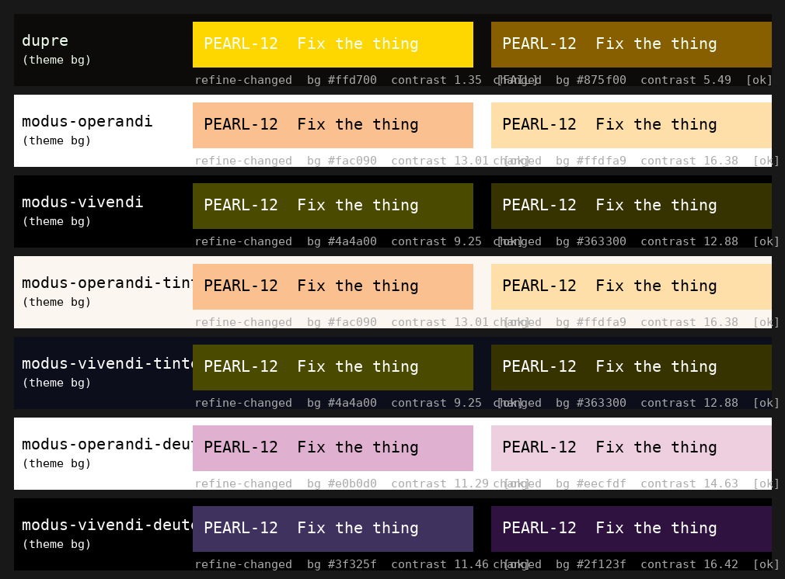

#+TITLE: Emacs Config
#+AUTHOR: Craig Jennings
#+ARCHIVE: %s::* Emacs Resolved

* Emacs Priority Scheme

Use priority to express impact and urgency, not task type. Bugs, refactors,
tests, chores, and features can all be high or low priority.

- =[#A]= Urgent risk or current workflow blocker. Use for credential exposure,
  security/privacy leaks, data loss, destructive behavior, startup breakage,
  failing tests that block work, or a feature/refactor that unblocks a core
  daily workflow.
- =[#B]= Important planned work. Use for concrete bugs, high-leverage
  architecture cleanup, brittle load-order/test gaps, dependency failures, or
  feature work with a clear design and expected near-term use.
- =[#C]= Useful but optional. Use for low-risk cleanup, ergonomics, smoke tests,
  investigations with limited current impact, or feature work that would improve
  the setup but is not yet a committed workflow.
- =[#D]= Someday/maybe or watchlist. Use for speculative features, tiny polish,
  upstream/package tracking, optimizations without current pain, or deferred
  ideas that should not compete with active maintenance.

For =PROJECT= headings, use the highest priority of the meaningful child work
inside the project. If a project only contains exploration or review, assign the
priority by the expected decision value rather than the number of files touched.

Use tags to describe the work shape:
- =:bug:= means the current behavior is wrong or likely broken.
- =:feature:= means the task adds a new user-visible capability or workflow.
- =:refactor:= means the task changes structure/ownership without primarily
  changing behavior.
- =:quick:= means the task appears low effort and localized. It is a planning
  hint, not a promise; remove it if the task grows during implementation.
- =:solo:= means Claude can do the task end to end with no input from Craig:
  bounded scope, no design or preference call, and verifiable in the local
  setup (tests, byte-compile, launch). Tasks needing a policy/preference
  decision, visual judgment, or a live remote do not get =:solo:=.

Tags are additive. For example, a small wrong-behavior fix can be
=:bug:quick:=, and a feature that requires internal restructuring can be
=:feature:refactor:=.
* Emacs Open Work
** TODO [#B] Dupre diff-changed / diff-refine-changed legibility :bug:dupre:
Surfaced 2026-06-07 from a pearl session designing its modified-ticket indicator (pearl marks a changed field by inheriting =diff-changed=). dupre's =diff-refine-changed= is bright gold (#ffd700) under near-white text (#f0fef0) -- WCAG contrast ~1.35, unreadable as a plain background. It only looks fine inside diff-mode because diff-mode overlays its own dark foreground. =diff-changed= (#875f00 amber) is ~5.49, readable but off the modus model. Every modus variant keeps both faces legible (contrast 9-16) by pairing a dark low-saturation background with a hue-matched foreground.

Ask:
1. Rework dupre's =diff-changed= and =diff-refine-changed= on modus lines: dark low-saturation background, legible foreground (plain default fg for simplicity, or hue-tinted per modus -- decide), and keep refine slightly stronger than changed (refine is the word-level emphasis inside a changed region; modus keeps them distinct).
2. While there, audit dupre's broader diff/palette faces against modus conventions (background/foreground tinting, contrast targets) and flag where it diverges.

Reference values -- modus-vivendi: refine-changed bg #4a4a00 fg #efef80, changed bg #363300 fg #efef80. modus-operandi: refine-changed bg #fac090 fg #553d00, changed bg #ffdfa9 fg #553d00.

Side-by-side legibility render: .
** TODO [#B] dupre-theme test failures :bug:dupre:tests:
A full =make test= run (2026-06-07) is green across 516 of 517 files; the only failures are 4 tests in =tests/test-dupre-theme.el=, long pre-existing. Two root causes. For each, decide whether the palette or the test assertion is canonical, then fix the loser so =make test= goes fully green.

*** TODO Background drift: 3 tests expect #151311, palette bg is #0d0b0a
=dupre-get-color-base= (test:46), =dupre-theme-default-face= (test:84), and =dupre-with-colors-binds-values= (test:62) all assert the default background is "#151311", but =themes/dupre-palette.el= defines =bg= as "#0d0b0a". The committed palette looks intentional, so the three assertions are likely just stale -- confirm #0d0b0a is the wanted background, then update the tests.

*** TODO org-todo color mismatch: test expects #ff2a00, theme renders #a7502d
=dupre-theme-org-todo= (test:130) asserts the org-todo foreground is "#ff2a00" (intense-red), but the theme renders "#a7502d" (red-1). Design call: should org-todo be the bright intense-red or the muted red-1? Fix whichever side loses the decision.
** TODO [#C] dupre-clear theme — contrast-first AAA sibling :feature:theme:dupre:
Build a new theme (working name "dupre-clear", final name TBD) that takes dupre's color identity and rebuilds it Prot's way: contrast-first, targeting WCAG AAA (~7:1 on the ground), where the in-progress dupre revision is mood/depth-first and lands at AA. Same hues (dupre blue, emerald, gold, terracotta, regal violet, mint) brightened to clear the AAA floor; same modus-style role mapping (blue keywords bold, gold functions, violet types, emerald strings, terracotta constants, silver default, warm-grey comments, metallic greys, navy + regal fills). Build the dupre revision first; this reuses its hue choices as the starting point.

Full design + methodology + starting palette + open questions in the spec: [[file:docs/design/dupre-clear-theme.org][docs/design/dupre-clear-theme.org]]. Key prerequisite/context: the dupre-redesign entry in =.ai/session-context.org= (the AA palette this brightens). Hardest slot: blue keywords (a deep dupre blue can't be AAA on near-black — decide brighten vs keep-AA-exception vs lift-the-ground).
** TODO [#B] Dashboard keybinding changes :quick:
:PROPERTIES:
:LAST_REVIEWED: 2026-06-06
:END:
pressing g has should refresh. find another binding for Telegram.
** TODO [#A] Calibre Open Work :calibre:
:PROPERTIES:
:LAST_REVIEWED: 2026-06-06
:END:
Parent grouping the open Calibre / ebook-workflow issues; close each child independently. The EPUB reading-width tasks were already resolved (2026-05-12/14).

*** DOING Calibre bookmark title format :feature:solo:quick:
When I hit m in calibre, I'm making my place in the book with a bookmark.
While sometimes, the books look fine: "The A.B.C. Murders - Agatha Christie.epub"
Sometimes they look not so good: Engines of Logic_ Mathematicians and the O - Martin Davis.pdf or Software Architecture_ The Hard Parts _ Mo - Neal Ford.pdf

What I would like to do is to have the bookmarks be saved in the following format:

Author, Title [no extension]. Underscores should be stripped.

Root cause: in a nov buffer =m= is =bookmark-set= (rebound at calibredb-epub-config.el:311); nov's =nov-bookmark-make-record= names the record =(buffer-name)= -- the EPUB filename.

Implemented 2026-06-06. Source decision: parse the *filename*, not the embedded EPUB metadata -- under Calibre's "<Title> - <Author>.epub" naming the filename is more complete (the embedded metadata had truncated titles, author-sort "Last, First" forms, and lost punctuation; see the separate metadata-cleanup task). A =:filter-return= advice on =nov-bookmark-make-record= rebuilds the name from the record's filename: split on the last " - " into title/author, restore the colon Calibre sanitized to "_ " (-> ": "), reorder to "Author, Title". Pure helpers =cj/--nov-clean-title= + =cj/--nov-bookmark-name-from-file= in =modules/calibredb-epub-config.el=; 10 ERT tests in =tests/test-calibredb-epub-config--bookmark-name.el=. Live in the daemon.

Existing bookmarks: the 3 nov bookmarks in =~/sync/org/emacs_bookmarks= were renamed by hand (one-pass, in the daemon + saved; backup at =emacs_bookmarks.bak-2026-06-06=): "Edward Kanterian, Frege: A Guide for the Perplexed", "Agatha Christie, The A.B.C. Murders", "Edward Abbey, The Fool's Progress: An Honest Novel".

Awaiting Craig's manual confirm: make a NEW bookmark (open an EPUB, hit m) and check the default name is "Author, Title" from the filename.

*** DOING [#A] Reconsider Calibre keybindings :feature:ux:
Relocated from the global capture inbox 2026-06-06. Want a discoverable set of keybindings (visible in which-key) for the most frequent calibredb workflows:
- Switch to a library (e.g. Literature), sort by last name, scroll the list.
- Scope/filter the list in place, keeping the current library scope:
  - by format (e.g. epubs only)
  - by author last name (exact == or ^begins-with some text)
  - sort by title, publication date, or group by format
- One key pops up the selected book's description in a bottom-30% buffer, dismissed with q (same display pattern as the signel chat dock).
- RET opens the book in the appropriate viewer.
Survey finding 2026-06-06: calibredb already binds almost all of this in calibredb-search-mode-map (S/L library, g filter [f format, a author, t tag, d date], o sort [t title, a author, p pubdate, f format], RET open) and even ships transient menus (? = calibredb-dispatch, g, o). The real problem was discoverability -- they are top-level single keys (which-key never pops up) and Craig didn't know ? opened a menu. calibredb-quick-look is macOS-only; the detail view (v -> *calibredb-entry*, q quits) is the description but opens full-window.

Implemented 2026-06-06 in =modules/calibredb-epub-config.el=:
- A curated transient =cj/calibredb-menu= (library switch; filter format/author/reset; sort author/title/pubdate/format; open; describe; H = full calibredb-dispatch) bound to =?= in calibredb-search-mode-map. calibredb's own full dispatch moved to =H=. Defined in the use-package =:config= (needs the elpa transient, which batch doesn't load) -- the "? brings up a curated help menu" convention.
- Bottom-30% description dock: =calibredb-show-entry-switch= -> =pop-to-buffer= + a =display-buffer-alist= rule for =*calibredb-entry*= (display-buffer-at-bottom, height 0.3); =cj/calibredb-describe-at-point= shows the entry without switching focus so q dismisses it. Same pattern as the signel chat dock.
1 ERT test (the describe command; the transient/bindings/dock need the elpa transient + live calibredb, verified in the daemon). Author "begins-with" is covered well enough by g a's completing-read over "Last, First"; a true regex filter was not built. Awaiting Craig's manual verify (M-B -> ? menu; d/v docked description; H full menu).

*** TODO Embed Calibre DB metadata into the EPUB files :data:maintenance:
Surfaced 2026-06-06 while building the bookmark naming: the metadata embedded in the EPUB files' OPF is worse than Calibre's database metadata. nov reads the embedded OPF and got truncated titles ("Frege" vs the filename's "Frege: A Guide for the Perplexed"), author-sort "Last, First" forms ("Christie, Agatha"), and lost punctuation ("A.B.C." -> "A B C"). The filenames (from Calibre's curated DB) are the good copy. Fix on the Calibre side: select all (or by library), run "Edit metadata -> Embed metadata into book files" so the DB metadata is written into each EPUB's OPF. Consider auditing author vs author_sort first. After embedding, the in-file metadata matches the library and any tool reading the files (nov, other readers, re-imports) gets the good data. Not an Emacs task; Calibre-side bulk maintenance.

** TODO [#B] TTY-accessible personal C-; keymap :feature:ux:solo:quick:
:PROPERTIES:
:LAST_REVIEWED: 2026-06-05
:END:
The personal prefix =C-;= (Control-semicolon) is GUI-only — terminals can't encode it, so the entire custom command family (=C-; g= calendar, =C-; a= AI, =C-; S= Slack, =C-; O= org, =C-; M= Signal, =C-; L= pearl, =C-; j= jump, …) is unreachable in a terminal frame (=emacsclient -nw=, Emacs inside vterm/tmux). Surfaced 2026-06-03 out of the pearl =C-; L= prefix discussion.

Goal: keep =C-;= in GUI and add a TTY-typable mirror prefix so the same leaf keys work in a terminal. The fix is a single point: =modules/keybindings.el= defines =cj/custom-keymap= once, binds it globally with =(keymap-global-set "C-;" cj/custom-keymap)=, and every module registers into it via =cj/bind-prefix= / =cj/bind-command=. Binding that one keymap under a second prefix mirrors the whole family for free — no per-module edits.

Easy prefix candidates (home-row-leaning, TTY-safe), same leaf keys under each:
- =C-c ;= (recommended) — keeps the semicolon mnemonic; =C-c= is the standard user prefix and always TTY-encodable, =;= is home row. =C-; L= becomes =C-c ; L=, zero leaf-key relearning. Bind it unconditionally alongside =C-;= so both GUI and TTY reach the identical map — no =env-terminal-p= branch needed.
- =C-c SPC= — easy reach, but collides with =org-table-blank-field= (=C-c SPC=) inside org buffers.
- Bare =C-c <leaf>= (the literal "C-c L" idea) — rejected: =C-c= is shared with org (=C-c l= = =org-store-link=, confirmed live), the LSP prefix (=lsp-keymap-prefix "C-c l"=), and pdf-view; binding the whole family under bare =C-c= would shadow/conflict with those.

While in here, audit individual leaf chords for other non-TTY keys (any =C-RET=, super/hyper bindings — terminals can't send super/hyper either) and note or remap them. Verify the result in an actual =emacs -nw= / =emacsclient -nw= frame, not just GUI. Relates to the standing "org-mode keybinding consolidation" reminder.

** DOING [#B] Signel Client Open Work
:PROPERTIES:
:LAST_REVIEWED: 2026-06-06
:END:
Parent task for the Emacs Signal client. Engine: signal-cli (linked secondary device). Front end: a fork of signel at =~/code/signel=, wired through =modules/signal-config.el=. Design: [[file:docs/design/signal-client.org][docs/design/signal-client.org]]. Child issues below.

*** 2026-05-26 Tue @ 20:06:58 -0500 Decided: fork signel rather than depend on it
signel is on MELPA but stale (one-author v0.1, all commits in a Jan-2026 burst, unattended tracker, no PRs). The spec needs internal edits (notify behavior, input-clobber fix), which are clean in a fork and hacky via advice, and a dead upstream means no divergence cost. Rejected: adopt-from-MELPA + advice, build-from-scratch, signal-cli-rest-api (Docker), MCP-tool, ERC bridge. Full rationale in the design doc.

*** 2026-05-26 Tue @ 20:06:58 -0500 Linked as secondary device; contact parser verified against live shape
Installed signal-cli 0.14.4.1 (AUR; imported AsamK's signing key FA10826A... to clear the makepkg verification). Linked the account via QR. Built and unit-tested the pure helper layer in =modules/signal-config.el= (contact-list parsing, notify-when-not-viewing predicate) with =tests/test-signal-config.el=. Confirmed the live =listContacts= shape: givenName/familyName are top-level in 0.14, not under profile as first assumed; corrected the parser and verified it produces a picker entry for all 94 real contacts. Sent a request to archsetup to add signal-cli to the standard install.

*** 2026-05-27 Wed @ 22:08:40 -0500 Shipped initiate-message workflow: picker + Note-to-Self + keymap
=cj/signel-message= (=C-; M m=) names contacts via =completing-read= over the cj-owned =cj/signel--contact-cache=, with "Note to Self" pinned first.  =cj/signel-message-self= (=C-; M s=) sends straight to =signel-account=.  Daemon guard =cj/signel--ensure-started= auto-starts the daemon when =signel-account= is set and =user-error='s with the remedy when it isn't; on start it pre-warms the cache.  =cj/signel--fetch-contacts= rides the new RPC callback contract (=signel--send-rpc= with success-callback), the result feeds =cj/signal--parse-contacts=, and =cj/signel-refresh-contacts= (=C-; M no leaf=) clears + refetches.  Cold-cache invocations =accept-process-output= up to =cj/signel-fetch-timeout= seconds (3s default) and =user-error= on timeout so a wedged daemon can't hang Emacs.  Prefix keymap =cj/signel-prefix-map= bound under =C-; M= via =keybindings.el='s =cj/custom-keymap=: m / s / d / q / SPC.  15 new ERT tests in =tests/test-signal-config.el= cover ensure-started branches, fetch contract, cache empty-vs-failure, refresh, picker happy-path + cold-cache resolves + cold-cache timeout, message-self, and the prefix map bindings.

*** 2026-05-27 Wed @ 21:55:57 -0500 Added JSON-RPC success-result dispatch in the signel fork
Fork commit 4740d97 added =signel--request-handler-map= (id → success callback), extended =signel--send-rpc= with an optional =success-callback= that registers under the new request id, and gave =signel--dispatch= a result branch that invokes the callback and removes the handler.  Error responses also remhash the handler entry, and =signel-start= / =signel-stop= both =clrhash= the map so reconnect is reliably empty.  Backward-compatible: existing callers that don't pass a callback hit the same code path as before.  Five ERT tests in this project (=tests/test-signel-rpc-dispatch.el=, dotemacs commit bfec0eab) lock the contract: Normal (result invokes callback + cleanup, send-rpc registers), Boundary (unknown id is a no-op), Error (error response cleans up handler), reconnect (=signel-stop= empties the map).  Refactor audit surfaced a separate pre-existing leak in =signel--handle-error= (request-buffer-map entries aren't removed on error); filed as the [#C] follow-up below.

*** TODO [#C] signel--handle-error leaks request-buffer-map entries :bug:no-sync:
Surfaced during the JSON-RPC dispatch refactor audit. =signel--handle-error= reads =signel--request-buffer-map= by id but never =remhash='es the entry, so every error response leaves the request-id → buffer-name mapping behind for the life of the process. Low impact (the map clears on stop/start, and id collisions are unlikely at the counter scale), but unbounded growth in a long-lived session and inconsistent with how the new request-handler-map is cleaned up on error.

*** TODO [#B] Notify only for the unviewed conversation :feature:
Wire =cj/signal--should-notify-p= (done) into signel's =signel--handle-receive= notify block (signel.el:277), route through Craig's notify script instead of bare =notifications-notify=, and gate sound behind a defcustom that defaults off.

*** 2026-05-27 Wed @ 22:08:40 -0500 Shipped clobber fix for both insert paths
Fork commit 5ec56c0 added =signel--pending-input= (capture from input-marker to point-max) and =signel--restore-input= (re-insert after the redrawn prompt; nil-safe), and wired both into =signel--insert-msg= (the receive path) and =signel--insert-system-msg= (the error path).  A mid-type send now survives both an incoming message and a system-error insertion.  Four ERT tests in =tests/test-signel-input-preservation.el= cover the helpers (typed text, empty) and both insert paths via a temp =signel-chat-mode= buffer.

*** TODO [#B] Link command with QR :feature:
=cj/signel-link= wrapping =signal-cli link -n NAME=, capturing the =sgnl://linkdevice= URI and rendering it as a scannable QR (qrencode). Convenience for re-linking; the first link was done by hand this session.

*** 2026-05-27 Wed @ 22:08:40 -0500 use-package wired with C-; M keymap and local account config
=use-package signel :load-path "~/code/signel" :ensure nil= already wired earlier with =signel-auto-open-buffer nil=.  Account source is =signel-account= set from =cj/signal-private-config-file= (=signal-config.local.el=, gitignored) loaded in =:config=, decided in the workflow spec.  Keymap prefix =C-; M= attached via =with-eval-after-load 'keybindings= so the binding survives load-order.

*** TODO [#D] Include Signal groups in the picker :feature:no-sync:
vNext after the 1:1 initiate-message flow is stable. Merge =listGroups= with =listContacts=, label groups distinctly, and preserve the current v1 behavior where the picker is contacts-only.

*** 2026-06-06 Sat @ 12:29:24 -0500 Fixed C-; M load-order bug via canonical register-prefix-map
Root cause: signal-config.el was the only feature module that violated the prefix-registration contract documented in =keybindings.el:41-45=.  Every other prefix map uses =(require 'keybindings)= + a top-level =(cj/register-prefix-map "X" map)=; signal-config had neither, mutating =cj/custom-keymap= directly through a =(with-eval-after-load 'keybindings (when (boundp 'cj/custom-keymap) ...))= form.  The =boundp= guard turned a load-order miss into a SILENT no-op — no error, the binding just never happened — which is why a live-reload (keybindings definitely loaded by then) papered over it.
Fix: added =(require 'keybindings)= at the top of signal-config.el and replaced the guarded form with =(cj/register-prefix-map "M" cj/signel-prefix-map "signal messages")=, matching the 25+ other prefix maps.
Verified: (1) new contract test =test-signal-config-prefix-map-registered-under-c-semi-m= asserts =C-; M= resolves to =cj/signel-prefix-map= (35/35 green); (2) full =emacs --batch= init.el launch — the exact failing scenario — now shows =C-; M= bound; (3) clean byte-compile; (4) live-reloaded into the daemon, binding confirmed.  No unit-level red was possible: the =boundp= guard is robust under all standard test timings, which is the CLAUDE.md launch-only-failure class.

*** 2026-05-28 Thu @ 03:09:18 -0500 Chat buffer docks bottom 30% and C-c C-k cancels
=display-buffer-alist= entry in =modules/signal-config.el= matches =^\*Signel: = chat buffers and routes them through =display-buffer-at-bottom= with =window-height . 0.3=, so the chat docks to the bottom 30% of the frame.  The signel fork's =signel-chat= switched from =switch-to-buffer= to =pop-to-buffer= so the rule can apply (=switch-to-buffer= ignores =display-buffer-alist=).  =C-c C-c= was already bound to =signel--send-input= in the mode; =C-c C-k= now binds =signel--cancel-input=, a new fork helper that clears the editable region between =signel--input-marker= and =point-max= and then calls =quit-window=.  Buffer stays alive so chat history above the marker survives revisits; cleared input means the next visit lands on a fresh prompt.  Five ERT tests in =tests/test-signel-cancel-input.el= (clears pending, empty-area no-op, quit-window called, buffer preserved, keymap binding) and two new tests in =tests/test-signal-config.el= (entry shape + regex match set).  Dotemacs commit 998e9c7a, fork commit df02d79.

** DOING [#B] Migrate All Terminals From Vterm to Ghostel :terminal:ghostel:
:PROPERTIES:
:LAST_REVIEWED: 2026-06-04
:END:
Replace vterm with ghostel (libghostty-vt) as the single terminal engine across every workflow, and rename ai-vterm → ai-term. References: [[file:docs/2026-05-25-emacs-terminal-comparison.org][docs/2026-05-25-emacs-terminal-comparison.org]] (vterm vs eat vs ghostel research); migration spec [[file:docs/design/vterm-to-ghostel-migration-spec.org][docs/design/vterm-to-ghostel-migration-spec.org]] (READY; external review incorporated 2026-06-04, D1-D7 agreed). Build in 5 phases (0-4); see the spec's Implementation tasks block.

Decisions D1-D7 are settled in the spec's Agreed-decisions section. Build order below; each phase stays green (suite + byte-compile) at every step.

*** 2026-06-04 Thu @ 23:57:09 -0500 Phase 0 done: characterization baseline green
=make test= green except the 5 documented pre-existing failures (4 test-dupre-theme, 1 test-init-module-headers), none terminal-related. Characterization coverage already present + green for all six must-survive behaviors: vterm-toggle--dispatch/display/buffer-filter, vterm-tmux-history, ai-vterm--show-or-create/launch-command/f9-in-vterm, ui-config--buffer-cursor-state + vterm-copy-mode-cursor, dashboard-config-launchers. Add a characterization test before any behavior change in later phases if a gap appears.

*** 2026-06-05 Fri @ 00:38:34 -0500 Phase 1 done: ghostel + term-config.el
=modules/term-config.el= written (full port of vterm-config: tmux history/copy-mode-dwim preserved via process-tty-name + ghostel-send-string; F12 toggle + display rule + geometry; cj/term-map C-; x menu → ghostel commands; which-key "terminal menu"; ghostel-max-scrollback 10MB; C-; added to ghostel-keymap-exceptions; F12 + C-; in ghostel-mode-map; use-package ghostel guarded per D6). Dropped: mouse-wheel SGR forwarding, vterm-timer-delay hacks, copy-mode cursor hook, goto-address hook. ghostel installed into elpa (MELPA + auto-downloaded native module). Tests: test-term-toggle--{dispatch,display,buffer-filter} + test-term-tmux-history (16) ported with a ghostel stub in testutil-ghostel-buffers; all green.

*** 2026-06-05 Fri @ 00:38:34 -0500 Phase 2 done: ai-vterm→ai-term on ghostel
=modules/ai-vterm.el= → =modules/ai-term.el=: 6 vterm call sites swapped to ghostel (buffer named via let-bound ghostel-buffer-name + pinned ghostel-buffer-name-function so OSC titles don't rename agent buffers); F9/C-F9/M-F9 on global + ghostel-mode-map; refuse-in-terminal guard removed (D4 — F9 launches in TTY frames); tmux-suppression invariant preserved (cj/--ai-term-suppress-tmux). 23 ai-vterm tests renamed → test-ai-term--* (terminal-guard test deleted, obsolete); show-or-create + f9-in-term rewritten for ghostel; all green. ui-config cursor-state ported (ghostel-mode + ghostel--input-mode; copy/emacs = read-only, else writeable) + its test. init.el now requires term-config + ai-term; vterm-config.el + ai-vterm.el deleted. Full suite green except the 5 documented pre-existing failures (4 dupre-theme, 1 init-module-headers/popper-config-missing — both unrelated). validate-modules ✓; full early-init+init smoke clean (no ghostel/term/ai-term errors). vterm package still installed (Phase 4) — dashboard "Launch VTerm" + dormant auto-dim still reference it until Phase 3/4. Restart Emacs to pick up ghostel (load-order + use-package :config change).

*** TODO [#B] Phase 2: rename ai-vterm→ai-term on ghostel :terminal:ghostel:
Swap the 6 vterm call sites; F9 family on global + ghostel-mode-map; drop refuse-in-terminal guard (D4); preserve the tmux-suppression invariant. Rename engine-agnostic tests after green; rework coupled tests; add D4 + F12-excludes-agent regression tests.

*** 2026-06-05 Fri @ 00:50:58 -0500 Phase 3 done: satellites ported to ghostel
Deleted auto-dim's vterm color-advice + redraw integration (~165 lines; D1 — terminals don't dim, ghostel bakes its palette per-terminal so there's no per-window color hook); dashboard launcher → =(ghostel)= + "Launch Terminal" label; cj-window-geometry/toggle-lib doc comments; module-inventory + init-load-graph doc refs. (ui-config cursor-state + init.el requires landed in Phase 2.) Trimmed test-auto-dim-config (dropped the 6 vterm tests) + updated the dashboard-launcher test stub. Incidental: removed the stale =popper-config= entry from the test-init-module-headers allowlist (the file doesn't exist + isn't required) — fixes the long-standing pre-existing test failure.

*** 2026-06-05 Fri @ 00:50:58 -0500 Phase 4 done: vterm + vterm-toggle removed
=package-delete='d vterm + vterm-toggle from elpa. No vterm refs remain in modules/init except intentional historical comments. Suite green except the 4 pre-existing dupre-theme failures (the popper-config one is now fixed). validate-modules ✓; full early-init+init batch smoke = INIT-SMOKE-OK. The migration parent stays DOING until Craig restarts Emacs and walks the ghostel manual-verify matrix under "Emacs Manual Testing and Validation".

*** TODO [#B] Follow-up: theme ghostel ANSI faces in dupre :terminal:ghostel:dupre:
D2 — set the 16 ghostel-color-* + ghostel-default faces in dupre-faces/palette.

*** TODO [#B] Follow-up: evaluate ghostel-eshell + ghostel-compile :terminal:ghostel:eval:
D3 — ghostel-eshell as eshell visual backend; ghostel-compile against F4 dev-fkeys.

*** 2026-06-05 Fri @ 14:24:02 -0500 Auto-dim revisit cancelled — current no-dim behavior is fine
Craig confirmed the shipped auto-dim setup works fine as-is: terminal buffers don't participate in unfocused-window dimming (D1), and the rest of auto-dim behaves. That is the measured decision the original task asked for — option (a), keep no-dim — so no rework (the focus-loss palette-blend in option (b) or an upstream per-window hook in option (c)) is needed. Closing without further investigation. Context: [[file:docs/design/vterm-to-ghostel-migration-spec.org][migration spec]] D1.

*** TODO [#B] Investigate ghostel selection/highlight color :terminal:ghostel:
Look at how selected text is highlighted in a ghostel buffer — the region face in =ghostel-copy-mode= and any live selection — surfaced during the copy-mode debugging. Check whether the highlight is legible against the dupre background and consistent with the rest of the config; if it needs theming, fold it in with D2 (theming the ghostel faces in dupre).

*** 2026-05-26 Tue @ 15:15:43 -0500 Direction confirmed; Claude Code in eat needs a caveat
Craig confirmed the consolidation: one terminal engine everywhere — eat for standalone terminal buffers (replacing vterm) plus =eat-eshell-mode= as eshell's visual backend, keeping eshell as the shell. Not dropping eshell for eat + zsh.

Researched whether Claude Code runs cleanly in eat (Craig runs it in his Emacs terminal). Verdict: mostly, with caveats. eat is the default backend for claude-code.el and renders the TUI with color and full key handling, but there is an eat-specific bug where Claude Code's input handling makes the buffer scroll-pop to the top on window-buffer changes and the input box can get stuck mid-buffer (recoverable, but it does not happen in vterm or ghostel), and eat runs about 1.5x slower than vterm on heavy streaming output. claude-code.el's own docs name ghostel as the most faithful Claude TUI renderer.

Recommendation: consolidate everyday terminals onto eat, but keep ghostel (or vterm) for the Claude Code workflow specifically — the scroll-pop / stuck-input bug and the slower heavy-stream handling are exactly what bites a long Claude session. Sources: [[https://github.com/cpoile/claudemacs][claudemacs]], [[https://github.com/stevemolitor/claude-code.el][claude-code.el]], [[https://codeberg.org/akib/emacs-eat][emacs-eat]].

Eval plan (from the research doc): install EAT alongside vterm, run the same workloads through both, decide. Test matrix: Claude Code TUI, lazygit, htop/btop, yazi, a heavy-output build, ssh to a remote, and eshell with =eat-eshell-mode=. Assess rendering fidelity, stability under heavy output, and Emacs-native line editing. Switch only if it covers every workflow without regression.

*** 2026-06-02 Tue @ 14:12:48 -0500 Audit: eval plan not yet run; back to TODO
Task audit found no eval work recorded since the 2026-05-26 direction-confirmed note. The test matrix above is unrun, so the task isn't actively in progress — moved DOING back to TODO until the eval starts.

*** 2026-06-04 Thu @ 22:40:27 -0500 Pivot: ghostel as the single engine (not eat)
Direction changed from eat-everyday + ghostel-for-Claude to ghostel-for-everything, and the task is now a migration rather than an eval. Rationale: ghostel is claude-code.el's most-faithful Claude TUI renderer and the fastest engine (81 vs vterm 34 vs eat 4.9 MB/s), and an audit confirmed it exposes an analog for every vterm primitive this config uses (=ghostel-send-string=, =ghostel-keymap-exceptions=, =ghostel-copy-mode=, =ghostel-clear-scrollback=, =ghostel-send-next-key=, =ghostel-next-prompt= / =ghostel-previous-prompt=, =ghostel-max-scrollback=, =ghostel-kill-buffer-on-exit=). eat's washed colors, the scroll-pop / stuck-input bug under Claude Code, and slowest throughput made it the weaker single-engine pick; one engine beats running two. Surface audited: 2 main modules (=vterm-config.el=, =ai-vterm.el=) + 4 satellites (=auto-dim-config.el= is the heavy one) + ~35 test files + init.el. Next: spike ghostel read-only to answer the open migration questions (auto-dim rework — ARCHITECTURE.md forbids the around-redraw color advice vterm uses; tmux pane-id via =process-tty-name= on a ghostel process; buffer naming; TTY-frame behavior; copy-mode keybinding parity), then write the migration spec under =docs/design/= and review it.

*** 2026-06-04 Thu @ 23:17:54 -0500 Spec review: not ready until decisions and handoff shape are closed
Ran the spec-review workflow against [[file:docs/design/vterm-to-ghostel-migration-spec.org][docs/design/vterm-to-ghostel-migration-spec.org]] and wrote a companion review file (incorporated and deleted 2026-06-04). Verdict: =Not ready=. Direction is sound, but the draft still has open D1-D5 decisions, lacks the workflow-required =Implementation phases= section and acceptance criteria, and needs explicit ghostel package/native-module failure behavior before implementation tasks can be emitted.

*** 2026-06-04 Thu @ 23:24:28 -0500 Spec-response: review incorporated, raised to READY
Folded the external review via spec-response. Craig accepted D1-D5; baked them plus D6 (module-failure = degrade-with-warning, modifying the reviewer's fail-loud) and D7 (=ghostel-max-scrollback= 10 MB) into a new Agreed-decisions section. Added Implementation phases (0-4), Acceptance criteria, Dependency/module-failure behavior, Test strategy, per-phase key/menu ownership, the tmux-suppression contract, and an Implementation-tasks drop-in block. Status DRAFT → READY; review file deleted. Build is now unblocked.

*** 2026-06-04 Thu @ 23:30:18 -0500 External re-review: ready
Re-reviewed [[file:docs/design/vterm-to-ghostel-migration-spec.org][docs/design/vterm-to-ghostel-migration-spec.org]] after incorporation. Verdict: =Ready=. No further blocking review notes; implementation can start from the phase plan and acceptance criteria in the spec.

** PROJECT [#B] Implement ai-kb :feature:ai:kb:
Build v1 of the AI knowledge base per [[file:docs/design/ai-kb.org][docs/design/ai-kb.org]] (Ready; six reviews incorporated, all decisions resolved 2026-05-24). Step 1 splits into 1a (the safe write path — minimum usable) and 1b (retrieval, maintenance, push), since =remember= depends on =index=+=lint= and the adapter depends on =remember=. Step 2 is the Emacs layer: a full org-roam profile on switch, the human-edit safety model (same write path as the agent), and the browsing surface. Step 3 and the LLM-Wiki layer are vNext. Children are ordered by build sequence; the server bootstrap is the prerequisite.

*** TODO [#B] ai-kb bare repo on cjennings.net :ai-kb:
Prerequisite, one-time server bootstrap (not doable by the local script): =sudo git init --bare /var/git/ai-kb.git= + chown on cjennings.net. Leave the github-mirror hook OFF — this repo is private. Required before every per-machine clone.

*** TODO [#B] ai-kb store + contract + seed :ai-kb:
Step 1a. Clone =git@cjennings.net:ai-kb.git= to =~/.local/share/ai-kb=. Author =AGENT_CONTRACT.org= (canonical repo-resident contract: node format, write protocol, operations, routing) and seed =index.org= + a README/index node with a generated =:ID:=. Node format per spec — a *required* one-line =:SUMMARY:= (the index/query read it straight, no inference/LLM), provenance (=:CREATED_BY:/:CONFIDENCE:/:VISIBILITY:/:SOURCE:/:STATUS:=), =:PROJECTS:= slugs, type filetags, relation labels. Define the durable external-pointer format as *ID-first*: =ai-kb: <Title> (<UUID>)=, resolved by ID with title fallback (filenames can change in curation).

*** TODO [#B] ai-kb CLI 1a: index, lint, remember, doctor :ai-kb:
Step 1a. Shell wrapper calling Emacs for org work — =emacsclient= when a daemon is up, =emacs --batch= fallback, lint+index in *one* invocation per =remember=. =index= regenerates =index.org= from node properties incl. =:SUMMARY:= (never hand-maintained); the index references nodes as plain =Title (UUID)= text, never =[[id:]]= links, and is excluded from the scan so it can't manufacture backlinks or hide orphans. =lint= = org-lint fatal checks + duplicate IDs + broken id-links (excl =raw/= + index) + missing required props (incl =:SUMMARY:=) + bad project slugs + stale/incomplete index + credential scan of nodes *and* =raw/= text files (binaries skipped). =remember= = the write protocol: fetch + =pull --ff-only= (abort on diverge/dirty), write, regenerate index, then run the *full =ai-kb lint=* over the change as the commit gate (not just node org-lint — this is the safety boundary), commit locally, =flock=; no push. =doctor= / =status= = health + push-state + raw-dir-size report (repo, private remote, CLI on PATH, =graphviz= if the map needs it, adapter linked, db buildable, no secrets, "ahead N"/"push failed"/"diverged"); =status= is the fast non-diagnostic mode for the dashboard/nudge.

*** TODO [#B] claude-rules/ai-kb.md adapter :ai-kb:
Step 1a. Global L1 rule in rulesets pointing at the repo-resident =AGENT_CONTRACT.org=: path, routing (T1/T2/T3 tiers; per-project =MEMORY.md= shrinks to ID-first pointers into ai-kb), proactive + contradiction rules, concrete "read the index first" triggers, link-grep recipes, "use =ai-kb remember=, never bypass =ai-kb lint=", one-line nudge on unpushed commits / recorded push rejection. =make install= symlinks it into =~/.claude/rules/=.

*** TODO [#B] ai-kb provisioning: setup-ai-kb.sh + make ai-kb-init :ai-kb:
Step 1a (core; the timer-install line is added with 1b). Idempotent =scripts/setup-ai-kb.sh=: clone (or init+add-remote on first machine), seed, install the CLI on PATH, =ai-kb index=, =ai-kb doctor=. =make ai-kb-init= wraps it. The one-time server bootstrap stays a separate documented step.

*** TODO [#B] ai-kb Step-1a tests :ai-kb:tests:
Write-path: a write with the remote unreachable still commits locally and does not error; =flock= serializes concurrent =remember=; each org-lint *fatal* check (malformed drawer, missing/dup =:ID:=, invalid required property, missing =#+title:=, unparseable org) rejects the commit, a style warning does not; a node missing =:SUMMARY:= fails lint; =remember= aborts the commit when the *full* lint fails (stale index, broken link, secret in a node or =raw/= text file); the credential scan skips binaries. Index: regen from a fixture produces expected entries; an out-of-band node appears only after regen; a node referenced only by =index.org= still reports as an orphan (the index is not a backlink source). Link recipes: backlink (excl =raw/= + index) + forward correct. Provisioning (bats): idempotent, valid =:ID:= + =:SUMMARY:=, =doctor= passes.

*** TODO [#B] ai-kb CLI 1b: query, curate, sync :ai-kb:
Step 1b. =query <context>= with a *testable contract*: plain-text default + =--json=; fields title/ID/summary/projects/status/updated/path + *match reason*; searches index rows + title/tags/properties/body; ranks by lexical score — sum of each matched field's weight, counted once per field: title 100, tag/project/status 50 each, summary 20, body 5; no term-frequency weighting in v1 — with most-recently-updated (=:UPDATED:=) only as the *tie-break* on equal scores (recency alone buries stable old preferences); default max-results; =raw/= paths only as source references; exit codes for no-match / invalid KB / lint-index failure. =show <id-or-title>= (resolve ID-first, print the node) and =backlinks <id>= (excl =raw/= + index) as the inspection primitives the Emacs commands wrap. =curate --dry-run= (four buckets; also flags orphan =raw/= captures and any =raw/= file over 256 KB; destructive ops human-only). =sync= (=org-roam-db-sync= against ai-kb) only when the db is missing/stale or forced.

*** TODO [#B] ai-kb push timer + failure observability :ai-kb:
Step 1b. =ai-kb-push.timer= + =ai-kb-push.service= =systemd --user= units: push only if ahead, ~15 min; installed + =enable --now= by the setup script (add this line to =setup-ai-kb.sh=). A failed push is logged to a state file (=$XDG_STATE_HOME/ai-kb=), never fatal; surfaced by =ai-kb doctor= and the adapter's startup nudge.

*** TODO [#B] ai-kb-curate workflow in rulesets :ai-kb:
Step 1b. =~/code/rulesets/.ai/workflows/ai-kb-curate.org= — human-gated curation: the four buckets, node-count trigger (nudge at 150 nodes, re-fire every +50), =:LAST_CURATED:= rotation, pointer-integrity (merge/supersede changes the canonical ID, so grep inbound =[[id:]]= + =MEMORY.md= =ai-kb: ... (UUID)= refs and repoint before deleting). Surfaced by =ai-kb doctor= + session startup when due.

*** TODO [#B] ai-kb Step-1b tests :ai-kb:tests:
=query --json= returns the specified fields (incl. match reason)/exit-codes on a fixture KB and =raw/= appears only as a source ref; a title match outranks a body-only match with recency only breaking ties (an old preference is not buried under a newer body-only hit); a simulated push failure is recorded to the state file and surfaced by =ai-kb doctor= / =status=. Performance (=:perf= tag): 100- and 1,000-node fixtures keep =index=/=query=/=lint=/=remember= under a stated time budget (catches an accidental per-check Emacs startup or an O(n²) scan).

*** TODO [#B] Emacs: org-roam ai-kb profile + switch :ai-kb:
Step 2.
=org-roam-config.el=: =cj/org-roam-switch-to-ai-kb= / =cj/org-roam-switch-to-personal= install a full org-roam *profile*, not a two-variable swap — dir + =org-roam-ai.db= + =org-roam-file-exclude-regexp= (=raw/= + =index*.org=), and dailies, capture templates, topic/project/recipe find wrappers, and the agenda/refile + completed-task→daily hooks all rescoped or neutralized so ai-kb nodes never leak into personal journals/agenda. Restore everything exactly on exit; re-assert personal state at startup (abnormal-exit safety). =cj/ai-kb-db-sync= syncs only when the db is missing/stale or forced, with a status indicator.

*** TODO [#B] Emacs: ai-kb edit safety (same write path) :ai-kb:
Step 2. An =ai-kb= minor mode whose =after-save-hook= runs the agent's post-write sequence under =flock= — =ai-kb index=, full =ai-kb lint=, commit, push-state update — so a human Emacs edit can't bypass index/lint/commit. One write path for both agent and human. Failure UX: the save always writes to disk and the buffer stays editable (never read-only/blocked); on lint failure it does *not* commit, pops findings to a =*ai-kb-lint*= buffer (no focus steal), and shows the uncommitted-failing state in the modeline + dashboard — Craig fixes and re-saves, a clean save commits. Recursion guard, two layers: the mode's activation predicate excludes =index*.org= + =raw/=, and the pipeline binds a re-entrancy flag (=cj/ai-kb--in-pipeline=) the hook early-returns on; index regen prefers =write-region= over =save-buffer=.

*** TODO [#B] Emacs: ai-kb browsing surface :ai-kb:
Step 2. =cj/ai-kb-dashboard= (status banner: active KB, node count, unpushed commits, push-failure state, curation due, last index/sync), =cj/ai-kb-find-node= (=org-roam-node-find= in the ai-kb profile), =cj/ai-kb-search= (=ai-kb query= or scoped =consult-ripgrep=), =cj/ai-kb-show-node= (resolve ID-first, open), =cj/ai-kb-backlinks= (excl =raw/= + index), =cj/ai-kb-map= (built-in =org-roam-graph= *first* — the profile's exclude regexp already keeps =raw/= + index out of the db, so the graph inherits the right scope; custom DOT export only if project/tag/status filtering proves necessary; =graphviz= dep). Simple wrappers over the CLI primitives where possible.

*** TODO [#B] Emacs: ai-kb keybindings + which-key :ai-kb:
Bind the switch + sync + browsing commands under the =C-c n= roam prefix (e.g. =C-c n a= → ai-kb, =C-c n A= → personal, a small transient for the browsing commands), avoiding the dense existing set; which-key labels.

*** TODO [#B] Emacs: ai-kb Step-2 ERT tests :ai-kb:tests:
Profile: switch installs the ai-kb dir + db + exclude regexp and switch-back restores personal *exactly* — completed-task hook, agenda/refile finalize hook, dailies, and capture templates all untouched by ai-kb while switched; startup re-asserts personal state after a simulated abnormal exit. Edit path: a save in an ai-kb buffer runs index+lint+commit (a bad save surfaces the lint failure rather than committing). Sync runs only when stale.

** PROJECT [#B] Architecture review follow-up from 2026-05-03 :refactor:nosync:

High-level pass over =init.el=, =early-init.el=, and all 104 files in
=modules/=. The main theme: the config works, but load order, startup side
effects, credentials, and test measurement are more implicit than they should
be. Use this project as the parent tracker; each child below should land as a
small, reviewable change.

Review snapshot:
- =modules/= has 104 files and about 24k lines including =init.el= and
  =early-init.el=.
- =init.el= eagerly =require=s nearly every module.
- =make coverage= passed when allowed to write the test scratch directory.
- Coverage report: =3240/4952= executable lines, =65.43%=, across 49 module
  files. Caveat: 55 module files do not appear in the report at all, so the
  real project confidence is lower than the raw percentage suggests.

*** 2026-05-15 Fri Consolidate shared utility helpers :architecture:refactor:
CLOSED: [2026-05-15 Fri]

Helpers are scattered across feature modules where they were first needed.
Some are duplicated, and some private helpers are generic enough to belong in a
shared foundation library. This is adjacent to the load-graph refactor because
central helper ownership reduces hidden inter-module dependencies, but it
should remain a sibling project so load-order batches stay small and
reviewable.

Guidance:
- Do not extract a helper until at least two callers are clearly the same
  shape.
- Prefer growing =system-lib.el= first; split into topic libraries only if it
  becomes too broad or starts pulling coarse dependencies into foundation
  startup.
- Keep one helper extraction per commit.
- Move unit tests with the helper. Consumers should keep behavior/integration
  coverage.
- Do not add heavy package dependencies to foundation helpers.

**** DONE [#B] Write full utility consolidation design spec :architecture:refactor:
CLOSED: [2026-05-04 Mon]

Create a design document that inventories candidate helper extractions,
recommends grouping and naming, explains how the helpers fit into existing
library modules, defines migration phases, and identifies testing/rollback
rules.

Spec: [[file:docs/design/utility-consolidation.org][docs/design/utility-consolidation.org]]

Verify 2026-05-04:
- Added [[file:docs/design/utility-consolidation.org][docs/design/utility-consolidation.org]].
- Spec includes framing questions, existing library fit, proposed grouping,
  concrete pull/rename table, migration phases, test strategy, acceptance
  criteria, risks, open questions, and recommended first commits.
- Parsed the spec and =todo.org= with =org-element=.
- Committed the tracked spec as =3ea4707=.
- Incorporated complete review feedback in =dd77ebd=, including API behavior
  contracts, speculative-extraction rules, =system-lib= dependency budget,
  inventory/audit artifacts, test relocation policy, commit type guidance,
  =use-package :if= load-order policy, and Phase 5 cache-design addendum
  requirement.

**** DONE [#B] Inventory private helpers across modules :refactor:
CLOSED: [2026-05-10 Sun]

Walk every module and tag private helpers as genuinely module-specific,
generic-but-trapped, or duplicated. Capture likely consumers and any dependency
cost before extracting.

Candidate families:
- shell argument formatting,
- executable lookup with user-visible warnings,
- argv-based process runners,
- path containment/safe-base predicates,
- Org-safe heading/property/body text sanitizers,
- cache-with-TTL plus invalidation hooks,
- warning/message wrappers.

Verify 2026-05-10:
- Added [[file:docs/design/utility-inventory.org][docs/design/utility-inventory.org]] covering the 30 entries in the spec's
  Candidate Extraction Table grouped by family (executable discovery, shell
  quoting, process runner, file/path, external-open, Org-safe text, cache,
  logging, macros/debug, theme I/O, string).
- For each helper recorded: visibility, dependencies, side effects, callers
  (production + test), test files, priority, decision (Migrate / Leave / Defer)
  with rationale.
- Decisions Summary: 11 Migrate, 3 Leave, 13 Defer.
- Concrete next-action list groups Migrate items by Phase (2 = foundation
  helpers, 3 = Org-safe text, 4 = external-open consolidation) for the order
  the spec recommends.
- Discoveries: =cj/log-silently= has 10 production callers (more than the
  spec's table suggested -- defer is the right call); =cj/--file-manager-program-for=
  shipped today in =dirvish-config.el= is the new form of OS-dispatch
  consolidation and should fold into =cj/external-open-command= during Phase 4.

**** DONE [#B] Extract executable lookup with warning helper :refactor:
CLOSED: [2026-05-10 Sun]

Create a generic helper such as =cj/find-executable-or-warn= from the useful
=mail-config= pattern. It should return the executable path or nil and produce
a clear warning when the executable is missing.

Done 2026-05-10:
- Shipped as =cj/executable-find-or-warn= in =modules/system-lib.el=
  (commit =c75e36f4=, extracted from =mail-config=).
- First consumer rewired in =12c2cb14= (=cj/set-wallpaper= in
  =dirvish-config.el=).

**** DONE [#B] Extract argv-based process runner helper :refactor:
CLOSED: [2026-05-10 Sun]

Generalize the =coverage-core= process pattern into a dependency-light helper
that captures output and signals a clear =user-error= with command/status/output
on failure. Consider a small git wrapper only after the generic runner exists.

Done 2026-05-10:
- Shipped =cj/process-output-or-error= plus the =cj/git-output-or-error=
  wrapper in =modules/system-lib.el= (commit =57e558ce=, extracted from
  =coverage-core=).

**** DONE [#B] Extract Org-safe text sanitizers :refactor:
CLOSED: [2026-05-10 Sun]

Move heading/property/body sanitization into a shared helper once at least one
non-calendar consumer is ready. Keep behavior explicit so external text cannot
accidentally create headings or malformed properties.

Done 2026-05-10:
- Shipped =modules/cj-org-text-lib.el= (renamed to its final =-lib= form in
  commit =0f9e3087=) with three sanitizers: =cj/org-sanitize-body-text=,
  =cj/org-sanitize-property-value=, =cj/org-sanitize-heading=.

*** 2026-05-15 Fri Make coverage reporting account for untracked modules :tests:
CLOSED: [2026-05-15 Fri]

The current coverage result is useful but easy to overread. =make coverage=
reported =65.43%= for files that undercover saw, but only 49 of 104 module
files appeared in =.coverage/simplecov.json=.

Definition: in this task, "untracked modules" means repository-owned
=modules/*.el= files that should be part of the Emacs configuration coverage
universe but have no entry in =.coverage/simplecov.json= after =make coverage=
runs. These files may be missing because no test required them, because loading
was skipped due to package/environment guards, or because instrumentation did
not see them. They are distinct from tracked modules with 0% covered lines,
which already appear in SimpleCov and can be scored directly.

Completed 2026-05-15:
- Both child tasks are done.
- =make coverage-summary= reports missing modules explicitly and also reports a
  separate project-module score where missing modules count as 0%.
- Focused summary tests and byte-compilation of the summary helper passed.

**** 2026-05-15 Fri Teach the coverage report to list modules missing from SimpleCov
CLOSED: [2026-05-15 Fri]

Expected outcome:
- Compare =modules/*.el= against paths present in =.coverage/simplecov.json=.
- Show a separate "not in report" section.
- Do not silently fold those files into the percentage until we decide the
  semantics. A visible missing-file count is enough for v1.

Done 2026-05-15:
- =make coverage-summary= now compares direct =modules/*.el= files on disk
  against the module paths present in =.coverage/simplecov.json=.
- The terminal report appends a =Not in SimpleCov report= section with a count
  and the missing module paths.
- Missing modules are explicitly excluded from the displayed percentage for
  now; the policy question below remains open.
- Added focused tests in =tests/test-coverage-summary.el= for missing-module
  reporting and for ignoring =.elc= files and nested paths outside direct
  =modules/*.el= ownership.

**** 2026-05-15 Fri Decide whether unreported modules count as 0% coverage
CLOSED: [2026-05-15 Fri]

This is a policy decision:
- Counting missing modules as 0% gives a more honest project-level number.
- Keeping the current number is useful for "instrumented executable lines only".

Recommendation: display both:
- Instrumented coverage: current SimpleCov percentage.
- Project module coverage: includes unreported module files as 0% or reports
  them separately with an explicit caveat.

Decision 2026-05-15:
- Keep the existing SimpleCov percentage as the line-weighted
  =instrumented coverage= number. It only covers modules that SimpleCov saw and
  has real executable-line denominators for.
- Also display a separate module-weighted =project module coverage= score over
  all direct =modules/*.el= files. Modules present in SimpleCov contribute their
  per-file coverage percentage; modules absent from SimpleCov count as 0%.
- Do not pretend missing modules have known executable-line counts. Counting
  them as 0% at the module level is honest about risk without inventing a line
  denominator.

Done 2026-05-15:
- =make coverage-summary= now prints both the existing line-weighted summary
  and a separate =Project module coverage= line that includes missing modules
  as 0%.
- The missing-module section now states that missing modules count as 0% in the
  project-module score.
- Updated =tests/test-coverage-summary.el= to assert the policy and the
  displayed project-module percentage.

*** 2026-05-15 Fri Add a lightweight architecture smoke test for startup contracts :tests:
CLOSED: [2026-05-15 Fri]

After the above refactors start, add one or two smoke tests that protect the
architecture instead of individual functions.

Candidate checks:
- All modules can be loaded directly with only =modules/= on =load-path=, or
  skipped with a clear external package reason.
- No module other than =keybindings.el= binds =C-;= itself.
- Startup-only modules do not run timers in batch test mode.

Keep this small. The goal is to catch accidental return to hidden load-order
coupling, not to build a full static analyzer.

Done 2026-05-15:
- Added =tests/test-architecture-startup-contracts.el= with two source-level
  smoke checks:
  - only =keybindings.el= may globally own the exact =C-;= prefix;
  - top-level timer scheduling forms must be guarded by =noninteractive= so
    batch/test loads do not schedule startup timers.
- Gated existing startup timers in =org-agenda-config.el=,
  =org-refile-config.el=, =quick-video-capture.el=, and =wrap-up.el=.
- Focused tests passed for the new architecture smoke file and the affected
  agenda/refile helpers.

*** PROJECT [#A] Un tangle the eager =init.el= load graph :architecture:refactor:

=init.el= currently functions as the dependency graph by eagerly requiring
almost every module in a fixed order. That makes modules harder to test in
isolation and hides real dependencies behind "loaded earlier in init.el"
assumptions.

Spec: [[file:docs/design/init-load-graph.org][docs/design/init-load-graph.org]]

**** 2026-05-25 Mon @ 07:59:20 -0500 Wrote full design spec for the =init.el= load-graph refactor :architecture:refactor:

Create a design document that defines the target architecture, module
categories, migration phases, test strategy, acceptance criteria, and risk
controls for untangling the eager =init.el= load graph.

Review incorporation:
- Treat helper consolidation as adjacent architecture work, not a direct
  acceptance criterion for the load-graph refactor.
- Mention utility extraction guardrails in the spec so Phase 2 dependency work
  has a clear rule for duplicated helpers found along the way.

Verify 2026-05-04:
- Added [[file:docs/design/init-load-graph.org][docs/design/init-load-graph.org]].
- Incorporated review feedback by making utility consolidation an explicit
  sibling project with guardrails and candidate helper families.
- Parsed the spec and =todo.org= with =org-element=.
- Committed the tracked spec as =0528475=.

**** 2026-05-24 Sun @ 17:07:03 -0500 Classified modules by role and startup requirement
Built [[file:docs/design/module-inventory.org][docs/design/module-inventory.org]] across 9 batches: 101 of 102 init.el-required modules annotated with the load-graph header contract (Layer, Category, Load shape, Eager reason, Top-level side effects, Runtime requires, Direct test load) and tabulated in the inventory. Added =tests/test-init-module-headers.el= to enforce the contract on each classified module. Retired the three vague =init.el= comments (latex-config WIP, prog-shell "combine elsewhere", "Modules In Test" banner) into real tasks. Recorded seven hidden =cj/custom-keymap= / cross-module dependencies for the Phase 2 dependency pass. Tagged the span =load-graph-classify-start..load-graph-classify-end=. elfeed-config is the one module left, pulled to its own task below.

**** 2026-05-25 Mon @ 08:35:33 -0500 Annotated elfeed-config load-graph header
Added the load-graph header to elfeed-config (Layer 4, O/D/P, current load shape eager with an eager reason, target command-loaded; runtime requires user-constants, system-lib, media-utils), added it to the header-contract allowlist in =tests/test-init-module-headers.el= (Batch 8), and moved it in =docs/design/module-inventory.org= from the Deferred/Pending sections into the Batch 8 table. Inventory now 102 of 102 classified. The header's "Load shape" records the current shape (eager, required in init.el) per the weather-config/games-config convention; "command-loaded" is the target, in the inventory's Target column. Shipped as a522e553.

**** 2026-05-24 Sun @ 18:35:06 -0500 Made hidden module dependencies explicit
Fixed the seven hidden dependencies the classification surfaced: system-defaults now requires host-environment and user-constants at runtime (was eval-when-compile); custom-buffer-file, dev-fkeys, calendar-sync, and video-audio-recording require keybindings and drop their =(when (boundp 'cj/custom-keymap) ...)= shims; flycheck-config and mail-config require keybindings for their cj/custom-keymap bindings. Removed a dead =eval-when-compile (defvar cj/custom-keymap)= in transcription-config (the var was never used).

No init.el load-order change — keybindings and the foundation modules already load before these, so the explicit requires are no-ops at startup and only fix standalone/test loading.

Verified each fix with a fresh =emacs --batch (require 'X)=, then swept all ~100 modules standalone: every one loads or fails only with a clear missing-package message (the spec's Phase 2 exit bar). Full =make test=, =make validate-modules=, and an init smoke all pass. Module headers and the inventory's hidden-dependency section updated to mark the seven resolved.

**** TODO [#B] Defer feature modules behind autoloads, hooks, and commands :refactor:

Once dependencies are explicit, reduce the number of modules required at
startup. Start with lower-risk feature modules:
- Entertainment and optional integrations: =games-config=, =music-config=,
  =weather-config=, =slack-config=, =erc-config=.
- Heavy document/media modules: =pdf-config=, =calibredb-epub-config=,
  =video-audio-recording=, =transcription-config=.
- AI/rest tooling: =ai-config=, =restclient-config=, =ai-conversations=.

Do this incrementally. After each batch:
- Restart Emacs interactively.
- Run =make test= or at least targeted tests.
- Check that keybindings still resolve and which-key labels still appear.

**** 2026-05-24 Sun @ 19:59:01 -0500 Centralized custom keymap registration
Added cj/register-prefix-map and cj/register-command to keybindings.el (commit 47f222f6) with test-init-keymap-registration.el, then migrated all 31 cj/custom-keymap registration sites across 24 modules onto the API. Consumers no longer reference cj/custom-keymap directly — keybindings.el is the sole owner of the prefix, and modules require keybindings to reach the API.

Verified behavior-preserving by dumping every C-; binding before and after: identical, 279 bindings, each resolving to the same command. Byte-compiled all 24 migrated files (no new free-variable warnings — the cj/custom-keymap coupling is gone), and full make test, validate-modules, and an init load all pass. which-key label blocks were left intact; they use string key descriptions and never assumed cj/custom-keymap existed.

Related existing task: [#B] "Review and rebind M-S- keybindings".

*** PROJECT [#A] Move package bootstrap out of =early-init.el= where possible :startup:refactor:

=early-init.el= currently handles package archives, package refresh, installing
=use-package=, and =use-package-always-ensure=. That is more than early startup
needs and can make startup network-sensitive.

**** TODO [#B] Split early startup from package bootstrap :refactor:

Keep =early-init.el= focused on things that must happen before package and UI
startup:
- GC/file-name-handler startup tuning.
- =load-prefer-newer=.
- frame/UI suppression.
- minimal debug behavior.

Move package archive setup and =use-package= installation to a normal module or
bootstrap command, unless there is a specific reason it must run in
=early-init.el=.

Acceptance criteria:
- Fresh install/bootstrap still works from a documented command or script.
- Normal startup does not refresh archives or install packages unexpectedly.
- Offline startup remains quiet and predictable.

**** TODO [#A] Revisit package signature policy

=package-check-signature= is disabled. Decide whether that is still necessary
for the localrepo/mirror workflow.

Expected outcome:
- Prefer signatures on by default.
- If signatures must be disabled for local mirrors, scope that exception and
  document why.
- Add a note to the local repository docs so future package failures do not
  lead to permanent insecure defaults.

** TODO [#B] F-key Completion :feature:
:PROPERTIES:
:LAST_REVIEWED: 2026-06-02
:END:

The L546 ticket "Rework dev F-keys" landed roughly 75% as of the 2026-05-27 audit. F4 (compile+run dispatcher, project-type detection, clean-rebuild, projectile cache revert), F7 (coverage), and the format-key migration off F6 are all shipped with ERT coverage. F6 ships Phase 2a only — "All tests" and "Current file's tests" via plain F6 and C-F6.

Phase 2b remains: per-language test discovery, the "Run a test..." menu entry, M-F6 fast path, buffer-local last-test memory, and the spec-mandated "No tests found for <buffer>" error. The =dev-fkeys.el= header (L35–46) already sketches the tree-sitter capture-then-filter pattern needed to work around Emacs bug #79687 on the emacs-30 branch.

Two smaller cleanups also fall out: the header comment claims TS/JS is "punted for v1" while the cmd-builder at =dev-fkeys.el:384= actually emits a vitest/jest command, and the cmd-builder is a likely home for =cj/--tests-in-buffer= once it lands.

Open: helper home — keep =cj/--tests-in-buffer= in =dev-fkeys.el= (per L546 spec) or push it into =test-runner.el= (per the parallel "Fix up test runner" thread). Elisp "Run a test..." — drill into individual =ert-deftest= names, or keep the current regex-aggregate (=make test-name TEST=^test-<stem>-=).

*** TODO [#B] Per-language test discovery helper :feature:tests:
Build =cj/--tests-in-buffer= returning a list of test names; tree-sitter capture-then-filter for python/go/ts/js per the bug #79687 workaround in =dev-fkeys.el= L35–46; sexp scan for elisp =ert-deftest= forms.

*** TODO [#B] F6 Run-a-test menu entry :feature:tests:
Add "Run a test..." to =cj/f6-test-runner= candidates; pre-select =cj/--last-test-run=; signal =user-error= "No tests found for <buffer>" when discovery returns nil.

*** TODO [#B] M-F6 fast path :feature:tests:
Bind =M-<f6>= to a thin wrapper that calls the same "Run a test..." path directly; release the reservation comment at =dev-fkeys.el:541=.

*** TODO [#B] Buffer-local cj/--last-test-run :feature:tests:
Add the buffer-local var, set it on each "Run a test..." selection, use it as the completing-read default so a bare RET re-runs the last test.

*** TODO [#B] TS/JS coverage status sync :docs:cleanup:
Update the =dev-fkeys.el= header comment (L33) — TS/JS is no longer punted; the cmd-builder at L384 emits vitest/jest. Document the prefer-vitest fallback.

** TODO [#B] Fix up test runner :bug:
:PROPERTIES:
:LAST_REVIEWED: 2026-06-06
:END:
*** 2026-05-16 Sat @ 11:15:51 -0500 Ideas
**** Current State
=modules/test-runner.el= is a solid first pass for an Emacs-config-specific ERT
workflow:
- project-scoped focus lists
- run all vs focused mode
- run ERT test at point
- load all test files
- clear ERT tests from other project roots
- keybindings under =C-; t=

The universal test-running direction is currently split across modules:
- =test-runner.el= owns ERT focus/state/UI.
- =dev-fkeys.el= owns F6 language detection and command generation for Elisp,
  Python, Go, and partial TypeScript.

That split is the biggest architectural pressure point.  The test runner should
eventually own runner discovery, scopes, command construction, result handling,
and UI.  F6 should become a thin entry point into the runner.

**** Critical Design Issues
***** Too ERT-specific at the core
The current state model is named generically, but most operations assume:
- test files live in =test/= or =tests/=
- files match =test-*.el=
- tests are ERT forms
- individual tests can be selected by ERT selector regex
- loading tests into the current Emacs process is acceptable

This makes the module hard to extend cleanly to pytest, Jest, Vitest, Go, Rust,
or shell test runners.  The common abstraction should be "test run request" and
"test runner adapter", not "ERT file list".

***** In-process ERT causes state contamination
=cj/test-load-all= and focused runs load test files into the current Emacs
session.  This is fast and ergonomic, but it can leak:
- global variables
- advice
- loaded features
- overridden functions
- ERT test definitions
- load-path mutations

The runner should support two ERT execution modes:
- =interactive= / in-process for fast local TDD
- =isolated= / batch Emacs for reliable verification

The isolated path should be preferred for "before commit", CI parity, and
agent-driven verification.

***** Test discovery is regex-based and fragile
=cj/test--extract-test-names= scans files with a regex for =ert-deftest=.
That misses or mishandles:
- macro-generated tests
- commented forms in unusual shapes
- multiline or reader-conditional forms
- non-ERT Elisp tests such as Buttercup
- stale ERT tests already loaded in the session

Better approach:
- for ERT in isolated mode, let ERT discover tests after loading files
- for source navigation, use syntax-aware forms where possible
- store discovered tests as structured records with file, line, name, framework,
  tags, and runner

***** Path containment has at least one suspicious edge
=cj/test--do-focus-add-file= checks:

#+begin_src elisp
(string-prefix-p (file-truename testdir) (file-truename filepath))
#+end_src

That should use =cj/test--file-in-directory-p= or ensure the directory has a
trailing slash.  Otherwise sibling paths with a shared prefix are a recurring
class of bug.

***** Runner commands are shell strings too early
=cj/--f6-test-runner-cmd-for= returns shell command strings.  That makes it
harder to:
- inspect command parts
- safely quote arguments
- offer command editing
- run via =make-process= / =compilation-start= without shell ambiguity
- attach metadata
- rerun exact invocations
- convert commands into UI labels

Prefer a structured command object:

#+begin_src elisp
(:program "pytest"
 :args ("tests/test_foo.py" "-q")
 :default-directory "/project/"
 :env (("PYTHONPATH" . "..."))
 :runner pytest
 :scope file)
#+end_src

Render to a shell string only at the final compilation boundary.

***** F6 and =C-; t= workflows duplicate the same domain
F6 already handles "all tests" and "current file's tests" for multiple
languages.  =C-; t= handles ERT-only focus and run state.  These should converge
on one runner service:
- F6: quick entry point
- =C-; t=: full runner menu
- both call the same scope/adapter engine

***** Test directory discovery is too narrow
Current discovery prefers =test/= then =tests/=, with a global fallback.  Real
projects often need:
- Python: =tests/=, package-local =test_*.py=, =pytest.ini=, =pyproject.toml=
- JS/TS: =package.json= scripts, =vitest.config.*=, =jest.config.*=,
  =*.test.ts=, =*.spec.ts=
- Go: package directories, =go.mod=
- Rust: =Cargo.toml=, integration tests under =tests/=
- Elisp packages: =Makefile=, =Eask=, =ert-runner=, Buttercup, =tests/=

Discovery should be adapter-specific and project-config-aware.

***** No structured result model
=cj/test-last-results= exists but is not meaningfully populated.  A powerful
runner needs a normalized result model:
- run id
- started/finished timestamps
- status: passed/failed/errored/cancelled/skipped/xfail/xpass
- command
- runner adapter
- scope
- exit code
- duration
- failed test records
- file/line locations
- raw output buffer
- coverage artifact paths

This enables last-failed, failures-first, summaries, dashboards, and AI-assisted
failure explanation.

***** No failure parser / navigation layer
Compilation buffers are useful, but the runner should parse common failure
formats and provide:
- next/previous failure
- jump to source line
- failure summary buffer
- copy failure context
- rerun failed test at point
- annotate failing tests in source buffers

Adapters can provide regexes/parsers for ERT, pytest, Jest/Vitest, Go, Rust,
and shell.

***** Missing watch/rerun modes
Modern test runners optimize the feedback loop:
- pytest supports selecting tests, markers, last-failed, failures-first,
  stepwise, fixtures, xfail/skip, plugins, and cache state.
- Jest/Vitest support watch workflows, changed-file selection, coverage,
  snapshots, and rich interactive filtering.  Vitest also defaults to watch in
  development and run mode in CI.
- Go and Rust runners commonly support package-level runs, regex selection,
  race/coverage flags, and cached test behavior.

The Emacs runner should expose the subset that maps well to editor workflows:
- current test
- current file
- related test file
- focused set
- last failed
- failed first
- changed since git base
- watch current scope
- full project
- coverage for current scope

**** Proposed Architecture
***** Core Types
Use plain plists initially; promote to =cl-defstruct= only if helpful.

#+begin_src elisp
;; Test runner adapter
(:id pytest
 :name "pytest"
 :languages (python)
 :detect cj/test-pytest-detect
 :discover cj/test-pytest-discover
 :build-command cj/test-pytest-build-command
 :parse-results cj/test-pytest-parse-results
 :capabilities (:current-test :file :project :last-failed :coverage :watch))

;; Test run request
(:project-root "/repo/"
 :language python
 :framework pytest
 :scope file
 :file "/repo/tests/test_api.py"
 :test-name "test_create_user"
 :extra-args ("-q")
 :profile default)

;; Test run result
(:run-id "..."
 :status failed
 :exit-code 1
 :duration 2.14
 :failures (...)
 :output-buffer "*test pytest*"
 :artifacts (...))
#+end_src

***** Adapter Registry
Create a registry like:

#+begin_src elisp
(defvar cj/test-runner-adapters nil)
(cj/test-register-adapter 'pytest ...)
(cj/test-register-adapter 'ert ...)
(cj/test-register-adapter 'vitest ...)
#+end_src

Runner selection should consider:
- buffer file extension
- project files
- explicit user override
- available executables
- package manager scripts
- existing Makefile targets

***** Scope Model
Make scopes explicit and shared across languages:
- =test-at-point=
- =current-file=
- =related-file=
- =focused-files=
- =last-failed=
- =changed=
- =package/module=
- =project=
- =coverage=
- =watch=

Each adapter can say which scopes it supports.  Unsupported scopes should produce
clear user-errors with suggestions.

***** Command Builder Pipeline
1. Detect project.
2. Detect language/framework candidates.
3. Resolve user-requested scope.
4. Build structured command object.
5. Optionally let user edit command.
6. Run via =compilation-start= or =make-process=.
7. Parse output/result artifacts.
8. Store normalized result.
9. Update UI/modeline/messages/failure buffer.

***** Keep Makefile Support But Do Not Require It
For this Emacs config, =make test-file= and =make test-name= are useful and
should remain the default Elisp isolated path.  But adapter detection should
support:
- direct =emacs --batch= ERT invocation
- =make test=
- =make test-file=
- =make test-name=
- Eask
- Buttercup

**** Elisp-Specific Improvements
***** Add isolated ERT runs
Support batch commands for:
- all project tests
- one test file
- one test name
- focused files
- last failed, once result parsing exists

Use the same Makefile targets in this repo, but design the adapter so other
Elisp projects can run without this Makefile.

***** Support Buttercup/Eask Later
Buttercup uses BDD-style =describe= / =it= suites and is common in Elisp
package testing.  Eask is often used to run package tests.  Add adapter slots
for these instead of hard-coding ERT forever.

***** Avoid unnecessary global ERT deletion
=cj/ert-clear-tests= is a pragmatic fix for project contamination, but the
stronger long-term answer is isolated runs plus project-scoped discovery.  Keep
the cleanup command, but do not make correctness depend on deleting global ERT
state.

**** Python / pytest Ideas
- Detect pytest by =pyproject.toml=, =pytest.ini=, =tox.ini=, =setup.cfg=, or
  presence of =tests/=.
- Build commands for:
  - project: =pytest=
  - file: =pytest path/to/test_file.py=
  - test at point: =pytest path/to/test_file.py::test_name=
  - class method: =pytest path::TestClass::test_method=
  - marker: =pytest -m marker=
  - last failed: =pytest --lf=
  - failed first: =pytest --ff=
  - stop after first: =pytest -x=
  - coverage: =pytest --cov=...=
- Parse output for failing node ids and =file:line= references.
- Read pytest cache for last-failed where useful.
- Offer marker completion by parsing =pytest --markers= or config files.
- Surface xfail/skip separately from hard failures.

**** TypeScript / JavaScript Ideas
***** Detection
Detect runner by project files and scripts:
- =vitest.config.ts/js/mts/mjs=
- =jest.config.ts/js/mjs/cjs=
- =package.json= scripts: =test=, =test:watch=, =vitest=, =jest=
- lockfile/package manager: =pnpm-lock.yaml=, =yarn.lock=, =package-lock.json=,
  =bun.lockb=

Prefer project scripts over raw =npx= when present:
- =pnpm test -- path=
- =npm test -- path=
- =yarn test path=
- =bun test path=

***** Scopes
- current file: =vitest run path= or =jest path=
- test at point: use nearest =it= / =test= / =describe= string and pass =-t=
- watch current file
- changed tests where runner supports it
- coverage current file/project
- update snapshots

***** Result Parsing
Parse:
- failing test names
- file paths and line numbers
- snapshot failures
- coverage summary

Treat snapshot updates as an explicit command, not an automatic side effect.

**** Go Ideas
- Detect =go.mod=.
- Current file/source: run package =go test ./pkg=.
- Test at point: nearest =func TestXxx= and run =go test ./pkg -run '^TestXxx$'=.
- Bench at point: nearest =BenchmarkXxx= and run =go test -bench '^BenchmarkXxx$'=.
- Add toggles for =-race=, =-cover=, =-count=1=, =-v=.
- Parse =file.go:line:= output and package failure summaries.

**** Rust Ideas
- Detect =Cargo.toml=.
- Use =cargo test= by default, optionally =cargo nextest run= when available.
- Current test at point: nearest =#[test]= function.
- Current file/module where possible.
- Integration test file: =cargo test --test name=.
- Support =-- --nocapture= toggle.
- Parse compiler/test failures and =file:line= links.

**** Shell / Generic Ideas
- Adapter for Makefile targets:
  - detect =make test=, =make check=, =make coverage=
  - expose project-level commands even when language-specific detection fails
- Adapter for arbitrary project command configured in dir-locals or a project
  config plist.
- Let users register custom command templates per project:

#+begin_src elisp
((:name "unit"
  :command ("npm" "run" "test:unit" "--" "{file}"))
 (:name "integration"
  :command ("pytest" "tests/integration" "-q")))
#+end_src

**** UI Ideas
***** Transient Menu
Replace or complement the raw keymap with a =transient= menu:
- scope: current test/file/focused/last failed/project
- runner: auto/ert/pytest/vitest/jest/go/cargo/make
- toggles: watch, coverage, debug, fail-fast, verbose, update snapshots
- actions: run, rerun, edit command, show failures, open report

***** Result Buffer
Create a normalized =*Test Results*= buffer:
- latest status per project
- command and duration
- pass/fail/skip counts
- failure list with clickable =file:line=
- actions to rerun failed/current/all
- links to coverage artifacts

***** Modeline / Headerline Signal
Show the last run status for the current project:
- green passed
- red failed
- yellow running
- gray no run

Keep it quiet and optional.

***** History
Store recent run requests per project:
- rerun last
- rerun last failed
- choose previous command
- compare duration/status against previous run

**** Configuration Ideas
- =cj/test-runner-default-scope=
- =cj/test-runner-prefer-isolated-elisp=
- =cj/test-runner-project-overrides=
- =cj/test-runner-known-adapters=
- =cj/test-runner-enable-watch=
- =cj/test-runner-result-retention=
- per-project override through =.dir-locals.el=

Example:

#+begin_src elisp
((nil . ((cj/test-runner-project-overrides
          . (:adapter pytest
             :default-args ("-q")
             :coverage-args ("--cov=src"))))))
#+end_src

**** Safety And Robustness
- Use structured commands until the final boundary.
- Quote only at render time.
- Avoid shell when =make-process= / =process-file= is sufficient.
- Keep command preview/editing available for surprising cases.
- Detect missing executables before running.
- Add timeouts/cancel commands for long-running or hung tests.
- Do not silently fall back from a missing runner to a different runner unless
  the fallback is visible in the command preview.
- Avoid mutating global =load-path= permanently.
- Keep remote/TRAMP behavior explicit; do not accidentally run local commands
  for remote projects.

**** Coverage Integration
Tie this into the existing coverage work:
- run coverage for current file/scope
- open latest coverage report
- summarize uncovered lines for current file
- support Elisp SimpleCov/Undercover, pytest-cov, Vitest coverage, Go cover,
  and Rust coverage later
- store coverage artifact paths in the normalized run result

**** AI-Assisted Debugging Ideas
- Summarize failing tests from the parsed failure records and raw output.
- Include command, changed files, failure snippets, and relevant source/test
  locations.
- Redact env vars, tokens, Authorization headers, and secrets before sending to
  =gptel=.
- Add commands:
  - =cj/test-runner-explain-failure=
  - =cj/test-runner-suggest-related-tests=
  - =cj/test-runner-summarize-coverage-gap=

**** Migration Plan
***** Phase 1: Internal cleanup
- Fix the task typo and rename current ERT-specific functions or wrap them under
  an ERT adapter.
- Move F6 language detection/command construction from =dev-fkeys.el= into
  =test-runner.el= or a new =test-runner-core.el=.
- Replace shell-string command builders with structured command plists.
- Fix path containment in =cj/test--do-focus-add-file=.
- Make =cj/test-last-results= real for ERT runs.

***** Phase 2: ERT adapter
- Implement adapter registry.
- Add ERT adapter with in-process and isolated modes.
- Preserve all current keybindings by routing them through the adapter.
- Add failure/result normalization for ERT.
- Add "rerun last" and "rerun failed" for ERT.

***** Phase 3: Python and JS/TS adapters
- Add pytest adapter.
- Add Vitest/Jest adapter with package-manager/script detection.
- Support current file and test-at-point for both.
- Add parser/navigation for common failures.

***** Phase 4: UI and watch modes
- Add transient menu.
- Add result buffer.
- Add cancellation and rerun history.
- Add watch commands where supported.

***** Phase 5: Coverage and AI
- Connect coverage commands to adapter capabilities.
- Add failure summarization with redaction.
- Add coverage-gap summarization.

**** Acceptance Criteria For First Fix-Up Pass
- Existing ERT workflow still works.
- F6 and =C-; t= use the same underlying runner API.
- Current-file test command generation is covered for Elisp, Python, Go,
  TypeScript, and JavaScript.
- At least one isolated ERT command path exists.
- Path containment checks are robust against sibling-prefix paths and symlinks.
- Runner requests and results are represented as data, not only messages.
- Missing runner/tool errors are clear and actionable.
- Tests cover adapter detection, command building, scope resolution, result
  storage, and key interactive paths.

** DOING [#B] Module-by-module hardening :harden:nosync:
:PROPERTIES:
:LAST_REVIEWED: 2026-06-05
:END:

Review every file in =modules/= and capture concrete bugs, tests, refactors,
and design improvements as child tasks. This is intentionally separate from the
top-level architecture review: the architecture project tracks cross-cutting
load/startup/test structure, while this project tracks module-specific work.

Audit reconciliation 2026-05-27: four sessions between 2026-05-23 and
2026-05-26 drained the umbrella significantly. Roughly 24 of the original
~89 sub-task findings remain open (TODO/DOING/VERIFY) across all six tracks.
Notable shipped work since the 2026-05-22 review: user-constants
filesystem-init split, system-defaults smoke tests, env-desktop-p doc fix,
popper-config removal, UI/navigation runtime smoke coverage, mu4e
org-contacts coverage, prog-lisp smoke coverage, Org export tool guards.
The six =***= track tasks are all still DOING (track status unchanged);
the change is mass of completed sub-work, not track status.

Re-review pass 2026-05-15:
- Each of the six existing review tracks (foundation, custom editing, UI /
  navigation, Org workflow, programming workflow, integrations and
  applications) was re-walked as if it had not been reviewed before.
- 32 new sub-task findings filed across the tracks above (foundation 5,
  custom editing 6, UI / navigation 9, Org workflow 3, programming 6,
  integrations 2).  Findings already covered by an existing sub-task were
  dropped during consolidation.
- A separate =Review newly added modules= task lists the 24 modules that
  were either added after the parent task was written (post-2026-04) or
  fell outside the original scope lists.  Each is routed to its target
  track; module-specific findings are filed under the relevant track.

Review protocol for each module:
- Read the module directly, not just the test names.
- Check runtime dependencies, top-level side effects, keybindings, timers,
  external executable assumptions, secrets, host-specific paths, and user-data
  writes.
- Check existing test coverage and whether tests protect the highest-risk
  behavior.
- Promote larger findings into child =PROJECT= tasks with phases. Keep small
  fixes as plain =TODO= tasks.

Priority scheme: use the top-level =Priority Scheme= section in this file.

Suggested review order:
1. Foundation: =system-lib=, =user-constants=, =host-environment=,
   =system-defaults=, =keybindings=, =config-utilities=, =early-init=,
   =init=.
2. Custom editing utilities: =custom-*=, =external-open=, =media-utils=.
3. UI and navigation: =ui-*=, =font-config=, =modeline-config=,
   =selection-framework=, =mousetrap-mode=, =popper-config=.
4. Org workflow: =org-*=, =calendar-sync=, =hugo-config=, =gloss-config=.
5. Programming workflow: =prog-*=, =dev-fkeys=, =test-runner=,
   =coverage-*=, =vc-config=.
6. Integrations and applications: mail, Slack, ERC, Elfeed, EWW, Dirvish,
   PDF, Calibre, music, recording/transcription, AI/rest tooling.

*** DOING [#B] Harden foundation modules :harden:

Scope:
- =system-lib.el=
- =user-constants.el=
- =host-environment.el=
- =system-defaults.el=
- =keybindings.el=
- =config-utilities.el=
- =early-init.el=
- =init.el=

Expected output:
- Add one child task for each actionable finding.
- Note "no action" only when the module has been reviewed and no task is
  needed.
- Cross-reference existing architecture tasks instead of duplicating them.

Review progress:
- =system-lib.el=: reviewed 2026-05-03. No immediate action beyond the existing
  [#B] system-lib extraction task.
- =host-environment.el=: reviewed 2026-05-03. See child tasks below.
- =user-constants.el=: reviewed 2026-05-03. See child tasks below.
- =system-defaults.el=: reviewed 2026-05-03. See child tasks below.
- =keybindings.el=: reviewed during architecture pass. No new module-specific
  action beyond the load-order/keymap architecture tasks.
- =config-utilities.el=: reviewed 2026-05-03. No new module-specific action;
  profiling extraction is already tracked by [#B] "Build debug-profiling.el
  module".
- =early-init.el=: reviewed 2026-05-10. See child tasks below and the existing
  [#B] "Split early startup from package bootstrap" task.
- =init.el=: reviewed 2026-05-10. See child tasks below and the existing
  eager load-graph architecture tasks.

Completion review 2026-05-15:
- Re-read the parent =Module-by-module review and hardening= context and the
  adjacent architecture follow-up so this review stays module-specific.
- Re-checked all scoped files against the review protocol. Existing child
  tasks below still cover the actionable module findings for
  =user-constants.el=, =host-environment.el=, =system-defaults.el=, and
  =early-init.el=.
- =system-lib.el=, =keybindings.el=, =config-utilities.el=, and =init.el= do
  not need additional module-specific child tasks from this pass; remaining
  concerns are already tracked by the utility-consolidation, keymap
  registration, debug-profiling, and eager-load-graph architecture tasks.

**** 2026-05-25 Mon @ 19:12:02 -0500 Split path constants from filesystem init in user-constants.el

=(require 'user-constants)= used to create ~8 directories and ~10 org/calendar
files at load — the source of the stray =sync/org/= tree that appeared in the
repo during test runs. Both load-time forms are gone now; the path defconsts
stay pure, and init.el calls =cj/initialize-user-directories-and-files= on real
startup (guarded by =(unless noninteractive)=) so a bare require is
side-effect-free. Verified end-to-end: a require creates nothing, and the
interactive guard creates the backbone dirs and files. Landed in two commits on
the =refactor/user-constants-defer-fs-init= branch.

***** 2026-05-25 Mon @ 19:12:02 -0500 Extracted pure path definitions from startup writes

Removed the top-level calendar =dolist= and the top-level initializer call, and
folded gcal/pcal/dcal into =cj/initialize-user-directories-and-files=. init.el
now calls it right after the require, guarded by =(unless noninteractive)=.
Added =tests/test-user-constants.el= (loading creates nothing; the initializer
creates the configured paths) and updated the module header — top-level side
effects are now none and it's safe to load in tests.

***** 2026-05-25 Mon @ 19:12:02 -0500 Made initialization failures actionable

=cj/verify-or-create-dir=/=-file= took an optional =required= flag routed
through =cj/--report-path-failure=: required failures raise a prominent
=display-warning=, optional ones are logged. The initializer groups paths by
that split — required: the sync/org/roam dirs and the gcal/pcal/dcal stubs;
optional: the secondary dirs and content files. Chose a warning over a
=user-error= so a directory hiccup surfaces loudly without aborting init. Added
error-path tests for the optional-logs and required-warns behavior.

**** 2026-05-23 Sat @ 03:33:30 -0500 Fixed env-desktop-p doc and normalized the X predicates
Corrected =env-desktop-p='s docstring (it described a laptop; the function returns t for the desktop/no-battery case). Switched =env-x-p= from =(string= (window-system) "x")= to =(eq (window-system) 'x)= to match =env-x11-p='s style, and documented the difference: =env-x-p= is any X display incl. XWayland, =env-x11-p= is a real X11 session with no WAYLAND_DISPLAY. Behavior unchanged, existing display-predicate tests stay green. Fixed in 14ec32b2.

Left =cj/match-localtime-to-zoneinfo= caching alone — it was a "consider if this runs during startup" note, not an acceptance item, and it doesn't run at startup. File a separate task if it ever shows up in a profile.

**** 2026-05-25 Mon @ 16:59:37 -0500 Added system-defaults settings smoke tests

Added =tests/test-system-defaults.el= with three settings assertions the
existing files didn't cover: custom-file is redirected to a temp trashbin
(not the repo), backups land under =user-emacs-directory/backups=, and the
minibuffer GC hooks are wired onto the minibuffer hooks. The module's
functions were already covered by =test-system-defaults-functions.el= and the
=vc-follow-symlinks= default by its own file, so this stayed narrow to the
settings gap. Extracted the shared sandbox loader into
=tests/testutil-system-defaults.el= so both the new file and the
vc-follow-symlinks test use one copy. The backups test clears
=cj/backup-directory= first because it's a defvar that only recomputes when
unbound.

**** TODO [#B] Move package bootstrap policy out of =early-init.el= :startup:refactor:

=early-init.el= currently handles performance/debug setup, package archive
construction, archive refresh policy, =use-package= installation, package
signature policy, and Unicode defaults. That makes early startup do network- and
package-manager-adjacent work before the regular module system exists.

This overlaps with the existing [#B] "Split early startup from package
bootstrap" task; keep the implementation there if that task is already active.
This foundation review finding is the module-level acceptance detail.

Expected outcome:
- =early-init.el= keeps only settings that must happen before normal init:
  startup GC/file-handler tuning, debug flag setup, native-comp workaround,
  =load-prefer-newer=, site-start suppression, and package startup suppression.
- Package archive setup, refresh/install policy, and =use-package= bootstrap
  live in a normal module or bootstrap helper that can be tested directly.
- Offline and missing-package states produce actionable errors without doing an
  unexpected package refresh during early startup.
- Existing local repo and ELPA mirror behavior is preserved.

Pitfalls:
- Do not break first-run bootstrap on a clean machine.
- Keep local repositories higher priority than online archives.
- Avoid prompting or refreshing archives during batch tests.

**** TODO [#B] Decide and test package signature policy :security:startup:

=early-init.el= sets =package-check-signature= to =nil= after package setup, with
an earlier commented emergency toggle for expired signatures. That may be
intentional for local mirrors, but it is security-sensitive enough to make the
policy explicit.

Expected outcome:
- Document when signatures should be disabled, if ever.
- Prefer signatures on for online archives unless a local-mirror workflow
  requires otherwise.
- If signatures stay disabled, add a clear comment explaining the trust model.
- Add a small test or validation helper around the computed package policy if
  package bootstrap is extracted.

**** 2026-05-16 Sat @ 02:34:22 -0500 Consolidated user-home-dir into early-init as canonical

Canonical defconst in =early-init.el= kept (the package-archive paths
need it during package bootstrap, before normal modules load).
=modules/user-constants.el= switched to a `defvar` with the identical
=(getenv "HOME")= expression and a comment explaining the pattern:
defvar is a no-op at runtime (early-init's defconst wins, defvar
doesn't reassign a bound symbol), but it lets the module load /
byte-compile standalone when early-init hasn't run.  Drift risk is
mitigated by both expressions being =(getenv "HOME")= literally; the
comment flags the requirement to keep them identical.

**** 2026-05-16 Sat @ 02:34:22 -0500 Dropped redundant autoload alongside compile-time require in system-defaults.el

Kept the =eval-when-compile= requires for =host-environment= and
=user-constants= (they silence free-variable / free-function warnings
during byte-compile in isolation) and dropped the
=(autoload 'env-bsd-p ...)= line — both modules are loaded earlier in
init.el at runtime, and the eval-when-compile already exposes
=env-bsd-p= to the byte-compiler.  Added a comment documenting the
chosen boundary.

**** 2026-05-16 Sat @ 02:34:22 -0500 Converted cj/debug-modules and cj/use-online-repos to defcustom

Both toggles now live as =defcustom= with explicit =:type= and
=:group 'cj=.  =cj/debug-modules='s type is the natural choice form:
either =t= (all modules) or a list of module symbols.
=cj/use-online-repos='s type is boolean.  Added a top-level
=(defgroup cj ...)= in early-init.el so the group exists for both,
plus the package-priority constants below it.

**** 2026-05-25 Mon @ 18:29:40 -0500 Made the Customize-save discard non-silent

Took the display-warning option. =cj/--warn-customize-discarded= advises
=custom-save-all= (the chokepoint both =customize-save-variable= and the
Customize "Save for Future Sessions" button funnel through) with a one-shot
=:before= warning that explains the edit won't persist and points at the Elisp
init files. The advice removes itself after firing, so it warns once per
session, and the body never runs at load, so startup stays quiet. Kept the
throwaway =custom-file= as-is. Test added in =tests/test-system-defaults.el=.

**** 2026-05-16 Sat @ 02:34:22 -0500 Named the package archive priorities in early-init.el

Nine =defconst= entries replace the magic numbers:
=cj/package-priority-localrepo= (200) for the project-pinned repo,
four =cj/package-priority-mirror-*= entries for the local ELPA
mirrors (125 / 120 / 115 / 100), four =cj/package-priority-online-*=
entries for the online archives (25 / 20 / 15 / 5).  A header comment
above the block explains the local-first ordering and the
gnu > nongnu > melpa > melpa-stable trust ranking within each tier.

**** 2026-05-16 Sat @ 02:34:22 -0500 Deleted dead world-clock block in chrono-tools.el

The 19-line commented-out =use-package time= block is gone.  The
=time-zones= use-package directly above it is the active replacement;
git history preserves the old config if anyone needs to dig it back up.

**** 2026-05-16 Sat @ 02:34:22 -0500 Added coverage for cj/tmr-select-sound-file with a pre-test refactor

The prefix-arg branch now delegates to =cj/tmr-reset-sound-to-default=
directly (single source for the reset path).  Extracted a pure helper
=cj/tmr--available-sound-files= so the directory scan is testable
without driving =completing-read=.  =tests/test-chrono-tools-tmr-sound.el=
covers Normal / Boundary / Error: available-sounds against a populated
dir, empty dir, missing dir; reset path; select with prefix-arg
(delegates to reset, no prompt); select normal (picks a file); select
boundary paths for empty dir, missing dir, cancel (empty completion).
9 tests, all green.

*** DOING [#B] Harden custom editing utility modules :harden:

Scope:
- =custom-buffer-file.el=
- =custom-case.el=
- =custom-comments.el=
- =custom-datetime.el=
- =custom-line-paragraph.el=
- =custom-misc.el=
- =custom-ordering.el=
- =custom-text-enclose.el=
- =custom-whitespace.el=
- =external-open.el=
- =media-utils.el=

Review progress:
- Core =custom-*= text modules reviewed 2026-05-03. They have unusually strong
  direct ERT coverage compared with the rest of the config.
- =external-open.el= and =media-utils.el= reviewed 2026-05-03. See child tasks.
- =custom-buffer-file.el= reviewed 2026-05-03. See child tasks.

Completion review 2026-05-15:
- Re-checked the scoped custom editing utility modules and their test files.
- The pure editing modules remain well covered by focused ERT tests.
- Remaining actionable issues are already logged below: process-launch
  hardening and coverage for =external-open.el= / =media-utils.el=,
  destructive buffer/file keybinding policy, and explicit cross-module
  autoload/require boundaries.

**** TODO [#B] Harden external process launching in =external-open.el= and =media-utils.el= :security:refactor:

=external-open.el= and =media-utils.el= use shell command strings for launching
external applications:
- =cj/open-this-file-with= interpolates the user-supplied command into
  =call-process-shell-command=.
- =cj/media-play-it= builds a shell command for players and optional =yt-dlp=
  stream extraction.

This is mostly controlled local input, but it is still brittle: command paths
with spaces can fail, arguments are hard to reason about, and future URL/source
changes could create shell quoting bugs.

Expected outcome:
- Prefer =start-process= / =call-process= with argv lists where possible.
- If shell is required for command substitution, isolate and quote every
  untrusted value.
- Add tests around command construction for:
  - file paths with spaces and shell metacharacters,
  - URL strings with shell metacharacters,
  - configured player args,
  - missing executable errors.

Pitfalls:
- =cj/open-this-file-with= may intentionally accept "program plus args". If so,
  split the command deliberately or introduce separate program/args prompts.
- Some media players need different URL handling; preserve the existing
  =:needs-stream-url= behavior.

**** 2026-05-23 Sat @ 03:41:00 -0500 Added media-utils coverage; external-open already covered
=external-open= already had three test files (=test-external-open-commands.el=, =test-external-open-lib-command.el=, =test-external-open-lib-launcher-p.el=). =media-utils.el= had none, so I added =test-media-utils.el= (8 cases): player availability from =cj/media-players=, the play command-builder (direct vs yt-dlp -g stream wrap), and the missing-tool error paths for the player, =yt-dlp=, and =tsp=. All process/exec boundaries mocked. Added in the test-media-utils commit.

**** TODO [#B] Audit destructive buffer/file keybindings for confirmation policy :ux:

=cj/buffer-and-file-map= includes destructive operations under =C-; b=,
including delete file, erase buffer, clear top, clear bottom, and revert. Some
are intentionally fast, but this module is high blast radius.

Expected outcome:
- Decide which operations need confirmation when the buffer is modified or
  visiting a file.
- At minimum, document the intended policy in =custom-buffer-file.el=.
- Consider safer wrappers for =erase-buffer= and =revert-buffer= under the
  personal keymap.

**** 2026-05-24 Sun @ 14:43:13 -0500 Declared cross-module commands bound in custom keymaps

Byte-compiling =custom-ordering.el= and =custom-text-enclose.el= standalone warned "not known to be defined" for =cj/org-sort-by-todo-and-priority= (owned by org-config) and =change-inner=/=change-outer= (the change-inner package). Both work at runtime — org-config loads eagerly, and text-config autoloads change-inner via =use-package :commands= — so only the compiler needed telling; added =declare-function= for each (no autoload needed since the runtime autoload/eager-load already exists). =custom-buffer-file.el= byte-compiles clean already, so it needed no change. Commit =ad173a77=.

**** 2026-05-24 Sun @ 07:26:31 -0500 Extracted shared region-or-buffer bounds helper

The described docstring mismatch was already resolved: =custom-ordering.el='s =cj/--arrayify=/=cj/--unarrayify= now document an explicit =(start end)= contract accurately and are region-required by design. The remaining work was the enclose side, where append/prepend/indent/dedent each inlined the same region-or-buffer bounds block (four copies). Extracted =cj/--region-or-buffer-bounds= as the single source of that contract and routed all four through it (behavior unchanged; public-wrapper tests still pass). Each pair now has one clear, consistent, documented contract. New tests cover the helper (region / no-region / empty buffer). Commit =a7cc8948=.

**** 2026-05-16 Sat @ 02:47:15 -0500 Preserved trailing newlines in custom-ordering output

Both =cj/--arrayify= and =cj/--unarrayify= now detect a trailing
newline on the input region (via =string-suffix-p=) and re-append it
to the result.  Matches the pattern =custom-text-enclose.el= already
uses.  Docstrings updated to document the contract.

**** 2026-05-16 Sat @ 02:47:15 -0500 Guarded cj/duplicate-line-or-region against modes without comment syntax

=cj/duplicate-line-or-region= now signals a clear =user-error= when
=COMMENT= is non-nil but the current mode has no =comment-start=
(=fundamental-mode= and similar).  Docstring updated to document the
error.  Picks the "error out clearly" branch from the task body --
restricting the binding per-mode would be a larger refactor that
isn't justified for the silent-malformed-output blast radius.

**** 2026-05-16 Sat @ 02:47:15 -0500 Made external-open advice install explicit via cj/external-open-install-advice

Factored the =advice-remove= / =advice-add= pair into
=cj/external-open-install-advice= and called it once at the bottom
of the module.  Same idempotent shape (remove-then-add) but now the
intent is named.  Re-running the module updates the advice rather
than stacking it; if a future caller wants to opt out, they can
=advice-remove= the helper or skip calling it altogether.

**** 2026-05-16 Sat @ 02:47:15 -0500 Added cj/--validate-decoration-char across all six divider/border helpers

New top-level validator =cj/--validate-decoration-char= rejects
anything that isn't a printable single-character string and signals
=user-error=.  Wired into all six internal helpers:
=cj/--comment-inline-border=, =cj/--comment-simple-divider=,
=cj/--comment-padded-divider=, =cj/--comment-box=,
=cj/--comment-heavy-box=, =cj/--comment-block-banner=.  The five
nil-decoration ERT tests updated from =:type 'wrong-type-argument=
(the old crash signal from =string-to-char= on nil) to
=:type 'user-error=, since the guard now produces a clear message
instead of a deep crash.

**** 2026-05-23 Sat @ 03:38:30 -0500 Filled the remaining title-case edge gaps
=test-custom-case-title-case-region.el= already had 29 cases (empty region, unicode words, numbers, separators, colon resets, partial region). The named gaps that were missing — leading-quote and leading-paren handling, plus a caseless RTL first word — are now covered by three boundary tests (32 total). Added in 3841c59e.

**** 2026-05-16 Sat @ 02:47:15 -0500 Extracted cj/--require-spell-checker

Both =cj/flyspell-toggle= and =cj/flyspell-then-abbrev= now call
=cj/--require-spell-checker= instead of carrying their own copy of
the executable-find check.  The checker list lives in the new
defconst =cj/--spell-checker-executables=, so adding nuspell (or any
other checker) is a one-line edit.  Top-level =(require 'cl-lib)=
added since the new helper uses =cl-some=.

**** 2026-05-23 Sat @ 03:44:50 -0500 Covered flyspell-and-abbrev testable seams
Added =test-flyspell-and-abbrev.el= (8 cases): =cj/--require-spell-checker= (PATH gate, mocked), =cj/find-previous-flyspell-overlay= against synthetic overlays (closest-previous match, non-flyspell skipped, nil when none), and =cj/flyspell-on-for-buffer-type= (prog-mode -> flyspell-prog-mode, text-mode -> flyspell-mode). Left =cj/flyspell-then-abbrev= to manual testing — pinning its flyspell-UI orchestration would mean mocking flyspell internals rather than our logic. Added in the test-flyspell-abbrev commit.

*** DOING [#B] Harden UI and navigation modules :harden:

Scope:
- =ui-config.el=
- =ui-navigation.el=
- =ui-theme.el=
- =font-config.el=
- =modeline-config.el=
- =selection-framework.el=
- =mousetrap-mode.el=
- =popper-config.el=

Review progress:
- Reviewed 2026-05-03.
- =mousetrap-mode.el= has strong focused and integration tests.
- =modeline-config.el= has pure string-helper coverage, but not VC/runtime
  segment behavior.
- =font-config.el=, =ui-theme.el=, =selection-framework.el=, =ui-navigation.el=,
  and =popper-config.el= have little direct test coverage.

Completion review 2026-05-15:
- Re-checked the scoped UI/navigation modules and current tests.
- =mousetrap-mode.el=, =ui-navigation.el=, =ui-theme.el=,
  =selection-framework.el=, and selected modeline/UI helpers now have focused
  tests, but the font/modeline/popper runtime policy remains under-tested.
- Existing cleanup below covers the disabled =popper-config.el= load-graph
  issue; added a separate test-gap task for the remaining UI smoke coverage.

**** 2026-05-25 Mon @ 17:05:00 -0500 Added UI/navigation runtime smoke coverage

Added =tests/test-font-config.el= (4 tests): cj/font-installed-p returns t/nil
off find-font, and cj/apply-font-settings-to-frame is a no-op on a non-GUI
frame and applies the preset exactly once per frame (idempotent). find-font,
env-gui-p, and fontaine-set-preset are stubbed so the run stays headless, and
a skip-unless on the demanded packages keeps a bare checkout green.
font-config had zero direct coverage; this fills the gap the task named.

modeline-config was already well covered (string-cut-middle, string-truncate-p,
vc-cache, vc-cache-key, the flycheck segment, the recording indicator), so it
needed no net-new smoke tests. popper-config's no-op smoke test is gated on the
"Decide whether popper-config.el should exist while disabled" task and was
deferred there, since whether to write it depends on that keep/remove call.

Original scope:
- =font-config.el=: font fallback/daemon frame setup does not error when
  optional fonts or emoji packages are absent.
- =modeline-config.el=: runtime segment assembly handles missing VC/project
  data and does not signal in non-file buffers.
- =popper-config.el=: if the module remains in =init.el= while disabled, a
  smoke test should prove requiring it is an intentional no-op.

**** 2026-05-26 Tue @ 17:33:28 -0500 Removed popper-config.el (disabled no-op)
Deleted =modules/popper-config.el= and its =(require 'popper-config)= in =init.el= (commit 1cca84c5). It was =use-package :disabled t=, so use-package elided the whole form and it ran nothing while still sitting in the load graph. No test existed and none was needed. validate-modules passes and init loads clean. The config stays in git history if popper is ever wanted.

***** 2026-05-26 Tue @ 15:15:43 -0500 Decided: remove popper-config.el
Craig's call: remove it (quick, solo). It has been a disabled no-op in the load graph. Remaining action: drop =(require 'popper-config)= from =init.el= and delete =modules/popper-config.el= (and any test), then close this task.

**** 2026-05-16 Sat @ 02:55:14 -0500 Moved popper-mode activation from :init to :config

=popper-mode +1= and =popper-echo-mode +1= now live in the
=:config= block of =modules/popper-config.el='s use-package form.
=:disabled t= now actually disables the mode (=:config= is skipped
when disabled; =:init= still runs but it only sets the reference-
buffer list and the display-buffer-alist entry, both of which are
harmless no-ops when popper itself never loads).  Comment in the
module explains the split.

**** 2026-05-16 Sat @ 02:55:14 -0500 Made cj/modeline-vc-fetch fall back when vc-git--symbolic-ref is missing

The =require 'vc-git= now uses =nil 'noerror=, and the call to
=vc-git--symbolic-ref= is gated on =(fboundp ...)= so an Emacs
version that renames or removes the internal accessor just leaves
=branch= at =vc-working-revision='s output instead of crashing the
modeline render.  Added =ignore-errors= around the call too in case
the internal accessor signals on unusual inputs.

**** 2026-05-25 Mon @ 18:18:29 -0500 Theme-aware font label face in cj/display-available-fonts

Replaced the hardcoded =((:foreground "Light Blue" :weight bold))= label
face in =modules/font-config.el= with =(font-lock-keyword-face (:weight
bold))= so the family header follows theme contrast instead of being
unreadable on light themes. The Regular/Bold/Italic sample lines stay as-is
(they render in each font family on purpose).

=modules/font-config.el:266= hardcodes ="Light Blue"= and gray
foreground for font labels.  Switching themes (especially light
themes) makes the labels nearly unreadable.  Replace the literal
color with a face reference (=font-lock-keyword-face= or a face this
config owns) so the labels follow theme contrast.

**** 2026-05-25 Mon @ 18:18:29 -0500 Routed emoji fontset through per-frame hook in daemon mode

The emoji-fontset =(when (env-gui-p) (cond ...))= block in
=modules/font-config.el= ran once at load. In daemon mode =env-gui-p= is
nil at load (no GUI frame yet), so a later =emacsclient -c= frame inherited
no emoji fontset. Wrapped it in =cj/setup-emoji-fontset= (idempotent, GUI-
guarded) and, mirroring the fontaine pattern, added it to
=server-after-make-frame-hook= in daemon mode / ran it directly otherwise.
The all-the-icons install path already used the per-frame hook, so it was
left alone. Manual daemon TTY-then-GUI test added under "Manual testing and
validation" (batch can't drive it).

**** 2026-05-25 Mon @ 18:05:56 -0500 Cached mousetrap keymaps per profile

=mouse-trap--build-keymap= rebuilt the whole keymap on every major-mode hook.
Moved the build into =mouse-trap--build-keymap-1= and cached its result in
=mouse-trap--keymap-cache=, keyed on =(profile-name . allowed-categories)=, so
the same profile reuses the cached map and editing a profile's categories
changes the key and rebuilds. Sharing one keymap object across buffers is safe
since the map only binds disallowed events to =ignore= and is never mutated.
Added =mouse-trap--clear-keymap-cache=. Behavior is unchanged; 5 cache tests
plus the existing 66 mousetrap tests pass. Done by subagent, reviewed.

**** 2026-05-24 Sun @ 07:26:31 -0500 Keyed VC modeline cache on resolved truename

=cj/modeline-vc-cache-key= keyed on =(list file cj/modeline-vc-show-remote)=, so a symlink whose target moved (shared drives, CI workspaces) kept serving the old VC backend. Added =(file-truename file)= to the key — one stat per refresh, cheap next to the VC calls the cache avoids — so a re-pointed symlink produces a different key and refreshes. Tests cover truename inclusion, stability for an unchanged file, and a symlink whose target moves. Commit =9135298c=.

**** 2026-05-24 Sun @ 04:01:02 -0500 Verified C-s already advances isearch — non-bug, no change

The premise didn't hold on Emacs 30.2. Investigated in the live daemon: while isearch is active, =overriding-terminal-local-map= is =isearch-mode-map= and the effective =C-s= resolves to =isearch-repeat-forward=, not =cj/consult-line-or-repeat=. isearch installs its own map as an overriding map, so the global =C-s= binding can't shadow it during a search. =isearch-mode-map= already binds =C-s= to =isearch-repeat-forward= by default. Adding an explicit binding to the consult =:bind= block would only duplicate that default, so I left =selection-framework.el= unchanged.

**** 2026-05-16 Sat @ 02:55:14 -0500 Guarded cursor-color hook behind display-graphic-p (with daemon-mode catch)

Both the install (=add-hook= on =post-command-hook=) and the function
body now gate on =(display-graphic-p)=.  Batch and TTY runs short-
circuit cleanly: no per-command overhead, no =set-cursor-color= calls
on frames that don't have a cursor color.  A =server-after-make-frame-hook=
catches the daemon case where the first GUI frame is created after
=ui-config= loads -- it installs the hook lazily the first time a
GUI frame appears.

The two cursor-color test files
(=test-ui-config--buffer-cursor-state.el=,
=test-ui-cursor-color-integration.el=) stub =display-graphic-p= to
return t so the work body still runs in batch.

**** 2026-05-16 Sat @ 02:55:14 -0500 Deferred nerd-icons by dropping :demand t plus an after-load safety net

=(use-package nerd-icons :demand t ...)= flipped to =:defer t=.  The
=:config= block already wraps the advice + tint in lazy-on-load
semantics, so the advice now installs the first time nerd-icons
loads (typically when a feature module like =dashboard-icon-type=
or =dirvish-attributes= triggers a load).  An additional
=(with-eval-after-load 'nerd-icons ...)= block at module bottom
catches the "already-loaded when this module re-evaluates" case --
it checks =advice-member-p= so it doesn't stack the advice on every
re-eval.

*** DOING [#B] Harden Org workflow modules :harden:

Scope:
- =org-config.el=
- =org-agenda-config.el=
- =org-babel-config.el=
- =org-capture-config.el=
- =org-contacts-config.el=
- =org-drill-config.el=
- =org-export-config.el=
- =org-noter-config.el=
- =org-refile-config.el=
- =org-reveal-config.el=
- =org-roam-config.el=
- =org-webclipper.el=
- =calendar-sync.el=
- =hugo-config.el=
- =gloss-config.el=

Review progress:
- Reviewed 2026-05-03 at high level.
- =calendar-sync.el= has substantial focused coverage for parsing, recurrence,
  timezone conversion, event conversion, and regressions. The largest remaining
  risks are configuration/secrets, startup side effects, and process/network
  boundaries.
- =org-agenda-config.el= and =org-refile-config.el= now have useful cache tests,
  but the cache lifecycle and startup idle timers still deserve a design pass.
- =org-noter-config.el= already has an older [#B] workflow VERIFY task. Do not
  duplicate that work here.
- =hugo-config.el= and =org-reveal-config.el= have focused helper coverage.
- =gloss-config.el= is a thin package wrapper; no local unit-test target unless
  custom glue is added.
- Deeper pass 2026-05-10 added follow-up tasks for org-roam done hooks, drill
  file selection/package loading, Org export defaults, Babel templates, and
  contact/Mu4e boundaries.

Completion review 2026-05-15:
- Re-checked the scoped Org workflow modules and their test coverage.
- The broad parser/cache/helper areas now have useful focused tests, especially
  =calendar-sync.el=, agenda/refile helpers, org-roam helpers, org-noter, Hugo,
  reveal, and webclipper processing.
- Remaining issues are already logged below, including security-sensitive
  calendar config and Babel evaluation policy, cache lifecycle/timer behavior,
  org-roam destructive workflow guardrails, executable checks, capture-template
  smoke tests, and Org workflow ownership documentation.

**** 2026-05-23 Sat @ 04:18:44 -0500 Split personal calendar config out of calendar-sync.el
=calendar-sync.el= now defaults =calendar-sync-calendars= to nil and loads the real plists from =calendar-sync-private-config-file= (an ignored file), so the engine carries no private feed tokens in source. =calendar-sync-status= / =calendar-sync-start= report missing config without erroring, and agenda startup is unaffected (tests/test-calendar-sync-no-config-startup.el). Rotating the previously-committed feed URLs remains a manual credential action — tracked under the L2557 calendar-sync hardening finding.

**** PROJECT [#B] Normalize Org agenda/refile cache lifecycle :perf:refactor:

Two of three children are done (shared cache helper extracted, idle timers gated). Still open: the directory-scan-failure visibility child below.

***** 2026-05-23 Sat @ 04:18:44 -0500 Extracted a shared cache helper
=cj-cache-lib.el= now provides =cj/cache-valid-p=, =cj/cache-building-p=, and =cj/cache-value-or-rebuild=, consumed by both =org-agenda-config.el= and =org-refile-config.el=; the contract is documented in =docs/design/cache-helper-design.org=. The agenda and refile public commands are unchanged.

***** 2026-05-24 Sun @ 07:26:31 -0500 Surfaced directory-scan failures instead of hiding/crashing

The refile scan caught =permission-denied= and silently dropped the dir, and crashed outright on a missing root (only permission-denied was caught, so a missing =code-dir=/=projects-dir= raised =file-missing= and aborted the build); the agenda build had the same missing-dir crash via =directory-files=. Extracted =cj/--org-refile-scan-dir= (warns + returns nil for missing/unreadable/permission-denied so the scan continues) and guarded the agenda scan the same way. Also fixed a latent bug found here: =org-refile-targets= was never declared special, so under =make compile= =cj/org-refile-in-file= let-bound it lexically and the scoped targets never reached =org-refile= — added =(defvar org-refile-targets)=. Tests cover the helper + the agenda missing-dir guard. Commit =12fb0108=.

***** 2026-05-23 Sat @ 04:18:44 -0500 Gated cache idle timers out of batch
Both cache builders' =run-with-idle-timer= calls are wrapped in =(unless noninteractive)= (=org-refile-config.el:105=, =org-agenda-config.el:203=), so requiring the modules in batch schedules nothing. =tests/test-architecture-startup-contracts.el= scans every module and asserts there are no unguarded top-level timer forms.

**** 2026-05-23 Sat @ 19:48:00 -0500 Made org-confirm-babel-evaluate default to t with a toggle

=org-babel-config.el= set =org-confirm-babel-evaluate= to nil globally, so every source block in every Org file (cloned repos, downloaded notes, web clips) ran without confirmation. Changed the default to =t= (confirm before running). Replaced the old =babel-confirm= command (which reported, and toggled only with a prefix arg) with =cj/org-babel-toggle-confirm=, a plain toggle bound to =C-; k= for flipping confirmation off in trusted files and back on. 3 ERT tests cover the toggle both directions plus the binding.

**** TODO [#B] Rebind babel-confirm toggle off =C-; k= :keybinding:solo:discuss:

=cj/org-babel-toggle-confirm= landed on =C-; k= as a placeholder. Pick a permanent home — likely under an Org-specific prefix rather than the global =C-;= map.

Triggered by: 2026-05-23 org-confirm-babel-evaluate hardening.

**** 2026-05-24 Sun @ 14:43:13 -0500 Guarded move-branch-to-roam against data loss

The command cut the subtree from the source before writing the new roam file, so any failure in demote/format/write/db-sync lost the subtree with no rollback. Reordered to write and verify the file on disk before =org-cut-subtree=, so a failed write aborts with the source intact. Added a no-clobber guard (refuse an existing target file) and a confirmation prompt for large subtrees (>= =cj/move-org-branch-confirm-lines=, 30) or buffers with unsaved changes. Decided: leave the source buffer modified and undoable rather than auto-saving, so the move stays reversible. New test drives the write-failure-preserves-source invariant via an unwritable roam dir. Commit =5c0fa15d=.

**** 2026-05-25 Mon @ 18:29:40 -0500 Already done — clip URL/title scoped to dynamic bindings

Found this already shipped in =6dfc41af= ("refactor(webclipper): scope clip
URL/title to dynamic bindings", 2026-05-24). The temp vars =cj/--webclip-url= /
=cj/--webclip-title= are now =let=-bound around the org-capture call instead of
=setq='d and manually cleared, so they unwind on every exit path including a
=C-g= abort — which covers the "aborted captures clear temp state" outcome more
completely than a finalize hook would. The bookmarklet/org-protocol workflow is
unchanged. =tests/test-org-webclipper-commands.el= already covers the
leaves-no-stale-state and aborted-capture-clears-state cases. No new work needed.

**** 2026-05-25 Mon @ 17:51:17 -0500 Guarded external-tool assumptions in Org export/publishing

Added command-time guards to four export/publishing commands so a missing tool
fails with a user-error that names it, instead of an opaque process error (or,
for reveal.js, a silently broken presentation):
- =org-export-config.el=: zathura check in my/org-pandoc-export-to-pdf-and-open.
- =hugo-config.el=: hugo binary check in cj/hugo-preview, and the platform
  file-manager opener check in cj/hugo-open-blog-dir-external.
- =org-reveal-config.el=: extracted =cj/--reveal-ensure-root= (checks the local
  reveal.js clone, points at scripts/setup-reveal.sh), called from
  cj/reveal-export and cj/reveal-preview-start.
- =org-webclipper.el=: pandoc check in cj/org-protocol-webclip-handler, the
  single path that shells out to pandoc via org-web-tools.

All checks run at command time, not load, so startup stays quiet. Each guard
has a user-error test; existing happy-path tests now stub the lookups. Things
deliberately not guarded: hugo-publish (magit, internal), the preview filter
(browse-url, internal), hugo-export-post (ox-hugo, Elisp). Done with four
parallel implementation agents, reviewed individually; full suite green.

**** 2026-05-16 Sat @ 03:44:45 -0500 Guarded org-roam completed-task hook with cj/--org-roam-should-copy-completed-task-p

=org-roam-config.el= adds a global =org-after-todo-state-change-hook= that
copies newly completed tasks to today's org-roam journal. The hook assumes the
current Org buffer is visiting a file:

- It calls =(buffer-file-name)= and passes the result to =string=.
- =cj/org-roam-copy-todo-to-today= later compares =file-truename= of the daily
  file and the current buffer file.

That can error in capture buffers, indirect buffers, temporary Org buffers, or
other fileless Org workflows.

Expected outcome:
- Extract a predicate for "should copy this completed task to today's journal".
- Skip fileless buffers, calendar sync files, aborted capture buffers, and tasks
  already in the target daily file.
- Keep the normal completed-task journal workflow unchanged.
- Add tests for fileless buffers, =gcal-file=, already-daily buffers, and a
  normal project/todo buffer.

**** 2026-05-24 Sun @ 04:30:14 -0500 Shared one validated drill-file selector

org-capture-config.el and org-drill-config.el each scanned =drill-dir= with an inline =directory-files= call, so a missing/empty/unreadable dir surfaced as a low-level error or an empty =completing-read= depending on which command ran. Added =cj/--drill-files-or-error=, the single validated entry point: clear =user-error= when the dir is missing, unreadable, or has no drill files; otherwise the list. =cj/--drill-pick-file= and both drill capture templates route through it; the pure =cj/--drill-files-in= primitive and its tests are unchanged. Tests cover missing/empty/non-org/normal. Commit =49038c41=.

**** 2026-05-24 Sun @ 14:43:13 -0500 Removed contradictory org-export-with-tasks default

=org-export-config.el= set =org-export-with-tasks= twice (=("TODO")= then =nil=); the final =nil= won but the stale first line + comment contradicted it. Removed the leftover. =nil= (export no tasks) is the deliberate default — it was already winning, its comment matches, and it sits with the adjacent "without tags / section numbers by default" settings. Added a smoke test that fires the deferred =ox= :config and pins the value to =nil=. Commit =94ef5242=.

**** 2026-05-23 Sat @ 03:48:50 -0500 Fixed java structure-template typo and pinned the aliases
=("java" . "src javas")= expanded to a bogus =#+begin_src javas=; corrected it to =src java=. Added =test-org-babel-config-structure-templates.el=, which requires the module then org-tempo (firing the deferred :config) and asserts =bash=, =zsh=, =el=, =py=, =json=, =yaml=, =java= each map to the intended src language. Fixed in the org-babel commit.

**** TODO [#B] Make org-contacts/Mu4e boundaries explicit :cleanup:refactor:

=org-contacts-config.el= defines helpers that call Mu4e functions when the
current major mode is a Mu4e mode, and the =use-package org-contacts= block is
=:after (org mu4e)= while also requiring =mu4e= inside =:config=. This works in
the current eager setup, but the ownership boundary is unclear now that
=mu4e-org-contacts-integration.el= exists.

Expected outcome:
- Decide whether contact capture-from-email behavior belongs in
  =org-contacts-config.el= or the Mu4e integration modules.
- Add =declare-function= / autoloads or move Mu4e-specific code behind
  =with-eval-after-load 'mu4e=.
- Keep plain Org contact commands usable on systems without Mu4e loaded.
- Add a smoke test for loading =org-contacts-config.el= without Mu4e stubs if
  practical.

**** TODO [#B] Add an Org workflow health check command :feature:ux:solo:discuss:

Several Org workflow modules depend on personal paths, optional external tools,
and local package checkouts. Failures currently show up at command time in
different ways, depending on which module hits the missing dependency first.

Recommended improvement:
- Add a lightweight =cj/org-workflow-doctor= command that checks the main Org
  workflow prerequisites without mutating user data.
- Report status for core files/directories: =org-dir=, =roam-dir=, =drill-dir=,
  =contacts-file=, =webclipped-file=, =cj/hugo-content-org-dir=, and
  =cj/reveal-root=.
- Report optional executable/package availability for Pandoc/org-web-tools,
  Hugo, reveal.js, org-drill, org-roam, and org-noter.
- Keep startup quiet; run this only on demand.
- Make the checker return structured data so it can be unit-tested and displayed
  either in Messages or a buffer.

**** 2026-05-24 Sun @ 14:43:13 -0500 Added capture-template key + target smoke tests

New =test-org-capture-templates-integrity.el= loads the cleanly-loadable capture modules (=org-capture-config=, =quick-video-capture=, =org-contacts-config=), applies their lazy additions, and asserts no two templates share a dispatch key and that every symbol-valued file target resolves to a non-empty path string. Literal-string targets (the video template's no-save =(file "")=) and lambda targets (drill file pickers) are excluded. Webclipper templates need org-web-tools at registration time, so they stay covered by their own test rather than this batch smoke test. Mutation-checked that the uniqueness assertion flags a duplicate key. Commit =2e3905c7=.

**** TODO [#B] Document Org workflow module ownership and load boundaries :docs:refactor:solo:discuss:

The Org workflow is spread across many modules with overlapping responsibilities:
capture templates, keymaps, org-protocol handlers, refile/agenda target
construction, roam notes, publishing, and document annotation. The code is
usable, but future load-order work will be easier with explicit ownership notes.

Recommended improvement:
- Add a short design note under =docs/design/= that maps each Org module to the
  behavior it owns.
- Call out which modules may mutate global Org variables, capture templates,
  keymaps, and protocol handlers.
- Define which modules should be safe to load in batch mode and which are
  allowed to start timers or require interactive packages.
- Link this note from the Org workflow review task and the broader load-graph
  refactor.

**** 2026-05-16 Sat @ 03:44:45 -0500 Removed duplicate org-protocol-protocol-alist registration in cj/webclipper-ensure-initialized

The =webclip= protocol handler is registered twice:
=modules/org-webclipper.el:72-76= inside =cj/webclipper-ensure-initialized=
(unconditional =add-to-list=) and =:207-214= inside a
=with-eval-after-load 'org-protocol= block (=unless (assoc ...)= guard).
=add-to-list= uses =equal= membership so the two are effectively
idempotent, but maintaining two registration paths invites drift if
the alist entry shape ever changes.  Pick one site -- the
=with-eval-after-load= block is the more robust location -- and
remove the other.

**** 2026-05-16 Sat @ 03:44:45 -0500 Validated :url and :title in cj/org-protocol-webclip before stashing

=modules/org-webclipper.el:124-125= extracts =:url= and =:title= from
the incoming protocol plist with no type or nil check.  An unexpected
plist shape silently sets the globals to nil, and downstream code
fails inside the capture handler with confusing messages.  Guard with
=(unless (and (stringp url) (not (string-empty-p url))) (user-error ...))=
before stashing.

**** 2026-05-24 Sun @ 07:26:31 -0500 Scoped webclip URL/title to dynamic bindings

The protocol handler =setq= globals =cj/webclip-current-url= / =cj/webclip-current-title= that the "W" template and handler read (and cleared), so an aborted/erroring capture left stale state for the next clip. Renamed to =cj/--webclip-url= / =cj/--webclip-title= and =let=-bind them around the =org-capture= call: the template =%(identity ...)= forms and the handler run within that dynamic extent, and an abort/error unwinds the binding automatically — no stale state, no manual clear. Mirrors the quick-video-capture fix. Tests updated to the new contract (visible-during-capture, nothing-left-after, aborted-leaves-nothing). Commit =6dfc41af=.

**** 2026-05-16 Sat @ 03:44:45 -0500 Declared cross-module free vars in mu4e-org-contacts-integration.el

The module reads =contacts-file= (defined in =user-constants.el=) and
calls =cj/get-all-contact-emails= (defined in =org-contacts-config.el=)
without any forward declaration at the top of the file.  Byte-compile
in isolation warns about both as free variables / unknown functions.
Add =(eval-when-compile (defvar contacts-file))= and
=(declare-function cj/get-all-contact-emails "org-contacts-config")=
near the existing requires so the compile is clean and the
cross-module dependency is explicit at the top of the file.

**** 2026-05-25 Mon @ 17:10:47 -0500 Added mu4e org-contacts completion coverage

Added =tests/test-mu4e-org-contacts-integration.el= (10 tests). The capf
(cj/org-contacts-completion-at-point) is checked for the header-field and
compose-mode gating both ways, the bounds/table it returns when contacts
exist, and the empty-contacts case. TAB (cj/mu4e-org-contacts-tab-complete)
is checked across all three branches: completion-at-point in a header,
org-cycle in the org-msg body, indent elsewhere. Comma completion and the
direct-insert no-op-outside-header path round it out. mail-abbrev-in-expansion-header-p,
the mode actions, and cj/get-all-contact-emails are stubbed, so the run is
headless with no mu4e/org-contacts dependency.

*** DOING [#B] Harden programming workflow modules :harden:

Scope:
- =prog-c.el=
- =prog-general.el=
- =prog-go.el=
- =prog-json.el=
- =prog-lisp.el=
- =prog-lsp.el=
- =prog-python.el=
- =prog-shell.el=
- =prog-training.el=
- =prog-webdev.el=
- =prog-yaml.el=
- =coverage-core.el=
- =coverage-elisp.el=
- =test-runner.el=
- =vc-config.el=
- =keyboard-compat.el=
- =dev-fkeys.el=

Review progress:
- Reviewed 2026-05-03 at high level.
- =dev-fkeys.el= reviewed 2026-05-03 after local edits settled. The focused
  dev-fkeys test set passed: 22 test files, 163 ERT tests.
- =coverage-core.el= / =coverage-elisp.el= have strong pure-helper tests.
- Language formatter wiring is covered for Python, Go, shell, webdev, JSON, and
  YAML.
- =test-runner.el= has direct tests, but project-scoping is still a design gap.

Completion review 2026-05-15:
- Re-checked the scoped programming workflow modules and current tests.
- =dev-fkeys.el=, coverage modules, formatter wiring, keyboard compatibility,
  and test-runner helpers have meaningful focused coverage.
- Remaining issues are logged below: F4 project capability classification,
  LSP ownership and smoke coverage, tree-sitter auto-install policy, Git clone
  process handling, shell-script executable policy, and formatter process
  boundaries.

**** 2026-05-25 Mon @ 17:35:02 -0500 Added prog-lisp smoke coverage; assessed the other two

Added =tests/test-prog-lisp.el= (4 tests) covering the config prog-lisp owns
directly: cj/elisp-setup and cj/common-lisp-setup are each registered on their
mode hook and apply the right buffer locals (4-space/no-tabs/fill-120 for
elisp, 2-space/fill-100 for Common Lisp). The module loads with use-package
stubbed to a no-op, so nothing installs or downloads in batch.

=prog-training.el= got no test: it's entirely deferred use-package config with
no top-level surface, and its only owned settings (leetcode language/dir) live
in a deferred =:config= that would make the test package-dependent for no real
value. Forcing a test there would be coverage theater.

=prog-general.el= is deferred: it's the one of the three that touches LSP and
tree-sitter, and the task itself says to wait for the LSP/tree-sitter policy
tasks to land before fixing its assertions. Its smoke coverage rides with those.

**** TODO [#B] Revisit F4 project classification vs actual project capabilities :ux:

=dev-fkeys.el= classifies a project as =interpreted= if it has
=pyproject.toml=, =requirements.txt=, =Pipfile=, or =package.json=, even when it
also has a =Makefile=. That intentionally keeps Python/Node projects on a
Run-only F4 menu, but it also hides useful Compile/Clean options for projects
where =Makefile=, =package.json= scripts, or Projectile cached commands provide
real build/test tasks.

Expected outcome:
- Decide whether F4 should classify by language family or by available
  capabilities.
- Consider deriving candidates from Projectile's known compile/run/test commands
  first, then falling back to markers.
- Keep the current "interpreted markers win" behavior only if that remains the
  intentional UX after trying it in mixed Python/Node projects.

**** PROJECT [#B] Consolidate LSP ownership across programming modules :architecture:refactor:

LSP setup is currently split across =prog-general.el=, =prog-lsp.el=, and each
language module. There are multiple =use-package lsp-mode= forms and some
conflicting defaults:
- =prog-general.el= enables snippets/UI doc/sideline behavior.
- =prog-lsp.el= disables snippets/UI doc/sideline-heavy behavior.
- Python, Go, shell, C, and webdev modules both call =lsp-deferred= from local
  setup functions and add package hooks that call =lsp-deferred= again.

This probably works because lsp-mode is defensive, but it makes the final
runtime policy hard to predict.

***** TODO [#B] Make =prog-lsp.el= the single owner of generic LSP policy :refactor:

Expected outcome:
- Move generic =lsp-mode= and =lsp-ui= defaults out of =prog-general.el=.
- Keep language-specific server variables in language modules.
- Keep one hook path per language for starting LSP.
- Preserve the remote-file guard.

Pitfalls:
- =lsp-pyright= may still need a language-specific hook to load before LSP
  starts.
- Do not accidentally re-enable UI/doc/sideline behavior that was explicitly
  disabled for performance.

***** TODO [#B] Add a startup smoke test for LSP config resolution :solo:

Keep this narrow. A useful test can require the LSP-related modules with mocked
=use-package= side effects and assert that:
- generic defaults are set in one place,
- no duplicate hook entries are installed for the same mode,
- =lsp-enable-remote= remains nil.

**** TODO [#B] Gate tree-sitter grammar auto-install behind an explicit policy :startup:

=prog-general.el= sets =treesit-auto-install= to =t=. That means opening a file
can trigger grammar download/build/install behavior. This is convenient on a
fresh machine, but it is a startup/network/build side effect in normal editing
and batch contexts.

Expected outcome:
- Prefer ='prompt= or a custom command such as =cj/install-treesit-grammars=.
- Batch/test startup should never auto-install grammars.
- Document the intentional bootstrap path for a new machine.

Originally meant to coordinate with the [#A] Python tree-sitter predicate
syntax issue.  That one resolved upstream on 2026-05-14 (see =docs/python-
treesit-predicate-mismatch.txt= RESOLVED footer), so this task no longer
depends on it.

**** 2026-05-24 Sun @ 04:30:14 -0500 Hardened clipboard git-clone process and path handling

=cj/git-clone-clipboard-url= shelled out via =shell-command= and derived the dir with =file-name-nondirectory=, which mishandled scp-style SSH with no slash (=git@host:repo.git= → =git@host:repo=) and silently did nothing on a failed clone. Now clones as a direct =git= process (=call-process=, no shell) with =clone -- url dir= (so a =-=-leading URL can't be read as a flag); the destination comes from =cj/--git-clone-dir-name= (last component split on =/= and =:=, handling HTTPS, scp/ssh:// SSH, local paths); validates non-empty clipboard + writable target dir + non-existing destination; surfaces a non-zero git exit as a =user-error= with the =*git-clone*= output. Tests cover the deriver across schemes + empty-clipboard + clone-failure. Commit =35e4d701=.

**** TODO [#B] Decide whether auto-executable shell scripts should be opt-in :ux:

=prog-shell.el= adds a global =after-save-hook= that sets executable bits on any
saved file with a shebang. This is convenient, but it silently changes file
modes for every buffer in the session.

Expected outcome:
- Decide whether this should remain global, be limited to shell/script modes, or
  prompt the first time per file.
- Preserve the fast path for real scripts.
- Keep the existing =cj/make-script-executable= tests updated for the chosen
  policy.

**** 2026-05-25 Mon @ 18:05:56 -0500 Moved JSON/YAML/webdev formatters to argv process calls

Replaced =shell-command-on-region= with =call-process-region= (explicit program
+ argv, no shell) in cj/json-format-buffer (jq), cj/yaml-format-buffer
(prettier), and cj/webdev-format-buffer (prettier). The webdev path dropped its
=shell-quote-argument= once the filename became a plain argv element. Point
preservation is unchanged. One deliberate, tested improvement: the old code
clobbered the buffer with the formatter's error text on a non-zero exit; the new
per-module =cj/--<lang>-format-region= helper captures output, checks the exit
code, replaces only on success, and otherwise raises a user-error with stderr.
Kept a small helper in each of the three modules rather than one shared one,
since they share no module short of system-lib. Added argv-invocation and
no-clobber tests per formatter; existing wiring tests stay green. Done by
subagent, reviewed.

**** 2026-05-16 Sat @ 03:54:56 -0500 Added cj/executable-find-or-warn checks for prettier and pyright at load time

=modules/prog-webdev.el:34-40= declares =prettier-path= and
=modules/prog-python.el:33-40= declares =pyright-path= as string
literals.  No validation at module load means a missing executable
surfaces only at first use -- format-on-save fires, then errors
mid-edit, then the user has to discover why.  Wrap with
=cj/executable-find-or-warn= (already in =system-lib.el=) at module
load time so the missing dependency is reported up front.

**** 2026-05-16 Sat @ 03:54:56 -0500 Documented keyboard-compat hook idempotence (already correct)

=modules/keyboard-compat.el:169-174= adds the frame-setup hook
unconditionally.  If the module is required twice (e.g. via two
=eval-after-load= chains in different load orders), the hook runs
twice per new frame and installs duplicate =key-translation-map=
entries.  Wrap the =add-hook= in a guard, or use a named function
and rely on =add-hook='s own duplicate-check.

**** 2026-05-16 Sat @ 03:54:56 -0500 Wired F6 TypeScript clause to npx vitest|jest

=modules/dev-fkeys.el:261-269= maps =tsx= to =typescript= in the
language detection table.  =modules/dev-fkeys.el:347-349=
(=cj/--f6-test-runner-cmd-for=) has no clause for =typescript= --
the catch-all =(_)= returns nil, so F6 errors instead of routing to
a real runner.  Either add a =typescript= → =jest=/=vitest= clause
or remove the =tsx= mapping until the runner side is implemented.

**** 2026-05-16 Sat @ 03:54:56 -0500 Fixed prog-lsp eldoc-provider removal to act on the global hook

=modules/prog-lsp.el:51-54,76= attaches
=cj/lsp--remove-eldoc-provider= globally to =lsp-managed-mode-hook=
but the removal it performs uses =(remove-hook ... t)= -- a
buffer-local removal.  The first LSP buffer activates the hook,
which removes the provider for that buffer.  Subsequent LSP buffers
still inherit the global default because the hook itself never
re-fires the buffer-local removal in their context.  Either make
the hook itself buffer-local-friendly (add it inside
=lsp-managed-mode-hook= per-buffer) or remove from the global
provider list once instead of per-buffer.

**** 2026-05-16 Sat @ 03:54:56 -0500 Externalized LanguageTool script path via user-emacs-directory

=modules/flycheck-config.el:69= hardcodes
=~/.emacs.d/scripts/languagetool-flycheck= as the LanguageTool wrapper.
Users running from a non-standard =user-emacs-directory= (or anyone
auditing the module against a future package) get a broken checker.
Replace with =(expand-file-name "scripts/languagetool-flycheck"
user-emacs-directory)= or a defcustom.

**** 2026-05-16 Sat @ 03:54:56 -0500 Replaced hardcoded Zathura viewer with executable-find candidate list

=modules/latex-config.el:28= sets the LaTeX viewer to =zathura=
unconditionally.  macOS / Windows users and anyone who prefers a
different PDF viewer lose document review without explanation.
Resolve via =executable-find= over a candidate list (=zathura=,
=evince=, =okular=, =Preview.app= via =open=, =SumatraPDF.exe=) and
fall back to =pdf-tools=.

**** 2026-05-15 Fri @ 18:49:24 -0500 Fixed abbrev-mode no-arg toggle in =cj/prose-helpers-on=

Replaced the =(if (not (abbrev-mode)) (abbrev-mode))= shape with
=(unless (bound-and-true-p abbrev-mode) (abbrev-mode 1))= and the same
for =flycheck-mode= in =modules/flycheck-config.el:36-42=.  Dropped
"flyspell" from the docstring (the commented-out
=cj/flyspell-on-for-buffer-type= line had been gone for a while; the
docstring was lying) and removed the stale comment marker.

Added =tests/test-flycheck-config-prose-helpers-on.el= -- 4 tests
covering Normal (both modes off -> each enabled once with a positive
arg) and Boundary (both on -> no-op; each mixed state -> only the off
one enabled).  The "both on -> no-op" assertion is the regression
guard for the no-arg toggle shape: it would record a =(nil)= call list
under the bug and a =()= call list under the fix.

Test infra needed an explicit =(defvar abbrev-mode)= /
=(defvar flycheck-mode)= at the top of the test file: with
=lexical-binding: t= and flycheck loaded =:defer t=, =let= on the
flycheck-mode symbol creates a lexical-only binding the production
code's =bound-and-true-p= can't see; declaring both as special makes
=let= dynamic and the test stable.

Full suite: =make test= exits 0; 468 lines of output with =ALL UNIT
TESTS PASSED= banner; no regressions.

*** DOING [#B] Harden integrations and application modules :harden:

Scope:
- AI/rest: =ai-config.el=, =ai-conversations.el=, =restclient-config.el=
- Mail/chat/social: =mail-config.el=, =mu4e-*.el=, =slack-config.el=,
  =erc-config.el=, =elfeed-config.el=, =eww-config.el=
- File/media/apps: =dirvish-config.el=, =dwim-shell-config.el=, =pdf-config.el=,
  =calibredb-epub-config.el=, =music-config.el=, =quick-video-capture.el=,
  =video-audio-recording.el=, =transcription-config.el=
- Utilities/apps: =auth-config.el=, =browser-config.el=, =dashboard-config.el=,
  =help-config.el=, =help-utils.el=, =jumper.el=, =keyboard-macros.el=,
  =local-repository.el=, =lorem-optimum.el=, =reconcile-open-repos.el=,
  =show-kill-ring.el=, =system-commands.el=, =system-utils.el=,
  =tramp-config.el=, =undead-buffers.el=, =weather-config.el=, =wrap-up.el=

Review progress:
- Reviewed 2026-05-03 at high level by direct reads plus risky-pattern search.
- Recording/transcription and music modules have much stronger coverage than
  most application wrappers.
- Existing coverage audit already tracks =ai-conversations=, =quick-video-capture=,
  =dashboard-config=, =mail-config=, =show-kill-ring=, =system-commands=, and
  =wrap-up= as high-value test targets.

Completion review 2026-05-15:
- Re-checked the scoped integration/application modules with risky-pattern and
  test-coverage searches.
- Many integration modules now have focused tests, including AI config,
  restclient, mail helpers, Slack commands, Dirvish helpers, music,
  recording/transcription, system commands, browser/help/jumper/reconcile, and
  undead buffer helpers.
- Remaining issues are already logged below, especially system command safety,
  REST key persistence, mail privacy/lifecycle policy, quick-video timers and
  temp state, shell-heavy dwim/recording command hardening, AI conversation
  persistence coverage, calendar operational behavior, Dirvish dependency/path
  hardening, EWW/Elfeed network helpers, and Slack which-key registration.

**** 2026-05-24 Sun @ 04:15:36 -0500 Made Emacs restart and destructive confirms defensive

Restart-Emacs scheduled an unconditional =kill-emacs= one second after firing the systemctl restart, so a missing or failed service killed the session with nothing to replace it. Restart now guards on =(daemonp)= and a present =emacs.service= (new =cj/system-cmd--emacs-service-available-p= via =systemctl --user cat=) before doing anything, and drops the separate =kill-emacs= — =systemctl restart= cycles the daemon itself, so a failed restart leaves the current Emacs alive. Shutdown and reboot moved to a strong =yes-or-no-p= confirm (a stray RET/space on the old quick prompt could power off the machine); logout and suspend keep the quick confirm since they are recoverable. Tests cover service detection, both restart guards, and the strong-confirm paths with system primitives stubbed. Commit =f1dbec16=.

Not done: the detached restart+reconnect (=nohup sh -c '... && emacsclient -c'=) may still race systemd's cgroup teardown of =emacs.service= before =emacsclient -c= runs. Couldn't verify from here without cycling the live daemon — eyeball the reconnect on the next real restart.

**** 2026-05-23 Sat @ 19:01:53 -0500 Removed SkyFi key-injection feature from restclient-config

Resolved by removing the feature rather than hardening it. =cj/restclient-skyfi-buffer= opened =data/skyfi-api.rest= in a file-visiting buffer and rewrote the =:skyfi-key= line with the real key from authinfo, so an accidental save would persist the key to local disk (the file was gitignored and never tracked, so no repo/public-mirror exposure — local plaintext only). Deleted =cj/skyfi-api-key=, =cj/restclient--inject-skyfi-key=, =cj/restclient-skyfi-buffer=, the =C-; R s= binding, the two SkyFi test files, and the local =data/skyfi-api.rest= template. Generic restclient (=C-; R n=, =C-; R o=, restclient/restclient-jq) kept.

**** TODO [#B] Reconcile mail image/privacy settings :privacy:

=mail-config.el= documents blocked remote images and sets
=gnus-blocked-images=, but later enables both =mu4e-show-images= and
=mu4e-view-show-images=. The interactive toggle changes =gnus-blocked-images=
buffer-locally, so the final privacy behavior is hard to reason about without
manual testing against real HTML messages.

Expected outcome:
- Decide the default policy for embedded images versus remote HTTP images.
- Make the toggle report the effective state in the current mu4e view buffer.
- Add a short manual checklist or mocked test for the variables that control
  remote image display.

**** 2026-05-23 Sat @ 03:52:00 -0500 Set compose buffers to kill on exit, both composers
First clarified the ownership (dd671f8c): the org-msg comment "always kill buffers on exit" was backwards — org-msg set =nil= (keep), which won over mu4e's =t= because org-msg-mode runs in every compose buffer. Craig then chose to kill compose buffers on exit, so I set the org-msg value to =t= as well (82978c79). Both mu4e and org-msg now kill the buffer on send/exit, so HTML drafts don't linger.

**** 2026-05-24 Sun @ 07:26:31 -0500 Dropped startup timers for lazy protocol init

=quick-video-capture.el= scheduled an =after-init-hook= idle timer + a 2s fallback =run-with-timer= to call setup, which required org-protocol/capture and registered both the protocol handler and the capture template at every startup. Split the concerns like =org-webclipper.el=: the org-protocol handler registers in a =with-eval-after-load 'org-protocol= block (lightweight =add-to-list=, in place whenever org-protocol loads — org-config requires it at startup), and =cj/setup-video-download= now registers only the capture template lazily (first capture or first protocol call). Both timers gone. Tests pin that setup registers the template idempotently and no longer touches the protocol alist; verified in a live daemon that the protocol registers on load. Commit =bc965275=.

**** 2026-05-24 Sun @ 04:30:14 -0500 Scoped video-capture URL to a dynamic binding

The protocol handler =setq= a global =cj/video-download-current-url= and the capture handler read/cleared it, so an aborted or erroring capture left the stale URL for the next manual capture. Renamed to =cj/--video-download-url= and =let=-bind it around the =org-capture= call instead of mutating a global: the binding lives only for the capture's dynamic extent, so the handler sees the URL while the capture runs and an abort/error unwinds it automatically — no stale state, no manual clear. Manual invocation still prompts. Tests cover bound-URL download, manual prompt, empty-URL error, URL-visible-during-capture, and aborted-capture-leaves-nothing. Commit =b26b74cb=.

Note: the sibling =org-webclipper.el= still uses the same global-mutation pattern (=cj/webclip-current-url= / =title=); a separate =:solo:= task tracks that.

**** TODO [#B] Audit shell-command-heavy recording and dwim-shell workflows :security:refactor:

=video-audio-recording.el= and =dwim-shell-config.el= are intentionally close to
the shell: pactl/ffmpeg/qpdf/7z/tesseract/media conversion commands are the
point. They also have the highest process and quoting surface in the config.

Expected outcome:
- Keep the current workflows, but catalog which commands accept filenames,
  URLs, passwords, or free-form user input.
- Prefer argv process APIs for commands that do not require a shell.
- For commands that must use shell templates, document which placeholders are
  safely quoted by =dwim-shell-command= and add focused tests around password
  temp-file cleanup.

***** 2026-05-23 Sat @ 19:11:30 -0500 Fixed async password temp-file lifetime in dwim-shell

The four password commands (PDF protect/unprotect, remove-zip-encryption, create-encrypted-zip) deleted the password temp file in =unwind-protect= the instant the async command launched, so =qpdf=/=7z= could start after the file was gone. Extracted =cj/dwim-shell--run-with-password-file= + =cj/dwim-shell--password-cleanup-callback=: the temp file (mode 600) is now deleted from an =:on-completion= callback that fires after the process exits (success or failure), with the synchronous =unwind-protect= kept only as a pre-launch-failure backstop. Rewrote all four commands onto the helper. 5 ERT tests cover the cleanup callback (success/error/missing-file) and the runner (writes 600 file + defers cleanup; cleans up on launch failure). qpdf already passes the password via =--password-file= (out of argv); the 7z argv exposure is split into its own follow-up below.

***** 2026-05-24 Sun @ 04:20:31 -0500 Accepted the brief 7z password-on-argv exposure, documented it

Investigated whether 7z could take the password off argv. It can't: 7-Zip 26.01 reads the password only from its controlling TTY, not stdin or a file. Verified empirically — =printf pw | 7z a -p ...= silently created an archive with an *empty* password (the piped value never reaches it), and a round-trip with the same password failed. So the password must go on argv via =$(cat tempfile)= and is briefly visible in the process list while 7z runs.

Craig's call (2026-05-24): accept the exposure rather than switch off the .7z format. On a single-user workstation, for a short-lived process, with the password already kept out of shell history by the mode-600 temp file, the residual exposure is acceptable. The gpg-wrapped-tar alternative would close it but change the archive format and decrypt workflow. Recorded the tradeoff in both function docstrings in =dwim-shell-config.el= so the decision is visible at the call site, not just here.

***** 2026-05-23 Sat @ 19:18:00 -0500 Quoted/validated user-controlled dwim-shell inputs

Closed the four injection-quoting cases. git-clone-clipboard-url now validates the clipboard with =cj/dwim-shell--valid-git-url-p= and passes the URL via =shell-quote-argument= instead of the raw =<<cb>>= substitution. GPG recipient and the 7z archive name go through =shell-quote-argument= instead of hand-written single quotes. The ffmpeg thumbnail timestamp is validated with =cj/dwim-shell--valid-ffmpeg-timestamp-p= (digits/colons/dot only) before it reaches =-ss=. The sequential-rename prefix is validated filename-safe with =cj/dwim-shell--safe-rename-prefix-p=. 7 ERT tests cover the three validators (Normal/Boundary/Error); the two =shell-quote-argument= swaps trust the builtin. The fifth case — video concatenation's echo/tr/sed filelist — is a redesign rather than a quoting fix and is split out below.

***** 2026-05-23 Sat @ 19:58:00 -0500 Rebuilt video-concat filelist in Elisp

=cj/dwim-shell-commands-concatenate-videos= built the ffmpeg concat list with =echo '<<*>>' | tr ' ' '\n' | sed 's/^/file /'=, which split on spaces and broke on quotes. Extracted =cj/dwim-shell--build-concat-filelist=, which renders each path as an escaped =file '...'= line (single quotes escaped as ='\''=), writes it to a temp file in Elisp, and runs =ffmpeg -f concat -i <quoted-listfile>= with a trailing =; rm -f= to clean up after the process exits. =<<*>>= stays only as an inert trailing shell comment so dwim-shell still runs one command over all marked files. 3 ERT tests cover plain paths, spaces, and an embedded quote.

***** 2026-05-23 Sat @ 20:17:00 -0500 Clarified broad/misleading file-operation commands

=remove-empty-directories= ran =find . -type d -empty -delete= from the ambient current directory. Now it prompts for an explicit root (via =read-directory-name=), names that root in the confirmation, and runs =find <quoted-root> ...= built by =cj/dwim-shell--empty-dirs-command= (2 ERT tests cover the command shape + space quoting). =secure-delete= called =shred= without =-u=, overwriting file contents but leaving the file in place despite the name and the "permanently destroy" prompt; added =-u= (=shred -vfzu=) so it actually unlinks. Both use the inert =<<*>>= comment trick for single-execution.

***** 2026-05-24 Sun @ 04:10:20 -0500 Shell-quoted X11 and audio recording command paths

The Wayland =wf-recorder= path already quoted its args, but the X11 =ffmpeg= path and the audio-only =ffmpeg= path interpolated mic device, system device, and output filename raw — breaking on directories with spaces or unusual device names. Wrapped all three in =shell-quote-argument= on both paths. Extracted =cj/recording--build-audio-command= (mirroring =cj/recording--build-video-command=) so the audio command is unit-testable, then quoted there. Tests cover device names and filenames with spaces on both builders. Commit =39795e85=.

***** 2026-05-24 Sun @ 04:10:20 -0500 Scoped wf-recorder stop signal to our own process

Stop ran =pkill -INT wf-recorder=, signalling every wf-recorder on the system including an unrelated screen capture. Added =cj/recording--interrupt-child-wf-recorder=, which scopes the producer-first interrupt to the wf-recorder child of our own recording shell via =pkill -P <shell-pid>=. Producer-first ordering preserved (ffmpeg still sees a clean pipe EOF). The orphan-cleanup at recording start stays a broad by-name kill on purpose — those leftovers come from crashed sessions whose shells are already dead, so there is no live PID to scope to. Tests cover the scoped call, the nil-PID no-op, and that the bare system-wide form is never used. Commit =556f48a2=.

***** 2026-05-24 Sun @ 04:10:20 -0500 Created the selected recording directory, not its parent

The toggles ran =(file-name-directory location)= before =make-directory=, which returns the *parent* for a path without a trailing slash — so the selected directory went uncreated and ffmpeg failed to write into it. Both toggles now route the destination through =cj/recording--normalize-recording-dir= (expand + =file-name-as-directory=) and =make-directory= that, creating the selected directory itself (including names with spaces). Tests cover trailing-slash normalization, idempotence, spaces, and relative-to-absolute expansion. Commit =dc033c75=.

**** TODO [#B] Make AI conversation persistence path-safe and project-aware :cleanup:refactor:

=ai-conversations.el= has good pure helper seams but is currently untested in
this repo. The path slugging is simple and the save/load/delete commands operate
directly in a single global directory.

Expected outcome:
- Add tests for candidate sorting, topic slug collisions, autosave path setup,
  and delete confirmation behavior.
- Consider whether conversations should remain global or support project-scoped
  subdirectories.
- Confirm autosave never writes partial prompt/response state to an unexpected
  file after loading a different conversation.

**** TODO [#B] Harden calendar sync operational behavior around the parser :data:refactor:

=calendar-sync.el= has broad parser/recurrence coverage, but the operational
path around it still has startup, persistence, and fetch risks.

Expected outcome:
- Move private calendar URLs out of source and rotate the exposed feed URLs
  before doing further cleanup.
- Avoid immediate network fetches at module load unless explicitly enabled for
  interactive sessions.
- Add a per-calendar in-flight guard so a timer tick cannot launch overlapping
  syncs for the same calendar.
- Use =curl --fail= or equivalent status handling so HTTP error pages are not
  treated as successful ICS downloads.
- Write generated Org files atomically via a temp file and rename.
- Read the local state file with =read-eval= disabled.

**** 2026-05-23 Sat @ 04:18:44 -0500 AI conversation persistence coverage already in place
Premise was stale. =tests/test-ai-conversations.el= (47 cases) already covers slug generation, timestamp parsing, candidate sorting (newest/oldest), latest-file selection, save/load header stripping against a temp dir, autosave path/timer, and delete confirmation — with GPTel stubbed throughout. Acceptance list satisfied; no new file needed.

**** 2026-05-23 Sat @ 03:31:12 -0500 Dirvish helper coverage already in place
The task premise was stale: =dirvish-config.el= now has 14 focused test files (=test-dirvish-config-*.el=, ~100 cases) covering duplicate-naming, resolve-display-path (project/home/absolute/org-link), ediff-pair, html/printable predicates, playlist filtering/sanitizing, wallpaper-program mapping, and the public wrappers. The remaining gaps (playlist name-safety, set-wallpaper nil-file) were filled by the L2668 hardening commit 8fc6432d. No new file needed.

**** 2026-05-23 Sat @ 03:21:12 -0500 Declared dirvish-config runtime deps with plain require
Switched =user-constants= and =system-utils= from =eval-when-compile= to plain =require= in =dirvish-config.el=, matching the three sibling requires below. The module builds =dirvish-quick-access-entries= from =code-dir=/=music-dir=/=pix-dir= at load and binds keys to =cj/xdg-open=/=cj/open-file-with-command=, so the deps are genuine runtime inputs. Added =tests/test-dirvish-config-runtime-requires.el= as a dependency-contract smoke test. Fixed in b63c4f83.

**** 2026-05-23 Sat @ 03:31:12 -0500 Hardened dirvish wallpaper + playlist path helpers
=cj/set-wallpaper= passed =(dired-file-name-at-point)= straight into =expand-file-name=, so no-file-at-point raised a bare wrong-type-argument; added a nil guard that signals a clear user-error. =cj/dired-create-playlist-from-marked= expanded a raw name under =music-dir= with no check; added =cj/--playlist-name-safe-p= to reject any name carrying a directory separator (=../=, absolute, nested) before the path is built. Regression tests went into =test-dirvish-config-wrappers.el= and =test-dirvish-config-playlist.el=. The duplicate/copy-path helpers already guarded nil, so they were left alone. Fixed in 8fc6432d.

**** 2026-05-23 Sat @ 03:38:30 -0500 Coverage already in place for mail + system-commands
The task premise was stale. =mail-config.el= has =test-mail-config-helpers.el= (4), =test-mail-config-transport.el= (7), and =test-mail-config.el= (1) covering executable discovery and transport command assignment. =system-commands.el= has =test-system-commands-keymap.el= (2, keymap shape + candidates) and =test-system-commands-resolve-and-run.el= (13, confirmation routing + command-string construction with shell-command stubbed). Both acceptance lists are satisfied; no new tests needed.

**** 2026-05-24 Sun @ 14:43:13 -0500 Bounded the elfeed YouTube fetch + locked EWW UA scoping

=cj/youtube-to-elfeed-feed-format= called =url-retrieve-synchronously= with no timeout (a hung request blocks Emacs) and only killed the temp URL buffer when an ID was extracted, leaking it on the parse-failure path. Passed =cj/elfeed-url-fetch-timeout= (10s) and moved fetch+parse into an =unwind-protect= that always kills the buffer. The EWW user-agent advice (=eww-config.el=) was already correctly scoped — it injects the UA only from eww-mode buffers, so package.el and other non-EWW url callers pass through untouched — so no code change there, just tests pinning that scoping and the replace-not-duplicate header behavior. Commit =c097b5b4=.

**** 2026-05-16 Sat @ 04:00:00 -0500 Moved Slack which-key registration behind with-eval-after-load

=slack-config.el= calls =which-key-add-keymap-based-replacements= at top level,
while most modules defer which-key registration. If which-key is not loaded or
autoloaded as expected, Slack config can fail during require.

Expected outcome:
- Wrap the registration in =with-eval-after-load 'which-key=.
- Add a module-load smoke test or byte-compile check if easy.

**** 2026-05-16 Sat @ 04:00:00 -0500 Removed httpd-start side effect from markdown-preview

=modules/markdown-config.el:37-51= starts =simple-httpd= inside an
interactive command, then opens a browser at
=http://localhost:8080/imp=.  Starting a network listener as a side
effect of a "preview" command surprises users; once started, the
server keeps running until Emacs exits.  Either gate the start
behind an explicit confirmation, document the listener clearly, or
move the server start into a separate =cj/markdown-preview-server-start=
command so =markdown-preview= just opens the URL once the server is
known to be running.

**** 2026-05-25 Mon @ 18:29:40 -0500 Moved eshell SSH hosts into a defcustom

Replaced the three inline =eshell/alias= SSH-jump lines with a
=cj/eshell-ssh-hosts= defcustom (an alias→remote-path alist defaulting to the
current gocj/gosb/gowolf entries) that a per-machine config can override or set
to nil. The aliases are now built by iterating it via
=cj/--eshell-define-ssh-aliases=; the pure =cj/--eshell-ssh-alias-commands=
helper makes the construction testable without a live eshell. Tests added in
=tests/test-eshell-config-ssh-aliases.el=.

**** 2026-05-16 Sat @ 04:00:00 -0500 Fixed https→http in markdown-preview + extracted server start

=modules/markdown-config.el:45= opens
=https://localhost:8080/imp= via =browse-url-generic=, but the
=simple-httpd= listener bound in =httpd-config.el= serves plain
HTTP on port 8080.  The =https= scheme causes the browser to
attempt a TLS handshake against a plaintext listener -- the request
fails before any preview content reaches the page, so the entire
feature is broken end-to-end.  Change the URL to
=http://localhost:8080/imp= (and consider switching the launch to
=browse-url= so the user's default protocol handler is respected).

**** TODO [#B] Document or vendor strapdown.js CDN dependency in =markdown-preview= :cleanup:solo:discuss:

=cj/markdown-html= (=modules/markdown-config.el:48-51=) embeds a
=<script src="http://ndossougbe.github.io/strapdown/dist/strapdown.js">=
in every rendered page.  The preview silently fails when offline,
when the GitHub Pages host is unreachable, or if the upstream project
disappears.  Document the dependency in the module commentary at
minimum; better, vendor a copy of =strapdown.js= under
=assets/= and serve it from the local =simple-httpd= root.

**** 2026-05-16 Sat @ 04:00:00 -0500 Scoped TERM=xterm-256color to eshell buffers via process-environment

=modules/eshell-config.el:131= calls =(setenv "TERM" "xterm-256color")=
at config time inside the =xterm-color= use-package block.  That
changes =TERM= for the entire Emacs process, so every subsequent
=start-process= / =call-process= inherits =xterm-256color= rather
than the terminal's actual emulator.  Most subprocesses treat it as
truthful and emit ANSI escapes, which surface as raw =\e[31m= bytes
in shells that aren't interpreting them.  Move the setenv into the
eshell entry hook (=eshell-mode-hook= or =eshell-before-prompt-hook=)
so it scopes to eshell processes only.

**** 2026-05-16 Sat @ 04:00:00 -0500 Quoted agent command in cj/--ai-vterm-launch-command via shell-quote-argument

=modules/ai-vterm.el:236-240= builds the tmux launch command by
wrapping =(concat cj/ai-vterm-agent-command "; exec bash")= in
literal single quotes.  The default value carries embedded double
quotes (=claude "Read .ai/protocols.org and follow all
instructions."=) which survives that wrap, but a user-customized
=cj/ai-vterm-agent-command= containing a single quote breaks the
shell parse silently.  Run the inner command through
=shell-quote-argument= (or pass the command as a separate tmux
=new-session= positional argument) so any user-customized agent
command launches safely.

*** 2026-05-15 Fri @ 18:14:26 -0500 Reviewed newly added modules

Fresh end-to-end re-read of the 24 modules listed for this review,
applying the parent's protocol (runtime deps, top-level side effects,
keybindings, timers, external-executable assumptions, secrets,
host-specific paths, user-data writes, and test coverage).

The 24 modules in scope:

- Post-2026-04 additions (11): =telega-config.el=,
  =mu4e-attachments.el=, =vterm-config.el=, =external-open-lib.el=,
  =eshell-config.el=, =cj-window-toggle-lib.el=,
  =cj-window-geometry-lib.el=, =cj-org-text-lib.el=,
  =cj-cache-lib.el=, =nerd-icons-config.el=, =ai-vterm.el=.
- Pre-existing modules outside the original scope (13):
  =text-config.el=, =markdown-config.el=, =latex-config.el=,
  =flycheck-config.el=, =flyspell-and-abbrev.el=, =ledger-config.el=,
  =httpd-config.el=, =chrono-tools.el=, =diff-config.el=,
  =games-config.el=, =mu4e-org-contacts-setup.el=,
  =mu4e-org-contacts-integration.el=, =org-agenda-config-debug.el=.

Confirmed the 5 findings from the 2026-05-15 re-review pass are
filed and visible under their target Harden tracks:
=markdown-config= httpd start (UI/integrations track), =flycheck-config=
LanguageTool path (programming track), =latex-config= Zathura
(programming), =eshell-config= SSH hostnames (integrations), and
=nerd-icons-config= advice-timing / =:demand t= (UI/navigation).

Filed 11 new sub-tasks across the Harden tracks this pass:

- Foundation: dead world-clock block in =chrono-tools.el=, and
  coverage for the TMR sound-selection helpers (with a refactor to
  collapse the prefix-arg duplication).
- Custom editing: de-duplicate the spell-checker availability guard
  in =flyspell-and-abbrev.el=, and add coverage for
  =cj/flyspell-then-abbrev= + helpers.
- Org workflow: declare cross-module free variables in
  =mu4e-org-contacts-integration.el=, and add coverage for the
  completion-at-point / TAB / comma logic there.
- Programming workflow: fix the =cj/prose-helpers-on= toggle bug in
  =flycheck-config.el= (=(if (not (abbrev-mode)) (abbrev-mode))=
  flips the mode twice; needs =bound-and-true-p= + explicit enable).
- Integrations: fix the =https= vs =http= scheme mismatch in
  =markdown-preview=, document/vendor its strapdown.js CDN
  dependency, narrow the global =TERM=xterm-256color= setenv in
  =eshell-config= so it doesn't leak into every subprocess, and
  shell-quote the user-customized agent command in
  =cj/--ai-vterm-launch-command=.

The remaining 13 of the 24 modules had no concrete findings worth
filing -- they are either pure libraries with strong test coverage
(=cj-window-toggle-lib=, =cj-window-geometry-lib=, =cj-org-text-lib=,
=cj-cache-lib=, =external-open-lib=) or thin declarative
configuration (=text-config=, =diff-config=, =ledger-config=,
=games-config=, =mu4e-org-contacts-setup=, =telega-config=,
=httpd-config=, =org-agenda-config-debug=).

** TODO [#B] Add Signal to the dashboard :quick:
:PROPERTIES:
:LAST_REVIEWED: 2026-06-01
:END:
** TODO [#C] Consider consolidating/harmonizing the UI in all Message Clients
:PROPERTIES:
:LAST_REVIEWED: 2026-06-06
:END:
They should have the same UI paradigms and patters for consistency.
** TODO [#C] Slack message buffers in a reused popup window :slack:ux:quick:
:PROPERTIES:
:LAST_REVIEWED: 2026-06-05
:END:
Display slack.el message and thread buffers in a dedicated popup window (side or bottom) and reuse that one window instead of spawning a new window per buffer. Likely a =display-buffer-alist= rule (or popper integration) in =modules/slack-config.el=.

** DONE [#C] M-F9 ai-vterm close removes the window split :quick:solo:
CLOSED: [2026-06-06 Sat]
:PROPERTIES:
:LAST_REVIEWED: 2026-06-02
:END:
Closing the ai-vterm with M-F9 while its window is in a split deletes the split too (the sibling window goes away) instead of just closing the vterm and leaving the rest of the layout intact.

*** 2026-06-02 Tue @ 14:12:48 -0500 Audit: still a bug, distinct from the F9 collapse
The F9 toggle-off rework (38dad92) made F9 collapse the split by design, but that's the toggle path. This is M-F9 close (kills the agent process): close should leave the surrounding layout intact, not delete the sibling window. Craig confirmed it's still a bug. cj/--ai-vterm-close-buffer still calls delete-window.

*** 2026-06-06 Sat @ 18:18:17 -0500 Fixed: close swaps the window to a non-agent buffer instead of deleting it
=cj/--ai-term-close-buffer= no longer calls =delete-window=; it swaps the agent's window to the working buffer (=cj/--ai-term-most-recent-non-agent-buffer=), then kills the agent buffer, so the split survives. F9 hide still collapses the split by design; close no longer does. Regression test =test-ai-term--close-buffer-keeps-window-split=. Commit =1a097b7e=.

** TODO [#C] Implement EMMS-free music-config architecture :refactor:
:PROPERTIES:
:LAST_REVIEWED: 2026-06-01
:END:
*** 2026-05-15 Fri @ 19:17:01 -0500 Specification
Implement the design in [[file:docs/design/music-config-without-emms.org][Design: music-config Without EMMS]].

The implementation should make =music-config.el= load without EMMS, introduce
package-owned playlist and track state, add a =cj/music-playlist-mode= view,
and route playback through a small backend protocol with an initial =mpv=
backend.  Preserve the current F10 and =C-; m= user workflows where practical,
and keep M3U load/save/edit/reload plus radio station creation working.

Complexity estimate: high.  This is a module rewrite with a new internal data
model, package-owned playlist mode, backend protocol, mpv process management,
and migration of existing EMMS-backed commands/tests.

Time estimate: 2-4 focused days for an EMMS-free v1 with play/stop/next/previous,
M3U persistence, playlist UI, and focused tests.  Add another 1-2 days if v1
must include full mpv IPC support for pause, seek, and volume parity.

Acceptance checks:
- =music-config.el= can be required in batch with no EMMS package installed.
- Existing focused music tests pass without EMMS preload or EMMS stubs except
  where a compatibility adapter is explicitly under test.
- New tests cover playlist state, backend command dispatch, M3U persistence,
  and the EMMS-free load smoke path.

*** TODO [#B] Pure helpers + state structs extraction :refactor:
Lift EMMS-free pure code into standalone form: file validation, recursive
collection, M3U parse/write, safe filenames, radio-station content, and
URL/file track typing.  Introduce =cj/music-track= and =cj/music-playlist=
cl-structs plus state-mutation helpers (=cj/music-playlist-*= predicates and
setters).  Files: =modules/music-config.el=, possibly a new
=modules/music-state.el= split.  Existing pure-helper tests should pass
unchanged.

Acceptance: structs defined, helpers callable in batch without EMMS loaded.

Depends on: none (start here).

*** TODO [#B] Backend protocol + fake test backend :refactor:tests:
Define the backend plist contract (=:available-p :play :pause :resume :stop
:seek :volume :status :metadata=) and =cj/music-current-backend=.  Add
=cj/music-state-change-functions= abnormal hook with the v1 event set
(=started=, =paused=, =resumed=, =stopped=, =finished=, =error=,
=playlist-changed=, =mode-changed=).  Create =tests/testutil-music-backend.el=
exposing =cj/test-music-fake-backend= with an event ledger.

Acceptance: fake backend installable in tests; ordered-event assertions work
against a no-op playback flow.

Depends on: pure helpers + state structs.

*** TODO [#B] Read-side state API + characterization tests :tests:refactor:
Implement =cj/music-playing-p=, =cj/music-paused-p=, =cj/music-current-track=,
=cj/music-playlist-state=, =cj/music-track-description=.  Before rewriting
command bodies, add characterization tests against current behavior for
=cj/music-next=, =cj/music-previous=, =cj/music-toggle-consume=,
=cj/music-playlist-toggle=, =cj/music-playlist-load=, =cj/music-playlist-clear=
so the migration has a safety net.

Acceptance: read-side helpers covered; characterization tests green against
the current EMMS-backed implementation.

Depends on: backend protocol + fake test backend.

*** TODO [#B] Playlist major mode + render-from-state :feature:
Add =cj/music-playlist-mode= rendering the buffer as a view over
=cj/music-current-playlist=.  Selected-track overlay + face, header reads
package state, full keymap from design Section "Playlist Buffer" (RET/p, SPC,
s, >/<, f/b, +/=/-, a, A, c/C, L/S/E/g, r/t/z/x, Z, i, o, q, S-up/down).
Preserve the active-window background highlight.

Acceptance: opening the playlist renders package state; reorder/shuffle/clear
go through state mutations and re-render; tests cover header + overlay
positioning.

Depends on: read-side state API.

*** TODO [#B] mpv backend implementation :feature:
Implement =cj/music-mpv-*= backend functions.  Phase the work per migration
plan §5: (a) process spawn, UID/PID-stamped socket under
=temporary-file-directory=, stale-socket sweep, IPC connect via
=make-network-process :family 'local=, state-hook plumbing.  (b) play/stop/
next/previous + finished-track auto-advance with deliberate-stop tracking.
(c) pause/resume, seek, volume over JSON IPC.  (d) metadata read on track
start.  Add =cj/music-doctor= reporting platform capabilities; ship Windows
degraded mode (play/stop/next/previous only via stdin/=call-process=).

Acceptance: integration tests tagged =:slow= and skipped when =mpv= not on
PATH; on Linux/macOS pause/seek/volume parity works; clean socket lifecycle
across Emacs restart and exit.

Depends on: backend protocol + fake test backend.

*** TODO [#B] Command + Dired/Dirvish rewire :refactor:
Migrate user-facing commands (=cj/music-play=, =cj/music-pause=,
=cj/music-stop=, =cj/music-next=, =cj/music-previous=, seek/volume,
random/repeat/consume/shuffle toggles) to operate on package state and call
=cj/music-current-backend=.  Update Dired/Dirvish =+= add routing,
M3U load/save/edit/reload, radio-station creation, F10 toggle, and =C-; m=
keymap entries to drop EMMS symbols.  Migrate command-flow tests to the fake
backend.

Acceptance: full keymap functional end-to-end against the fake backend;
characterization tests still green; Dirvish =+= add path covered.

Depends on: playlist major mode + mpv backend.

*** TODO [#B] EMMS removal + parity walk :cleanup:tests:
Remove =cj/emms--setup=, the on-demand EMMS loader, and the =use-package emms=
block.  Add the EMMS-free batch-load smoke test (=music-config.el= requires
clean without EMMS installed).  Run the 22-step parity walk from design
§"Parity Walk" against the new implementation; record measurements against
the performance budget (1000-track load <500ms, reorder <50ms, IPC dispatch
<100ms, header refresh <16ms) and note any deviations.

Acceptance: =init.el= loads cleanly without EMMS; =make test= passes; parity
walk recorded as a completion log entry under the parent task.

Depends on: command + Dired/Dirvish rewire.

** TODO [#C] music-config option-combination audit + tests :tests:harden:solo:
:PROPERTIES:
:LAST_REVIEWED: 2026-06-06
:END:

Two-part task surfaced 2026-05-28 during the Signel verify walk — generalized from the "are there combinations of options that we'd want to disallow together" question.

Part 1 — enumerate the configurable option surface of =modules/music-config.el=: every =defcustom=, every behavior toggle, every backend-selection variable, every cross-cutting flag (auto-play, repeat, shuffle, follow-cursor, side-window-height-fraction, etc.). Audit each option for valid value ranges. Capture the matrix in =docs/design/music-config-options.org= (or inline in the test file's header — judgment call when the matrix lands).

Part 2 — combinatorial test coverage. Use the =/pairwise-tests= skill: identify parameters, value partitions, and inter-parameter constraints, build a PICT model, generate the minimal test matrix that hits every 2-way combination. For each problematic combination the matrix surfaces, decide: (a) validate at config-load time with a =user-error= that names the conflict, (b) runtime guard in the affected command, or (c) doc-only warning in the option's docstring. Disallow only the genuinely-broken pairs; doc-warn the merely-confusing ones.

The recent F10 side-window-height-fraction work and the EMMS-free refactor candidate ("Implement EMMS-free music-config architecture" above) are both natural near-term touchpoints — best to land this audit before the EMMS swap so the new architecture inherits a clean option spec.

** TODO [#C] gptel-magit activation fails on velox :bug:ai:quick:
:PROPERTIES:
:LAST_REVIEWED: 2026-06-01
:END:
Surfaced 2026-05-25 while diagnosing an unrelated load failure over SSH. velox-specific — the workstation has a current gptel and does not show it.

At startup (and reproducibly in batch) velox logs: "Unable to activate package `gptel-magit'. Required package `gptel-0.9.8' is unavailable." gptel-magit depends on gptel >= 0.9.8 and velox's installed gptel is older or missing, so it can't activate. A startup warning, not a blocker.

Reproduce:
: emacs --batch --no-site-file -L . -L modules --eval "(package-initialize)" --eval "(message \"done\")" 2>&1 | grep -i gptel

Next step: check the installed gptel version (=(assq 'gptel package-alist)= or =M-x package-list-packages=), update gptel to >= 0.9.8, then re-evaluate gptel-magit activation. If gptel was pinned/held on velox, reconcile the pin against the gptel-magit dependency.

** TODO [#C] GPTel Work :feature:ai:
:PROPERTIES:
:LAST_REVIEWED: 2026-06-01
:END:

Categories below thematize the agent affordances the design doc
[[file:docs/design/gptel-agentic-tool-ideas.org][gptel-agentic-tool-ideas.org]]
points at -- Git, Org, messaging, file / buffer / workspace state,
media, and the dev loop.  The shortlist's first-batch ADOPT tools
(git_status / git_log / git_diff / web_fetch) already shipped; the
themes below are next-tier work where the agent treats Emacs as a
structured workspace, not a text terminal.  Per-theme spec lives in
the task body once written; implementation tasks land as siblings
of the spec heading once the spec is approved.  The magit-backend
reimplementation of the shipped git tools is tracked separately in
[[file:docs/design/gptel-git-tools-magit-backend.org][gptel-git-tools-magit-backend.org]].

*** TODO [#C] Wire Up MCP.el so That GPTel Has Access to MCP Servers via GPTel Tools

**** 2026-05-16 Sat @ 15:44:36 -0500 Spec

Design doc: [[file:docs/design/mcp-el-gptel-integration.org][docs/design/mcp-el-gptel-integration.org]]

**** 2026-05-17 Sun @ 14:14:34 -0500 Landed ai-mcp.el pure-helper foundation

Commit =54d231be=.  Sections 1 (constants + defcustoms) and 3 (pure helpers) of the seven-section outline.  41 ERT tests, all green.  Refactor audit caught two duplications during Phase 4 and folded them into the same commit (=cj/mcp--get-server-entry= and =cj/mcp--name-matches-p=).  Phase 1.5 (confirmation contract) is next.

**** TODO [#C] Phase 1.5 -- GPTel confirmation contract :mcp:

*Goal:* flip =gptel-confirm-tool-calls= to ='auto= and gate the existing local tools that need it.

*Entry:* Phase 1 module exists and helpers tested.

*DECISION (cj):* which of the existing local tools register with =:confirm t= once ='auto= is in effect?  Reads (=read_buffer=, =read_text_file=, =list_directory_files=, =git_status=, =git_log=, =git_diff=) clearly stay =:confirm nil=.  Judgment calls:
- =web_fetch= -- fetches arbitrary URLs the agent supplies.  Spec recommends gating.
- =write_text_file= -- writes any path under =$HOME= with agent-supplied content.
- =update_text_file= -- modifies an existing file with an agent-supplied transform.
- =move_to_trash= -- moves a path to trash (reversible but disruptive).

*Deliverables:*
- =ai-mcp.el= setup section runs =(setq gptel-confirm-tool-calls 'auto)=.
- Remove =(setq gptel-confirm-tool-calls nil)= from =modules/ai-config.el:386= with a comment pointing at =ai-mcp.el=.
- For each tool the decision marks "gate," add =:confirm t= to its =gptel-make-tool= form.
- Tests in =tests/test-ai-mcp-confirm-contract.el= asserting: =gptel-confirm-tool-calls= is ='auto= after load; write-classified stub MCP tool with =:confirm t= triggers the confirm branch in =gptel-send='s dispatch (stub the prompt); read-classified MCP tool with =:confirm nil= does not; =git_log= (=:confirm nil=) still runs without prompting; each newly-gated local tool does prompt.

*Exit:* tests green.  Manual smoke: open GPTel, call a gated tool, confirm prompt appears.  Call =git_log=, no prompt.

**** TODO [#B] Phase 2 -- Compat layer + registration pipeline (fake inventory) :mcp:

*Goal:* implement the mcp.el compat wrappers and the tool-registration pipeline against stubbed =mcp-server-connections=.

*Entry:* Phase 1.5 proves gptel respects per-tool =:confirm= slot.

*Deliverables:*
- Section 4 of =ai-mcp.el= (compat layer): =cj/mcp--server-status=, =cj/mcp--server-tools=, =cj/mcp--server-name=, =cj/mcp--assert-capabilities=.  Each helper documents the upstream commit / file location it targets.
- Section 5 of =ai-mcp.el= (registration pipeline): =cj/mcp--register-tool=, =cj/mcp--register-server-tools=, =cj/mcp--deregister-server-tools=, =cj/mcp--rewrite-plist=, =cj/mcp--registered-tools= hash.
- All MCP tools register with =:async t=.
- Tests in =tests/test-ai-mcp-registration.el=.

*Exit:* with a stubbed =mcp-server-connections=, registration produces correctly prefixed =mcp__SERVER__TOOL= entries in =gptel-tools=; closures call =mcp-call-tool SERVER REMOTE-NAME= (verified by stubbing =mcp-async-call-tool=); deregistration removes only MCP-owned tools and leaves a pre-populated local =git_log= entry intact; re-registration replaces function pointer without duplicating menu entries; confirm overrides win over patterns.

**** TODO [#B] Phase 3 -- Async state machine + timer-race timeout wrapper :mcp:

*Goal:* implement the lifecycle state machine and the per-call timer-race timeout.

*Entry:* Phase 2 registration works against stubs.

*Deliverables:*
- Section 6 of =ai-mcp.el= (async state machine): =cj/mcp--state=, =cj/mcp--server-status= alist, =cj/mcp--stall-timer=, =cj/mcp-ensure-started=, =cj/mcp--on-hub-callback=, =cj/mcp--poll-status=, =cj/mcp--start-stall-timer=, =cj/mcp--build-status-from-specs=.
- =cj/mcp--wrap-async-with-timeout= (timer/callback race; both branches set =done= before invoking gptel callback so late responses are ignored).
- Tests in =tests/test-ai-mcp-async.el=.

*Exit:* =cj/mcp-ensure-started= returns in <100 ms with delayed-callback stubs; stall timer fires for stuck servers; timer-race wrapper handles all three orderings (MCP-first, timer-first, late-MCP-after-timer); async error path (=:error-callback= without inited callback) reaches =failed= state via polling.

**** TODO [#B] Phase 4 -- First real connection (drawio or slack-deepsat) :mcp:

*Goal:* wire one real no-auth server end-to-end against actual mcp.el and prove the stubbed Phase 3 behavior matches reality.

*Entry:* Phase 3 async works against stubs.

*Deliverables:*
- Add =use-package mcp= to =ai-mcp.el= (MELPA active, =:load-path= for local checkout commented).
- =cj/mcp--assert-capabilities= called at load time; signals clearly if mcp.el is too old.
- Set =cj/mcp-enabled-servers= temporarily to =("drawio")= (or =("slack-deepsat")= if the local proxy is running).
- First real =cj/mcp-ensure-started= invocation from =cj/toggle-gptel=.

*Exit:* manual smoke -- =C-; a t= opens GPTel without blocking; within 30 s, drawio (or slack-deepsat) tools appear in =gptel-menu= grouped by category; calling a tool returns expected output; killing the subprocess externally surfaces as =failed= in =cj/mcp--server-status=.

**** TODO [#B] Phase 5 -- Status UX + commands + doctor (static) :mcp:

*Goal:* ship the full server-management UX so partial-availability and failures are visible.

*Entry:* Phase 4 proves a real connection works.

*Deliverables:*
- Section 7 of =ai-mcp.el= (UI).
- Commands: =cj/mcp-status= (echo-area summary keyed off =cj/mcp--state=), =cj/mcp-list-tools= (tabulated buffer with failed servers at top in red face; keys =g r c RET q=), =cj/mcp-doctor= (static mode only -- capability, =npx=/=uvx=, Claude config, per-server env, local endpoints; output buffer keys =c r q=), =cj/mcp-wait-until-ready=, =cj/mcp-hub= (thin wrapper that ensures startup first), =cj/mcp-restart-failed=, =cj/mcp-restart-server=, =cj/mcp-stop-all=.
- Keymap: =C-; a C= subprefix bound in =ai-config.el='s autoload section.  Keys =h s l r R S d w=.
- which-key labels for every binding.
- =kill-emacs-hook= registration for =cj/mcp-stop-all=.
- Investigation: does =gptel-menu= refresh after mid-call tool registration?  Document the answer in =ai-mcp.el= commentary; if it requires close+reopen, add to known UX caveats.

*Exit:* all keymap bindings work; audit buffer surfaces failed servers prominently; doctor identifies each scenario in the manual test matrix; status command shows the right state for each phase transition.

**** TODO [#B] Phase 6 -- HTTP servers (linear, notion) :mcp:

*Goal:* add the two HTTP-transport servers with in-protocol OAuth.

*Entry:* Phase 5 UX shipped.

*Deliverables:*
- Add =linear= and =notion= back to =cj/mcp-enabled-servers=.
- Doctor gains live-auth-check mode (=C-u C-; a C d=): invokes a single safe read per auth class to verify OAuth tokens haven't silently expired.  Static checks first; live probe only fires after static passes.
- OAuth recovery pattern matcher surfaces auth URLs in =cj/mcp-status= on first connect.

*Exit:* first connect surfaces the OAuth URL through the recovery pattern; after browser handshake completes, subsequent connects succeed without prompt; live-auth-check correctly identifies a deliberately revoked token; both servers appear ready in the audit buffer.

**** TODO [#B] Phase 7 -- Env-dependent stdio servers (figma, google-*) :mcp:

*Goal:* add the remaining five env-dependent servers.

*Entry:* Phase 6 HTTP servers connect cleanly.

*Deliverables:*
- Add =figma=, =google-calendar=, =google-docs-personal=, =google-docs-work=, =google-keep= to =cj/mcp-enabled-servers=.
- Verify env-merge from =~/.claude.json= for each (the mtime-cached reader from Phase 1).
- Verify figma's =:secret-args= splicing places the API key correctly without echoing it.
- Manual smoke: simulate token expiry on one Google server; recovery message points at "re-auth via Claude Code, then C-; a C r SERVER".

*Exit:* all 9 servers reach =ready= state on a clean machine.  Sentinel-grep check across status / audit / hub / errors / audit-log shows zero secret leakage.  Doctor's live-auth covers each auth class (oauth, token, args-token, in-protocol, local, none).

**** TODO [#B] Phase 8 -- Privacy + audit polish :mcp:

*Goal:* land the final UX polish and documentation.

*Entry:* all 9 servers working.

*Deliverables:*
- Audit buffer privacy header: "Tool results land in =gptel-tools= responses; saved conversations persist them.  Use =cj/gptel-autosave-toggle= per buffer to opt out."
- =cj/mcp-tool-audit-log-enabled= defcustom + log writer (=~/.emacs.d/data/mcp-tool-log/YYYY-MM-DD.log= -- metadata only, one line per call, daily rotation).
- =ai-mcp.el= commentary updated with the code-organization outline as a table of contents.
- Final pass on tests covering saved-conversation behavior (autosave persists MCP tool results; toggling off prevents persistence).

*Exit:* all 10 acceptance criteria from the spec pass.  Manual matrix run end-to-end on a fresh Emacs.  Working tree clean.

*** TODO [#C] Wrap the gh CLI as a GPTel tool

**** 2026-05-16 Sat @ 16:20:00 -0500 Spec

Design doc: [[file:docs/design/gptel-gh-tool.org][docs/design/gptel-gh-tool.org]]

*** TODO [#C] GPTel should autosave regularly after a conversation is saved
*** TODO [#B] Org Workflow Related Tools

Affordances that expose the Org workspace -- agenda state, capture
targets, org-roam nodes and backlinks, dailies, drill review state --
to the agent as structured context, not raw .org buffer text.

**** TODO [#B] Agenda state tools :feature:

Read scheduled / deadline / waiting tasks for a date range; query by
tag, priority, or TODO keyword; list what's blocking today.  Lets the
agent answer "what's on the critical path this week" without me
pasting agenda output, and feeds the daily-prep / wrap-up workflows.

**** TODO [#B] Org-roam node tools :feature:

Resolve a topic to its node; return body + backlinks; list nodes by
tag; surface dailies for a date range.  Lets the agent reason over
the personal knowledge graph and write back into it via the capture
tools below.

**** TODO [#B] Capture creation tools :feature:

Drive =org-capture= from a template key + body string.  Lets the
agent file inbox items, reading notes, journal entries, or roam
nodes without me leaving the chat.  Tight pairing with the
=cj/org-capture= optimization task in todo.org.

**** TODO [#B] Org-drill review tools :feature:

Surface next-due drill cards in =drill-dir=; let the agent quiz on a
topic and report performance.  Useful for prompted recall sessions
("ask me five medical-Spanish cards") and for "did this card stick"
analysis.

*** TODO [#B] Git Related Tools

Affordances that expose magit's structured view of a repo -- sections,
staged-vs-unstaged, commit metadata, rebase / conflict state -- as
first-class tools rather than asking the model to reason over raw
diff text.

**** TODO [#B] Section-aware git tools :feature:

Expose Magit sections as first-class GPTel tools: current section type,
heading, file, hunk range, and content; sibling sections under the same
file; staged / unstaged / untracked status; commit metadata around the
selected commit or branch; the exact staged patch that would be
committed.  Lets prompts say "review the file section at point" or
"explain this hunk in the context of adjacent hunks" without manual
context-copying.

**** TODO [#B] Commit intent workbench :feature:

Transient that builds a commit intentionally:
1. Agent reads unstaged + staged changes.
2. Agent proposes coherent commit groups.
3. User selects groups in a Magit-style buffer.
4. Agent stages those paths or hunks only after confirmation.
5. Agent generates a message reflecting the selected intent.

Addresses the common case of two or three unrelated edits in one
working tree -- a single commit-message generator can't handle that
cleanly.

**** TODO [#B] Patch narrative buffer :feature:

Generate an Org buffer that explains a change set as a reviewable
narrative:
- "What changed" by subsystem.
- "Why it appears to have changed" inferred from names, tests, and docs.
- "Risk areas" with links back to Magit file sections.
- "Suggested verification" using local Makefile targets when present.

Reusable artifact: paste into a PR description, save with an AI
session, or file into org-roam.

**** TODO [#B] Review-thread simulator :feature:

Before opening a PR, create a local review buffer with inline comments
attached to Magit diff positions.  The agent writes comments as if
reviewing someone else's patch:
- Comments grouped by severity.
- Each comment links to file and line.
- Resolved comments check off in Org.
- Accepted suggestions apply through the existing text-update tools.

Makes "review my diff" less ephemeral and avoids losing useful findings
inside a chat transcript.

**** TODO [#B] Rebase and conflict coach :feature:

When Magit enters a rebase, cherry-pick, merge, or conflict state,
expose an agent command that reads:
- Git operation state from =.git/=.
- Conflict markers in the worktree.
- Relevant commits from =git log --merge= or the rebase todo.
- The current Magit status sections.

The agent explains the conflict in domain terms and proposes a
resolution patch; the actual edit and =git add= stay under explicit
user control.

**** TODO [#B] Regression archaeology :feature:

Magit transient that runs a bisect-like reasoning workflow:
- Ask for a symptom and a known-good / known-bad range.
- Summarize candidate commits in small batches.
- Use tests or user-provided repro commands when available.
- Maintain a bisect journal in an Org buffer.

Even when the agent can't run the whole bisect, it keeps the
investigation structured and preserves why each commit was judged
good or bad.

*** TODO [#B] Messaging Related Tools

Affordances over mu4e, Slack, Telegram, and ERC.  Same shape across
protocols: read recent threads, search by sender / topic, compose a
draft from a prompt + thread context, leave the send under explicit
user control.

**** TODO [#B] Mu4e thread and compose tools :feature:

Read the message at point and surrounding thread (with attachments
summarized); query the inbox by =from:= / =subject:= / date range;
compose a draft from a prompt + thread context using =org-msg=.
Pairs with the existing =mu4e-org-contacts-integration.el=.

**** TODO [#B] Slack thread and compose tools :feature:

Read channel / DM / thread history through =emacs-slack=; search by
user or channel; compose a draft message but leave sending to me.
Mirrors the mu4e shape so the agent's interface is uniform across
messaging protocols.

**** TODO [#B] Telegram and IRC read tools :feature:

Same shape as Slack for =telega= (Telegram) and =erc= (IRC):
recent-message reads, search, and draft compose.  Bundled because
the API shape is identical even if the underlying clients differ.

**** TODO [#B] Contact resolution tools :feature:

Resolve a name to email / Slack ID / Telegram handle via
=org-contacts= and the configured address books.  Removes the
"who's this person again" friction from the compose flows above.

*** TODO [#B] File and Buffer Related Tools

Affordances that expose the user's actual workspace -- open buffers,
narrowed regions, marked files, vterm / eshell sessions -- as
structured context.  Stops the model from asking "what file are you
looking at" or "what region is selected."

**** TODO [#B] Buffer state tools :feature:

List visible buffers with major-mode + file (when any); read the
narrowed region instead of the whole buffer; report point + mark
positions and the active region's text.  The single most-asked
question between turns becomes a tool call.

**** TODO [#B] Dirvish / Dired tools :feature:

Read marked files, sort state, and filter state from a Dired or
Dirvish buffer.  Lets the agent operate on "the files I just marked"
rather than "files in this directory" -- a real distinction in any
review or refactor workflow.

**** TODO [#B] Vterm session tools :feature:

Recent command output from a named vterm session; scroll-history
search.  Pairs naturally with the =ai-vterm= design: the agent
running in one project's vterm can read another project's vterm
without leaving the chat.

**** TODO [#B] Eshell session tools :feature:

Same shape as the vterm tools for =eshell= sessions -- last-command
output, history search, current directory.  Most useful for
agent-driven inspection of long-running pipelines.

*** TODO [#B] Filesystem Related Tools

Affordances that let the agent operate on actual files on disk and
run common CLI utilities -- pandoc, ffmpeg, imagemagick, ripgrep,
fd, jq -- rather than relying on me to paste content or run
commands by hand.

*Design tension to resolve before any of these ship: one tool per
utility, or one generic =run_shell_command=?*

The shortlist's first pass DEFERRED a generic =run_shell_command=:
sandboxing to HOME + /tmp with a denylist for destructive ops is
straightforward, but the denylist can never be exhaustive, and
"confirmation for everything else" becomes click-fatigue.

The children below take the other path -- *one gptel tool per
binary*, with a strictly-typed argv shape (e.g.
=pandoc_convert(input_path, output_format)=, not
=pandoc_convert(args_string)=).  Each tool:

- Validates its own paths (must be under HOME, outputs in a
  sandboxed dir).
- Rejects dangerous flags explicitly (pandoc =--filter=, ffmpeg's
  =-protocol_whitelist= chicanery, imagemagick's policy bypasses).
- Runs via =call-process= with an argv list -- no shell parsing,
  no string-interpolation injection.
- Caps output and reports truncation inline.

The trade-off is breadth: every new CLI tool means a new gptel tool
file.  Acceptable because (a) the list of utilities I actually need
agent access to is small (~8 below covers most of it), and (b) each
wrapper gets type-checked argv and a focused description the model
can reason over, which is genuinely better than a free-form
=run_shell_command(string)=.

The =eshell_submit= entry at the end is the escape hatch for one-
off needs the wrappers don't cover -- =:confirm t= always.

Adjacent categories: the existing =gptel-tools/= file CRUD
(=read_text_file=, =write_text_file=, =update_text_file=,
=list_directory_files=, =move_to_trash=) is the foundation this
category extends.  =web_fetch= is the network-fetch counterpart.

**** TODO [#B] Document conversion (pandoc) :feature:

Convert between markdown, org, html, pdf, docx, latex, epub, plain
text.  Most common use: "extract this docx to markdown so I can
read it inline."  Strict argv: input path, output format, optional
output path.  Reject =--filter= and =--lua-filter= (arbitrary code
execution).  Output written to a sandbox dir unless explicit
override.

**** TODO [#B] Image manipulation (imagemagick) :feature:

Resize, format-convert, get-metadata (=identify=), optionally crop /
rotate / annotate.  Common use: "resize this PNG to a thumbnail" or
"convert these HEICs to JPEGs."  Strict argv per operation.
Reject pre-validated dangerous formats (the historical EXR / SVG /
MVG CVE surface) unless explicitly enabled.  ImageMagick's
=policy.xml= is the underlying defense; the wrapper enforces it at
the tool boundary too.

**** TODO [#B] Audio / video processing (ffmpeg) :feature:

Trim, transcode, extract audio, get-metadata (=ffprobe=).  Paths
under HOME only; reject network-protocol inputs (=http:= / =rtmp:=
/ =rtsp:=) so the model can't pull from arbitrary sources.  Pairs
with the existing transcription module -- the same "extract audio
from video" path =cj/transcribe-media= uses internally.

**** TODO [#B] Content search (ripgrep) :feature:

=rg= wrapper with path / glob filtering, result-count cap, optional
literal-vs-regex mode.  Pure read.  Was in the shortlist's ADOPT
bucket as =search_in_files=.  Highest-leverage filesystem tool by
expected call frequency -- "where in this repo is X" is the
question I paste agent output for most often.

**** TODO [#B] File discovery (fd) :feature:

=fd= (or =find= fallback) wrapper, capped result count.  Pure
read, lower stakes than =search_in_files= (filenames only, no
content).  Common pairing: =find_file_by_name= then
=read_text_file=.

**** TODO [#B] Metadata extraction (file / exiftool) :feature:

=file= for MIME-type detection; =exiftool= for image / video /
audio metadata.  Lets the agent answer "what is this file" or
"when was this photo taken" without me opening external tools.
Pure read.

**** TODO [#B] Structured data processing (jq / yq) :feature:

=jq= for JSON, =yq= for YAML / TOML.  Filter / project / transform
structured data into a smaller, more focused view before reading.
Strictly read-only -- output goes to the chat, not to disk.  The
agent often wants "the third element of .results" from a JSON file
and this is much cheaper than pasting the whole thing.

**** TODO [#B] Eshell command submission :feature:

Submit a single eshell command line, return output (capped).
=:confirm t= always -- this is the escape hatch where the
strictly-typed wrappers above don't fit, so each invocation needs
my eyeball.  Eshell parses in-process (no /bin/sh fork) so the
security surface is narrower than a shell command runner, but it's
still effectively arbitrary execution -- treat it as such.

*** TODO [#B] Media and Reading Related Tools

Affordances over non-code content: feeds, PDFs, EPUBs, music.  The
agent's job here is summarize / extract / queue, not produce.

**** TODO [#B] Elfeed entry tools :feature:

Read entry body; list unread by feed or tag; mark read after a
summary lands in a roam node or inbox.  Enables "give me the
non-noise headlines from this week's feeds" flows.

**** TODO [#B] PDF and EPUB text tools :feature:

Extract plain text from a PDF page or page range (via =pdftotext=)
and from an EPUB (via the existing nov-mode pipeline).  Lets the
agent summarize / quote a research paper or book chapter without
me pasting passages.

**** TODO [#B] EMMS playback and queue tools :feature:

Current track, queue contents, playback state; queue or play a
path; compose a playlist from a prompt ("play something focusing
that's not Nick Cave").  Light tools, but a frequent friction
point.

*** TODO [#B] Development Workflow Related Tools

Affordances over the dev loop: compilation output, test invocation,
coverage / profile data, flycheck / flymake diagnostics.

**** TODO [#B] Compilation buffer tools :feature:

Read the most recent =compile= buffer output; parse error locations
to =file:line=; summarize what broke.  Pairs with the F6 test-runner
flow -- "tell me what's failing" becomes a single agent turn
instead of paste + parse.

**** TODO [#B] Project test invocation tools :feature:

Run =make test-file FILE=X= / =make test-name TEST=Y= /
project-equivalent and return results.  Currently each agent guesses
the project convention; expose the canonical invocation explicitly
per project so the agent can run focused tests itself.

**** TODO [#B] Coverage and profile tools :feature:

Read the most recent SimpleCov JSON or profile dump.  Lets the
agent answer "what's still uncovered after this push" or "what
function dominates startup time" against real measured data.

**** TODO [#B] Diagnostic tools (flycheck / flymake) :feature:

Surface current-buffer or project-wide errors and warnings.  Useful
both as a "what's broken right now" check and as input to the
patch-narrative buffer / commit-intent workbench above.

** TODO [#C] Review and rebind M-S- keybindings :refactor:
:PROPERTIES:
:LAST_REVIEWED: 2026-06-01
:END:

Changed from M-uppercase to M-S-lowercase for terminal compatibility.
These may override useful defaults - review and pick better bindings:
- M-S-b calibredb (was overriding backward-word)
- M-S-c time-zones (was overriding capitalize-word)
- M-S-d dwim-shell-menu (was overriding kill-word)
- M-S-e eww (was overriding forward-sentence)
- M-S-f fontaine (was overriding forward-word)
- M-S-h split-below
- M-S-i edit-indirect
- M-S-k show-kill-ring (was overriding kill-sentence)
- M-S-l switch-themes (was overriding downcase-word)
- M-S-m kill-all-buffers
- M-S-o kill-other-window
- M-S-r elfeed
- M-S-s window-swap
- M-S-t toggle-split (was overriding transpose-words)
- M-S-u winner-undo (was overriding upcase-word)
- M-S-v split-right (was overriding scroll-down)
- M-S-w wttrin (was overriding kill-ring-save)
- M-S-y yank-media (was overriding yank-pop)
- M-S-z undo-kill-buffer (was overriding zap-to-char)

** TODO [#C] Build cj/dev-setup-project helper (per docs/design/dev-setup-project.org) :feature:
:PROPERTIES:
:LAST_REVIEWED: 2026-06-01
:END:
*** 2026-05-15 Fri @ 19:17:37 -0500 Specification

Interactive command that opens a review buffer with proposed per-subdirectory .dir-locals.el contents (projectile compile/run/test + cj/coverage-backend), optional starter Makefile when none exists, and gitignore updates. User edits inline, C-c C-c writes all files.

Design: [[file:docs/design/dev-setup-project.org][docs/design/dev-setup-project.org]]

Scope of v1:
- modules/dev-setup-config.el (command + review-buffer major mode)
- Three-tier detection: existing Makefile, existing package.json/pyproject.toml scripts, fall-back starter Makefile generation.
- Project shapes supported: pure Elisp, pure Go, pure Python, pure Node/TS, Docker Compose polyglot.
- Re-run semantics: status banners (UNCHANGED / WILL UPDATE / WILL CREATE), idempotent gitignore append, never modifies an existing Makefile.
- ERT tests for the pure helpers (Makefile parser, package.json parser, shape detection, target-to-role mapping, review-buffer parser).

Deferred:
- Rust (Cargo.toml), Java (pom.xml), other language shapes.
- Project-wide override config file.
- Auto-detecting external run scripts in conventional locations.

Do this after the F-key rework ticket ships; don't want to churn project configs before the keys are stable.

*** TODO [#B] Pure detection + parsing helpers :feature:
Implement the four pure helpers the rest of the command composes on:
- =cj/--dev-setup-parse-makefile-targets FILE= (.PHONY + bare target lines, skip pattern rules)
- =cj/--dev-setup-parse-package-json-scripts FILE= (scripts block, JSON)
- =cj/--dev-setup-detect-project-shape ROOT= (Elisp / Go / Python / Node-TS / Docker-Compose polyglot / unknown)
- =cj/--dev-setup-map-targets-to-roles TARGETS= (best-guess compile/run/test mapping per design § Detection)

Files: =modules/dev-setup-config.el= (new).  No interactive surface, no I/O
beyond reading the named file.

Acceptance: each helper callable in isolation with handcrafted fixtures;
no command yet.

Depends on: none -- start here.

*** TODO [#B] ERT coverage for the pure helpers :feature:tests:
Normal/Boundary/Error tests for every helper from the prior sub-task,
matching the design's testing section.

Files: =tests/test-dev-setup-config.el=, plus
=tests/testutil-dev-setup-config.el= for the temp-project fixture builder
(writes Makefile / package.json / compose stub into =make-temp-file ... 'dir=).

Acceptance: =make test-file FILE=tests/test-dev-setup-config.el= green;
every helper has at least one Normal, one Boundary, one Error case.

Depends on: pure detection + parsing helpers.

*** TODO [#B] Starter-Makefile + .dir-locals.el proposal generator :feature:
Pure function =cj/--dev-setup-build-proposal SHAPE ROOT= returning a
structured plist of proposed blocks: one per subproject =.dir-locals.el=
(projectile compile/run/test + =cj/coverage-backend=), the optional starter
Makefile (only when none exists, adapted per shape per design § Tier 3),
and the gitignore append lines.

Files: =modules/dev-setup-config.el=.

Acceptance: given a shape plist, returns deterministic block list ready for
the review buffer; ERT cases cover each shape (Elisp / Go / Python / Node-TS
/ polyglot) plus the Tier-1 "Makefile already exists, suppress Makefile
block" branch.

Depends on: pure detection + parsing helpers.

*** TODO [#B] Review-buffer major mode + parser :feature:
Define =cj/dev-setup-review-mode= (derived from =emacs-lisp-mode=) with =C-c
C-c= / =C-c C-k= bindings, plus the pure parser
=cj/--dev-setup-review-buffer-parse CONTENTS= that turns buffer text back
into a block list.  Banner syntax per design § Review Buffer (=;; ==== <path>
====[ <status>]==, gitignore special, Makefile special).

Files: =modules/dev-setup-config.el=, =tests/test-dev-setup-config.el=
(parser cases: well-formed multi-block, single block, empty body, missing
banner, malformed elisp inside a dir-locals block).

Acceptance: round-trip -- render proposal -> parse buffer -> equal block
list.  Mode keybindings smoke-tested.

Depends on: starter-Makefile + .dir-locals.el proposal generator.

*** TODO [#B] Writer + status diff + projectile cache reset :feature:
Implement the =C-c C-c= writer: diff each parsed block against the on-disk
file to assign =UNCHANGED= / =WILL UPDATE= / =WILL CREATE=, write only the
non-UNCHANGED ones, append gitignore idempotently, never touch an existing
Makefile, honor the =;;; cj/dev-setup-project: ignore= escape hatch, clear
projectile's per-project command cache, print the summary line.

Files: =modules/dev-setup-config.el=, plus ERT cases for the diff +
idempotent-append logic against temp dirs.

Acceptance: re-run on an unchanged project writes nothing; renaming a
Makefile target flips one block to =WILL UPDATE=; ignore-marked files stay
untouched.

Depends on: review-buffer major mode + parser.

*** TODO [#B] Interactive command + smoke test :feature:tests:
Thin =cj/dev-setup-project= interactive wrapper: resolve project root via
projectile, run detection, build proposal, render the review buffer, pop to
it.  One smoke test against a prepared temp project asserting the expected
files exist after a simulated =C-c C-c=.

Files: =modules/dev-setup-config.el=, =tests/test-dev-setup-config.el=.  Add
=(require 'dev-setup-config)= to =init.el= (or the appropriate aggregator).

Acceptance: =M-x cj/dev-setup-project= on a fixture project opens the review
buffer; =C-c C-c= writes the expected files.

Depends on: writer + status diff + projectile cache reset.

*** TODO [#B] Resolve open questions + design follow-ups :cleanup:
Three design questions to close before / during implementation: (a) include
=make coverage= target in starter Makefile? (b) project-wide override file
=.cj-dev-setup.el=? (c) Cargo/pom detection.

Body: park decisions inline in the design doc or run =arch-decide= if they
turn out load-bearing.

Depends on: none, but easiest after the writer sub-task surfaces real
friction.

** TODO [#C] Pick and wire a debug backend for F5 :feature:
:PROPERTIES:
:LAST_REVIEWED: 2026-06-01
:END:

#+begin_src emacs-lisp
  Give me an idea of the amount of work and complexity and what allows for a consistent UX across languages. 
#+end_src

*** 2026-05-15 Fri @ 19:19:21 -0500 Inital Goals
Bind F5 globally to a debug entry point. Backend choice is the hard part:

- dape (Debug Adapter Protocol for Emacs) — modern, multi-language via DAP. Single UX across Python, Go, TS, Rust, etc. Less mature than DAP clients in other editors.
- realgud — wraps multiple debuggers (pdb, gdb, node --inspect, etc.). More mature; UX varies by backend.
- Language-specific stacks — dap-mode (python-mode + dap), delve for go, ts-node --inspect, etc. Best per-language UX; most config work.

F5 itself will be simple (start/resume debug). Likely modifier variants once the backend is picked:
- C-F5 toggle breakpoint at point
- M-F5 eval expression in debug context (or step-over shortcut)

Evaluate against these projects' languages: elisp (edebug already works), Python, Go, TS, shell. Shell debug is usually print-based; skip.

Do this after the F-key rework ticket ships so F5 is the only hole left.

** TODO [#C] Build debug-profiling.el module :feature:
:PROPERTIES:
:LAST_REVIEWED: 2026-06-02
:END:

Reusable profiling infrastructure for targeted slow-command investigation. Consolidates scattered profiler bindings (currently in =modules/config-utilities.el=) and adds two pure-helper-backed entry points: "profile next command" and "time region or sexp." Designed via =/brainstorm= 2026-04-26.

Design: [[file:docs/design/debug-profiling.org][docs/design/debug-profiling.org]]

Implement via =/start-work= against the design — branch =feat/debug-profiling=, commits decomposed along the test-first split-for-testability boundary. Once shipped, use it as the v1 exercise on the queued [#B] org-capture target-building investigation.

** TODO [#C] Org-noter custom workflow — fix and finish :feature:bug:
:PROPERTIES:
:LAST_REVIEWED: 2026-06-02
:END:

Continue debugging and testing the custom org-noter workflow from 2025-11-21 session.
This is partially implemented but has known issues that need fixing before it's usable.

*Last worked on:* 2025-11-21
*Current status:* Implementation complete but has bugs, needs testing

*Known issues to fix:*

1. /Double notes buffer appearing when pressing 'i' to insert note/
   - When user presses 'i' in document to insert a note, two notes buffers appear
   - Expected: single notes buffer appears
   - Need to debug why the insert-note function is creating duplicate buffers

2. /Toggle behavior refinement needed/
   - The toggle between document and notes needs refinement
   - May have edge cases with window management
   - Need to test various scenarios

*Testing needed:*

1. /EPUB files/ - Test with EPUB documents (primary use case)
2. /Reopening existing notes/ - Verify it works when notes file already exists
3. /Starting from notes file/ - Test opening document from an existing notes file
4. /PDF files/ - Verify compatibility with PDF workflow
5. /Edge cases:/
   - Multiple windows open
   - Splitting behavior
   - Window focus after operations

*Implementation files:*
- =modules/org-noter-config.el= - Custom workflow implementation
- Contains custom functions for document/notes toggling and insertion

*Context:*
This custom workflow is designed to make org-noter more ergonomic for Craig's reading/annotation
workflow. It simplifies the toggle between document and notes, and streamlines note insertion.
The core functionality is implemented but needs debugging before it's production-ready.

**Next Steps:**
1. Debug the double buffer issue when pressing 'i'
2. Test all scenarios listed above
3. Refine toggle behavior based on testing
4. Document the final keybindings and workflow

** TODO [#C] Build an Org-native API workspace :feature:tests:
:PROPERTIES:
:LAST_REVIEWED: 2026-06-02
:END:

Build an Emacs-native API workspace layer that keeps =restclient.el= useful for
lightweight request execution while adding OpenAPI import, Org notebooks,
response capture, inline images, and =gptel=-assisted API documentation.

*** Spec

**** Summary
Build a small Emacs API-workspace layer that keeps =restclient.el= as the
plain-text request executor, while adding higher-level discovery, generation,
Org notebook, response handling, and =gptel=-assisted documentation workflows.

The intended result is not a Postman clone.  It should feel like an
Emacs-native API lab:
- generate request collections from OpenAPI/Swagger specs
- browse and execute requests from =.rest= files or Org notebooks
- save useful responses back into Org
- display image responses inline
- use =gptel= to explain APIs, endpoints, request bodies, and responses
- leave room for =verb.el= or Hurl where they are a better fit

**** Goals
- Preserve the current lightweight =restclient.el= workflow for ad-hoc calls.
- Add an OpenAPI importer that can generate useful first-draft request files.
- Add an Org workspace format for API notes, executable request blocks, results,
  response links, and generated summaries.
- Add response post-processing helpers for JSON, binary/image data, and model
  summaries.
- Make common auth flows easy to scaffold without storing secrets in generated
  files.
- Keep generated artifacts readable and editable by hand.
- Keep implementation modular enough that =verb.el= can be evaluated as a richer
  Org-native frontend.

**** Non-Goals
- Do not build a full graphical API client.
- Do not store secrets directly in Org or =.rest= files.
- Do not attempt complete OpenAPI 3.1 schema synthesis in the first pass.
- Do not require =gptel= for ordinary request execution.
- Do not make Hurl a runtime dependency for the restclient workflow.

**** Primary User Flows
***** Import An API
1. User runs =cj/restclient-import-openapi=.
2. Command prompts for a URL or local OpenAPI/Swagger file.
3. Command parses the spec into normalized endpoint records.
4. Command prompts for output format:
   - =restclient= request collection
   - Org API workspace
   - both
5. Command writes generated files under a project/API workspace directory.
6. Generated file includes host variables, auth placeholders, request examples,
   and a short summary of how to start using the collection.

***** Describe An API
1. User runs =cj/restclient-describe-api= from a generated workspace or spec file.
2. Command extracts API metadata, paths, operations, schemas, auth, and tags.
3. Command sends a bounded summary payload to =gptel=.
4. Result is inserted under an Org =Overview= subtree.

***** Execute And Capture A Request
1. User executes a request via =restclient.el= or =ob-restclient=.
2. Command captures response status, headers, content type, body, and timestamp
   when available.
3. JSON/XML responses can be inserted as source blocks or summarized.
4. Image responses are saved to an assets directory and linked inline in Org.
5. Binary responses that are not image-like are saved as file links.

***** Iterate On A Response
1. User runs helper commands against the last response:
   - pretty-print JSON/XML
   - run =jq=
   - summarize with =gptel=
   - extract a value into a restclient variable
   - save body to a file
2. The result is inserted near the endpoint subtree or shown in a temporary
   buffer depending on command prefix/options.

**** Proposed Modules
***** =modules/restclient-workspace.el=
Main configuration and user-facing commands.  Owns keybindings, workspace
creation, dispatch commands, and integration with existing restclient config.

***** =modules/restclient-openapi.el=
OpenAPI/Swagger loading and normalization:
- fetch URL or read file
- parse JSON/YAML where available
- normalize servers, paths, methods, parameters, request bodies, auth schemes,
  tags, operation IDs, and examples
- expose pure helper functions suitable for unit tests

***** =modules/restclient-generate.el=
Generation layer:
- render =.rest= / =.http= request collections
- render Org workspaces
- synthesize simple JSON request bodies from schemas/examples
- generate variables and auth placeholders

***** =modules/restclient-response.el=
Response helpers:
- identify content type
- save binary/image bodies
- insert Org links
- display inline images
- route JSON/XML/text handling
- track last response metadata

***** =modules/restclient-ai.el=
=gptel= integration:
- summarize API specs
- explain endpoint behavior
- generate example payload notes
- summarize responses
- keep prompts bounded and avoid sending secrets

**** File And Workspace Layout
Default generated workspace:

#+begin_src text
data/apis/<api-slug>/
  <api-slug>.rest
  <api-slug>.org
  openapi.json
  assets/
    responses/
#+end_src

The exact root should be configurable, defaulting to the existing REST data
directory if one is already present in the config.

**** Org Workspace Shape
#+begin_example
,* API Name
:PROPERTIES:
:OPENAPI_SOURCE: https://example.com/openapi.json
:BASE_URL: https://api.example.com
:END:

,** Overview
Generated or user-written API notes.

,** Auth
Token acquisition notes and placeholders.  No secrets stored here.

,** Endpoints
,*** GET /users
:PROPERTIES:
:OPERATION_ID: listUsers
:METHOD: GET
:PATH: /users
:END:

#+begin_src restclient :results raw
GET :host/users
Authorization: Bearer :token
Accept: application/json
#+end_src

,**** Notes
,**** Responses
#+end_example

**** Commands
- =cj/restclient-new-scratch= :: open a scratch =restclient-mode= buffer.
- =cj/restclient-open-file= :: open a REST file from the configured API data dir.
- =cj/restclient-import-openapi= :: generate a workspace from OpenAPI/Swagger.
- =cj/restclient-describe-api= :: insert a =gptel=-generated API overview.
- =cj/restclient-describe-endpoint= :: explain the endpoint at point.
- =cj/restclient-generate-example-body= :: generate or refresh sample JSON body.
- =cj/restclient-save-last-response= :: save response body and metadata.
- =cj/restclient-insert-last-response-org= :: insert response under Org subtree.
- =cj/restclient-display-image-response= :: save and display image response.
- =cj/restclient-response-jq= :: run =jq= against the last JSON response.
- =cj/restclient-copy-curl= :: copy the request at point as curl if supported.

**** Keybindings
Keep the existing prefix shape under =C-; R=:
- =C-; R n= :: new scratch request buffer
- =C-; R o= :: open REST file
- =C-; R i= :: import OpenAPI/Swagger
- =C-; R d= :: describe API or endpoint
- =C-; R s= :: save/capture last response
- =C-; R j= :: run =jq= on last response
- =C-; R m= :: transient menu for workspace commands

**** OpenAPI Import Details
Minimum first-pass support:
- OpenAPI 3.x JSON
- Swagger 2.0 JSON if easy to normalize
- YAML via available Emacs YAML library or external converter if already present
- =servers= / =host= + =basePath=
- path-level and operation-level parameters
- query/path/header parameters
- JSON request bodies
- examples and default schema values
- security schemes:
  - HTTP bearer
  - basic
  - API key header
  - API key query

First pass can skip or mark as unsupported:
- polymorphic schemas beyond simple =oneOf= / =anyOf= note generation
- multipart body generation
- full OAuth flows
- callbacks/webhooks
- complete response schema rendering

**** Secret Handling
- Generated files must use placeholders like =:token=, =:api-key=, or
  =:basic-auth=.
- Do not write tokens into generated files.
- Prefer variables loaded from auth-source, environment variables, or manually
  entered restclient variables.
- =gptel= prompts must strip obvious auth headers and secret-like values from
  request/response payloads before sending context.

**** Response Handling
- Text JSON/XML/HTML/plain responses may be inserted into Org as source blocks.
- JSON responses should support optional =jq= filters.
- Image responses should be saved under =assets/responses/= and inserted as Org
  file links.
- After inserting image links, call =org-display-inline-images= when in Org.
- Large responses should be saved as files and linked rather than inserted.
- Binary non-image responses should be saved and linked with content type notes.

**** Integration Choices To Evaluate
- =restclient.el= remains the default executor for =.rest= files.
- =ob-restclient= powers executable Org source blocks.
- =verb.el= should be evaluated as an alternate frontend for Org-native API
  workspaces because it already has tree inheritance, embedded Elisp, and image
  response display.
- Hurl should be evaluated as an export/test target, especially for chained
  request tests and CI assertions.

**** Testing Strategy
- Unit-test OpenAPI normalization with small fixture specs.
- Unit-test request generation for GET, POST, auth, query params, path params,
  and request-body examples.
- Unit-test secret redaction before =gptel= calls.
- Unit-test response classification and Org insertion helpers.
- Integration-test generated =.rest= files for representative APIs.
- Integration-test generated Org workspaces with =ob-restclient= where feasible.
- Avoid live network tests by default; use fixtures/stubs unless explicitly
  tagged =:network=.

**** First Milestone
1. Keep/verify existing restclient scratch/open commands.
2. Add a tiny OpenAPI JSON parser/normalizer for a fixture spec.
3. Generate a readable =.rest= collection with variables and examples.
4. Generate a matching Org workspace.
5. Add response save/link helpers for JSON and images.
6. Add a =gptel= API-summary command with secret redaction.
7. Add focused unit tests and one sample fixture.

**** Open Questions
- Should the canonical workspace be =.rest= first, Org first, or generated in
  both formats by default?
- Is =verb.el= a better primary target than =ob-restclient= for the Org notebook
  experience?
- Which YAML parser should be used if no YAML package is already configured?
- Where should API workspaces live by default: =data/=, =docs/=, or project root?
- Should response capture hook into restclient internals, or should capture be a
  separate explicit command operating on response buffers?
- How much schema synthesis is useful before it becomes noisy?

*** Ideas
- Treat =restclient.el= as the lightweight request scratchpad, and layer richer workflow commands around it instead of trying to turn it into Postman.
- Add an OpenAPI/Swagger importer:
  - prompt for a spec URL or local file
  - parse paths, methods, auth schemes, request bodies, and examples
  - generate a =.http= / =.rest= request collection
  - optionally generate an Org notebook with one subtree per endpoint
- Add an API description command using =gptel=:
  - summarize the API from an OpenAPI spec
  - explain each endpoint, auth requirement, parameters, and response shape
  - write the summary into the generated Org workspace
- Generate example requests automatically:
  - =GET= examples with query params
  - =POST= / =PUT= / =PATCH= examples with sample JSON bodies
  - =DELETE= examples with safe placeholder IDs
  - shared variables like =:host=, =:token=, =:api-version=, =:tenant=
- Add auth helpers:
  - bearer token insertion
  - basic auth
  - API key header/query param
  - OAuth token fetch request template
- Improve Org integration:
  - use =ob-restclient= for executable API notebooks
  - support =:jq= filters for clean JSON results
  - save response bodies under endpoint subtrees
  - capture request/response metadata as Org properties
- Handle images and binary responses:
  - detect image =Content-Type=
  - save response data into an assets directory
  - insert =[[file:...]]= links into Org
  - call =org-display-inline-images= after execution
- Add response-processing commands:
  - pretty-print JSON/XML
  - run =jq= against the last response
  - summarize response with =gptel=
  - extract fields into restclient variables for follow-up calls
- Add request collection ergonomics:
  - imenu/consult navigation by endpoint
  - transient menu for send/copy curl/jq/save response
  - templates for common headers
  - per-project API workspace discovery
- Investigate =verb.el= as the richer Org-native frontend:
  - Org tree inheritance for host/header/auth defaults
  - embedded Elisp in request specs
  - built-in display of image/PDF/SVG responses
  - likely better base for a notebook-style API client
- Investigate Hurl for repeatable API tests:
  - request chaining
  - captures
  - assertions
  - CI-friendly execution
  - possible export target from generated API workspaces

*** Original Goals
**** Keybindings to test
- C-; R n — new scratch *restclient* buffer (should open in restclient-mode)
- C-; R o — open .rest file (should default to data/ directory)

**** Functional tests
1. Open tutorial-api.rest, run JSONPlaceholder GET (C-c C-c) — verify response inline
2. Run POST example — verify 201 response with fake ID
3. Run httpbin header echo — verify custom headers echoed back
4. Navigate between requests with C-c C-n / C-c C-p
5. Test jq filtering (requires jq installed): restclient-jq loaded?
6. Open scratch buffer (C-; R n), type a request manually, execute
7. which-key shows "REST client" menu under C-; R
  
** TODO [#C] Migrate from Company to Corfu (with prescient integration) :feature:
:PROPERTIES:
:LAST_REVIEWED: 2026-06-02
:END:

Spec: [[file:docs/design/company-to-corfu-migration.org][docs/design/company-to-corfu-migration.org]]

*** TODO [#C] Install corfu-side packages
Add corfu, cape, kind-icon, corfu-prescient to the package list. corfu-popupinfo ships inside corfu. Spec step 1.

*** TODO [#C] Rewrite selection-framework.el company block as corfu/cape stack
Replace the three company-* use-package blocks (lines 192-226) and company-prescient (240-243) with corfu / cape / corfu-popupinfo / kind-icon / corfu-prescient. Rename the section header Company → Corfu in the same change. Spec steps 2 + 8.

*** TODO [#C] Swap mail-compose completion disable to corfu
Rewrite cj/disable-company-in-mu4e-compose to (corfu-mode -1) across mu4e-compose, org-msg-edit, and message modes (mail-config.el:319-333). Spec step 3.

*** TODO [#C] Drop company-ledger for ledger's built-in capf
ledger-config.el: remove company-ledger; verify ledger-complete-at-point registers on completion-at-point-functions, add a ledger-mode-hook capf push only if it doesn't. Spec step 4.

*** TODO [#C] Drop company-auctex for AUCTeX capf + cape-tex
latex-config.el: remove company-auctex and (company-auctex-init); add cape-tex on TeX-mode-hook. Spec step 5.

*** TODO [#C] Rewire eshell completion to pcomplete capf
eshell-config.el:163-171: drop company-shell and the company-mode activation; add cape-capf-buster around pcomplete-completions-at-point + corfu-mode. Spec step 6.

*** TODO [#C] Remove company-mode calls from prog-go/python/webdev
Delete (declare-function company-mode ...) and (company-mode) from the three mode hooks; global-corfu-mode covers them. Spec step 7.

*** TODO [#C] Uninstall company packages + recompile
After the rewrite is green: package-delete company, -quickhelp, -box, -prescient, -ledger, -auctex, -shell; make clean && make compile. Spec step 9.

*** TODO [#C] Tests: corfu activation, mail-disable, capf registration
New tests/test-selection-framework-corfu.el and tests/test-mail-config-corfu-disable.el; update ledger/latex tests to assert their capf registers. Spec Testing section.

*** 2026-05-16 Sat @ 11:07:24 -0500 Goals
Drop-in replacement for the in-buffer completion stack: =company= →
=corfu=, =company-quickhelp= → =corfu-popupinfo=, =company-box= →
=kind-icon=, =company-prescient= → =corfu-prescient=, plus =cape= for
the file/keyword/dabbrev capfs that =company-files= / =company-keywords=
used to handle.  Per-module fixups for ledger, AUCTeX, eshell, mu4e
compose, and the three =prog-*= modules.  See the design doc for the
full translation table, migration steps, tests, and risks.

** TODO [#C] Extend F2 "preview" convention across modes :feature:
:PROPERTIES:
:LAST_REVIEWED: 2026-06-02
:END:

F2 is the universal preview key. Currently bound only in markdown-mode (markdown-preview, in =modules/markdown-config.el=). Org-reveal lives on =C-; o R= via =cj/org-map=, not F2. Extend F2 to other modes where a "preview" action is natural:

- Hugo blog (hugo-config.el) — preview the post in browser
- HTML / web-mode — open in browser
- Reveal presentations - preview in browser
- Any other mode with a natural "preview this" action

Keep the binding mode-local so F2 stays available as a global candidate where no preview makes sense.

** TODO [#C] Localrepo Documentation :feature:docs:localrepo:
:PROPERTIES:
:LAST_REVIEWED: 2026-06-05
:END:

Audit on 2026-05-27 found the localrepo build half is shipped (=.localrepo/= holds 185 entries; =early-init.el= L135–165 wires the priority-200 pin above the local ELPA-mirror tier at 120–125 and the online fallback). The remaining "document limitations" half splits into one docs-set plus four gap-fix follow-ups that the docs cross-reference.

Docs land in three artifacts. =docs/design/localrepo.org= carries the full architecture (tier model, install path, refresh story, all four limitations with pointers to the follow-up tasks). =.localrepo/README.org= sits next to the artifact as the user-facing entry — a short summary that survives even if =early-init.el= moves. =early-init.el= grows a commentary header that points at the README, not at the design doc — the README is what future-Craig hits first.

The four limitations the docs cover (each spun out below as its own task):
- Treesitter grammars (downloaded by =treesit-auto= on first use; not in the localrepo)
- Native-comp =.eln= cache (Emacs-version-specific; invalidated by version bumps)
- System-tool deps (=ripgrep=, =fd=, =pandoc=, =prettier=, =pyright=, etc.; flagged at load by =cj/executable-find-or-warn=, not packageable via =package.el=)
- Refresh / update story (no dedicated script today; ad-hoc =cp= from the elpa mirrors)

*** TODO [#C] Design doc — docs/design/localrepo.org :docs:
Write the design doc: tier model, priorities, install path, refresh story, all four limitations with cross-links to the follow-up tasks below.

*** TODO [#C] README — .localrepo/README.org :docs:
Write the README at the artifact: short prose entry point summarizing the tier model, pointing at =docs/design/localrepo.org= for full detail. This is what =early-init.el='s commentary header links to.

*** TODO [#C] Commentary header in early-init.el :docs:
Add a Commentary-section header in =early-init.el= pointing at =.localrepo/README.org= for usage and =docs/design/localrepo.org= for architecture. Sits at the top of the localrepo block (around L130).

** TODO [#C] TRAMP/dirvish "?" for remote dates — verify the fix per host :bug:
:PROPERTIES:
:LAST_REVIEWED: 2026-06-02
:END:

Root cause is traced (see the dated investigation entry below). What's left needs a live remote: open each remote host in dirvish and run the three diagnostic evals to find which gate is closed, then close it.

Diagnostics (run with point in a remote dirvish buffer):
- =M-: (dirvish-prop :remote-async)= — nil means =tramp-direct-async-process-p= is failing for this method/host, so dirvish's remote attribute fetch never runs.
- =M-: (dirvish-prop :gnuls)= — nil means the remote has no GNU =ls= (the =ls --version= probe failed), so the parser gate stays shut. Likely on truenas (FreeBSD).
- =M-: (tramp-direct-async-process-p)= — confirms whether direct-async is actually active for the connection.

Likely fixes, by which gate is closed:
- =:gnuls= nil → install GNU coreutils on the remote (FreeBSD: =pkg install coreutils=) and make =ls= resolve to GNU on the TRAMP path, or accept "?" on that host.

  - Constraint: nothing gets installed on the remote host, so the =:gnuls= gate is resolved by accepting "?" on that host rather than installing coreutils.
- =:remote-async= nil → the scp/sshx method isn't advertising direct-async; switch to a method that supports it or check =tramp-direct-async-process= is taking effect for that protocol.

Files involved: =modules/tramp-config.el=, =modules/dirvish-config.el=.

*** 2026-05-22 Fri @ 20:24:44 -0500 Traced the root cause through dirvish source
Remote dates/sizes don't come from the dired =ls= listing or =dired-listing-switches=. They come from =dirvish-data-for-dir= (=dirvish-tramp.el:95=), which runs =ls -1lahi= on the remote and parses the columns into the attribute cache. That method only fires when both =(dirvish-prop :remote-async)= is a number and =(dirvish-prop :gnuls)= is a string. When either gate is shut, dirvish falls back to its default, which deliberately skips =(file-attributes f-name)= for remote files (=dirvish.el:904=, a perf guard) — leaving attrs nil, so the file-size and file-time widgets render "?" (=dirvish-widgets.el:216,247=).

That explains why every prior fix missed: dired-listing-switches feed a different code path entirely, and disabling =tramp-direct-async-process= shuts the =:remote-async= gate, which is the one path that populates remote attributes — exactly backwards. The config already enables direct-async for ssh/sshx (=tramp-config.el:79-88=), so the remaining closed gate is per-host: =:gnuls= (no GNU ls on FreeBSD-based truenas) or direct-async not taking effect for the method. Could not verify on a live remote from the work session — handed the per-host diagnostics up into the task body.

** TODO [#C] Terminal GPG pinentry Completion :feature:
:PROPERTIES:
:LAST_REVIEWED: 2026-06-05
:END:

Audit on 2026-05-27 found no trace of the =terminal-pinentry= branch on this machine: no local or remote ref, no reflog entry across 732 entries reaching back through January, no stash, no dangling commit, no sibling worktree. The 2026-01-24 session log says the branch was created that day, but the work either lived on another machine or was deleted before reaching here. The original task above (=Finish terminal GPG pinentry configuration=) is superseded by this one.

Surviving footprint on this machine: one commented line at =modules/auth-config.el:83= (=;; (setq epa-pinentry-mode 'loopback)=). The hook point =env-terminal-p= exists in =modules/host-environment.el:97=. Everything else (terminal-vs-GUI branching in the epa =:config=, external pinentry wiring for GUI, =GPG_TTY= export, tests) is to be written fresh off main.

Goal: in terminal Emacs, GPG passphrase prompts land in the minibuffer via loopback mode; in GUI Emacs, prompts go to the existing external pinentry.

Open: confirm the GUI pinentry tool (2026-01-24 notes named =pinentry-dmenu=; current =auth-config.el= names no pinentry program, leaving it to =gpg-agent='s config). Also worth checking whether the =terminal-pinentry= branch survives on the laptop and should be pulled here rather than rewritten.

*** TODO [#C] env-terminal-p branch in epa :config :feature:
Inside the epa =use-package= =:config= in =modules/auth-config.el=, set =epa-pinentry-mode= to ='loopback= when =(env-terminal-p)=, else leave the external pinentry path active. Replace the lone commented line at =auth-config.el:83=.

*** TODO [#C] GPG_TTY export for terminal sessions :feature:
When =(env-terminal-p)=, =(setenv "GPG_TTY" (shell-command-to-string "tty"))= so gpg-agent can target the controlling tty. Guard against a non-tty stdin.

*** TODO [#C] gpg-agent updatestartuptty refresh in terminal :feature:
The current =call-process= to "gpg-connect-agent updatestartuptty /bye" runs unconditionally; keep it for GUI, and re-fire it on terminal entry so the agent re-binds to the current tty.

*** TODO [#C] ERT tests for terminal vs GUI pinentry branching :tests:
Test that with =env-terminal-p= stubbed t, =epa-pinentry-mode= resolves to ='loopback= after =auth-config= loads; with it stubbed nil, the loopback setting is not applied. Use =cl-letf= around =env-terminal-p=; cover normal, boundary (=epa= already loaded), error (=gpg-connect-agent= missing).

*** TODO [#C] Minibuffer prompt in real terminal Emacs :verify:
=emacs -nw=, open an encrypted file or trigger an auth-source decrypt, confirm the passphrase prompt lands in the minibuffer rather than failing on missing pinentry.

*** TODO [#C] External pinentry still fires in GUI Emacs :verify:
Restart the daemon, open a GUI frame, trigger an encrypted decrypt, confirm =pinentry-dmenu= (or whatever GUI pinentry is configured) still appears.

*** TODO [#C] Archive the original L3813 task :chore:
After this work lands, mark the original "Finish terminal GPG pinentry configuration" task DONE with a =CLOSED:= stamp and a one-line note pointing at this parent task.

** TODO [#D] Treesitter grammar offline cache :feature:offline:localrepo:
Treesitter grammars are downloaded by =treesit-auto= on first use and live outside the localrepo. For true offline reproducibility, cache the grammars next to the localrepo (a =.localrepo/treesitter/= tier, or a separate mirror script). Cross-linked from =docs/design/localrepo.org=.

** TODO [#D] Native-comp .eln cache strategy :feature:offline:localrepo:
The native-comp =.eln= cache is Emacs-version-specific; an Emacs upgrade invalidates everything. Document the cache location, what an upgrade triggers, and whether a warm-the-cache script is worth shipping. Cross-linked from =docs/design/localrepo.org=.

** TODO [#D] System-tool dependency install script :feature:offline:localrepo:
=ripgrep=, =fd=, =pandoc=, =prettier=, =pyright=, and other binaries that =cj/executable-find-or-warn= flags at module load are not in =package.el='s reach. Document the required-tool set and ship a setup script (or =pacman=/=apt= invocation set). Cross-linked from =docs/design/localrepo.org=.

** TODO [#D] Localrepo refresh / update script :feature:offline:localrepo:
No dedicated update path today — refreshing a pinned package means ad-hoc =cp= from the local elpa mirrors. Document the current shape and decide whether a =scripts/refresh-localrepo.sh= is worth writing. Cross-linked from =docs/design/localrepo.org=.

** TODO [#D] Dashboard over-scroll: pin last line to window bottom :bug:
:PROPERTIES:
:LAST_REVIEWED: 2026-05-22
:END:
Triggered by: 2026-05-20 Dashboard buffer too long follow-up.

After the opens-at-top fix (=4ac1b81=), the dashboard can still be
scrolled past its content: the banner image makes the buffer just over
one screenful, so the wheel / =C-v= / =M->= pull the last line up and
leave empty space below it.  Craig wants scrolling to stop once the
trailing line reaches the window bottom (no void) while still allowing
scroll-down to reach content below the window.

Findings from the 2026-05-20 investigation:
- =pixel-scroll-precision-mode= is off, so this is standard line-based
  scroll overshoot (the tall banner image inflates the rendered height).
- A =window-start= clamp does not work: =window-start= only lands on
  line boundaries, so it can't express a position partway into the
  banner image — it either blocks all scrolling or leaves the void.
- A =recenter -1= pin on =post-command-hook= does not work: it fires on
  every command, so it fights item navigation (the cursor can't reach
  the projects / bookmarks / recents).
- Right design: clamp only on actual scroll commands — advise
  =mwheel-scroll= / =scroll-up-command= / =scroll-down-command= /
  =end-of-buffer= to =recenter -1= when over-scrolled, never on
  navigation commands.
- Live experiment scratch file: =~/dashboard-overscroll-experiment.el=.

** TODO [#D] Polish reveal.js presentation setup :feature:

Three small reveal.js improvements; collected into one task because each on its own is too small to track separately.

1. *Image insertion helper.* Function to insert images with proper org-reveal attributes (sizing, background images, etc.) without having to remember the syntax.
2. *Default font sizing for slide elements.* Configure reveal.js font sizes for headings, body text, code blocks, etc. — better defaults via =org-reveal-head-preamble= CSS or a custom theme.
3. *Custom dupre reveal.js theme.* CSS theme using the colors from =themes/dupre-palette.el=. Install into =reveal.js/css/theme/= for use with =#+REVEAL_THEME: dupre=.

** DOING Project-aware bug capture via C-c c t :feature:capture:
Relocated from the global capture inbox 2026-06-06. When inside a projectile project, C-c c t (Task) files into that project's root todo.org under the "<Project> Open Work" header. If the project has no todo.org, fall back to the global inbox-file and warn naming the project.

Implemented 2026-06-06 in =modules/org-capture-config.el=: a shared project-aware =function= capture target (=cj/--org-capture-project-location=) used by =C-c c t= (Task, =* TODO=) and a new =C-c c b= (Bug, =* TODO [#C]=). Matches an existing top-level "... Open Work" heading (so ~/.emacs.d hits "Emacs Open Work") and creates "<Capitalized project> Open Work" only when absent. Outside a project / no todo.org -> global inbox under "Inbox" (with a warning in the no-todo.org case). 15 ERT tests in =tests/test-org-capture-config-project-target.el=; daemon e2e confirmed a real capture lands "** TODO [#C] ..." prepended under Open Work. Awaiting Craig's interactive manual verify (see the Manual Testing task) before close. NOTE: the matching "<Project> Resolved Work" header for the wrap-up workflow is a separate concern, not handled here.

** TODO "? = curated help menu" convention across modes :feature:ux:discoverability:
From the calibredb keybindings work 2026-06-06. The pattern that worked: in a modal/major-mode buffer (calibredb), bind =?= to a curated transient of the frequent workflows, and move the package's own full dispatch to =H=. It fixes the "I can't discover the keys" problem that which-key can't help with (which-key only pops up after a prefix, not for top-level single keys in a mode-map).

Task: survey the modes/modules Craig works in and identify where a =?= -> curated-help-menu (transient) makes sense. Candidates: any major-mode buffer with single-key bindings and no good discovery affordance -- calibredb (done), nov, dirvish, mu4e, ghostel/term, signel, pearl/linear, ELFeed, etc. For each, note whether =?= is free or already a help dispatch, and whether a curated menu (vs the package's own) adds value. Establish it as a convention (and maybe a small helper/macro to define a curated =?= menu consistently).

* Emacs Resolved
** DONE [#B] Fix likely =elpa-mirror-location= path bug :bug:quick:
CLOSED: [2026-05-03 Sun]

=early-init.el= builds =elpa-mirror-location= with:

#+begin_src emacs-lisp
(concat user-home-dir ".elpa-mirrors/")
#+end_src

That likely expands to =~/..= incorrectly, e.g. =/home/cjennings.elpa-mirrors/=
instead of =/home/cjennings/.elpa-mirrors/=. Use =expand-file-name= instead.

Acceptance criteria:
- Local mirror paths resolve under the home directory as intended.
- Add a small testable helper if this logic moves out of =early-init.el=.

Done 2026-05-03:
- Replaced =concat= path construction with =expand-file-name= for
  =elpa-mirror-location=, =localrepo-location=, and local mirror archive paths.
- Added =tests/test-early-init-paths.el= to load =early-init.el= with package
  side effects stubbed and assert local archive paths.

** DONE [#B] Fix =vc-follow-symlinks= setting in =system-defaults.el= :bug:quick:
CLOSED: [2026-05-03 Sun]

=modules/system-defaults.el= has:

#+begin_src emacs-lisp
(setq-default vc-follow-symlinks)
#+end_src

The comment says "don't ask to follow symlinks if target is version
controlled", but evaluating this leaves =vc-follow-symlinks= as =nil=. That
means the intended prompt suppression is not actually configured. The likely
fix is =t=, but verify the exact Emacs semantics first.

Acceptance criteria:
- Set =vc-follow-symlinks= to the intended value explicitly.
- Add a small regression test or startup smoke assertion for this setting.
- Confirm opening a symlinked, version-controlled file no longer prompts.

Done 2026-05-03:
- Confirmed from Emacs docs that =t= follows version-controlled symlinks without
  prompting.
- Set =vc-follow-symlinks= explicitly to =t=.
- Added =tests/test-system-defaults-vc-follow-symlinks.el=.

** DONE [#B] Fix overwritten =C-; != system command prefix :bug:quick:
CLOSED: [2026-05-03 Sun]

=system-commands.el= first binds =cj/system-command-map= under =C-; !=, then
later replaces the same prefix with =cj/system-command-menu=:

#+begin_src emacs-lisp
(keymap-set cj/custom-keymap "!" cj/system-command-map)
...
(keymap-set cj/custom-keymap "!" #'cj/system-command-menu)
#+end_src

That likely makes the documented subkeys such as =C-; ! r= and =C-; ! s=
unreachable.

Expected outcome:
- Decide whether =C-; != is a prefix map or a direct menu command.
- If keeping both, bind the menu inside the prefix, e.g. =C-; ! != or =C-; ! m=.
- Add a key-resolution smoke test for the chosen bindings.

Done 2026-05-03:
- Kept =C-; != as the prefix map.
- Moved the completing-read menu to =C-; ! !=.
- Added which-key labels for the documented subkeys.
- Added =tests/test-system-commands-keymap.el=.

** DONE [#B] Ensure formatters for TS, Python, Go, Shell with automated tests :tests:
CLOSED: [2026-04-30 Thu]

Audit showed the four formatters were already consistently bound to =C-; f=
across the relevant mode-maps. No production change needed — this branch
shipped the regression net only.

5 new files (1 testutil + 4 per-language test files), 17 tests total, all
passing.

Per-language wiring inventory (locked in):
- Python: =blacken-buffer= in =python-ts-mode-map= (use-package =:bind=)
- Shell: =shfmt-buffer= in =sh-mode-map= and =bash-ts-mode-map=
  (use-package =:bind=, gated on =:if (executable-find shfmt-path)=)
- Go: =gofmt= via =cj/go-mode-keybindings= hook + =local-set-key=
- TS / JS / Web: =cj/webdev-format-buffer= via =cj/webdev-keybindings= hook

Each test file checks: prog module requires without error, formatter package
is in =features=, format command is fboundp, C-; f binding resolves, and the
underlying executable is on PATH (skipped via =ert-skip= if not installed).

Real-formatting tests (run formatter on misformatted input, assert output)
were deferred — wiring tests catch the highest-frequency regressions cheaply
without crossing the boundary into testing the upstream formatter tools.

** DONE [#A] Continue coverage push on low-coverage modules :tests:
CLOSED: [2026-04-30 Thu]

The four scoped low-coverage modules — =keybindings.el=, =config-utilities.el=,
=org-noter-config.el=, =host-environment.el= — are now covered. 121 new tests
across 18 test files. Plus one production bug fixed in
=cj/validate-org-agenda-timestamps= (property-check branch was dead since the
function was written: =(intern (downcase prop))= built plain symbols where
=org-element-property= expects keywords).

Modules covered (per-function test files, Normal/Boundary/Error categories):

- =keybindings.el= — =cj/jump-open-var=, the auto-generated jump commands.
- =host-environment.el= — laptop/desktop predicates, platform predicates,
  display predicates, system-timezone detection. Folded a docstring fix on
  =cj/detect-system-timezone= along the way.
- =config-utilities.el= — =with-timer=, =cj/compile-this-elisp-buffer=,
  =cj/emacs-build--summary-string=, info-commands smoke. Plus refactor pass
  to extract testable internals from the four heavyweight interactives:
  =cj/--delete-compiled-files-in-dir=, =cj/--benchmark-method=,
  =cj/--recompile-emacs-home=, =cj/--validate-timestamps-in-buffer= +
  =cj/--format-validation-report-section=.
- =org-noter-config.el= — preferred-split, title-to-slug,
  generate-notes-template, the predicate cluster.

Broader scope (the 11 high-value untested modules, 7 lightly-tested ones, and
~28 use-package wrappers to triage) is tracked under the [#B] "Coverage audit:
untested and lightly-tested modules" entry.

** DONE [#B] Test Slack mark-as-read and bury buffer (C-; S q) :tests:
CLOSED: [2026-04-30 Thu]

Verified working. =cj/slack-mark-read-and-bury= is bound to =C-; S q= in
=modules/slack-config.el=, replacing the previous binding that referenced a
non-existent =slack-buffer-mark-as-read-and-bury=.

** DONE [#A] Fix calendar-sync UNTIL boundary regression :bug:
CLOSED: [2026-05-03 Sun]

Real cause was a Saturday-only flake in the test, not a stale =.elc= as
earlier triage suggested. =test-calendar-sync--expand-weekly-boundary-single-week-5-element-until=
built its byday string from a 0-indexed Sunday-first array
=("SU" "MO" "TU" "WE" "TH" "FR" "SA")= while the production code uses
Monday=1, Sunday=7 throughout. When start-date landed on a Sunday
(start-weekday=7), =(nth 7 array)= returned nil, and inside =expand-weekly=
the =(mod (- nil current-weekday) 7)= form raised
=wrong-type-argument number-or-marker-p nil=. The test failed every
Saturday (when "tomorrow" is Sunday) and passed the other six days.

Fixed in commit =8ec668d= by switching the lookup to
=(nth (1- start-weekday) '("MO" "TU" "WE" "TH" "FR" "SA" "SU"))= — the
same convention as every other weekday-mapping in the codebase. Verified
across all 7 weekdays via faked =current-time=.

Production code was internally consistent; no production change needed.

** DONE [#B] Investigate missing yasnippet configuration
CLOSED: [2026-02-16 Mon]

Resolved: snippets were in ~/sync/org/snippets/ but directory was empty after
machine migration. Restored 28 snippets from backup, relocated snippets-dir
to ~/.emacs.d/snippets/ for source control.

** DONE [#B] Write Complete ERT Tests for This Config [13/13]
CLOSED: [2026-02-16 Mon]

All 13 modules covered: custom-case (43), custom-datetime (10), hugo-config (41),
org-capture-config (22), modeline-config (26), config-utilities (11),
org-agenda-config (31), org-contacts-config (40), ui-config (27),
org-refile-config (16), org-webclipper (31), org-noter-config (30),
browser-config (20). 172 test files, all passing.

** DONE [#B] Validate recording startup
CLOSED: [2026-02-15 Sun 15:40]

Check process status after starting.
Parse ffmpeg output for errors.
Show actual ffmpeg command for debugging.

** DONE [#C] Fix EMMS keybinding inconsistency with other buffers
CLOSED: [2026-02-15 Sun 15:40]

EMMS keybindings conflict with standard buffer keybindings, causing mistypes.
Results in accidental destructive actions (clearing buffers), requires undo + context switch.
Violates Intuitive value - muscle memory should help, not hurt.

** DONE [#B] Update stale model list in ai-config.el
CLOSED: [2026-03-06 Fri]

Model IDs were outdated. Updated to current models (claude-opus-4-6, claude-sonnet-4-6, etc.).
See cleanup task in ai-config.el for full list of related improvements.

** DONE [#C] Graduate easy-hugo into hugo-config.el, retire wip.el, uninstall pomm
CLOSED: [2026-04-22 Wed]

Move the easy-hugo use-package block from modules/wip.el into modules/hugo-config.el so the full Hugo pipeline (new post → ox-hugo export → preview server → SSH deploy) lives in one place and is actually reachable at runtime. wip.el is currently not required in init.el, so its only live block (pomm) never ran anyway.

Scope:
- Verify easy-hugo is usable against current Hugo CLI and the paths in the existing config (~/code/cjennings-net/, /var/www/cjennings/).
- If easy-hugo is healthy: graduate it and propose keybindings under the C-; h hugo prefix.
- If easy-hugo is unmaintained or broken: document the issues, assess whether fixing or forking is viable.
- Delete modules/wip.el entirely and remove the commented-out (require 'wip) line at init.el:156.
- Uninstall pomm (remove from elpa/).
- Confirm make compile no longer warns about wip or pomm.

** DONE [#C] Consider Recording Enhancement via post-processing hooks
CLOSED: [2026-04-04 Sat 12:00]

Auto-compress after recording.
Move to cloud sync directory.
Generate transcript (once transcription workflow exists).

** DONE [#B] Implement coverage reporting (per docs/design/coverage.org)
CLOSED: [2026-04-23]

Diff-aware coverage report with pluggable backends. Shipped v1 on 2026-04-23.

Design: [[file:docs/design/coverage.org][docs/design/coverage.org]]

What shipped:
- modules/coverage-core.el (engine, backend registry, cj/coverage-report, cj/coverage-report-mode)
- modules/coverage-elisp.el (undercover.el backend, auto-registered on load)
- make coverage Makefile target (simplecov JSON output, per-file isolation, .elc cleanup, exclusion list)
- tests/run-coverage-file.el (undercover driver for the Makefile)
- ERT tests for all pure helpers (parse-simplecov, parse-diff, intersect, format-report, backend registry, scope lookup) plus one smoke test for the command
- F7 global binding
- docs/design/coverage.org (design doc with historical LCOV→simplecov pivot note)

Notable pivots during implementation:
- Switched collection format from LCOV to simplecov (undercover's :merge-report t only supports simplecov).
- `make coverage` must delete modules/*.elc first so undercover's source-level instrumentation actually fires.
- Excluded tests/test-all-comp-errors.el from coverage runs (byte-compiles modules, which fails under undercover instrumentation).

Deferred to future tickets:
- Python, TypeScript, Go backends
- Fringe-overlay coverage display (parked over perf concerns)
- Historical coverage tracking

** DONE [#A] Fix "Invalid face attribute :foreground nil" flood :bug:
CLOSED: [2026-04-26 Sun 20:15]

Diagnosed 2026-04-26 — paused at /start-work Gate 2.  The diagnostic was originally saved to =~/code/emacs-wttrin/inbox/wttrin-face-flood-diagnosis.txt= but that file has since been cleaned out of the wttrin inbox; the summary below is the surviving record.

Summary: root cause is =wttrin--make-emoji-icon= in =~/code/emacs-wttrin/wttrin.el:598-608=. Builds a face spec with =:foreground foreground= unconditionally when =wttrin-mode-line-emoji-font= is set; the caller passes nil when the cache is fresh, producing =(:family ... :foreground nil)= which Emacs treats as invalid on every redisplay.

Fix lives in the wttrin repo (cross-repo), not =.emacs.d=. Two-commit scope: regression test + fix.

** DONE [#B] Test Slack desktop notifications (DM and @mention) :tests:
CLOSED: [2026-04-26 Sun]

Notifications were silently failing due to two bugs in =cj/slack-notify=:
1. =slack-room-im-p= (nonexistent) → =slack-im-p= (correct EIEIO predicate)
2. =slack-message-to-string= (propertized) → =slack-message-body= (plain text)

Verified in actual Slack use: desktop notifications fire correctly for DMs and @mentions, with the title and message body rendering as expected.

*File:* modules/slack-config.el (cj/slack-notify function)

** DONE [#C] Clean up ai-config.el
CLOSED: [2026-03-06 Fri]

Cleaned up assorted issues in =modules/ai-config.el=:
- Stale model list updated to current IDs (=claude-opus-4-6=, =claude-sonnet-4-6=, etc.).
- Removed duplicate =gptel-backend= setq (lines 284 and 295 both did the same set).
- Deleted the unused =cj/gptel-backends= defvar (duplicated =cj/gptel--available-backends=).
- Moved helpers (=cj/gptel--fresh-org-prefix=, =cj/gptel--refresh-org-prefix=, =cj/gptel-backend-and-model=, =cj/gptel-insert-model-heading=) outside the use-package =:config= block for visibility and byte-compilation.
- Changed =gptel-include-reasoning= from ='ignore= to a buffer name (=*AI-Reasoning*=) so reasoning lands in a separate buffer, isn't re-sent as context, and can be toggled per-session via the gptel menu (=C-; a M=).
- Switched =gptel-magit= loading from a hook to lazy autoloads via =with-eval-after-load 'magit= so it only loads on key press.
- Moved Rewrite from =&= to =C-; a r= and Clear context to =C-; a c= for clearer mnemonics.

** DONE [#B] Use file basename, not buffer name, when moving buffer files :review:bug:quick:
CLOSED: [2026-05-03 Sun]
:PROPERTIES:
:ARCHIVE_TIME: 2026-05-03 Sun 19:24
:ARCHIVE_FILE: ~/.emacs.d/todo.org
:ARCHIVE_OLPATH: Emacs Open Work/PROJECT [#B] Module-by-module review and hardening/Review custom editing utility modules
:ARCHIVE_CATEGORY: todo
:ARCHIVE_TODO: DONE
:ARCHIVE_ITAGS: review
:END:

=cj/--move-buffer-and-file= builds the destination as =(concat dir "/" name)=,
where =name= is =(buffer-name)=. If the buffer has been renamed, uniquified
(e.g. =foo.txt<2>=), or otherwise differs from the file basename, the move can
write an unexpected destination filename.

Expected outcome:
- Use =(file-name-nondirectory filename)= for the destination basename unless
  the interactive command explicitly asks for a new name.
- Add regression tests for:
  - renamed buffer visiting =original.txt=,
  - duplicate buffer names / uniquified names,
  - target directory with and without trailing slash.

Done 2026-05-03:
- =cj/--move-buffer-and-file= now derives the destination basename from
  =buffer-file-name=.
- =cj/move-buffer-and-file= uses the same basename when checking/prompting for
  overwrite.
- Added regression coverage for renamed and uniquified buffer names.

** DONE [#B] Fix malformed drill capture template in =org-capture-config.el= :review:bug:quick:
CLOSED: [2026-05-03 Sun]
:PROPERTIES:
:ARCHIVE_TIME: 2026-05-03 Sun 19:28
:ARCHIVE_FILE: ~/.emacs.d/todo.org
:ARCHIVE_OLPATH: Emacs Open Work/PROJECT [#B] Module-by-module review and hardening/Review Org workflow modules
:ARCHIVE_CATEGORY: todo
:ARCHIVE_TODO: DONE
:ARCHIVE_ITAGS: review
:END:

The ="d"= drill capture template appears to have a malformed source link:

#+begin_src org
Source: [[%:link][%:description]
nCaptured On: %U
#+end_src

It is missing the closing =]]= and has a literal leading =n= before "Captured".

Expected outcome:
- Fix the template string.
- Add a narrow test that expands or inspects the template and confirms the
  source link plus "Captured On" line are well-formed.

Done 2026-05-03:
- Closed the source link in the regular drill capture template.
- Removed the stray literal =n= before =Captured On=.
- Added =tests/test-org-capture-config-drill-template.el=.

** DONE [#B] Disable auth-source debug logging by default :review:security:quick:
CLOSED: [2026-05-03 Sun]
:PROPERTIES:
:ARCHIVE_TIME: 2026-05-03 Sun 19:40
:ARCHIVE_FILE: ~/.emacs.d/todo.org
:ARCHIVE_OLPATH: Emacs Open Work/PROJECT [#B] Module-by-module review and hardening/Review integrations and application modules
:ARCHIVE_CATEGORY: todo
:ARCHIVE_TODO: DONE
:ARCHIVE_ITAGS: review
:END:

=auth-config.el= sets =auth-source-debug= to =t=. Debug output is helpful while
fixing GPG/auth-source issues, but credential lookup debug logging should not be
the steady-state default for a config that handles Slack, AI, REST, mail, and
transcription credentials.

Expected outcome:
- Default =auth-source-debug= to nil.
- Add an explicit troubleshooting command or variable to enable auth debugging
  temporarily.
- Confirm no module logs secret values directly on auth failure.

Done 2026-05-03:
- Defaulted =auth-source-debug= to nil via =cj/auth-source-debug-enabled=.
- Added =cj/set-auth-source-debug= and =cj/toggle-auth-source-debug= for
  temporary troubleshooting.
- Added =tests/test-auth-config-debug.el=.
- Scanned nearby auth callers; obvious failure messages name hosts/logins but
  do not print secret values directly.

** DONE [#B] Quote F6 current-file test commands in =dev-fkeys.el= :review:bug:quick:
CLOSED: [2026-05-03 Sun]
:PROPERTIES:
:ARCHIVE_TIME: 2026-05-03 Sun 19:44
:ARCHIVE_FILE: ~/.emacs.d/todo.org
:ARCHIVE_OLPATH: Emacs Open Work/PROJECT [#B] Module-by-module review and hardening/Review programming workflow modules
:ARCHIVE_CATEGORY: todo
:ARCHIVE_TODO: DONE
:ARCHIVE_ITAGS: review
:END:

=cj/--f6-test-runner-cmd-for= builds shell command strings from relative paths,
directories, and source stems:

#+begin_src emacs-lisp
(format "pytest %s" rel-path)
(format "make test-name TEST=^test-%s-" stem)
(format "go test ./%s" rel-dir)
#+end_src

This is fine for the current repo's simple filenames, but it will break or
misbehave for paths with spaces or shell metacharacters. Since these commands
feed =compile=, either quote each dynamic argument or move to a command-builder
that returns argv plus a shell-rendering function.

Expected outcome:
- Quote =rel-path=, =stem= / test regex, and =rel-dir= appropriately.
- Add regression tests for:
  - Python test file under a directory with spaces,
  - Elisp module stem containing shell-significant characters,
  - Go package directory with spaces.
- Keep existing command strings unchanged for ordinary paths.

Done 2026-05-03:
- Added =cj/--f6-shell-quote-argument= so F6 command strings escape dynamic
  paths and test regexes only when needed.
- Quoted Python rel-paths, generated Python test paths, Elisp =FILE= /
  =TEST= values, and Go package paths.
- Added regression coverage for Python paths with spaces, Elisp stems with
  shell metacharacters, and Go package directories with spaces.
- Confirmed ordinary command strings remain unchanged.

** DONE [#B] Disable mail transport debug logging and validate dependencies :review:security:
CLOSED: [2026-05-03 Sun]
:PROPERTIES:
:ARCHIVE_TIME: 2026-05-03 Sun 19:57
:ARCHIVE_FILE: ~/.emacs.d/todo.org
:ARCHIVE_OLPATH: Emacs Open Work/PROJECT [#B] Module-by-module review and hardening/Review integrations and application modules
:ARCHIVE_CATEGORY: todo
:ARCHIVE_TODO: DONE
:ARCHIVE_ITAGS: review
:END:

=mail-config.el= sets =smtpmail-debug-info= to =t= and builds mail commands from
=executable-find= results at config time. If =msmtp= or =mbsync= is missing, the
configuration can silently produce unusable command values. Mail debug output is
also too sensitive to leave enabled by default.

Expected outcome:
- Default =smtpmail-debug-info= to nil.
- Add an explicit mail troubleshooting variable/command for temporary SMTP
  debug logging.
- Validate =msmtp= and =mbsync= before assigning send/sync commands, and show a
  clear warning or disable the dependent feature when missing.
- Add a module-load test with stubbed =executable-find= results.

Done 2026-05-03:
- Defaulted =smtpmail-debug-info= to nil via =cj/smtpmail-debug-enabled=.
- Added =cj/set-smtpmail-debug= and =cj/toggle-smtpmail-debug= for temporary
  troubleshooting.
- Added validation helpers for =msmtp= and =mbsync= so missing executables
  warn and do not produce unusable command values.
- Added =tests/test-mail-config-transport.el= with stubbed executable lookup.

** DONE [#B] Make test scratch paths sandbox- and CI-friendly :refactor:tests:
CLOSED: [2026-05-03 Sun]
:PROPERTIES:
:ARCHIVE_TIME: 2026-05-03 Sun 19:59
:ARCHIVE_FILE: ~/.emacs.d/todo.org
:ARCHIVE_OLPATH: Emacs Open Work/PROJECT [#A] Architecture review follow-up from 2026-05-03
:ARCHIVE_CATEGORY: todo
:ARCHIVE_TODO: DONE
:ARCHIVE_ITAGS: refactor
:END:

=tests/testutil-general.el= hardcodes =~/.temp-emacs-tests/=. That caused the
first =make coverage= run to fail under the default workspace sandbox because
tests attempted to write outside the repo and =/tmp=.

Confirmed again 2026-05-03 with =make test=: the default sandbox run reported
32 failing test files across custom-buffer, custom-line, music, Org, undead
buffers, and recording cleanup tests. Rerunning the same command with approval
outside the sandbox passed all 311 test files. This is a test-environment
contract problem, not a regression in those modules.

Expected outcome:
- Let tests honor an env var, for example =CJ_EMACS_TEST_DIR=.
- Default to =(make-temp-file ... t)= or a stable directory under
  =temporary-file-directory=.
- Keep an option for a stable local directory when debugging manually.
- Ensure cleanup is robust and guarded against deleting outside the selected
  test root.

Acceptance criteria:
- =make test-file FILE=test-custom-line-paragraph-join-line-or-region.el=
  works without special home-directory write permission.
- =make coverage= works in a clean sandbox/CI environment.
- Update any docs or Makefile notes that assume =~/.temp-emacs-tests/=.

Done 2026-05-03:
- Changed =cj/test-base-dir= to honor =CJ_EMACS_TEST_DIR= for stable local
  debugging and otherwise create a unique directory under
  =temporary-file-directory=.
- Replaced prefix-string path checks with =file-in-directory-p= and added a
  deletion guard that refuses broad roots such as =temporary-file-directory=.
- Updated =make clean-tests= to clean the new temp-root pattern and the legacy
  =~/.temp-emacs-tests= directory.
- Added =tests/test-testutil-general.el=.
- Confirmed default sandbox =make test= passes: 312 test files.

** DONE [#B] Fix C single-file compile command path handling :review:bug:
CLOSED: [2026-05-03 Sun]
:PROPERTIES:
:ARCHIVE_TIME: 2026-05-03 Sun 20:11
:ARCHIVE_FILE: ~/.emacs.d/todo.org
:ARCHIVE_OLPATH: Emacs Open Work/PROJECT [#B] Module-by-module review and hardening/Review programming workflow modules
:ARCHIVE_CATEGORY: todo
:ARCHIVE_TODO: DONE
:ARCHIVE_ITAGS: review
:END:

=prog-c.el= builds the fallback single-file compile command from =(buffer-name)=:

#+begin_src emacs-lisp
(format "gcc -Wall -Wextra -g -o %s %s"
        (file-name-sans-extension (buffer-name))
        (buffer-name))
#+end_src

This breaks for renamed buffers, duplicate buffer names, paths with spaces, and
files outside =default-directory=.

Expected outcome:
- Use =buffer-file-name= for source path and derive output from the file path.
- Shell-quote both paths.
- If the buffer is not visiting a file, show a clear message or use a safe temp
  target.
- Add regression tests for filenames with spaces and renamed buffers.

Done 2026-05-03:
- Added =cj/c--single-file-compile-command= and changed the fallback path to
  use =buffer-file-name= instead of =(buffer-name)=.
- Shell-quoted source and output paths.
- Made non-file buffers signal a clear =user-error=.
- Added =tests/test-prog-c-compile-command.el= for spaces, shell
  metacharacters, renamed buffers, and non-file buffers.

** DONE [#B] Replace shell-based coverage git diff calls with argv process calls :review:robustness:refactor:
CLOSED: [2026-05-03 Sun]
:PROPERTIES:
:ARCHIVE_TIME: 2026-05-03 Sun 20:11
:ARCHIVE_FILE: ~/.emacs.d/todo.org
:ARCHIVE_OLPATH: Emacs Open Work/PROJECT [#B] Module-by-module review and hardening/Review programming workflow modules
:ARCHIVE_CATEGORY: todo
:ARCHIVE_TODO: DONE
:ARCHIVE_ITAGS: review
:END:

=coverage-core.el= uses =shell-command-to-string= for git diff scopes, including
forms with command substitution:

#+begin_src emacs-lisp
git diff $(git merge-base HEAD main)..HEAD --unified=0
#+end_src

The inputs are mostly fixed, but this code is central tooling and should avoid
shell parsing entirely.

Expected outcome:
- Use =process-file= / =call-process= with argv lists.
- Compute merge bases with a separate git invocation.
- Surface git failures as clear =user-error= messages.
- Preserve the existing parser and report formatting tests.

Done 2026-05-03:
- Added argv-boundary tests before the implementation change.
- Replaced =shell-command-to-string= with =process-file= based git helpers.
- Compute merge-base with a separate =git merge-base HEAD <base>= invocation
  before running =git diff <merge-base>..HEAD --unified=0=.
- Surface non-zero git exits as =user-error= messages that include the git
  argv, exit status, and command output.
- Updated the interactive coverage report smoke test to stub =process-file=.

** DONE [#B] Cache or cheapen VC work in the custom modeline :review:perf:
CLOSED: [2026-05-03 Sun]
:PROPERTIES:
:ARCHIVE_TIME: 2026-05-03 Sun 20:24
:ARCHIVE_FILE: ~/.emacs.d/todo.org
:ARCHIVE_OLPATH: Emacs Open Work/PROJECT [#B] Module-by-module review and hardening/Review UI and navigation modules
:ARCHIVE_CATEGORY: todo
:ARCHIVE_TODO: DONE
:ARCHIVE_ITAGS: review
:END:

=modeline-config.el= computes VC branch/state in a mode-line =:eval= form using
=vc-backend=, =vc-working-revision=, =vc-git--symbolic-ref=, and =vc-state=.
Even though it only displays for the selected window, this can become expensive
in large repositories, remote/TRAMP buffers, or slow filesystems.

Expected outcome:
- Measure the current cost in normal git repos and a TRAMP/remote-like case if
  available.
- Cache branch/state per buffer and invalidate on buffer/file save, VC refresh,
  or timer.
- Avoid VC calls for remote files unless explicitly enabled.
- Add tests around any pure formatting/cache invalidation helpers.

Pitfalls:
- Mode-line code runs often; avoid anything that can block redisplay.
- Do not lose the useful active-window-only behavior.

Done 2026-05-03:
- Added buffer-local VC modeline caching with a short TTL, plus cache clearing
  on save and revert.
- Kept the active-window-only modeline rendering behavior.
- Skipped VC work for remote files by default, with a custom option to opt in.
- Added focused tests for cache reuse, TTL refresh, remote-file bypass, cache
  clearing, and VC rendering metadata.
- Measured on this repo after the change: uncached reads were about 2.4 ms
  each, cached reads were about 0.0025 ms each, and remote-skipped reads avoid
  VC calls while still paying the cheap =file-remote-p= check.

** DONE [#B] Make Projectile command-cache revert state compilation-local :review:robustness:bug:
CLOSED: [2026-05-03 Sun]
:PROPERTIES:
:ARCHIVE_TIME: 2026-05-03 Sun 21:11
:ARCHIVE_FILE: ~/.emacs.d/todo.org
:ARCHIVE_OLPATH: Emacs Open Work/PROJECT [#B] Module-by-module review and hardening/Review programming workflow modules
:ARCHIVE_CATEGORY: todo
:ARCHIVE_TODO: DONE
:ARCHIVE_ITAGS: review
:END:

=dev-fkeys.el= protects Projectile's compile/test/run command caches by
capturing prior state in the global =cj/--projectile-revert-state= and reverting
on failed compile when the cached command changed. The idea is useful and well
covered, but the state is global while compilation processes are asynchronous.

Risk:
- Starting another Projectile compile/test/run before the first finish hook
  fires can overwrite the state.
- The finish hook is installed even when no project/cache state was captured.
- A failure from one compilation buffer could theoretically act on state from a
  later command.

Expected outcome:
- Store revert metadata on the compilation buffer/process where possible, or
  close over immutable state in a one-shot hook instead of using one global
  variable.
- Only install the revert hook when state was captured.
- Add a test that simulates two overlapping compile processes finishing out of
  order.

Done 2026-05-03:
- Changed Projectile command-cache revert capture to return immutable state
  instead of storing live compile metadata in one global variable.
- Installed one-shot buffer-local compilation finish hooks on the compilation
  buffer returned by Projectile, so overlapping compiles keep separate revert
  metadata.
- Avoided installing revert hooks when no project/cache state was captured.
- Added regression coverage for two overlapping compiles finishing out of order.

** DONE [#C] Tighten =dev-fkeys.el= load-order contract with Projectile :review:cleanup:
CLOSED: [2026-05-03 Sun]
:PROPERTIES:
:ARCHIVE_TIME: 2026-05-03 Sun 21:17
:ARCHIVE_FILE: ~/.emacs.d/todo.org
:ARCHIVE_OLPATH: Emacs Open Work/PROJECT [#B] Module-by-module review and hardening/Review programming workflow modules
:ARCHIVE_CATEGORY: todo
:ARCHIVE_TODO: DONE
:ARCHIVE_ITAGS: review
:END:

=init.el= loads =dev-fkeys.el= before =prog-general.el=, while =prog-general.el=
owns the =projectile= setup. =dev-fkeys.el= currently works through autoloads,
=fboundp= checks, and top-level advice, but the dependency is implicit.

Expected outcome:
- Either require/load Projectile before installing advice, or move the
  =dev-fkeys= require after Projectile setup.
- Keep direct batch requiring of =dev-fkeys.el= test-friendly.
- Add a module-load smoke test for "Projectile not loaded yet" and "Projectile
  loaded after dev-fkeys".

Done 2026-05-03:
- Replaced raw top-level Projectile =advice-add= calls with named advice
  wrappers and an explicit idempotent installer.
- Registered advice immediately when Projectile is already loaded, otherwise
  delayed installation with =eval-after-load=.
- Kept direct batch requiring of =dev-fkeys.el= from forcing Projectile to load.
- Added smoke tests for deferred registration, already-loaded registration, and
  bounded installation behavior when Projectile functions are unavailable.

** DONE [#B] Retire legacy =cj/--projectile-revert-on-fail= and global revert state :review:chore:
CLOSED: [2026-05-03 Sun]
:PROPERTIES:
:ARCHIVE_TIME: 2026-05-03 Sun 21:32
:ARCHIVE_FILE: ~/.emacs.d/todo.org
:ARCHIVE_OLPATH: Emacs Open Work/PROJECT [#B] Module-by-module review and hardening/Review programming workflow modules
:ARCHIVE_CATEGORY: todo
:ARCHIVE_TODO: DONE
:ARCHIVE_ITAGS: review
:END:

After scoping the projectile cache-revert state to each compile (commit
=31edc86=), =cj/--projectile-revert-on-fail= and the global
=cj/--projectile-revert-state= are production-dead.  They survive only so
=tests/test-dev-fkeys--projectile-revert-on-fail.el= keeps exercising the
inner decision logic via the legacy wrapper.

Expected outcome:
- Delete =cj/--projectile-revert-on-fail= and =cj/--projectile-revert-state=
  from =modules/dev-fkeys.el=.
- Re-point the existing =test-dev-fkeys--projectile-revert-on-fail.el= cases
  at =cj/--projectile-revert-state-on-fail= (or rename the file to match
  the new target).
- Confirm the broader dev-fkeys test set still passes after the rename.

Done 2026-05-03:
- Removed the production-dead legacy wrapper and global revert state from
  =dev-fkeys.el=.
- Repointed the existing revert tests at =cj/--projectile-revert-state-on-fail=.
- Removed stale test bindings/assertions that only existed for the legacy global
  state.

** DONE [#C] Review duplicate or competing search/keybinding setup in =selection-framework.el= :review:cleanup:
CLOSED: [2026-05-03 Sun]
:PROPERTIES:
:ARCHIVE_TIME: 2026-05-03 Sun 23:27
:ARCHIVE_FILE: ~/.emacs.d/todo.org
:ARCHIVE_OLPATH: Emacs Open Work/PROJECT [#B] Module-by-module review and hardening/Review UI and navigation modules
:ARCHIVE_CATEGORY: todo
:ARCHIVE_TODO: DONE
:ARCHIVE_ITAGS: review
:END:

=selection-framework.el= binds =C-s= to =consult-line= and later rebinds it to
=cj/consult-line-or-repeat=. The final behavior is probably intended, but the
earlier binding is dead configuration and makes the file harder to reason about.

Expected outcome:
- Remove the intermediate =C-s= binding or explain it.
- Add a small test or smoke check that =C-s= resolves to
  =cj/consult-line-or-repeat= after the module loads.

Verify 2026-05-03:
- Removed the intermediate global =C-s= binding to =consult-line=.
- Kept the final =C-s= binding to =cj/consult-line-or-repeat=.
- Added a smoke test that loads =selection-framework.el= with package setup
  stubbed and asserts =C-s= resolves to =cj/consult-line-or-repeat=.

** DONE [#C] Move and test theme persistence behavior :review:tests:refactor:
CLOSED: [2026-05-03 Sun]
:PROPERTIES:
:ARCHIVE_TIME: 2026-05-03 Sun 23:46
:ARCHIVE_FILE: ~/.emacs.d/todo.org
:ARCHIVE_OLPATH: Emacs Open Work/PROJECT [#B] Module-by-module review and hardening/Review UI and navigation modules
:ARCHIVE_CATEGORY: todo
:ARCHIVE_TODO: DONE
:ARCHIVE_ITAGS: review
:END:

=ui-theme.el= persists theme names to =theme-file= and loads fallback themes
when the file is absent or invalid. The current default path is built from
=org-dir= as =emacs-theme.persist=, which makes UI theme persistence depend on
Org-directory configuration and keeps an Emacs preference outside the Emacs
home directory.

Desired direction:
- Make the persisted theme file a dotfile inside =user-emacs-directory=, e.g.
  =.emacs-theme= or another clear dotfile name.
- Remove the runtime need for =org-dir= from theme persistence.
- Keep the theme persistence code self-contained in =ui-theme.el= unless an
  existing constants helper is a better local fit.
- Preserve the current user-facing behavior: chosen themes persist, unreadable
  or invalid saved themes fall back, and literal ="nil"= means no enabled theme.
- Refactor the current large theme-load function into smaller helpers for:
  reading persisted theme names, disabling enabled themes, loading one named
  theme, applying a persisted theme value, and loading fallback themes.
- Prefer =defcustom= for user-facing persistence/fallback settings.
- Replace generic =cj/read-file-contents= / =cj/write-file-contents= names with
  theme-specific helpers or move generic helpers elsewhere.
- Prefer =write-region= over visiting the file with =write-file= for persistence.
- Decide whether the top-level =(cj/load-theme-from-file)= side effect should
  remain in the module or become an explicit init call; preserve startup behavior
  either way.

Useful tests:
- The default =theme-file= expands under =user-emacs-directory= and does not
  depend on =org-dir=.
- Reading a missing/unreadable theme file returns nil.
- Writing to a writable temp theme file succeeds.
- Invalid theme name triggers fallback path without leaving multiple themes
  enabled.
- The literal ="nil"= disables themes.
- Loading a valid persisted theme uses that theme and does not also load the
  fallback.
- Theme application disables existing themes before loading a valid or fallback
  theme, so themes do not stack.
- Theme writes use the configured =theme-file= and do not visit that file in a
  temp buffer.

Keep tests isolated by binding =theme-file= to a temp file and mocking
=load-theme= / =disable-theme= where appropriate. Avoid mutating the real
=custom-enabled-themes= state in tests.

Pitfalls:
- =ui-theme.el= currently calls =cj/load-theme-from-file= at module load time,
  so tests should either bind =theme-file= before loading or mock file/theme
  effects carefully.
- If changing the persisted filename, consider whether a migration path from
  the old =org-dir/emacs-theme.persist= location is worth doing now or should
  be a separate compatibility task.

Verify 2026-05-03:
- Moved the default =theme-file= to =(expand-file-name ".emacs-theme"
  user-emacs-directory)=.
- Removed the =org-dir= / =user-constants= dependency from =ui-theme.el= theme
  persistence.
- Split theme persistence into theme-specific helpers for read/write,
  disabling themes, named theme loading, fallback loading, and applying a
  persisted value.
- Switched persistence writes to =write-region=.
- Moved startup theme loading out of module load side effects and into
  =init.el= immediately after requiring =ui-theme=.
- Added focused tests for the default path, missing reads, writes,
  =write-region= use, valid persisted themes, invalid fallback, missing
  fallback, and literal ="nil"=.
- Verified with =make test-file FILE=test-ui-theme-persistence.el=,
  =make test-file FILE=test-all-comp-errors.el=,
  =make test-file FILE=test-dupre-theme.el=, and full =make test=.

** DONE [#B] Make test-runner focus state project-scoped :review:tests:bug:
CLOSED: [2026-05-03 Sun]
:PROPERTIES:
:ARCHIVE_TIME: 2026-05-03 Sun 23:46
:ARCHIVE_FILE: ~/.emacs.d/todo.org
:ARCHIVE_OLPATH: Emacs Open Work/PROJECT [#B] Module-by-module review and hardening/Review programming workflow modules
:ARCHIVE_CATEGORY: todo
:ARCHIVE_TODO: DONE
:ARCHIVE_ITAGS: review
:END:

=test-runner.el= stores =cj/test-focused-files= and =cj/test-mode= globally.
When switching between projects, focused test filenames and mode can bleed into
the next project.

Expected outcome:
- Scope focused files and mode by project root.
- Keep the current UI commands unchanged.
- Coordinate with the existing [#B] "Add project-aware ERT test isolation when
  switching projects" task so test registration and focus state follow the same
  project boundary.

Verify 2026-05-03:
- Added per-project test-runner state keyed by Projectile project root, with
  focused files and all/focused mode tracked independently per project.
- Kept the existing interactive commands and legacy public variables mirrored
  to the current project state.
- Removed the hard test-time dependency on requiring Projectile before project
  root calls can be mocked.
- Added regression tests proving focused files and mode do not bleed across
  projects.
- Verified with =make test-file FILE=test-test-runner.el=,
  =make test-file FILE=test-all-comp-errors.el=,
  =make test-file FILE=test-dev-fkeys--f6-test-runner.el=,
  =make test-file FILE=test-dev-fkeys--f6-current-file-tests-impl.el=, and
  full =make test=.

** DONE [#B] Add project-aware ERT test isolation when switching projects :tests:
CLOSED: [2026-05-03 Sun]
:PROPERTIES:
:ARCHIVE_TIME: 2026-05-03 Sun 23:46
:ARCHIVE_FILE: ~/.emacs.d/todo.org
:ARCHIVE_OLPATH: Emacs Open Work
:ARCHIVE_CATEGORY: todo
:ARCHIVE_TODO: DONE
:END:

When switching between elisp projects (e.g., emacs.d to Chime), previously loaded
ERT tests remain in memory causing confusion and wrong tests to run.

**Problem:**
- ERT tests globally registered in Emacs session
- `M-x ert RET t RET` runs ALL loaded tests from ALL projects
- Can accidentally run emacs.d tests when working on Chime
- Current workaround: restart Emacs (loses session state)

**Solution:**
Create `cj/ert-clear-tests` and `cj/ert-run-current-project-tests`:
- Clear tests when switching projects (hook into project-switch)
- Use test name prefixes to selectively clear (cj/ vs chime-)
- Only run current project's tests

**Success Criteria:**
- Switch projects -> old tests cleared
- Only current project's tests run with `M-x ert`
- Works with both interactive and batch runs

Verify 2026-05-03:
- Added =cj/ert-clear-tests= to delete ERT tests loaded by this runner from
  other known project roots while keeping the current project's tests.
- Added =cj/ert-run-current-project-tests= and routed =cj/test-run-all= through
  a current-project selector, so the test runner's "all" path runs all tests
  for the current project rather than every loaded ERT test in the session.
- Hooked =cj/test-project-switch-reset= into
  =projectile-after-switch-project-hook= after Projectile loads.
- Added regression tests for clearing other-project ERT tests and selecting
  only current-project test names.
- Verified with =make test-file FILE=test-test-runner.el=,
  =make test-file FILE=test-all-comp-errors.el=,
  =make test-file FILE=test-dev-fkeys--f6-test-runner.el=,
  =make test-file FILE=test-dev-fkeys--f6-current-file-tests-impl.el=, and
  full =make test=.

** DONE [#B] Sanitize calendar-generated Org headings and properties :review:bug:
CLOSED: [2026-05-03 Sun]
:PROPERTIES:
:ARCHIVE_TIME: 2026-05-03 Sun 23:52
:ARCHIVE_FILE: ~/.emacs.d/todo.org
:ARCHIVE_OLPATH: Emacs Open Work/PROJECT [#B] Module-by-module review and hardening/Review integrations and application modules
:ARCHIVE_CATEGORY: todo
:ARCHIVE_TODO: DONE
:ARCHIVE_ITAGS: review
:END:

=calendar-sync--event-to-org= sanitizes description body text against accidental
Org headings, but event summaries, locations, organizers, statuses, and URLs are
inserted into headings/property drawers directly. Calendar text containing
newlines, leading stars, or property drawer markers can corrupt the generated
Org structure.

Expected outcome:
- Add separate sanitizers for Org heading text and property values.
- Preserve readable event text while escaping or flattening structural
  characters.
- Add tests for summaries with newlines/stars and locations with property-like
  lines.

Verify 2026-05-03:
- Added separate sanitizers for Org heading text and Org property values.
- Event summaries now flatten newlines and convert leading heading stars to
  dashes before being inserted as Org heading text.
- Location, organizer, status, and URL values now collapse structural
  whitespace into single-line property values before insertion into the
  property drawer.
- Added regression tests for summaries with newlines/stars and property values
  containing =:END:=, property-looking text, and heading-looking text.
- Verified with =make test-file FILE=test-calendar-sync--event-to-org.el=,
  =make test-file FILE=test-calendar-sync--sanitize-org-body.el=,
  =make test-file FILE=test-all-comp-errors.el=,
  =make test-file FILE=test-calendar-sync.el=,
  =make test-file FILE=test-calendar-sync--parse-event.el=,
  =make test-file FILE=test-calendar-sync--event-start-time.el=, and full
  =make test=.

** DONE [#B] Add a no-config startup test for =calendar-sync.el= :review:security:refactor:
CLOSED: [2026-05-04 Mon]
:PROPERTIES:
:ARCHIVE_TIME: 2026-05-04 Mon 00:05
:ARCHIVE_FILE: ~/.emacs.d/todo.org
:ARCHIVE_OLPATH: Emacs Open Work/PROJECT [#B] Module-by-module review and hardening/Review Org workflow modules/PROJECT [#A] Split personal calendar configuration from =calendar-sync.el=
:ARCHIVE_CATEGORY: todo
:ARCHIVE_TODO: DONE
:ARCHIVE_ITAGS: review security refactor
:END:

Bind =calendar-sync-calendars= to nil and verify:
- requiring the module does not start a timer,
- =calendar-sync-status= reports the missing configuration cleanly,
- no network process is started.

Verify 2026-05-03:
- Removed the tracked top-level personal calendar plist from =calendar-sync.el=,
  leaving =calendar-sync-calendars= nil by default.
- Added an ignored private config path, =calendar-sync.local.el=, loaded when
  readable so local calendar definitions can stay outside git.
- Added =calendar-sync.local.el= to =.gitignore= and moved the current local
  calendar plist into that ignored file to preserve this machine's workflow.
- Gated top-level auto-start behind =(not noninteractive)= so batch/test loads
  do not start timers or network fetches, even when private config exists.
- Added startup tests for no-config loads, missing-config status reporting,
  private config loading, and private config not auto-starting in batch.
- Verified with =make test-file FILE=test-calendar-sync-no-config-startup.el=,
  =make test-file FILE=test-calendar-sync.el=,
  =make test-file FILE=test-all-comp-errors.el=, and full =make test=.

** DONE [#C] Add focused tests for early startup archive construction :tests:
CLOSED: [2026-05-10 Sun]

=tests/test-early-init-paths.el= covers path constants, but not archive
selection, archive priorities, refresh decisions, or the offline/localrepo
branches that make startup reproducible.

Useful assertions after package bootstrap is extracted:
- Local repo and local mirrors are added only when their directories exist.
- Local archives keep higher priority than online archives.
- =cj/use-online-repos= disables online archives and refresh attempts.
- Stale or missing online archive caches request refresh only through the
  extracted bootstrap path, not by loading unrelated modules.

Verify 2026-05-10:
- Extended =tests/test-early-init-paths.el= to cover local archive presence,
  local-vs-online priority, offline archive omission, fresh-cache no-refresh,
  and missing-cache refresh behavior.
- Ran =make test-file FILE=test-early-init-paths.el=.

** DONE [#C] Move inline GPT tool wiring out of =init.el= :startup:refactor:
CLOSED: [2026-05-10 Sun]

=init.el= contains a =with-eval-after-load 'gptel= block that mutates
=load-path= and requires local files from =~/.emacs.d/gptel-tools=. This is
feature-specific integration code inside the top-level load graph, and it will
be hard to test or defer cleanly while it stays inline.

Expected outcome:
- Move the tool registration into =ai-config.el= or a small dedicated module.
- Guard the local tool directory and individual tool files so missing optional
  files produce a clear message rather than breaking startup after =gptel= loads.
- Keep =init.el= limited to coarse module loading until the load-graph refactor
  removes most eager =require=s.
- Add a smoke test for the missing-directory path if the helper is pure enough.

Verify 2026-05-10:
- Moved optional GPTel tool loading into =ai-config.el= via
  =cj/gptel-load-local-tools=.
- Removed the inline =with-eval-after-load 'gptel= tool block from =init.el=.
- Added =tests/test-ai-config-gptel-local-tools.el= for missing-directory,
  present-tool, and missing-file behavior.
- Ran focused AI config tests and checked parens for =init.el= and
  =modules/ai-config.el=.

** DONE [#C] Clean up Org keymap ownership and duplicate maps :cleanup:refactor:
CLOSED: [2026-05-10 Sun]

=org-config.el= creates =cj/org-map= under =cj/custom-keymap=, then later
creates a separate =cj/org-keymap= under =C-; O=. Other Org modules bind their
own global prefixes directly. This works with the current eager load order, but
it makes the intended owner of Org commands less clear.

Expected outcome:
- Pick one owner for the Org command prefix.
- Move module-specific menus under that owner or document why they remain
  separate (=C-c n= for org-roam may be worth keeping).
- Avoid duplicate definitions for =C-; O= and =cj/org-map=.
- Coordinate with the broader custom keymap/load-order architecture task.

Verify 2026-05-10:
- Removed the duplicate =cj/org-keymap= and kept =cj/org-map= as the single
  owner of =C-; O= through =cj/custom-keymap=.
- Kept =C-; O c= bound to =cj/org-clear-element-cache=, which handles all Org
  buffers by default and only the current Org buffer with a prefix argument.
- Added =tests/test-org-config-keymap-ownership.el= and updated the existing
  Org sort test to load newer source in the presence of ignored =.elc= files.
- Ran =make test-file FILE=test-org-config-keymap-ownership.el= and
  =make test-file FILE=test-org-sort-by-todo-and-priority.el=.

** DONE [#A] Make repo reconciliation non-destructive by default :data:refactor:
CLOSED: [2026-05-10 Sun]

Before this refactor, =reconcile-open-repos.el= recursively scanned repos and,
for dirty repos, ran
=git stash --quiet=, =git pull --rebase --quiet=, and =git stash pop --quiet=
before opening Magit. That is high blast radius for a convenience command: stash
pop conflicts, untracked files, submodules, and worktrees can all create messy
states.

Verify 2026-05-10:
- Dirty repos now open Magit for review without running stash, pull, or stash
  pop.
- Clean repos still pull with =git pull --rebase --quiet= via =process-file=.
- Git calls now use argv lists through =cj/reconcile--git=.
- Reconcile results distinguish =pulled=, =needs-review=, =skipped=,
  =pull-failed=, and =status-failed=.
- Repo discovery prunes heavy/generated directories and stops at repo roots by
  default.
- HTTP/HTTPS remote skipping is explicit and configurable via
  =cj/reconcile-skipped-remote-regexp=.
- Ran all reconcile ERT files and byte-compiled =reconcile-open-repos.el=.

*** DONE [#A] Change dirty repo handling to review-first :bug:

Expected outcome:
- Clean repos may still pull automatically if desired.
- Dirty repos should open Magit or a review buffer before any stash/pull/pop.
- If an auto-reconcile mode is kept, require an explicit prefix argument or
  separate command name.
- Update the current dirty-repo tests so they assert the new review-first
  behavior instead of encoding =git stash= / =git pull= / =git stash pop= as the
  desired path.

*** DONE [#A] Replace shell git calls with process helpers and parse statuses :refactor:

Expected outcome:
- Use =process-file= / =call-process= with argv lists.
- Capture stdout/stderr per repo for a final report.
- Distinguish clean, dirty, skipped, pull-failed, and needs-review states.
- Add tests with stubbed git command results.

*** DONE [#A] Prune expensive directories while discovering repos :refactor:

=cj/find-git-repos= recursively walks the configured project/code roots and
checks every directory for a nested =.git=. That can wander through
=node_modules=, =.venv=, =target=, vendored source, build output, and nested
dependency checkouts.

Expected outcome:
- Add a configurable prune list for heavy/generated directories.
- Stop descending once a repo root has been found unless explicitly requested.
- Add tests for nested repos and ignored heavy directories.

*** DONE [#A] Make remote skip policy explicit and configurable

=cj/reconcile--reference-clone-p= treats HTTP/HTTPS remotes as reference clones
and skips them. That may be right for this machine, but the behavior is encoded
as a naming mismatch and can skip ordinary repos.

Expected outcome:
- Rename the predicate to reflect the actual policy, or make the policy
  configurable.
- Report skipped repos with the reason in the final reconcile output.
- Keep tests for SSH remotes, HTTP remotes, and local/file remotes.

** DONE [#B] ai-vterm: occasional wrong-edge replay after buffer-move dance :bug:
CLOSED: [2026-05-10 Sun]

Shipped 2026-05-09 in commit =26e9763= "fix(ai-vterm): harden F9 toggle across multi-window and buffer-move". The fix maps cardinal directions to frame-edge variants on replay (=right= → =rightmost=, =below= → =bottom=), switches captured units from frame-fractions to absolute body-cols / body-lines, wraps replay sizes in =(body-columns . N)= / =(body-lines . N)= cons forms so dividers don't shift the body, and uses =delete-window= (with =one-window-p= guard) instead of =quit-window= so buffer-moved windows don't leak. 7 regression tests added covering each scenario; 80 ai-vterm tests pass.

Surfaced 2026-05-09. After an extended sequence with both vterm and
ai-vterm visible, switching orientations, buffer-moving claude
between positions, and toggling each independently, claude
eventually replayed at the right side when its captured direction
should have been =below= (it had just been buffer-moved to the
bottom and toggled there).

The full sequence that hit it:

1. F9 to open claude (right side).
2. F12 to open vterm. M-S-t to flip vterm to right-side -- gives
   dashboard | vterm | claude. Toggle each off/on; both behave.
3. F12 vterm off. M-S-t flips claude to left half. Toggle both
   off/on; both behave.
4. Toggle both off. F12 vterm on. M-S-t flips vterm to bottom.
   Toggle both on/off; both behave.
5. Buffer-move claude to the bottom.
6. Toggle claude there -- claude pops up at the right instead of
   at the bottom.

** DONE [#B] Scope F12 (vterm-toggle) to non-claude vterm buffers, preserve user orientation :refactor:bug:
CLOSED: [2026-05-10 Sun]

Shipped 2026-05-09 in commit =554b32d= "feat(vterm): F12 toggle that excludes claude and preserves geometry". F12 now binds =cj/vterm-toggle= (replaces the =vterm-toggle= package binding). =cj/--vterm-toggle-buffer-p= excludes =claude [= prefixed buffers from the candidate set; =cj/--vterm-toggle-capture-state= records direction + body size at toggle-off; =cj/--vterm-toggle-display-saved= replays via =(body-columns . N)= / =(body-lines . N)= cons forms with cardinal direction mapped to frame-edge variant. Toggle-off uses =delete-window= (with =one-window-p= guard) so buffer-move scenarios don't leak ghost windows. The hard-coded =(window-height . 0.7)= override is gone — user-resized geometry persists. 19 new tests across buffer-filter, dispatch, and display.

F12 previously ran =vterm-toggle=, which picked the most-recent vterm buffer
as the toggle target. When that target was a =claude [<repo>]= buffer (which
has its own F9/C-F9/M-F9 dispatch via =modules/ai-vterm.el=), F12 ended up
toggling Claude. The display-buffer rule in =modules/eshell-vterm-config.el=
already excluded =claude [= names from the bottom-window placement, but the
exclusion only governed /where/ a buffer landed once vterm-toggle had chosen
it -- not which buffer got chosen.

Two changes shipped:

1. *Filter claude buffers from vterm-toggle's target set* via
   =cj/--vterm-toggle-buffer-p=, which ignores buffers whose names start with
   "claude [".
2. *Respect user-modified window orientation.* Captured direction + body size
   at toggle-off; replayed via =(body-columns . N)= / =(body-lines . N)= cons
   forms. The hard-coded =(window-height . 0.7)= override is gone.

** DONE [#C] Move vterm-copy-mode binding off C-c C-t to the personal keymap :chore:quick:
CLOSED: [2026-05-10 Sun 02:02]

Default vterm binding is =C-c C-t=, which collides with the =C-c= space many modes
reach for and is awkward to hit when the terminal is the active buffer. Move it
to the personal keymap (=C-;= prefix) — pick a mnemonic letter (e.g. =C-; V c=
for "vterm copy") and unbind the default in =vterm-mode-map=. Update
=modules/eshell-vterm-config.el= alongside any related vterm bindings.

Implemented with a broader =C-; V= vterm menu, clickable URLs in vterm buffers,
=C-; V c= for raw =vterm-copy-mode=, and =C-; V C= for tmux-pane history
capture into a temporary Emacs buffer.
** DONE [#A] AI-Term-Related Improvements
*** DONE Check for widen/shorten buffer keys.
The keybinding you "thought you had" is =windsize= on =C-s-<arrow>= (Ctrl+Super) — a tiling WM eats Ctrl+Super, which is why it didn't seem to exist. Shipped 2026-05-11 in commit =f837e5f= "feat(window): resize the split with C-; b <arrow>": =C-; b <left>/<right>/<up>/<down>= moves the active window's divider that way (via =windsize=), then keeps =cj/window-resize-map= active so bare arrows keep nudging until any other key (or =C-g= / =<escape>=); =C-u N C-; b <right>= resizes by N. The old =C-s-<arrow>= bindings were dropped; =windsize= is now =:commands=-deferred with =windsize-cols=/=windsize-rows= at 2. =cj/window-resize-sticky= (in ui-navigation.el) dispatches on the arrow that triggered it and arms the loop. New ERT tests; all green.
*** DONE Evaluate this buffer should be in personal keybindings also.
=eval-buffer= is now on =C-; b e= (it already had =C-c b=). =e= had been =cj/view-email-in-buffer= and the requested fallback =C-; b m= is =cj/move-buffer-and-file=, so email-view moved to =C-; b E= (docstring + which-key updated too). All in =modules/custom-buffer-file.el=.
*** DONE Last ai-project used should be topmost in completing-read.
Shipped 2026-05-11 in commit =c14d6c8= "feat(ai-vterm): order the project picker by most-recently-used". The picker's active group (projects with a live tmux session) now leads with projects opened this session, most-recent first (=cj/--ai-vterm-mru=, pushed by =cj/--ai-vterm-show-or-create=), then the rest of the active group alpha, then the no-session group alpha. Bundled fix: =cj/--ai-vterm-tmux-session-name= now sanitizes =.= / =:= → =_= the way tmux does, so =.emacs.d= (real session =aiv-_emacs_d=) is correctly matched to its session and shows up in the active group (and crash-recovery reattaches instead of spawning a duplicate). New tests + updated tests; all green.

*** DONE Kill other window that leaves the split where it is.
Didn't exist (the closest, =cj/kill-other-window= on =M-S-o=, *deletes* the other window). Shipped 2026-05-11 in commit =0ddbcde= "feat(window): kill the other window's buffer with C-; b K": =cj/kill-other-window-buffer= (in undead-buffers.el, on =C-; b K=) kills or buries the buffer shown in the other window and leaves that window and the split alone — the window then shows whatever bury/kill surfaces next. Reuses =cj/kill-buffer-or-bury-alive= so =cj/undead-buffer-list= buffers (=*scratch*= etc.) are buried; with 3+ windows it acts on =next-window=; errors with "No other window" if there's only one. =M-S-o= / =cj/kill-other-window= kept as-is (different op). 4 new ERT tests; all green.
*** DONE Kill this buffer/window that leaves the split.
Yes — the command is =cj/kill-buffer-and-window= (in =modules/undead-buffers.el=), bound to =C-; b k= (keymap entry in =modules/custom-buffer-file.el=, under the "buffer and file menu"). It does =(delete-window)= on the current window unless it's the only one, then kills (or buries, for "undead" buffers like =*scratch*=) the buffer — so in a 3-column split, =C-; b k= in column 2 leaves columns 1 and 3 as a normal 2-column split. No code change needed.

Footnote on the =M-S-c= memory: =M-S-c= was Emacs's default =capitalize-word= and is now =time-zones= (=modules/chrono-tools.el=) — it was never this command. The =M-S-= window-killing family is =M-S-o= → =cj/kill-other-window= and =M-S-m= → =cj/kill-all-other-buffers-and-windows=.
*** DONE M-w shouldn't close the buffer or copy-mode
Shipped 2026-05-11 in commit =949bdeb= "feat(vterm): unify the keys in vterm copy-mode and tmux history". Both scrollback surfaces (=vterm-copy-mode= and the tmux-history buffer) now share one key story: =M-w= copies the active region and stays put (copy several things in a row); =C-g=, =<escape>=, or =q= leaves without copying; =RET= is unbound (no "copy and exit" — vterm's default =RET → vterm-copy-mode-done= binding removed). Dropped the now-dead =cj/vterm-tmux-history-copy-and-quit= (=M-w= then =q= is the equivalent). Also moved =cj/vterm-tmux-history= from =C-; x C= to =C-; x h= (unshifted, frees =C=) and refreshed the file's stale commentary header. Tests updated.
*** DONE cursor still orange after hitting return.
Shipped 2026-05-11 in commit =a70bb98= "fix(ui-config): use the writeable cursor color in a live vterm". Root cause: =vterm-mode= sets =buffer-read-only=, so the post-command cursor-color hook painted the cursor the read-only color (orange) any time point was in a vterm — copy-mode and the live terminal alike. Fix: a live vterm (=vterm-mode= and not =vterm-copy-mode=) now reports =unmodified= (white); =vterm-copy-mode= still reports =read-only= (orange), which Craig confirmed he wants. Extracted =cj/--buffer-cursor-state= for testability; 7 new ERT tests.

*** DONE open in other window question/issue
Shipped 2026-05-11 in commit =071fb5e= "feat(ai-vterm): keep emacsclient files out of the agent window". =server-start= left =server-window= nil, so =emacsclient -n= opened files in the selected window — which is the agent window when you're typing in it. Fix in ai-vterm.el: =server-window= now points at =cj/--ai-vterm-server-display=, which routes the file to a non-agent window (splitting one off the agent when it's the only window); emacsclient from anywhere else still goes through =pop-to-buffer=. Helper =cj/--ai-vterm-non-agent-window= picks the target (skips the minibuffer, dedicated windows, agent windows). 7 new ERT tests. Confirmed working — direction-agnostic, picks the "other" window whichever side the agent is on.
** DONE [#A] Optimize org-capture target building performance :perf:
CLOSED: [2026-05-11 Mon 13:05]

15-20 seconds every time capturing a task (12+ times/day).
Major daily bottleneck - minutes lost waiting, plus context switching cost.

Implemented 2026-05-11: cache validated =file+headline= target markers in
=org-capture-config.el= so repeated task captures into =Inbox= skip Org's
full-file headline scan. Added regression coverage in
=tests/test-org-capture-config-target-cache.el=.
** DONE [#A] Fix Slack reaction workflow (C-; S !) :bug:
CLOSED: [2026-05-11 Mon 14:08]

Reactions via ~C-; S !~ (~slack-message-add-reaction~) have two problems:

1. *Emoji picker only shows GitHub-style names* — without the ~emojify~ package,
   ~slack-select-emoji~ falls back to a flat ~completing-read~ over 1600+ names
   fetched from GitHub's iamcal/emoji-data. Common names like ~thumbsup~ and ~pray~
   are buried. A curated shortlist of common reactions would fix the UX.

2. *CRITICAL: post-command-hook bug traps user in Slack buffer* —
   ~slack-reaction-echo-description~ is added to ~post-command-hook~ (buffer-local)
   in all Slack buffers. When the cursor lands on a reaction widget, it reads the
   ~reaction~ text property and calls ~slack-reaction-help-text~. If the reaction
   EIEIO object is malformed, the error fires on *every keystroke*, making it
   impossible to switch buffers, run M-x, or even C-g. The only escape is killing
   Emacs externally (~pkill emacs~).

   The fix must address this hook FIRST before any other reaction work.
   Approach: advise ~slack-reaction-echo-description~ with ~condition-case~ to
   silently catch errors, or remove it from ~post-command-hook~ entirely.

   Relevant code in emacs-slack:
   - ~slack-buffer.el:399~ — adds hook
   - ~slack-buffer.el:374~ — ~slack-reaction-echo-description~ definition
   - ~slack-reaction.el:72~ — ~slack-reaction-help-text~ method

Implemented 2026-05-11:
- Added a safe advice around ~slack-reaction-echo-description~. If malformed
  reaction data errors from the buffer-local ~post-command-hook~, the hook is
  removed for that buffer and a single message is shown instead of trapping
  every keystroke.
- Rebound ~C-; S !~ to ~cj/slack-message-add-reaction~, which presents a short
  common reaction list first and keeps an ~Other...~ fallback to upstream
  ~slack-message-reaction-input~.
- Added regression coverage in =tests/test-slack-config-reactions.el=.

*Discovered:* 2026-03-06
** DONE [#B] Coverage audit: untested and lightly-tested modules :tests:
CLOSED: [2026-05-11 Mon 14:38]

Snapshot of test-coverage gaps as of 2026-04-26. The existing [#A] "Continue coverage push" task already targets =keybindings.el=, =config-utilities.el=, =org-noter-config.el=, and =host-environment.el=; this entry catalogs the rest so future sessions have a working list.

*Methodology.* 102 modules in =modules/=, cross-referenced against =tests/= using fuzzy name matching (full module name, drop =-config=/=-setup= suffix, first hyphen segment). Categorized by likely test value.

*High-value untested (substantial logic, real test value):*
- =ai-conversations= — gptel persistence + autosave; 13 functions
- =quick-video-capture= — yt-dlp queue, org-protocol; 5 functions
- =dashboard-config= — custom commands (=cj/dashboard-only=, etc.)
- =external-open= — partially refactored; helpers covered, commands still bare
- =keyboard-compat= — terminal vs GUI Meta+Shift translation
- =help-config= and =help-utils= — interactive help and lookup commands
- =mail-config= — helpers (some covered via transcription tests; rest bare)
- =show-kill-ring= — kill-ring UI logic
- =system-commands= — shell command wrappers
- =ui-navigation= and =ui-theme= — navigation + theme switching
- =wrap-up= — init-finalize helpers

*Lightly covered (1–2 tests, likely many uncovered functions):*
- =modeline-config= (2 tests)
- =org-agenda-config= (2)
- =org-capture-config= (2)
- =org-reveal-config= (2)
- =transcription-config= (1) — helpers tested, start/stop loop bare
- =jumper= (1)
- =keyboard-macros= (1)

*Likely low-value (mostly use-package wrappers):*
About 28 modules are dominated by use-package + hooks + keybinds — testing them would mostly test Emacs/use-package itself. Examples: =auth-config=, =diff-config=, =dirvish-config=, =elfeed-config=, =erc-config=, =eww-config=, the =prog-*= language modules, etc. For each, review whether the file has any helper functions beyond use-package. If yes, write characterization tests. If not, document as "no unit tests appropriate" so the next audit skips it.

*Approach.* Pick 2–3 modules per session from the high-value list. Refactor-first if needed (split interactive wrapper from pure helper per =.claude/rules/elisp-testing.md=), then write Normal/Boundary/Error coverage. Re-run =cj/coverage-report= (F7, project scope) after each batch so progress is measurable.

*Cross-references:*
- 2026-04-22 session (not archived) — coverage v1 shipped, 59.6% baseline
- [[file:.claude/rules/elisp-testing.md][.claude/rules/elisp-testing.md]] — per-function test files, refactor-first, three required categories

*2026-05-11 refresh.* Re-ran =make coverage= after excluding timing-sensitive
=tests/test-lorem-optimum-benchmark.el= from coverage instrumentation. The
benchmark file still runs in normal test-file/unit flows, but Undercover slows
timing assertions enough to make it unsuitable for coverage. Low-coverage means
instrumented modules below 50% executable-line coverage, plus modules missing
from SimpleCov entirely. For missing modules, first decide whether the file has
testable project logic; if it is just use-package/keybinding glue, document it
as intentionally low-value instead of forcing brittle tests.

*** 2026-05-24 Sun @ 15:40 Refreshed against a clean make-coverage run

The per-module percentages previously listed here were stale.  This session's test-writing covered most of the originally-listed modules: =prog-python= 0%→100%, =hugo-config= 17.7%→91.7%, =undead-buffers= 5.7%→85.7%, and =selection-framework=, =keyboard-compat=, =system-utils=, =system-defaults=, =ui-navigation=, =prog-go= now sit at ~100%.  Re-measured against a clean =make coverage=; only modules genuinely below ~60% remain below as gaps, with current numbers.  Modules in the 60-80% band (e.g. =calendar-sync= 76%, =music-config= 77%, =ai-conversations= 74%, =calibredb-epub-config= 73%, =org-noter-config= 73%, =custom-misc= 72%, =test-runner= 72%) are adequately covered and dropped from the backlog.  Several remaining low entries are low only because the uncovered lines are use-package / interactive / process glue, not untested logic — flagged inline.

*** 2026-05-24 Sun @ 15:45 Assessed the sub-60% cluster; filled the real gaps, closed the rest

Read each sub-60% module to separate genuine untested logic from interactive/config glue.

Filled (new tests):
- =markdown-config.el= — =cj/markdown-html= (buffer → strapdown HTML) now tested (normal + empty buffer).  Preview/server commands stay interactive-only.  Commit =c6a81743=.
- =media-utils.el= — =cj/select-media-player= now tested (choice sets default; non-match leaves it).  Commit =c6a81743=.
- =elfeed-config.el= — =cj/extract-stream-url= + =cj/elfeed-process-entries= covered earlier this session (32%→66%).  Commit =35fa6297=.

Assessed already-covered (pure logic tested; remaining % is interactive only — no action):
- =flyspell-and-abbrev.el= — =cj/find-previous-flyspell-overlay= and =cj/--require-spell-checker= already have Normal/Boundary/Error tests; the rest is interactive (toggle, goto-previous, then-abbrev).
- =dashboard-config.el= — navigator builders + launcher binding already tested; the rest is =cj/dashboard-only= (interactive redisplay).
- =ai-quick-ask.el= — =--initial-text=, =--extract-response=, =--seed-text= already tested; the rest is the interactive ask/dismiss/continue flow.
- =prog-general.el= (10%) and =restclient-config.el= (50%) — LSP/use-package config and interactive new-buffer/open-file; no pure logic to cover.
- =vc-config.el= (7.9%) and =quick-video-capture.el= (50%) — pure logic already tested (git-clone path derivation; video URL dynamic-binding + capture-template registration); uncovered lines are magit/difftastic/git-timemachine config and interactive toggles.

Net: the coverage backlog is cleared — every module's testable logic is covered; the residual low percentages are interactive/config/process code that the testing rules say not to chase.

** DONE [#B] Review all config and pull library functions into system-lib file :refactor:
Superseded by =PROJECT [#B] Consolidate shared utility helpers= (the structured version of this, with =docs/design/utility-consolidation.org= as the spec and =docs/design/utility-inventory.org= as the config-wide audit -- 30 candidate helpers across all modules, decided 11 Migrate / 3 Leave / 13 Defer). The system-lib extractions shipped 2026-05-10: =c75e36f= (=cj/executable-find-or-warn= from mail-config), =f1e8f08= (=cj/shell-quote-argument-readable= from dev-fkeys), =57e558c= (=cj/process-output-or-error= + =cj/git-output-or-error= from coverage-core), =aa72245= (=cj/file-from-context= from system-utils), plus the earlier =8e8152e= (=cj/log-silently=) -- each with its own test file. The rest of the 11 Migrate items landed as new =-lib.el= modules in the same marathon (=cj-cache-lib.el=, =cj-org-text-lib.el=, =external-open-lib.el=, =cj-window-geometry-lib.el=, =cj-window-toggle-lib.el=). The 13 deferred candidates remain tracked under the Consolidate-shared-utility-helpers PROJECT, not here.
** DONE [#C] Clean up calibredb-epub-config.el :refactor:bug:
CLOSED: [2026-05-11 Mon 14:55]

1. *Remove ~:defer 1~ from calibredb use-package* — loads calibredb 1 second after
   startup even though ~:commands~ and ~:bind~ already handle lazy loading. Free
   startup time.

2. *Double rendering on EPUB open* — ~cj/nov-apply-preferences~ calls
   ~(nov-render-document)~ explicitly, but it runs as a ~nov-mode~ hook which fires
   after nov already renders. Every EPUB open renders twice.

3. *visual-fill-column-width doesn't adapt on resize* — calculated once at open
   time based on window size. Resizing or splitting the window won't recalculate
   text width. Consider hooking ~window-size-change-functions~ or
   ~window-configuration-change-hook~.

4. *~calibredb-search-page-max-rows 20000~* — effectively disables pagination.
   Could slow down the search buffer if library grows large. Monitor or lower.

5. *Anonymous lambda for zathura keybinding* — ~("z" . (lambda ...))~ won't show
   a name in which-key or describe-key. Replace with a named function.

*File:* modules/calibredb-epub-config.el

Implemented 2026-05-11: removed the timed calibredb load, removed the explicit
=nov-render-document= call from the =nov-mode= hook to avoid double rendering,
made Nov text width recalculate after window configuration changes, lowered
=calibredb-search-page-max-rows= from 20000 to 500, and replaced the anonymous
zathura binding with =cj/nov-open-external=. Added focused helper coverage in
=tests/test-calibredb-epub-config.el= for the adaptive width calculation and
named external-open command.
** DONE [#C] Update email setup script for the work account :chore:
CLOSED: [2026-05-11 Mon 14:21]

Follow-up to the deepsat mu4e work shipped 2026-04-27. The mu4e config (=modules/mail-config.el=), =.mbsyncrc=, =.msmtprc=, and the encrypted password file (=.config/.dmailpass.gpg=) all gained a third account. There is an "email setup script" (per Craig's mention while wrapping up that work) that needs the equivalent updates so a fresh machine bootstraps with all three accounts. Craig will name the specific script when picking this up.

Likely shape:
- Wherever the script writes / templates =.mbsyncrc=, add the dmail block (5-channel layout, mirroring the gmail block).
- Wherever it writes =.msmtprc=, add the dmail SMTP account (passwordeval against =~/.config/.dmailpass.gpg=).
- Ensure the encrypted password file exists or is sourced correctly during setup.

Implemented 2026-05-11: updated =scripts/setup-email.sh= so the setup flow
handles the deepsat/dmail account alongside gmail and cmail. The script now
creates =~/.mail/dmail=, passes =craig.jennings@deepsat.com= to =mu init=,
and installs/validates =~/.config/.dmailpass.gpg= using the same encrypted-file
pattern as gmail. While there, the credential bootstrap was made explicit:
gmail and dmail keep encrypted =.gpg= files because mbsync/msmtp decrypt them at
use time, while cmail is decrypted to the plaintext ProtonBridge password file.
** DONE [#C] Stand up packaging CI for personal Elisp packages :ci:feature:
CLOSED: [2026-05-11 Mon 14:08]

Get =chime=, =org-msg=, and =wttrin= covered by automated package-quality checks. Three pieces, all aimed at the same set of repos, so tracked together:

1. *melpazoid* — MELPA-submission validator. Run against each package; gives a pre-submission checklist so packages don't bounce on basics.
2. *package-lint* — elisp-specific package linter. Catches header issues, autoload problems, version-spec drift. Can be run locally as part of =make lint= and in CI.
3. *elisp-check GitHub Action* — zero-config CI workflow that wraps the above plus byte-compile and basic tests. One =.github/workflows/elisp.yml= per package.

Order of execution: package-lint first (most actionable, fastest feedback), then elisp-check (CI wiring), then melpazoid (heavier; only matters if/when submitting to MELPA).
** DONE [#D] Optimize lorem-optimum performance and liber-primus.txt size :perf:
CLOSED: [2026-05-11 Mon 14:17]

Lorem-optimum text generation is generally slow but doesn't completely break workflow.
Two benchmark tests were disabled (marked :slow) because they take MINUTES instead of seconds.

**Current State:**
- Tests disabled to unblock test suite (DONE 2025-11-09)
- Performance is acceptable for daily use, but could be better
- liber-primus.txt may be too large for optimal performance

**Investigation:**
1. Profile lorem-optimum to find bottlenecks
2. Check if liber-primus.txt size needs optimization
3. Optimize performance to get tests under 5 seconds
4. Re-enable benchmark tests once performance is acceptable

**Related Files:**
- modules/lorem-optimum.el (needs profiling and optimization)
- tests/test-lorem-optimum-benchmark.el (tests disabled with :tags '(:slow))
- liber-primus.txt (corpus file, may need size optimization)

Implemented 2026-05-11: optimized generation hotspots in =modules/lorem-optimum.el=
by avoiding repeated string/list appends, caching random Markov keys as a vector,
and hardening title generation while preserving empty-chain behavior. Re-enabled
the benchmark tests in =tests/test-lorem-optimum-benchmark.el= by removing their
=:slow= tags and added a title-generation regression test in
=tests/test-lorem-optimum.el=. Checked =assets/liber-primus.txt= directly; it is
36,475 bytes / 5,374 words, so no corpus shrink was needed. The benchmark file
now runs all 10 tests in under one second, with 100K-word learning measured under
200 ms on this machine.
** DONE [#D] Migrate lsp-eldoc-hook to eldoc-documentation-functions :chore:quick:
CLOSED: [2026-05-11 Mon 14:12]

=modules/prog-lsp.el:68= sets =lsp-eldoc-hook= to nil. Byte-compile flags it as obsolete since lsp-mode 9.0.0; replacement is =eldoc-documentation-functions=. Find the lsp-mode-supplied entry there and remove it (or set the variable buffer-locally per the new API). Discovered 2026-04-26 during refactor audit on the file-watch-ignored-extras change.

Implemented 2026-05-11: replaced the obsolete =lsp-eldoc-hook= assignment with
=cj/lsp--disable-eldoc-hover=, installed from =lsp-managed-mode-hook=. The helper
removes =lsp-eldoc-function= from buffer-local
=eldoc-documentation-functions= after lsp-mode adds it. Covered in
=tests/test-prog-lsp--add-file-watch-ignored-extras.el=.
** DONE [#B] Simplify mail attachment save workflow :feature:

Saving attachments out of mu4e is currently a multi-step dance via =mu4e-view-save-attachments= + embark + vertico. The flow documented in =modules/mail-config.el:10-17= goes:

#+begin_quote
After running =mu4e-view-save-attachments=:
- invoke =embark-act-all= in the completion menu, then RET to save all
- OR TAB (=vertico-insert=), comma each file to mark, RET to save selected
#+end_quote

That's four keystrokes for "save all to default dir" and N+2 for "save the one I want." Both common cases should be one keystroke.

Proposed shape:
- =cj/mu4e-save-all-attachments= → save every attachment in current message to a sensible default dir (=~/Downloads/= or per-thread). One keystroke.
- =cj/mu4e-save-attachment-here= → completing-read on attachment names; save selected one. One keystroke + selection.
- Bind both under =C-; e= (the existing email map already has =a= and =d= for attach/delete in compose).

Open question: should the "save all" target be a fixed dir, prompt every time, or use the directory of an associated org-noter / project context? Flagged for design decision when this lands.

Decision: save all should prompt every time. 

*Files:* =modules/mail-config.el= (add helpers, wire into mu4e-view-actions and the =C-; e= keymap).

Implemented 2026-05-11: added direct mu4e view attachment save commands in
=modules/mail-config.el=. =cj/mu4e-save-all-attachments= prompts once for a
directory and saves every attachment-like MIME part. =cj/mu4e-save-attachment-here=
prompts for a directory, then uses =completing-read= to save one attachment.
Both reuse mu4e's MIME part metadata, uniquify hook, path joiner, and
=mm-save-part-to-file= save primitive instead of driving the existing
multi-select completion UI. Duplicate filenames are disambiguated by part index.
Bound under =C-; e S= and =C-; e s= with which-key labels. Covered by
=tests/test-mail-config-attachments.el=.

Extended 2026-05-11: added =cj/mu4e-save-some-attachments= on =C-; e m=. It
prompts for the destination directory, opens a dedicated =*mu4e attachments*=
selection buffer, and lets the user mark rows with RET, mark all with =a=,
unmark all with =u=, save marked with =s=, and quit with =q=. The selection
buffer shows labels, MIME types, and approximate sizes while reusing the same
attachment save helpers.

Committed and pushed 2026-05-11 as =1aa8d0f= "feat(mu4e): simpler attachment-save commands on C-; e S/s/m"; 18 ERT tests in =tests/test-mail-config-attachments.el=. (Two small UX follow-ups — `entry-at-point' user-error outside a row, and clearing marks / auto-quit after save — are tracked under "Post-batch review follow-ups (2026-05-11)".)
** DONE [#B] EPUB text renders full-width: visual-fill-column margins not applied in nov-mode :bug:
*** Resolved 2026-05-12
Fixed in =b7c6b2c= "fix(nov): center the EPUB text by setting window margins directly" -- took the "preferred" plan below: `nov-text-width' is now a column count (~80% of the window's natural width) so nov's `shr' fills the text itself, and `cj/nov-update-layout' centers the block with `set-window-margins' directly (plus `set-window-fringes ... t' to push the fringes off the reading area). `visual-fill-column' is dropped from nov entirely -- its margin-setting still mysteriously never applied, but that's moot now. `+'/`=' / `-'/`_' re-flow and re-center; a buffer-local `kill-buffer-hook' resets the margins/fringes. The text-width math factored into `cj/nov--natural-window-width' + `cj/nov--text-width'. Remaining nit: see "EPUB text is slightly left-of-center" below.
*** Problem
Opening an EPUB renders the text filling 100% of the window width, not the configured ~80%. =modules/calibredb-epub-config.el=, =cj/nov-apply-preferences= (on =nov-mode-hook=).

Before the 2026-05-12 work it was the opposite — a too-narrow ~third-of-the-window strip — caused by a feedback loop (=cj/nov--text-width-for-window= computed from =window-body-width=, which is post-margin, so each =cj/nov-update-layout= pass shaved the column by another margin fraction, bottoming out at =cj/nov-min-text-width= = 40). Commit =1c5c8bd= "fix(nov): rework the EPUB reading-width layout" fixed the loop (width now computed from the window's *natural* column count, idempotent) and split out a pure =cj/nov--text-width= helper with a regression test; =4d9a206= set the default =cj/nov-margin-percent= to 10 (= 80% text); both also re-added =b3b537f='s =(nov-render-document)= for the cold open, made =cj/nov-update-layout= a command, and bound =+= / === / =-= / =_= in =nov-mode-map= to adjust the width live (clamp 0..25, i.e. text 50%..100%). The *width computation* and the *loop* are fixed. The *margin application* is not — hence 100%.

*** Why 100% specifically
=cj/nov-apply-preferences= sets =(setq-local nov-text-width t)=. With =nov-text-width= = t, =nov-render-html= renders the text *unfilled* — it swaps =shr-fill-line= for =nov-fill-line=, which only indents, never wraps — so the buffer holds one long logical line per paragraph, and =visual-line-mode= is relied on to wrap it visually at the window's *text-area* width. =cj/nov-update-layout= is supposed to narrow that text area by turning on =visual-fill-column-mode= with =visual-fill-column-width= set to ~80% of the window's columns and letting =visual-fill-column--adjust-window= set the left/right *window display margins*. The margins never get set, so the text area stays the full window width → text wraps at 100%.

*** Diagnostics captured (Craig's running Emacs, in the EPUB buffer, 2026-05-12)
=M-: (list :margin cj/nov-margin-percent :body-w (window-body-width) :vfc-w visual-fill-column-width :vfc-mode (bound-and-true-p visual-fill-column-mode) :vfc-feat (featurep 'visual-fill-column) :wmargins (window-margins) :ntw nov-text-width)= →
  =(:margin 10 :body-w 152 :vfc-w 121 :vfc-mode t :vfc-feat t :wmargins (nil . nil) :ntw t)=
So: the new code IS loaded (=cj/nov-margin-percent= 10), =visual-fill-column= IS loaded, =visual-fill-column-mode= IS on, =visual-fill-column-width= IS correct (121 = 80% of 152) — but =(window-margins)= is =(nil . nil)=. =M-x cj/nov-update-layout= (which calls =visual-fill-column--adjust-window=) does NOT change it; =M-: (condition-case e (progn (cj/nov-update-layout) (window-margins)) (error e))= → =(nil . nil)= (no error caught, margins still nil). So =visual-fill-column='s margin-setting path (=visual-fill-column--adjust-window= → =visual-fill-column--set-margins= → =set-window-margins=) is not landing in nov-mode buffers.

*** Why it doesn't apply — UNKNOWN
Code-reading =visual-fill-column-2.7.0= didn't pin it down. =visual-fill-column--adjust-window= does =(with-selected-window window (visual-fill-column--reset-window window) (when visual-fill-column-mode (... (visual-fill-column--set-margins window))))=. For the result to be =(nil . nil)=, either =--set-margins= isn't reached (the =(when visual-fill-column-mode ...)= check is false in whatever buffer =with-selected-window= makes current) or it computed left=right=0 (=set-window-margins window 0 0= → =(window-margins)= = =(nil . nil)=). =--set-margins= computes 0/0 only when =total-width= (≈ window-width) ≤ =visual-fill-column-width= (121) — and window-width is 152, so it shouldn't. Candidate causes not yet ruled out: (a) the =default= face is remapped to "Merriweather" :height 180 in nov buffers (via =face-remap-add-relative= in =cj/nov-apply-preferences=), and =set-window-margins='s units (canonical frame-font columns) vs. the remapped 18pt buffer columns may be confusing the column math; (b) =--adjust-window= being invoked on the wrong window (it defaults to =(selected-window)=, not the EPUB's window — relevant when nov-mode-hook runs before =find-file= switches the window, and possibly later); (c) a =visual-fill-column= 2.7.0 / Emacs 30 regression with =nov-fill-line=-style rendering; (d) something resetting the margins after they're set.

*** Plan forward — preferred: stop delegating the width to visual-fill-column
Set =nov-text-width= to a *computed integer* instead of =t=, so nov's =shr= fills the rendered text to that width itself — no dependence on =visual-fill-column='s window margins working at all. =visual-fill-column= then only *centers* the already-narrow block (if it works; if it still doesn't, the text is left-aligned at ~80%, which is acceptable). Specifically:
- =cj/nov-apply-preferences=: =(setq-local nov-text-width (cj/nov--text-width-for-window))= (integer) instead of =t=.
- =cj/nov-update-layout=: recompute and =setq-local= both =nov-text-width= and =visual-fill-column-width=, then call =(nov-render-document)= so =shr= re-flows the text at the new width (currently it only re-sets the vfc width). Still keep the =visual-fill-column-mode= + =--adjust-window= calls for centering.
- =+= / =-= keep working: they adjust =cj/nov-margin-percent= then call =cj/nov-update-layout=, which now re-renders.
- =cj/nov-min-text-width= (40) stays the absolute column floor.
TDD test-first. Touches =modules/calibredb-epub-config.el= + =tests/test-calibredb-epub-config.el=. ~25 lines.

*** Alternatives considered
(1) Keep =nov-text-width= = t + =visual-fill-column= and keep poking at *why* the margins don't apply — needs more in-Emacs diagnostics (e.g. trace =visual-fill-column--set-margins=, check =(window-margins)= right after =(set-window-margins win 15 16)=, check whether a stray window param clamps it). Higher uncertainty.
(2) Left-align at the computed width with no centering at all (drop =visual-fill-column= from nov entirely) — simpler, but loses the centered look Craig wanted.
Preferred is the =nov-text-width=-as-integer approach because it's robust regardless of what =visual-fill-column= does.
** DONE [#B] Post-batch review follow-ups (2026-05-11) :refactor:tests:
Minor items found while reviewing the 2026-05-11 commit batch (a70bb98..2b88c6a). The major fix (org-capture cache-key consistency) and the coverage gaps were already handled in commits =fc94e5b= / =e0e0ecd= / =2b88c6a=; these are the leftovers.

*** DONE [#B] Give the benchmarks a real home (`make benchmark' or `:tags '(:perf)') :tests:perf:
The 2026-05-11 lorem-optimum perf work (=7f353e9=) dropped the `:slow' tags from the benchmark tests so they run in every `make test', and one (`benchmark-learn-100k-words') gained an absolute wall-clock threshold (`(should (< time 5000.0))'). Then =1f4c692= excluded `test-lorem-optimum-benchmark.el' from `make coverage' because undercover's instrumentation breaks those thresholds. That's a fragmented policy and the thresholds are machine-dependent (a slower CI runner or older laptop could blow 5s). Pick one: (a) restore `:tags '(:perf)' on the benchmark tests and add a `make benchmark' target that runs them, or (b) replace the absolute thresholds with relative checks ("100K is no more than ~20x slower than 10K") that catch O(N^2) regressions without depending on the machine. Either way `make test' should stop running absolute-time benchmarks by default.

*** DONE [#B] Verify Nov EPUB renders at the right width on first open :bug:
There WAS a regression, deeper than =b3b537f=: `cj/nov--text-width-for-window' computed the column from `window-body-width' (post-margin), so `cj/nov-update-layout' (on `window-configuration-change-hook') shrank the column on every pass — a feedback loop bottoming out at `cj/nov-min-text-width' (40 cols) regardless of `cj/nov-margin-percent'. Fixed 2026-05-12 in =1c5c8bd= "fix(nov): rework the EPUB reading-width layout": width now from the window's natural column count (idempotent), pure `cj/nov--text-width' helper + regression test, `cj/nov-margin-percent' default 12 (~76% text), `b3b537f's `(nov-render-document)' re-added for the cold open, `cj/nov-update-layout' made a command, and `+'/`='/`-'/`_' added in `nov-mode-map' to adjust the width live (50%..100%). Visual confirm in real Emacs still pending Craig's restart.

*** DONE [#B] Surface `cj/slack-message-add-reaction' errors outside a Slack buffer :ux:
`cj/slack-message-add-reaction' (C-; S !, added in =bbd1b73=) silently no-ops when `slack-current-buffer' is nil — e.g. if the binding fires outside a Slack buffer. The `when-let*' chain just bails with no feedback. Add a `user-error "Not in a Slack buffer"' (and the same for `slack-buffer-team' returning nil) so the misuse surfaces instead of being swallowed.

*** DONE [#B] Rename `cj/lsp--disable-eldoc-hover' to `cj/lsp--remove-eldoc-provider' :refactor:
The function (added in =96d5d6a=) removes one specific provider — `lsp-eldoc-function' — from the buffer-local `eldoc-documentation-functions'. If lsp-mode ever adds another eldoc provider, the current function wouldn't catch it; the name promises more than it does. Rename to match what it actually does and update the `add-hook' callsite + the regression test.

*** DONE [#B] Add `bats' test infra and cover `scripts/setup-email.sh' helpers :tests:
The 2026-05-11 email-setup work (=eddc103=) added `install_encrypted_password' and `decrypt_password' — cleanly factored (filenames in, file-or-`exit 1' out) but untested, since the repo has no shell-test infrastructure. With a temp `$PASSWORD_DEST_DIR' and mocked `gpg'/`cp', they'd test cleanly. Add `bats' (or pick an alternative), wire a `make test-shell' target, and cover the two helpers plus the dest-exists-skip and missing-source-fails paths.

*** DONE [#B] Split the mu4e attachment workflow out of `mail-config.el' :refactor:
The 2026-05-11 mu4e attachment commit (=1aa8d0f=) added ~247 lines to `mail-config.el' for a self-contained attachment-save UI (helpers + three commands + a `special-mode'-derived selection buffer). None of it depends on the rest of `mail-config'. As that file grows, moving this into `modules/mu4e-attachments.el' (or `mail-attachments-lib.el', matching the `-lib.el' convention) would keep both files easier to read. The seam is clean.

*** DONE [#B] Clear marks (or auto-quit) after `cj/mu4e-attachment-selection-save-marked' :ux:
After saving the marked attachments, the `*mu4e attachments*' buffer (=1aa8d0f=) stays open with the same marks intact — pressing `s' again re-saves the same set silently. Decide what the workflow wants: auto-`quit-window' after a successful save, or clear the marks and stay so the user can save another batch. Right now it does neither.
** DONE [#D] Create print function for dirvish bound to uppercase P :feature:

Add a print function that works on printable files (PDF, txt, org, etc.) and bind it to uppercase P in dirvish-mode. Should detect file type and use appropriate print command (lpr for text files, print dialog for PDFs, etc.).
** DONE [#D] Collapse the duplicated per-file test loop in the Makefile :chore:
=test-unit=, =test-integration=, and =coverage= each carry a near-identical ~40-line shell loop (run each file in its own Emacs, count passes, collect failures, print a summary box). The three drifted once already (the =:perf= tag filter had to be added in three places). Extract a single =define=d shell function or a helper recipe parametrized by test list + extra =-l= args + label, and have the three targets call it. Cosmetic — the Makefile works — so low priority. Noticed 2026-05-12 while adding =make benchmark=.
** DONE [#A] Add Telegram Messaging
https://github.com/zevlg/telega.el
Make sure there is a setup script to run, so that the docker container can be installed post emacs dotfiles repository clone on a fresh install
also, let's add an icon to the dashboard for this. perhaps this is the beginning of the third row? If so, add a child task to review and balance the dashboard icons

Shipped this session:
- =modules/telega-config.el= -- =use-package telega= with
  =telega-use-docker t=; launcher on =C-; G= (=C-; t= and =C-; m t=
  were both taken).
- Dashboard Row 3 added with the Telegram icon; dashboard-mode-map =g=
  key launches =telega=.
- =scripts/setup-telega.sh= -- verifies docker presence + daemon
  reachability; pulls =$TELEGA_DOCKER_IMAGE= when set, otherwise
  announces =M-x telega-server-build= for the in-Emacs build path.
  7 bats tests in =tests/test-setup-telega.bats= (docker stubbed).
- Auth (phone + verification code) is interactive on first =M-x telega=
  -- not scripted.

*** DONE [#A] Add =scripts/setup-telega.sh= for TDLib docker container :feature:
Pull or build the telega TDLib container so a fresh-clone install can
run telega without a system-wide TDLib build.  Mirror the
=scripts/setup-email.sh= pattern: =main()= wrapped in a
=BASH_SOURCE == 0= guard so the script is sourceable for bats tests;
bats test file =tests/test-setup-telega.bats= with =docker= stubbed.

*** DONE [#A] Review and balance dashboard icon layout :refactor:
CLOSED: [2026-05-14 Thu]
Adding the Telegram icon started a third row that has only one entry.
Decide whether to (a) leave it asymmetric and let the row fill in as
new launchers arrive, (b) move an existing icon down to balance 5/5/2
or similar, or (c) reorganize by category (work / read / chat / play).

Picked (c) -- the categories actually exist and a 4/4/4 grid
balances cleanly:
- Row 1 Work: Code / Files / Terminal / Agenda
- Row 2 Read & Learn: Feeds / Books / Flashcards / Music
- Row 3 Communication: Email / IRC / Slack / Telegram

Drive-by fix in the same commit: Music had an icon but no
`dashboard-mode-map' keybinding, so the visual launcher couldn't be
fired without the mouse.  Added =m=.  Reordered the existing
`define-key' calls to mirror the row layout so reading the keymap
top-to-bottom matches the icons left-to-right.
Surfaced when Telegram landed in Row 3 alone.
** DONE [#B] Add VERIFY and DOING blocks to the main agenda view :feature:

The main agenda "d" command (=cj/main-agenda-display=, F8) currently
renders four blocks: OVERDUE -> HIGH PRIORITY UNRESOLVED -> SCHEDULE
-> PRIORITY B.  Insert two new blocks around SCHEDULE so a glance at
the daily view also surfaces what's in flight and what's waiting on a
manual check:

- Above SCHEDULE: all tasks with TODO state VERIFY  (header:
  =VERIFICATION=).
- Below SCHEDULE: all tasks with TODO state DOING   (header:
  =IN-PROGRESS=).

Resulting block order:

  OVERDUE -> HIGH PRIORITY -> *VERIFICATION* -> SCHEDULE -> *IN-PROGRESS* -> PRIORITY B

Decisions:
- *Scope*: same as the other blocks -- every entry in
  =org-agenda-files=, no per-project filter.
- *Scheduled / deadlined entries*: included.  A VERIFY task with a
  scheduled date for today appears in both the VERIFICATION block and
  the SCHEDULE block.  Mirrors the HIGH PRIORITY block's behavior.
- *Habit / PROJECT skips*: skip habits via
  =cj/org-skip-subtree-if-habit=.  Don't skip PROJECT-keyword entries
  (the =(todo "VERIFY")= and =(todo "DOING")= match is keyword-exact
  so PROJECT parents wouldn't appear anyway, and a PROJECT in VERIFY
  state would be deliberate).

Implementation locations:
- =modules/org-agenda-config.el= -- two new entries inside
  =org-agenda-custom-commands= "d" block, each a =(todo "STATE" ...)=
  with =org-agenda-overriding-header=, the shared
  =cj/--main-agenda-prefix-format=, and the habit skip-function.
- =modules/org-agenda-config.el= -- two header defvars
  (=cj/main-agenda-verify-title= / =cj/main-agenda-doing-title=) for
  symmetry with =cj/main-agenda-overdue-title= etc.

Regression coverage:
- Extend =tests/test-org-agenda-config-skip-functions.el= with
  structural assertions: the "d" command has six blocks in the
  expected order, the new VERIFICATION / IN-PROGRESS blocks reference
  the shared prefix-format symbol, carry the right
  =org-agenda-overriding-header=, and run the habit skip.
** DONE [#A] Org Agenda fixes :bug:
*** 2026-05-13 Wed @ 13:05:21 -0500 Skip CANCELLED entries from main agenda SCHEDULE
see the following screenshot
/home/cjennings/pictures/screenshots/2026-05-13_071428.png

Fix shipped on main: commit =8e57950=. Added an org-agenda-skip-function
to the SCHEDULE block of the "d" command in =org-agenda-custom-commands=
that filters entries with TODO state CANCELLED. Scope is deliberately
narrow -- DONE and FAILED scheduled tasks still render.

Tests in =tests/test-org-agenda-config-skip-functions.el= (Normal +
Boundary) lock in the configuration form on the agenda block and
verify the other blocks aren't accidentally carrying the same skip.
*** DONE [#A] Refactor: extract org-agenda-prefix-format literal :refactor:
=modules/org-agenda-config.el= currently inlines =" %i %-15:c%?-15t% s"=
across four blocks of =org-agenda-custom-commands= (overdue, hi-pri,
schedule, priority-B). Extract into a defvar (e.g.
=cj/--main-agenda-prefix-format=) and reference it from each block.
Surfaced during the audit for the CANCELLED-schedule fix.

Fix: new =cj/--main-agenda-prefix-format= defvar in
=modules/org-agenda-config.el=; all four blocks of the "d" command now
reference the symbol instead of inlining the literal.  Regression test
in =tests/test-org-agenda-config-skip-functions.el= walks the blocks
and asserts each =org-agenda-prefix-format= entry resolves to the
shared symbol -- so a future tweak to one block can't silently diverge
from the others.
*** 2026-05-13 Wed @ 13:27:39 -0500 Clear dedicated before toggling window split
Reproduction steps
- open an org file (I was using this projects's todo.org file
- hit the f8 button to open the agenda view. it opens fine.
- toggle-window-split
>>> The agenda displays on both panes after the toggle.
see snapshot below
/home/cjennings/pictures/screenshots/2026-05-13_071603.png

Fix shipped on main: commit =97f0f8e=. Root cause was the dedicated
=*Org Agenda*= window (set via =display-buffer-alist= rule) rejecting
the internal =set-window-buffer= swap. The non-dedicated buffer never
crossed and both panes ended up showing the agenda.

=modules/ui-navigation.el= now clears dedicated on both windows at the
top of =toggle-window-split= before the swap. The toggle is an
explicit layout change, so preserving per-window dedicated through it
would just re-trigger the same wedge on the next invocation.

Tests in =tests/test-ui-navigation--toggle-window-split.el= (5 tests,
Normal + Boundary) cover the no-dedicated baseline, the bug-trigger,
post-toggle cleared state, and the 1-window / 3-window no-op cases.
Verified red against the unfixed code (the bug-trigger test errored
=Window is dedicated to '*test-toggle-b*'=) before applying the fix.

Live verification pending: =M-x load-file modules/ui-navigation.el=,
then walk through F8 + M-S-t in a fresh session.
*** DONE [#A] Enhancement: replace todo indicators with project name
In the overdue section, the high priority section, and the priority B section, each of the entries has a todo: indicator, which is the name of the file.
This is not useful. Based on how I'm using emacs, every entry is likely to come from a file named todo.org.
A much preferrable option would be to have the project's name there instead.
so, for instance this todo.org file would show "emacs.d" as the project name in place of todo.

see snapshot below for an example of the current state.
/home/cjennings/pictures/screenshots/2026-05-13_071840.png

Fix: =cj/--org-todo-category-from-file= +
=cj/--org-set-todo-category= in =modules/org-agenda-config.el=
hook =org-category= buffer-locally to the parent directory's
basename (with a single leading dot stripped, so =.emacs.d= reads
as =emacs.d=) whenever a todo.org file opens.  Explicit
=#+CATEGORY:= still wins.  14 tests in
=tests/test-org-agenda-config-category.el= cover normal /
boundary / error paths; full =make test-unit= green.
** DONE [#A] Save journal buffer after marking a task DONE :bug:
CLOSED: [2026-05-14 Thu]

When a task transitions to a done state, =cj/org-roam-copy-todo-to-today=
in =modules/org-roam-config.el= refiles a copy of the heading into the
day's roam journal (creating the file if missing) -- example:
=/home/cjennings/sync/org/roam/journal/2026-05-14.org=.  The journal
buffer is left modified-but-unsaved, so closing Emacs always prompts
about open unsaved buffers with no obvious source.

Function intends to save via two routes:
- =org-after-refile-insert-hook= let-bound to =#'save-buffer= -- a
  single-function value rather than a list.  =run-hooks= calls a bare
  function value, so this should fire, but verify it does in the
  capture+refile context (and that it runs in the target buffer, not
  the source).
- The =:config= block of =use-package org-refile= advises =org-refile=
  =:after= with =org-save-all-org-buffers=.  That only runs once
  =org-refile= is loaded; if the DONE transition fires before
  org-refile's =:defer .5= elapses, the advice isn't attached yet.

Fix candidates:
- Drop the let-binding and call =(save-buffer)= explicitly in the
  target buffer after the =org-refile= call, before
  =save-window-excursion= unwinds.  Deterministic, doesn't depend on
  hook timing.
- Or eager-load =org-refile= so the =:after= advice attaches before any
  DONE transition can fire.

Test: mark a TODO done from a non-journal buffer, then check
=buffer-modified-p= on the dated journal buffer.  Should be nil.
** DONE [#B] Extend dired/dirvish =T= to transcribe videos, not just audio :feature:
CLOSED: [2026-05-14 Thu]

Today =T= on an audio file in dired/dirvish triggers
=cj/transcribe-audio-at-point= and only accepts files matching
=cj/audio-file-extensions= (=cj/--audio-file-p= rejects anything
else with a =user-error=).  Want the same one-key flow on video
files -- so a =.mp4= or =.mkv= recording can be transcribed without
hand-extracting the audio track first.

Likely shape:
- New =cj/video-file-extensions= in user-constants.el (mp4, mkv,
  mov, webm, avi, m4v, ...).
- =cj/--video-file-p= sibling of =cj/--audio-file-p=.
- =cj/--start-transcription-process= (or a wrapper) detects video,
  shells out to ffmpeg to extract the audio track to a temp file
  (=ffmpeg -i in.mp4 -vn -acodec copy out.m4a= or similar; pick a
  codec the backend accepts), then transcribes the temp file and
  cleans up.
- =cj/transcribe-audio-at-point= accepts both audio and video via
  =(or (cj/--audio-file-p f) (cj/--video-file-p f))=; the
  surrounding pipeline knows when to insert the ffmpeg step.

Open design questions:
- Keep the function named =transcribe-audio-at-point= (treats video
  as "audio-bearing") or rename to =transcribe-media-at-point= and
  add an alias?  Rename probably cleaner.
- ffmpeg availability check + =cj/executable-find-or-warn= pattern
  on first use.
- Where the temp audio file lives -- alongside the video (visible),
  or =temporary-file-directory= (clean).  Probably the latter for
  videos the user doesn't want to clutter.
- Do we keep the temp audio after transcription, or always delete?
  The log file already retains diagnostic info; extracted audio is
  derivable.  Default to delete; offer a custom to keep.

Test surface: =cj/--video-file-p= happy/edge cases, the ffmpeg
extract step (stub =call-process=), and the dispatch in
=cj/transcribe-audio-at-point= against a video path.
** DONE [#C] Surface org narrowing + sparse-tree under =C-; O= :refactor:
CLOSED: [2026-05-14 Thu]
Final layout flatter than the original proposal: no =n= or =s=
sub-prefixes.  Lowercase letters create / narrow / sparse-tree;
the same letter capitalized cancels.  `n' / `N' = narrow / widen.
`s' / `S' = match-sparse-tree / show-all.  `t' / `T' =
show-todo-tree / show-all (both capitals point at the same
`org-show-all' so the mental model is "capital cancels the
lowercase I just ran").  `R' = `org-reveal' (no lowercase pair --
`r' is the table-row sub-prefix); F2 (the old reveal binding) is
freed up.  Sibling-stepping is on `>' / `<' at the top level.

Four new ERT assertions in
=tests/test-org-config-keymap-ownership.el= lock the shape.

The narrowing and sparse-tree commands already exist in
=modules/org-config.el=, but they're bound only inside the
=:bind (:map org-mode-map ...)= block and scattered across `C-c'
shortcuts -- nothing in `cj/org-map' (`C-; O') surfaces them, so
which-key never shows them and discoverability is poor.

Existing bindings worth promoting (org-config.el ~line 141-150):
- =C-\\=        =org-match-sparse-tree=
- =C-c N=       =org-narrow-to-subtree=
- =C-c >=       =cj/org-narrow-forward=
- =C-c <=       =cj/org-narrow-backwards=
- =C-c <ESC>=   =widen=
- =<f2>=        =org-reveal= (the reveal-narrowed-context command,
                  not org-reveal-config.el)

Proposal:

Add a sub-menu under `C-; O':

- `C-; O n' -- narrow operations (sub-prefix)
  - `n s' narrow to subtree
  - `n e' narrow to element
  - `n >' narrow forward sibling
  - `n <' narrow backward sibling
  - `n w' widen

- `C-; O s' -- sparse-tree operations (sub-prefix)
  - `s s' org-match-sparse-tree (by tag/property/todo match)
  - `s t' show all TODOs
  - `s p' show entries with a priority
  - `s r' org-reveal (open the surrounding context of point)

Add the which-key labels alongside.  Keep the existing `C-c'
bindings as-is for muscle memory.

Open question: should `cj/org-narrow-forward' /
`cj/org-narrow-backwards' have their own sub-letters under `n', or
just be under `n >' / `n <' as written above?  The arrow-symbol
keys read naturally as "next/previous" so probably keep them.
** DONE [#B] F9 toggle should restore single-window layout for AI-vterm :bug:

When the AI-vterm buffer is the only window in the frame (e.g. after =C-x 1=) and
F9 is pressed, =cj/ai-vterm= buries the buffer (correct), but the next F9
redisplays the agent in a split rather than restoring the single-window full-frame
layout. F9 should toggle off/on while preserving the lone-window state.

Fix: new =cj/--ai-vterm-last-was-bury= flag in =modules/ai-vterm.el=.
The toggle-off branch sets it to t when =one-window-p= is true (bury
path) or nil when =delete-window= runs.  =cj/--ai-vterm-display-saved=
checks the flag at toggle-on: if t and the frame is still single-window,
it replaces the selected window's buffer in place via =set-window-buffer=
rather than splitting via =display-buffer-in-direction=.  Flag is
consumed (cleared) by either branch so it never stays stale.

5 tests in =tests/test-ai-vterm--single-window-toggle.el= cover:
flag set on bury, flag cleared on delete-window, flag respected only
when still one-window, flag not set when bury didn't run, and the
end-to-end roundtrip.  Full =make test-unit= green.
** DONE [#B] AI-vterm scrollback history should replace agent buffer in place :feature:

When viewing the scrollback history of an AI-vterm buffer, the history view should
replace the live agent buffer in the same window rather than splitting or popping
a separate window. Goal: read past output without losing the agent's frame slot,
then snap back to the live buffer when done.

Decisions on the open questions:
- *Trigger*: reused the existing =cj/vterm-tmux-history= command (=C-; x h=).
  No new command -- it already captures the tmux pane and runs from any
  vterm buffer including agents.
- *Round-trip*: =q= / =<escape>= / =C-g= already restore the origin in
  the same window via =cj/vterm-tmux-history-quit=.  Same key as the
  scrollback mode's other exits.
- *F9 integration*: deferred.  Pressing F9 in history mode now treats the
  history buffer as non-agent (its name is =*vterm tmux history: ...*=,
  not =agent [...]=) so dispatch falls through to redisplay-recent + a
  saved-direction split.  A user who wants to toggle agent off should
  press =q= first, then F9.  Filed as a follow-up if it bites.

Fix: =modules/vterm-config.el= -- one line.  =pop-to-buffer buffer=
became =switch-to-buffer buffer= so the history view replaces the origin
in the selected window instead of going through display-buffer's split
logic.  Quit was already in-place via =set-window-buffer=.

New test in =tests/test-vterm-tmux-history.el= asserts the selected
window's buffer becomes the history buffer with no extra window
created (=one-window-p= still t).  Existing tests dropped their
=pop-to-buffer= stub since =switch-to-buffer= works directly in batch.
Full =make test-unit= green.
** DONE [#B] Add ERT coverage for modules below 70% :tests:
CLOSED: [2026-05-14 Thu]

Coverage snapshot from =make coverage= on 2026-05-14 (post-push):
=5958/6861= executable lines covered (=86.8%=) across 73 tracked module files.

All tracked modules now sit at 70% or above.  The two stragglers
(=system-defaults.el= and =system-commands.el=) were resolved by
attacking the instrumentation pattern rather than adding more tests:

- =system-defaults.el= 8.3% -> 100%: switched the helper-functions
  test from per-test =(load ...)= reloads inside =cl-letf= to a
  single top-level =(require 'system-defaults)= wrapped in stubs,
  so undercover sees one load instead of N reloads.

- =system-commands.el= 69.4% -> 100%: switched =cj/system-cmd='s
  =(interactive (list (read-shell-command ...)))= to the equivalent
  string spec =(interactive "sSystem command: ")=, which lets
  undercover instrument the function body that was previously
  showing as 0 hits, plus added one test that captures and invokes
  the =run-at-time= lambda body directly.

Lesson for future coverage work: when ERT tests exercise a function
but the body shows 0 hits, suspect undercover/edebug instrumentation
failing on a specific Lisp form (=interactive= with a destructured
spec, backquote-destructured =pcase-let=, etc.), not the tests.

*** DONE [#B] Add ERT tests for =modules/prog-python.el= (21/21, 100.0%) :tests:
CLOSED: [2026-05-14 Thu]
*** DONE [#B] Add ERT tests for =modules/selection-framework.el= (3/3, 100.0%) :tests:
*** DONE [#B] Add ERT tests for =modules/keyboard-compat.el= (29/29, 100.0%) :tests:
*** DONE [#B] Add ERT tests for =modules/prog-webdev.el= (21/21, 100.0%) :tests:
CLOSED: [2026-05-14 Thu]
*** DONE [#B] Add ERT tests for =modules/calibredb-epub-config.el= (95/133, 71.4%) :tests:
*** DONE [#B] Add ERT tests for =modules/system-defaults.el= (12/12, 100.0%) :tests:
CLOSED: [2026-05-14 Thu]
Rewrote =tests/test-system-defaults-functions.el= to call
=(require 'system-defaults)= once at top level (with the
side-effecting primitives stubbed via =cl-letf= wrapping the
require) instead of looping per-test =(load ...)= reloads inside
=cl-letf=.  Undercover only saw the first load, so the function
bodies showed as uncovered even though every test ran them.  Loading
once -- with the same stubs -- fixed the gauge and pulled coverage
to 12/12.  Added two more tests to exercise the previously-unhit
list-without-comp guard and the non-string-message format branch.
*** DONE [#B] Add ERT tests for =modules/ui-navigation.el= (46/48, 95.8%) :tests:
CLOSED: [2026-05-14 Thu]
*** DONE [#B] Add ERT tests for =modules/prog-go.el= (24/27, 88.9%) :tests:
CLOSED: [2026-05-14 Thu]
*** DONE [#B] Add ERT tests for =modules/system-commands.el= (51/51, 100.0%) :tests:
CLOSED: [2026-05-14 Thu]
The =interactive= form on =cj/system-cmd= was =(interactive (list
(read-shell-command "...")))= -- a destructured list form.  Edebug-
based undercover instrumentation didn't see past it, so the function
body registered 0 hits even though the tests called it directly.
Switched to the equivalent string spec =(interactive "sSystem
command: ")= and the body instrumented as expected.  Added one more
test that captures the =run-at-time= lambda inside
=cj/system-cmd-restart-emacs= and invokes it directly so the inner
=call-process-shell-command= branch registers as covered.
*** DONE [#B] Add ERT tests for =modules/external-open.el= (31/33, 93.9%) :tests:
CLOSED: [2026-05-14 Thu]
*** DONE [#B] Add ERT tests for =modules/org-webclipper.el= (59/59, 100.0%) :tests:
CLOSED: [2026-05-14 Thu]
*** DONE [#B] Add ERT tests for =modules/system-utils.el= (26/26, 100.0%) :tests:
CLOSED: [2026-05-14 Thu]
*** DONE [#B] Add ERT tests for =modules/org-reveal-config.el= (68/81, 84.0%) :tests:
CLOSED: [2026-05-14 Thu]
*** DONE [#B] Add ERT tests for =modules/coverage-elisp.el= (19/19, 100.0%) :tests:
CLOSED: [2026-05-14 Thu]
*** DONE [#B] Add ERT tests for =modules/org-noter-config.el= (72/99, 72.7%) :tests:
CLOSED: [2026-05-14 Thu]
*** DONE [#B] Add ERT tests for =modules/ai-config.el= (160/191, 83.8%) :tests:
CLOSED: [2026-05-14 Thu]
*** DONE [#B] Add ERT tests for =modules/slack-config.el= (70/74, 94.6%) :tests:
CLOSED: [2026-05-14 Thu]
*** DONE [#B] Add ERT tests for =modules/org-roam-config.el= (80/80, 100.0%) :tests:
CLOSED: [2026-05-14 Thu]
*** DONE [#B] Add ERT tests for =modules/custom-text-enclose.el= (145/145, 100.0%) :tests:
CLOSED: [2026-05-14 Thu]
*** DONE [#B] Add ERT tests for =modules/dirvish-config.el= (174/185, 94.1%) :tests:
CLOSED: [2026-05-14 Thu]
*** DONE [#B] Add ERT tests for =modules/hugo-config.el= (88/96, 91.7%) :tests:
CLOSED: [2026-05-14 Thu]
*** DONE [#B] Add ERT tests for =modules/org-refile-config.el= (50/51, 98.0%) :tests:
CLOSED: [2026-05-14 Thu]
*** DONE [#B] Add ERT tests for =modules/org-contacts-config.el= (64/79, 81.0%) :tests:
CLOSED: [2026-05-14 Thu]
*** DONE [#B] Add ERT tests for =modules/transcription-config.el= (150/162, 92.6%) :tests:
CLOSED: [2026-05-14 Thu]
*** DONE [#B] Add ERT tests for =modules/music-config.el= (213/278, 76.6%) :tests:
CLOSED: [2026-05-14 Thu]
*** DONE [#B] Add ERT tests for =modules/mail-config.el= (14/19, 73.7%) :tests:
CLOSED: [2026-05-14 Thu]
*** DONE [#B] Add ERT tests for =modules/custom-buffer-file.el= (167/212, 78.8%) :tests:
CLOSED: [2026-05-14 Thu]
*** DONE [#B] Add ERT tests for =modules/org-agenda-config.el= (103/104, 99.0%) :tests:
CLOSED: [2026-05-14 Thu]
*** DONE [#B] Add ERT tests for =modules/host-environment.el= (53/57, 93.0%) :tests:
CLOSED: [2026-05-14 Thu]
*** DONE [#B] Add ERT tests for =modules/custom-ordering.el= (101/101, 100.0%) :tests:
CLOSED: [2026-05-14 Thu]
*** DONE [#B] Add ERT tests for =modules/ui-theme.el= (39/40, 97.5%) :tests:
CLOSED: [2026-05-14 Thu]
*** DONE [#B] Add ERT tests for =modules/custom-comments.el= (317/358, 88.5%) :tests:
CLOSED: [2026-05-14 Thu]
*** DONE [#B] Add ERT tests for =modules/ui-config.el= (28/31, 90.3%) :tests:
*** DONE [#B] Add ERT tests for =modules/custom-whitespace.el= (80/82, 97.6%) :tests:
*** DONE [#B] Add ERT tests for =modules/jumper.el= (97/99, 98.0%) :tests:
*** DONE [#B] Add ERT tests for =modules/test-runner.el= (160/222, 72.1%) :tests:
CLOSED: [2026-05-14 Thu]
*** DONE [#B] Add ERT tests for =modules/browser-config.el= (62/76, 81.6%) :tests:
** DONE [#A] Fix Python tree-sitter font-lock query syntax error :bug:
CLOSED: [2026-05-14 Thu]

Diagnosed 2026-04-26 — paused at /start-work Gate 2. Root cause was system-level, not in =.emacs.d=: Emacs 30.2 + tree-sitter library 0.26.x predicate-syntax mismatch. Emacs sent =#match= (no =?= suffix), tree-sitter 0.26 rejected anything but =#match?=. Affected every =:match=, =:equal=, =:pred= predicate in every treesit-aware mode, not just Python.

Full investigation, reproduction, and fix-option analysis in:

[[file:docs/python-treesit-predicate-mismatch.txt][docs/python-treesit-predicate-mismatch.txt]]

Resolved 2026-05-14 by an upstream emacs Arch-package revision bump (=30.2-2= → =30.2-3=, shipped 2026-05-03) — most likely carrying a downstream patch to =treesit.c='s predicate translation. Bug no longer reproduces: the exact failing query runs cleanly via =treesit-query-capture=, and =font-lock-ensure= on a real Python file under =python-ts-mode= completes with no =treesit-query-error=. No local override applied to =modules/prog-python.el=. Matches option A from the investigation's fix-options ("WAIT FOR UPSTREAM EMACS FIX").
** DONE [#C] EPUB text is slightly left-of-center (shr word-wrap shortfall) :bug:
CLOSED: [2026-05-14 Thu 23:39]
(2026-05-12) Visual review of the reading-width rework is done -- it's good. Not sure I actually need this nit fixed; the left-of-center bias is minor and the `+'/`-' keys let me nudge it. Parking here until I decide it bothers me enough.

After =b7c6b2c=, the EPUB text block is centered with `set-window-margins' at `(natural - nov-text-width) / 2' each side -- but the *rendered* text is a bit narrower than `nov-text-width' columns, because `shr' wraps at word boundaries, so the typical line ends a few columns short of the fill width. The text is left-aligned within its `nov-text-width'-wide fill region, so the unused tail of that region adds to the right margin -- the block reads as shifted left of center. Adjusting `cj/nov-margin-percent' (the `+'/`-' keys) re-flows and happens to look better at some widths (probably the line-ending pattern lands tighter), which is the same effect, not a real difference.

Plan: in `cj/nov-update-layout', after the render, measure the actual widest line (`(save-excursion (goto-char (point-min)) (let ((m 0)) (while (not (eobp)) (end-of-line) (setq m (max m (current-column))) (forward-line 1)) m))') and center on *that* instead of on `nov-text-width'. Or, cheaper but coarser: bias the left margin by a small fudge (a column or two). The measure-the-text approach is correct; do it if it's not too slow on big chapters (it scans the buffer once per render -- the buffer's already in memory, so likely fine). =modules/calibredb-epub-config.el=, =tests/test-calibredb-epub-config.el=.
** DONE [#B] Write spec on what's needed for music-config not to depend on EMMS
CLOSED: [2026-05-15 Fri]
What if we were writing this as it's own package and couldn't use EMMS. What would that look like?
The spec should be in docs/
Another task should be created to implement the spec
Spec written in [[file:docs/design/music-config-without-emms.org][Design: music-config Without EMMS]].
** DONE [#B] Update gptel models :chore:
CLOSED: [2026-05-14 Thu]
Anthropic side: bumped Opus 4.6 → 4.7 (current frontier); Sonnet 4.6
and Haiku 4.5 stay (still current).  Default model setq also bumped
to =claude-opus-4-7= in both places (=cj/ensure-gptel-backends= and
the =use-package gptel :config= block).

OpenAI side: bigger refresh.  Old menu (=gpt-4o=, =gpt-5= original,
=gpt-4.1=, =o1=) was all in the cohort retired from ChatGPT on
2026-02-13 -- still callable via API but no longer the path forward.
New menu: =gpt-5.5= (current flagship), =gpt-5.4-mini= (fast/cheap),
=o3= (reasoning).

Stale docstring example in =cj/gptel--current-model-selection=
also bumped to match.

gptel's bundled =:models= list only goes through May-2025 model IDs
but the constructor passes whatever string you supply straight to the
API, so newer model names work fine without a gptel upgrade.
** DONE [#B] Add gptel toggle to M-F9 :refactor:
CLOSED: [2026-05-15 Fri]
Rebound =M-<f9>= from =cj/ai-vterm-pick-buffer= to =cj/toggle-gptel=
in both the global keymap and =vterm-mode-map=.  The pick-buffer
command and its helper =cj/--ai-vterm-pick-buffer-candidates= were
deleted entirely along with the candidates test file.

F9 family after this change:
- =<f9>=   ai-vterm toggle (unchanged)
- =C-<f9>= ai-vterm project picker (unchanged)
- =M-<f9>= gptel *AI-Assistant* window toggle (NEW)

Two existing test files updated:
=test-ai-vterm--f9-in-vterm.el= (binding assertions flipped to the
new function).
=test-ai-vterm--pick-buffer-candidates.el= deleted.

Module commentary + the =cj/ai-vterm= docstring updated to describe
the new M-F9 behavior.

*** 2026-05-15 Fri @ 02:21:00 -0500 Add explicit ai-vterm -> ai-config command boundary for cj/toggle-gptel
=make compile= warned that =cj/toggle-gptel= was not known to be
defined when =modules/ai-vterm.el= was byte-compiled.  Added an
interactive autoload declaration in =ai-vterm.el= alongside the
other cross-module declarations:

#+begin_src elisp
(autoload 'cj/toggle-gptel "ai-config" nil t)
#+end_src

The dependency is now explicit, =make compile= is clean, and
requiring =ai-vterm= in isolation leaves =cj/toggle-gptel= fboundp
as an autoload sigil pointing at =ai-config=.  Added a regression
test in =test-ai-vterm--f9-in-vterm.el=:
=test-ai-vterm-toggle-gptel-autoloaded-without-ai-config=.  Verified
with =make compile= (no warning) and
=make test-file FILE=test-ai-vterm--f9-in-vterm.el= (5/5 pass).
** DONE [#B] Modify C-; b p :feature:
CLOSED: [2026-05-15 Fri]
- (EWW) copy EWW url when in an EWW buffer.
- (calibre) copy path to an epub or pdf or other document if those are shown in docview or pdfview

Shipped this session: =cj/copy-buffer-source-as-kill= replaces the
old =cj/copy-path-to-buffer-file-as-kill= (kept as a =defalias= for
backwards compat).  Dispatch alist =cj/buffer-source-functions= keys
on =major-mode= → thunk; =buffer-file-name= is the fallback.
Bindings: =C-; b p= now copies whatever is the right "source" for
the current mode.  which-key relabeled "copy buffer source" (was
"copy file path").

First-batch dispatches: =eww-mode= (eww URL), =elfeed-show-mode=
(entry link), =dired-mode= / =dirvish-mode= (file at point),
=doc-view-mode= / =pdf-view-mode= (covered by the fallback to
=buffer-file-name=).  10 new ERT tests in
=tests/test-custom-buffer-file-copy-buffer-source.el= cover the
dispatch paths + the alias + the keymap.

Deferred to a follow-up task: =mu4e-view-mode=, =org-mode= at a
heading, =help-mode=, =Info-mode=, =magit-log-mode= /
=magit-commit-mode= / =magit-status-mode=, =xref--xref-buffer-mode=
/ =grep-mode= / =compilation-mode=, =image-mode=, =archive-mode=.
These need format decisions (Message-ID vs link vs subject, id link
vs CUSTOM_ID vs heading text, etc.) before implementation.
** DONE [#C] Extend cj/buffer-source-functions to more modes :feature:
CLOSED: [2026-05-15 Fri]
Followup to =Modify C-; b p=.  The first batch covered eww,
elfeed-show, dired/dirvish, and doc-view/pdf-view (via the
buffer-file-name fallback).  These modes still need a decision +
implementation:

- =mu4e-view-mode= → Message-ID, =mu4e:msgid:...= link, or
  Subject + From?
- =Info-mode= → an org-style =[[info:(manual)Node][label]]= link

Each one is a small addition to =cj/buffer-source-functions= in
=modules/custom-buffer-file.el= plus a test.  Pick a format per
mode, then implement.

*** 2026-05-15 Fri @ 02:21:00 -0500 Make Info buffer-source output match the documented org link format
Updated the =Info-mode= thunk in =cj/buffer-source-functions=
(=modules/custom-buffer-file.el=) to return the full org bracket
link =[[info:(manual)Node][(manual) Node]]= instead of the bare
target =info:(manual)Node=.  Label format =(manual) Node= keeps the
manual name and node name both grep-friendly in note files.

Existing test
=test-copy-buffer-source-info-mode-formats-as-org-info-link= on a
=.info.gz= file now asserts the bracket form.  Added a new boundary
test
=test-copy-buffer-source-info-mode-handles-uncompressed-info-file=
for plain =.info= input so the suffix-stripping branch is locked
in.  Verified with
=make test-file FILE=test-custom-buffer-file-copy-buffer-source.el=
(15/15 pass).

*** 2026-05-15 Fri @ 00:11:47 -0500 Brainstorm: additional buffer-source ideas

Today =C-; b p= invokes =cj/copy-path-to-buffer-file-as-kill=, which only
handles file-visiting buffers and errors otherwise.  The proposed
extension turns it into a dispatcher: ask the current buffer "what's
your source?" and copy that, falling back to =buffer-file-name=.

Grouping ideas by yield (most useful first) so an implementation can
prioritize:

*Likely highest-leverage (matches Craig's daily workflows):*
- =eww-mode= → =(eww-current-url)= (already in task body).
- =elfeed-show-mode= → entry URL via =(elfeed-entry-link
  elfeed-show-entry)=.  Closes the loop for "I'm reading this article,
  let me share it / open it in browser."
- =mu4e-view-mode= / =mu4e-headers-mode= → either the Message-ID as a
  =mu4e:msgid:...= link or the From + Subject as plain text.  Useful
  for citing emails in org notes.
- =org-mode= on a heading → the heading's =CUSTOM_ID= or =ID= as a
  full =[[id:...][title]]= link.  Already partly covered by
  =org-store-link=; the value here is "give me the link form even
  outside an org-store flow."
- =dired-mode= / =dirvish-mode= → =(dired-get-filename)= for the file
  at point, not the dired buffer's =default-directory=.  Subtly
  different from current behavior because dired *is* file-visiting in
  a sense.
- =doc-view-mode= / =pdf-view-mode= → the underlying file path.  Often
  IS =buffer-file-name=, but explicit dispatch makes the behavior
  predictable.  Calibre integration (task body) is a special case of
  this -- calibre wraps the path through a different lookup.

*Useful for occasional workflows:*
- =help-mode= → the symbol being described (=help-xref-following= or
  parsing the *Help* buffer header).  Pairs with /describe-function/
  /describe-variable/.
- =Info-mode= → an org-style =[[info:(manual)Node][label]]= link.
- =magit-log-mode= / =magit-commit-mode= → the commit SHA at point,
  optionally as a clickable form for the remote.
- =magit-status-mode= → the project root (or repo URL via
  =vc-git-repository-url=).
- =xref--xref-buffer-mode= / =grep-mode= / =compilation-mode= → the
  =file:line= location at point.
- =image-mode= → the image file path.
- =archive-mode= (tar/zip) → =archive-file-name= plus the entry name.

*Probably skip:*
- =vterm-mode= / =eshell-mode= → no meaningful "source"; would just
  copy the buffer name.  Edge case at best.
- =w3m-mode= → covered by EWW for Craig; w3m use is rare here.
- =calc-mode= → "current value" isn't really a "buffer source"; better
  served by a dedicated calc keybinding.

*Implementation shape:*

A dispatch alist mapping major-mode → thunk that returns a string
(or nil to fall through), with =buffer-file-name= as the final
fallback.  Something like:

#+begin_src emacs-lisp
(defvar cj/buffer-source-functions
  '((eww-mode . (lambda () (eww-current-url)))
    (elfeed-show-mode . (lambda () (elfeed-entry-link elfeed-show-entry)))
    (dired-mode . (lambda () (dired-get-filename nil t)))
    ...))

(defun cj/copy-buffer-source-as-kill ()
  (interactive)
  (let* ((handler (alist-get major-mode cj/buffer-source-functions))
         (source (or (and handler (funcall handler))
                     (buffer-file-name)
                     (user-error "Buffer has no copyable source"))))
    (kill-new source)
    (message "Copied: %s" source)))
#+end_src

Rename the command (=cj/copy-buffer-source-as-kill=) since it's no
longer specifically about a file path.  Keep =C-; b p= binding so
muscle memory survives.
** DONE [#C] Rebind org-noter insert-note to =n= (so it's =C-; n n=) :refactor:
CLOSED: [2026-05-15 Fri]

The org-noter prefix =C-; n= currently has =i= for insert-note and =n=
for sync-next-note. Move insert-note onto =n= -- it's the most-used
action in a noter session and deserves the doubled prefix letter.

Current bindings in =modules/org-noter-config.el= (=cj/org-noter-map=):
- =i= -> =cj/org-noter-insert-note-dwim=
- =n= -> =org-noter-sync-next-note=
- =p= -> =org-noter-sync-prev-note=
- =.= -> =org-noter-sync-current-note=

Proposed bindings
- n -> =cj/org-noter-insert-note-dwim=
- > -> =org-noter-sync-next-note=
- < -> =org-noter-sync-prev-note=
- =.= -> =org-noter-sync-current-note=

Update the =which-key= labels in the same module and any test that asserts the keymap shape.
** DONE [#D] Dedup the doubly-defined functions in calibredb-epub-config.el :cleanup:
CLOSED: [2026-05-15 Fri]
=make compile= flags =calibredb-epub-config.el= for defining =cj/calibredb-clear-filters= (line ~79) and =cj/nov-jump-to-calibredb= (line ~277) twice each — the later definition silently shadows the earlier. Find which copy is current, delete the stale one. Pre-existing; noticed 2026-05-12 while fixing the Nov text-width loop.

Diagnosis: there was no actual duplicate.  Only one =(defun ...)=
of each name in the source.  The "defined multiple times" warning
fired because use-package's =:bind= expansion makes the
byte-compiler count the referenced symbol as a definition when the
target function is defined in the same file -- then sees the actual
=defun= later and warns about a redefinition.

Fix: reorder so each =defun= appears /before/ the =use-package=
block that references it via =:bind=.  Concrete moves:

- =cj/calibredb-clear-filters= moved above =(use-package calibredb
  ...)=.
- =cj/nov--metadata-get= + =cj/nov--file-path= +
  =cj/nov-jump-to-calibredb= (the entire jump-to-calibredb cluster)
  moved above =(use-package nov ...)=.  Helpers had to move
  alongside the public function so the byte-compiler doesn't emit
  free-function warnings for them.

After: both "defined multiple times" warnings are gone.  All unit
tests still pass.  Net line count unchanged (just reordered).
** DONE [#B] Convert <cj structure template to universal yasnippet :feature:refactor:
CLOSED: [2026-05-15 Fri]

Today =<cj= + TAB only expands in org-mode, via =org-structure-template-alist= in =modules/org-babel-config.el:144=. The expansion is the literal text:

#+begin_example
#+begin_src cj: comment

#+end_src
#+end_example

A Claude skill scans for this exact marker across files using a Python helper, so the marker needs to be insertable identically in any buffer (elisp, shell, plain text, anything) regardless of major mode. Language-aware variants (per-mode comment syntax) would break the script.

*** 2026-05-15 Fri @ 12:58:08 -0500 Wired yasnippet for universal availability

In =modules/prog-general.el= replace =:hook (prog-mode . yas-minor-mode)= with =(yas-global-mode 1)= in =:config=, so yasnippet activates in every buffer rather than only =prog-mode= ones. Also add a hook that turns on =fundamental-mode= as an extra mode in every buffer so the universal snippet table is always consulted:

#+begin_src emacs-lisp
(add-hook 'yas-minor-mode-hook
          (lambda () (yas-activate-extra-mode 'fundamental-mode)))
#+end_src

Acceptance: =M-: yas-minor-mode= returns =t= in =org-mode=, =text-mode=, =fundamental-mode=, and any =prog-mode= buffer. =yas-extra-modes= contains =fundamental-mode= in every buffer.

*** 2026-05-15 Fri @ 12:58:08 -0500 Created the <cj fundamental-mode snippet

Create =snippets/fundamental-mode/cj-comment-block= (or similar filename) with:

#+begin_example
# -*- mode: snippet -*-
# name: cj-comment-block
# key: <cj
# --
#+begin_src cj: comment
$0
#+end_src
#+end_example

Acceptance: in a scratch buffer, in a =.el= buffer, in a =.sh= buffer, in an =org= buffer — typing =<cj= and hitting TAB expands to the three-line block with the cursor on the empty middle line.

*** 2026-05-15 Fri @ 12:58:08 -0500 Removed the org-tempo cj entry

Once the yasnippet handles every mode, the =org-structure-template-alist= entry at =modules/org-babel-config.el:144= becomes redundant in org-mode and creates a TAB-handler ordering question. Remove the line:

#+begin_src emacs-lisp
(add-to-list 'org-structure-template-alist '("cj" . "src cj: comment"))
#+end_src

Verify =<cj= + TAB still expands in =org-mode= afterwards (now via yasnippet rather than org-tempo).

*** 2026-05-15 Fri @ 15:08:48 -0500 Audited existing per-mode snippets for cross-mode use

Walked =snippets/c-mode/=, =/emacs-lisp-mode/=, =/eshell-mode/=, =/html-ts-mode/=, =/org-mode/=, =/sh-mode/=. Read the body of every snippet. Conclusion: no movers — all 28 existing per-mode snippets contain mode-specific syntax (C =int main=, elisp =defun=, shell =printf= / =[ -f $1 ]=, HTML tags, org =#+STARTUP:= / =:PROPERTIES:= drawers, etc.) and belong where they are. =snippets/fundamental-mode/= correctly holds only the universal =cj-comment-block= marker.
** DONE [#B] Move lsp-file-watch-ignored-directories to global .emacs.d config :chore:refactor:
CLOSED: [2026-05-15 Fri] SCHEDULED: <2026-04-27 Mon>

Shipped 2026-04-26 in commit 781b46e. Implementation: =cj/lsp-file-watch-ignored-extras= (thirteen patterns) and =cj/lsp--add-file-watch-ignored-extras= in =modules/prog-lsp.el=, called from the lsp-mode use-package =:config=. Seven ERT tests in =tests/test-prog-lsp--add-file-watch-ignored-extras.el=, all green.

Manual verify (tomorrow): restart Emacs, open =~/code/deepsat/orchestration_dashboard_mvp/backend/test_mission_image_api.py=, watch for the file-watch prompt. Expected: no prompt, or count well below the previous 1905. If still prompting at ~1905, iterate on the pattern list.

After verification: drop the redundant =lsp-file-watch-ignored-directories= entry from the deepsat MVP's =.dir-locals.el= here and on velox.

Setting =lsp-file-watch-ignored-directories= via the project's =.dir-locals.el= doesn't apply at the buffer level. Confirmed via =M-: lsp-file-watch-ignored-directories= in a Python buffer — value is the lsp-mode default, not the 7 patterns we wrote in dir-locals. The safety prompt was answered with =!= and the dir-locals are otherwise live (the projectile commands take effect).

Fix: move the seven patterns into the lsp config module as a global default with =setq-default= or per-pattern =add-to-list=. The patterns are project-agnostic build/cache directories — safe as defaults for any project.

Patterns to add:
- =[/\\\\]node_modules\\'=
- =[/\\\\]\\.ruff_cache\\'=
- =[/\\\\]dist\\'=
- =[/\\\\]coverage\\'=
- =[/\\\\]test-results\\'=
- =[/\\\\]playwright-report\\'=
- =[/\\\\]tf[/\\\\]\\.terraform\\'=

After landing: =M-x lsp-workspace-shutdown=, reopen a Python file, confirm the directory count drops well below the default threshold of 1000 (currently 1905). Then remove the redundant entries from the deepsat MVP's =.dir-locals.el= here and on velox.

Discovered 2026-04-26 testing dashboard MVP F-key setup.
** DONE [#C] Investigate sqlite finalizer error on init :bug:
CLOSED: [2026-05-15 Fri]

=*Messages*= shows =finalizer failed: (wrong-type-argument sqlitep nil)= during init. A package is finalizing an sqlite handle that's already nil — indicates a teardown bug somewhere. Likely culprits: forge, magit-todos, or any package using the sqlite backend.

Investigation order:
1. =M-x toggle-debug-on-message= with a regex matching =finalizer failed=.
2. Restart Emacs to capture the backtrace.
3. Check =modules/git-config.el= (forge) and any other sqlite-using module.

Single occurrence per session, no visible impact yet. Track in case it grows.

Discovered 2026-04-26 in =*Messages*=.

Resolution 2026-05-15: confirmed gone.  Live session (2h uptime): no
=finalizer= / =sqlitep= / =wrong-type-argument sqlite= match in
=*Messages*= (3966 bytes) or =*Warnings*=.  Fresh namespaced daemon
(=emacs --daemon=sqlite-verify=): forced =forge= load, ran 10 GC
cycles with =sit-for= pauses, =sqlite-available-p= and
=forge-database-file= both confirmed live -- still zero hits across
1282 bytes of =*Messages*=.  If it recurs, arm
=toggle-debug-on-message= on the regex =finalizer failed= to capture
a backtrace.
** DONE [#A] org-element--list-struct issue when using gptel magit :bug:
CLOSED: [2026-05-16 Sat]
Launch Emacs
Stage a file using magit
Commit using magit
Use gptel magit to generate a commit message
Commit the file
>>> commit is successful
Stage another file using magit
Commit using magit
Use gptel magit to generate a commit message
Commit the file
>>> error  org-element--list-struct: Tab width in Org files must be 8, not 4.  Please adjust your ‘tab-width’ settings for Org mode
** DONE [#A] transient-setup error when running gptel magit :bug:
CLOSED: [2026-05-15 Fri]
When running gptel magit during a commit message on this machine, I get the following error consistently:
transient-setup: Cannot open load file: No such file or directory, gptel-magit
** DONE [#C] Implement flycheck modeline customization :feature:
CLOSED: [2026-05-16 Sat]

Spec: [[file:docs/design/flycheck-modeline-customization.org][docs/design/flycheck-modeline-customization.org]] (Option 4 / hybrid).

=modules/flycheck-config.el= got two new =:custom= lines:
=flycheck-mode-line-prefix= → "🐛", =flycheck-mode-success-indicator= →
" ✓".  =flycheck-mode-line-color= stays default-t so counts pick up
=error= / =warning= faces automatically.

=modules/modeline-config.el= got one new =(:eval ...)= form in
=mode-line-format=, placed between the recording indicator and
=cj/modeline-vc-branch=.  Two guards: =(mode-line-window-selected-p)=
gates to the active window; =(bound-and-true-p flycheck-mode)= prevents
the call from firing in buffers where flycheck hasn't loaded.

=tests/test-modeline-config-flycheck-segment.el= -- 3 smoke tests
asserting the segment is present and both guards are in place.  The
existing modeline tests stay green.
** DONE [#B] Gptel Work :refactor:cleanup:feature:
CLOSED: [2026-05-16 Sat]

Keep gptel as a focused side-tool for one-off conversations, impromptu help, and the rewrite-region code helper. Workflow stays distinct from the dedicated Claude-Code agents launched via F9, so per-project agent sessions don't get cluttered with general-purpose chat.

In scope:
- The =cj/ai-keymap= (=C-; a=) commands in =modules/ai-config.el=.
- The save/load/delete + autosave flow in =modules/ai-conversations.el=.
- The local-tools surface in =gptel-tools/= and the loader =cj/gptel-load-local-tools=.
- gptel-magit's three triggers (M-g in git-commit, =g= in magit-commit transient, =x= in magit-diff transient).

Out of scope: the F9 =ai-vterm= Claude-Code launcher (=modules/ai-vterm.el=) — separate module, working well.

Closing event log:

- Rewrote =gptel-tools/update_text_file.el= in pure Elisp + wired into =cj/gptel-local-tool-features=; 48 ERT tests.
- Split gptel-magit wiring into per-feature =with-eval-after-load= blocks (=git-commit=, =magit-commit=, =magit-diff=); rewrote the lazy-loading test to inspect =after-load-alist= directly.
- Added 36 ERT tests for =ai-conversations.el= (helpers, autosave hook, interactive save/delete).
- Added 52 ERT tests for the other five gptel-tools files; small refactor on =read_buffer.el= and =write_text_file.el= to extract testable helpers.
- =cj/gptel-autosave-toggle= + =[AS]= mode-line indicator, bound to =C-; a A=.
- =cj/gptel-quick-ask= one-shot Q&A buffer with =q= / =escape= / =c= bindings (new module =ai-quick-ask.el=), bound to =C-; a q=.
- Directive-picker wrappers around =gptel-rewrite= (=ai-rewrite.el=); =C-; a r= picks directive + rewrites, =C-; a R= redoes with a different directive.
- Dired-style saved-conversations browser (=ai-conversations-browser.el=) with RET/l/d/r/g/q bindings, bound to =C-; a b=.
- Shortlist design doc at =docs/design/gptel-tools-shortlist.org= for additional gptel tools (7 ADOPT, 2 DEFER, 1 SKIP); live community-tool survey remains as follow-up work for Craig.

*** 2026-05-16 Sat @ 01:17:58 -0500 Rewrote update_text_file.el and wired it into cj/gptel-local-tool-features

I rewrote =gptel-tools/update_text_file.el= in pure Elisp.  The previous
version shelled out to sed for everything, had a stray quote terminator
at EOF, produced literal backslash-n where actual newlines were
expected, and prompted via =y-or-n-p= redundantly with gptel's own
=:confirm t= flag.

The five operations (=replace=, =append=, =prepend=, =insert-at-line=,
=delete-lines=) split into pure string transforms that test without
touching the disk.  The file-level wrapper validates the path, enforces
the 10MB size limit, takes a timestamped backup, and writes atomically.
No backup is created when the operation is a no-op.

=tests/test-update-text-file.el= covers Normal / Boundary / Error per
operation plus the wrapper -- 48 tests green.  Added =update_text_file=
to =cj/gptel-local-tool-features= so gptel exposes it on next restart.

*** 2026-05-16 Sat @ 01:31:03 -0500 Split the magit wiring into per-feature with-eval-after-load blocks

Root cause: =magit.el= calls =(provide 'magit)= BEFORE its
=(cl-eval-when (load eval) ...)= block requires =magit-commit= and
=magit-stash=.  A single =with-eval-after-load 'magit= fires while
those transient prefixes are still undefined, and
=transient-append-suffix= silently no-ops on missing prefixes
(documented behavior unless =transient-error-on-insert-failure= is
set).  Two of three triggers failed silently because of this; only
M-g worked, because =git-commit= IS required before the provide.

Fix: replace the single =with-eval-after-load 'magit= with three
per-feature blocks (=git-commit=, =magit-commit=, =magit-diff=).  Each
hooks the exact dependency the wiring needs.

The existing lazy-loading test was rewritten to check
=after-load-alist= registration directly rather than driving the
hooks via =provide= -- in Emacs 30 batch mode, =provide= does not
fire registered =eval-after-load= callbacks; only an actual =load=
does.  Inspecting the registration is stronger evidence anyway: the
guard against the regression is "no entry for =magit=, entries for
=git-commit=, =magit-commit=, =magit-diff=," which is exactly what
the test asserts.

*** 2026-05-16 Sat @ 01:33:20 -0500 Added ERT coverage for ai-conversations.el

=tests/test-ai-conversations.el= covers every helper in the module
plus the interactive entry points.  36 tests across Normal / Boundary /
Error categories: slug normalization, timestamp decoding, file
enumeration (existing topics, latest-for-topic, candidate ordering for
both =newest-first= and =oldest-first=), the save-buffer/strip-headers
round-trip, the autosave-after-send + autosave-after-response hooks,
the install-once guard for the post-response hook, and the
save/delete interactive entry points exercised via =cl-letf= stubs.
Per-test temp directories; no writes outside them.

*** 2026-05-16 Sat @ 01:39:11 -0500 Added ERT coverage for the gptel-tools .el files

Five new test files cover the five remaining gptel tools beyond
=update_text_file= (which was tested with its rewrite):

- =tests/test-gptel-tools-read-buffer.el= -- 5 tests for the new
  =cj/read-buffer--get-content= helper extracted from the
  =gptel-make-tool= lambda.
- =tests/test-gptel-tools-write-text-file.el= -- 10 tests for the
  helpers extracted from =write_text_file.el= (validate-path,
  backup-name, ensure-parent, run with normal/overwrite/error
  paths).
- =tests/test-gptel-tools-read-text-file.el= -- 12 tests for the
  pre-existing helpers: =cj/validate-file-path=,
  =cj/get-file-metadata=, =cj/check-file-size-limits=,
  =cj/detect-binary-file=, =cj/handle-special-file-types=.
- =tests/test-gptel-tools-list-directory-files.el= -- 15 tests for
  the =list-directory-files--*= helpers (mode-to-permissions for
  files/dirs/executables, get-file-info, extension filter, formatter,
  recursive vs flat listing, error path).
- =tests/test-gptel-tools-move-to-trash.el= -- 10 tests for the
  =gptel--move-to-trash-*= helpers (unique-name generation with and
  without extension, path validation gating HOME and /tmp, critical
  directory rejection, perform on files and directories).

Two small refactors landed first to make the tooling testable:
=read_buffer.el= and =write_text_file.el= had their main bodies
inlined into the =gptel-make-tool= lambdas; I extracted them into
=cj/read-buffer--get-content= and =cj/write-text-file--run= (plus
=--validate-path=, =--backup-name=, =--ensure-parent=) following the
Internal/Wrapper split documented in =elisp-testing.md=.

52 new tests, all green.

*** 2026-05-16 Sat @ 02:01:48 -0500 Wrote the gptel-tools shortlist design doc

[[file:docs/design/gptel-tools-shortlist.org][docs/design/gptel-tools-shortlist.org]] covers each of the candidates
called out in the task body plus a few obvious adjacents.  Decisions:

- *ADOPT* (7): =search_in_files=, =git_status= / =git_log= /
  =git_diff= (three tools), =web_fetch=, =search_emacs_help=,
  =find_file_by_name=, =take_screenshot=.  Each gets a sketch in the
  doc (args, validation, implementation outline).
- *DEFER* (2): =run_shell_command= (huge surface, click-fatigue
  risk; ADOPT-bucket tools cover most legit use cases), =org_capture=
  (needs UX design for template pre-fill and round-trip).
- *SKIP* (1): =eval_elisp= (code execution from a model is too
  dangerous even with confirm-each-call).

Follow-up work surfaced in the doc:

1. *Live community survey* -- walk the gptel README's tool examples,
   MELPA =gptel-tool-*=, GitHub =gptel-make-tool= search,
   karthink's gptel repo.  I couldn't do live web research from
   this session; that pass remains for Craig to do or to delegate.
2. *Per-tool implementation sub-tasks* -- each ADOPT entry deserves
   its own [#B] under =Gptel Work= when Craig reviews this shortlist.
3. *Sandboxing convention* -- decide whether =web_fetch= needs an
   allowlist of outbound URLs, and the same call for
   =run_shell_command= if it's promoted from DEFER.

Three open questions called out for review at the bottom of the
doc.

*** 2026-05-16 Sat @ 01:54:34 -0500 Added directive-picker wrappers around gptel-rewrite

New module =modules/ai-rewrite.el= with two commands:

- =cj/gptel-rewrite-with-directive= (=C-; a r=, replacing the bare
  =gptel-rewrite= binding): completing-read on a directive name from
  =cj/gptel-rewrite-directives=, then rewrite the active region.
- =cj/gptel-rewrite-redo-with-different-directive= (=C-; a R=): replay
  the prior region with a different directive (markers are saved
  buffer-local so the region survives accept/reject of the first
  rewrite).

Open-question answer: the directive is injected via a one-shot
=let=-binding on =gptel-rewrite-directives-hook= (an abnormal hook
that gptel-rewrite already supports for per-call system messages),
not by mutating =gptel-directives= globally.  No advice on
=gptel-rewrite= and no state to clean up after the call returns.

Directives ship inline as a =defcustom= alist with the six names
called out in the task body (=terse=, =fix-grammar=,
=refactor-readability=, =add-docstring=, =explain-as-comment=,
=shorten=) so customization is straightforward without a separate
file layer.

9 tests in =tests/test-ai-rewrite.el= cover the defcustom shape,
the wrapper (normal path, no-region error, unknown-directive
error, last-state recording), and the redo (replays prior region,
errors when no previous, excludes the current directive from the
re-pick prompt).  =gptel-rewrite= stubbed for tests so no rewrite
UI fires.

*** 2026-05-16 Sat @ 01:59:44 -0500 Built the saved-conversations browser

New module =modules/ai-conversations-browser.el= +
=cj/gptel-browse-conversations= entry point bound to =C-; a b=
(which-key labelled "browse conversations").  Opens a dired-style
=*GPTel-Conversations*= buffer in =cj/gptel-browser-mode= (a
=special-mode= derivative).

Each row shows date, time, topic slug, and a preview of the most
recent message (configurable length via
=cj/gptel-browser-preview-length=, default 60 chars).  Rows sort
newest first.

Bindings in the browser:
- =RET= / =l=: load the conversation (delegates to
  =cj/gptel-load-conversation= with the file pre-selected via a
  =cl-letf= stub on =completing-read= so the user isn't prompted
  twice), then bury the browser window.
- =d=: delete the file under point after =y-or-n-p= confirmation,
  re-render.
- =r=: rename the file under point; preserves the timestamp,
  slugifies the new topic, refuses unchanged input and existing
  targets.
- =g=: refresh.
- =n= / =p=: next / previous row.
- =q=: quit-window.

21 tests in =tests/test-ai-conversations-browser.el= cover the
helpers (topic parsing, header stripping, preview shaping for
truncate / short / empty cases, row-for-file with both
conversation and non-conversation filenames, rows enumeration,
render output for empty and populated cases, newest-first sort,
rename-target preservation of timestamp + slug, rename-target
error on missing timestamp) and the file-touching actions (delete
with y, cancel with n, rename, rename-on-empty-line error).

*** 2026-05-16 Sat @ 01:46:55 -0500 Added cj/gptel-quick-ask one-shot command

New module =modules/ai-quick-ask.el=.  Bound to =C-; a q= via
=cj/ai-keymap= (which-key labelled "quick ask").

=cj/gptel-quick-ask=: read a prompt in the minibuffer, create the
=*GPTel-Quick*= buffer in =cj/gptel-quick-mode= (a special-mode
derivative with =q= / =escape= / =c= bindings), insert "Q: <prompt>"
and the response marker, then call =gptel-request= with =:stream t=
streaming into the buffer.

=cj/gptel-quick-dismiss= (=q= / =escape=): delete the window and
kill the buffer.  Idempotent when the buffer is absent.

=cj/gptel-quick-continue= (=c=): extract the prompt and response,
seed them into =*AI-Assistant*= under proper org headings (matching
=cj/gptel--fresh-org-prefix= shape), display the side window,
dismiss the quick buffer.

13 tests in =tests/test-ai-quick-ask.el=:
- Pure helpers: initial-text shape, extract-response (normal /
  multi-line / no-marker / empty), seed-text shape (with and without
  response).
- =ask=: creates the buffer in the right mode with the prompt
  recorded, calls =gptel-request=, errors on empty prompt.
- =dismiss=: kills the buffer, no-op when absent.
- =continue=: seeds =*AI-Assistant*= with both prompt and response,
  dismisses the quick buffer, errors when called outside a quick
  buffer.

=gptel-request= stubbed in tests so no network call happens.

*** 2026-05-16 Sat @ 01:41:51 -0500 Added cj/gptel-autosave-toggle + [AS] mode-line indicator

=cj/gptel-autosave-toggle= flips =cj/gptel-autosave-enabled= in the
current GPTel buffer.  Bound to =C-; a A= via =cj/ai-keymap=
(which-key labelled "toggle autosave").  When autosave is OFF and no
filepath is configured, the command prompts to save the conversation
first so a save target exists.  When autosave is ON, the command
turns it off.

=cj/gptel-autosave-mode-line-format= surfaces " [AS]" in the
mode-line when autosave is on, blank when off.  Installed via a
=gptel-mode-hook= so every GPTel buffer picks it up.  The install
helper is idempotent.

6 new tests in =tests/test-ai-conversations.el= cover the enable /
disable paths, the no-filepath prompt path, the
not-a-gptel-buffer error path, the mode-line format evaluation, and
the install idempotence.
** CANCELLED [#D] Add status dashboard for dwim-shell-command processes :feature:
CLOSED: [2026-05-16 Sat 11:12]

This was closed because all of the dwim commands finish before this would be necessary. 

Create a command to show all running dwim-shell-command processes with their status.
Currently, there's no unified view of multiple running extractions/conversions.

**Current behavior:**
- Each command shows spinner in minibuffer while running
- Process buffers created: `*Extract audio*`, etc.
- On completion: buffer renamed to `*Extract audio done*` or `*Extract audio error*`
- No way to see all running processes at once

**Recommended approach:**
Custom status buffer that reads `dwim-shell-command--commands`.
Can add mode-line indicator later as enhancement.
** CANCELLED [#D] Track ELPA upstream byte-compile warnings (esxml, poetry) :chore:
CLOSED: [2026-05-16 Sat 11:13]

Fixed the esxml issue in the config. not using poetry any longer

Two ELPA packages emit byte-compile warnings on =make compile= that aren't fixable in this repo:

1. =elpa/esxml-20250421.1632/esxml.el= — =Warning: Unknown type: attrs= and =Unknown type: stringp= (a defcustom =:type= spec).
2. =elpa/poetry-20240329.1103/poetry.el= — =Warning: Case 'X will match 'quote'= for four cases (=post-command=, =projectile=, =project=, =switch-buffer=). Quoted symbols inside =pcase= clauses — should be unquoted upstream.

No action in this repo. Revisit when packages update. File upstream issues if warnings linger past a few months.

Discovered 2026-04-26 in =*Messages*= during compile.
** DONE [#B] ai vterm sizing :feature:
CLOSED: [2026-05-20 Wed]
if on a laptop, ai vterm should come up from the bottom 75%
if on a desktop, ai vterm should come from the right side 50%

Shipped =feedb78= "feat(ai-vterm): default to bottom-75% on laptop, right-50% on desktop". Host-aware defaults via =cj/--ai-vterm-default-direction= / =cj/--ai-vterm-default-size= (branch on =env-laptop-p=); defcustoms =cj/ai-vterm-desktop-width= (0.5) + =cj/ai-vterm-laptop-height= (0.75). 6 new tests. Laptop path confirmed live; desktop path unit-tested, manual GUI check pending until next at a desktop.
** DONE [#C] Dashboard buffer too long :bug:
CLOSED: [2026-05-20 Wed]
The dashboard often opens scrolled — content is partly above the visible
window, the bottom half of content sits in the middle of the screen, and
the actual bottom of the buffer is empty lines.  The banner image + the
three navigator rows + several explicit newlines push the content too
high.  Even the smallest screen would fit the content if the gratuitous
empty lines were trimmed.

Shipped =4ac1b81= "fix(dashboard): trim padding newlines and reset
window-start on open".  Trimmed the startupify padding from five
newlines to two and added =set-window-start= to =point-min= in
=cj/dashboard-only=; characterization test in
=tests/test-dashboard-config.el=.  Opens at the top now, verified live.
** DONE [#C] org-contacts-files nil error at launch :bug:quick:
CLOSED: [2026-05-21 Thu]
Root cause: =org-contacts-files= was set via the deferred =:custom=, so it was still nil when the agenda-finalize anniversaries hook fired at launch. Fixed by setting it eagerly at require time + guarding the wrapper. Shipped =099a771=.
Launch emits:

: [org-contacts] ERROR: Your custom variable 'org-contacts-files' is nil.

Surfaced 2026-05-21. =org-contacts-files= isn't set (or is set after org-contacts loads / to an empty value), so org-contacts has no contacts file to read. Fix: point =org-contacts-files= at the intended contacts org file before org-contacts initializes.
** DONE [#B] Verify + commit ai-vterm graceful close (C-S-<f9>) :test:quick:
CLOSED: [2026-05-21 Thu]
Verified live (M-f9 closes the agent + tmux session, confirm guard works). Shipped =c38683f=; also consolidated the F9 family onto ai-vterm (M-f9 = close).
Triggered by: 2026-05-20 ai-vterm close command.

=cj/ai-vterm-close= is built but uncommitted (WIP in
=modules/ai-vterm.el= + new =tests/test-ai-vterm--close.el=, 7 tests
passing, clean-load smoke OK).  It kills the agent's tmux session, then
its vterm buffer + window, after a =y-or-n-p= confirm.  Bound =C-S-<f9>=
globally and in =vterm-mode-map=.  Needs live verification before commit:

- Launch an agent (F9), press =C-S-<f9>=: the confirm prompt fires,
  the vterm buffer + window go away, and =tmux ls= shows the
  =aiv-<name>= session gone.
- No-agent case: =C-S-<f9>= → "No AI-vterm agent buffers to close".
- Confirm guard: answer =n= → the agent stays.
- Confirm the =C-S-<f9>= chord actually reaches Emacs (PGTK/Wayland);
  pick a different key if a layer swallows it.

Once verified, =/review-code= + commit
=feat(ai-vterm): add graceful agent close on C-S-<f9>=.
** DONE [#B] gptel fork not loading: gptel-make-anthropic void :bug:
CLOSED: [2026-05-22 Fri]
:PROPERTIES:
:LAST_REVIEWED: 2026-05-22
:END:
=cj/toggle-gptel= (and gptel chat generally) errors with:

: cj/ensure-gptel-backends: Symbol's function definition is void: gptel-make-anthropic

Surfaced 2026-05-21 (was hit via =M-f9=, which used to run =cj/toggle-gptel=). =gptel-make-anthropic= being void means gptel isn't loaded (or didn't load cleanly) at the point =cj/ensure-gptel-backends= runs. Lead suspect: the 2026-05-18 switch to the local fork via =:load-path "~/code/gptel"= + =:ensure nil= in =modules/ai-config.el= — if the fork doesn't load, none of the =gptel-make-*= constructors are defined. Check that =~/code/gptel= is on the load-path and loads (the prior session also trashed =elpa/gptel-0.9.9.4=, so elpa is no longer a fallback), then confirm =cj/ensure-gptel-backends= runs after gptel is available rather than before.

Note: =M-f9= no longer triggers this — the F9 family was consolidated onto ai-vterm, so =M-<f9>= now runs =cj/ai-vterm-close= (permanent). =cj/toggle-gptel= lost its binding in the process; once gptel loads cleanly, decide on a new key for it (or leave it unbound).
** DONE [#C] make test-name aborts on gptel-dependent test files :tests:quick:
CLOSED: [2026-05-22 Fri]
:PROPERTIES:
:LAST_REVIEWED: 2026-05-22
:END:
=make test-name TEST=<pattern>= loads *every* test file before ERT applies the name selector, so an unrelated file that fails to load takes the whole run down. Currently =tests/test-gptel-tools-*.el= (and likely the transcription tests) error at load with =Symbol's function definition is void: gptel-make-tool= because gptel isn't available in batch, aborting with Error 255 even when the selected tests have nothing to do with gptel.

Surfaced 2026-05-21 while running the calendar-sync suite — had to fall back to loading the calendar-sync test files directly. Fix options: guard the gptel-dependent test files to skip cleanly when gptel is absent (e.g. =(when (require 'gptel nil t) ...)= or an ert skip), stub =gptel-make-tool= in a shared testutil, or have =test-name= load only files whose names match the pattern instead of all of them.

Resolution (2026-05-22): the diagnosis above was wrong. The =test-gptel-tools-*.el= files already stub =gptel-make-tool= and =(provide 'gptel)= when gptel is absent, so they load fine in batch. The real abort was =tests/test-system-defaults-functions.el= leaking =default-directory=: it requires =system-defaults=, which runs =(setq default-directory user-home-dir)= at load, and =test-name= then resolved every following relative =-l tests/X.el= against the wrong directory. Fixed in 4fbe435f — =test-name= passes absolute paths to =-l=, and the test contains the leak with a =let=-binding around the require.
** DONE [#C] Consolidate auth-source secret-funcall idiom :refactor:
CLOSED: [2026-05-22 Fri]
:PROPERTIES:
:LAST_REVIEWED: 2026-05-22
:END:
Fixed: extracted =cj/auth-source-secret-value= (host + optional user → secret or nil) into =system-lib.el= (a leaf, so calendar-sync stays off ai-config/gptel). All four callers delegate; ai-config layers its required-secret error on top. Dropped the now-dead =(require 'auth-source)= from the three delegating modules. f6e5885b.
The auth-source lookup + funcall-the-secret block is duplicated four times: =calendar-sync--calendar-url= (calendar-sync.el), =cj/auth-source-secret= (ai-config.el), =cj/--auth-source-password= (transcription-config.el), and =cj/--slack-token= (slack-config.el). All share =(let ((secret (plist-get (car (auth-source-search ...)) :secret))) (if (functionp secret) (funcall secret) secret))=.

Surfaced 2026-05-21 by the code review on the calendar auth-source work — flagged as the fourth copy. Extract one low-level helper into a leaf module both can load (=system-lib.el= or =auth-config.el=), then delegate all four to it. Note the semantics differ: =cj/auth-source-secret= forces =:user "apikey"= and =error=s on miss, while the calendar helper wants a no-user lookup that returns nil on miss — so the shared primitive needs optional user + nil-on-miss, with the erroring/required-user behavior layered on top where needed. Don't make calendar-sync depend on ai-config (it drags in the gptel stack).
** DONE [#B] Keybinding: rewrite TODO+priority as sorted timestamp :feature:quick:
CLOSED: [2026-05-22 Fri]
:PROPERTIES:
:LAST_REVIEWED: 2026-05-22
:END:

*** 2026-05-22 Fri @ 08:35:05 -0500 Approach (revised): finalize-task command, journal-aware + depth-aware
Bound =C-; O d= (=cj/org-map=, d = "date"). Command =cj/org-finalize-task=:
1. Guard: in org-mode, on a heading carrying a non-done todo keyword (else =user-error=).
2. =completing-read= over =org-done-keywords= (dynamic — tracks =org-todo-keywords=; default DONE).
3. =(let ((org-log-done nil)) (org-todo STATE))= — fires the journal-copy hook (=org-roam-config= copies the whole subtree to today's daily under "Completed Tasks"). =org-log-done= is bound nil so the command owns the CLOSED line; the hook keys off =org-state=, not =org-log-done=, so the copy still fires.
4. Dispatch per todo-format (capture the keyword BEFORE the transition):
   - level >= 3, OR keyword was VERIFY → dated rewrite: strip keyword + =[#X]= cookie, prepend =(format-time-string "%Y-%m-%d %a @ %H:%M:%S %z")=, keep tags. Done as a text edit, not via =org-todo=, so the hook doesn't double-fire.
   - level <= 2 and not VERIFY → close in place: keep the chosen done keyword, add a date-only =CLOSED: [YYYY-MM-DD Day]= line.
Tests: ERT in org temp-buffers with the journal hook bound to nil; the pure transform helper tested directly with an injected TIME for a deterministic stamp. Commit: =feat(org-config): ... with tests=, direct to main.
** DONE [#C] Reconcile duplicate org-log-done setting :refactor:
CLOSED: [2026-05-22 Fri]
=modules/org-config.el= and =modules/org-roam-config.el= both set =org-log-done=, so the effective value was load-order-dependent. Set it once in =cj/org-todo-settings= to ='time= (the dated-completion workflow wants a CLOSED timestamp on every TODO->DONE) and dropped the org-roam duplicate. Fixed in 5f8e1bc7.
Triggered by: 2026-05-22 L56 finalize-task work.
** DONE [#C] Always save the daily after a journal task-copy :feature:
CLOSED: [2026-05-22 Fri]
=cj/org-roam-copy-todo-to-today= (=org-roam-config.el=) only saved today's daily in the refile branch. Pulled the save into =cj/--org-roam-save-daily=, which now runs on both paths and writes only when the buffer is modified, so a crash or shutdown never loses a freshly-copied task. Fixed in f07ce74d.
Triggered by: 2026-05-22 L56 finalize-task work.
** DONE [#B] Collapse dashboard navigator + keymap duplication :refactor:
CLOSED: [2026-05-22 Fri]
:PROPERTIES:
:LAST_REVIEWED: 2026-05-22
:END:
Fixed: extracted a single =cj/dashboard--launchers= table; =cj/dashboard--navigator-rows= and =cj/dashboard--bind-launchers= derive the icon rows and the keybindings from it. Behavior-preserving (verified by tests + a live dashboard check). 5 ERT tests in test-dashboard-config-launchers.el.
Triggered by: 2026-05-18 Dashboard buffer too long refactor audit.

=modules/dashboard-config.el= inlines 12 launcher commands twice — once
as anonymous lambdas inside =dashboard-navigator-buttons= (lines
128-189) and once as anonymous lambdas inside the
=dashboard-mode-map= =define-key= block (lines 200-218).  Adding a
13th launcher requires editing two places, and the icon-row order and
keymap order drift independently.

Refactor sketch: a single =defconst cj/dashboard--launchers= holding
=(KEY ICON-FAMILY ICON-NAME LABEL TOOLTIP COMMAND)= tuples, then
derive both =dashboard-navigator-buttons= (grouped 4-per-row) and the
keybindings from that list with a small helper.
** DONE [#C] Dashboard banner subtitle off-center :bug:quick:
CLOSED: [2026-05-22 Fri]
:PROPERTIES:
:LAST_REVIEWED: 2026-05-22
:END:
The banner subtitle "Emacs: The Editor That Saves Your Soul" renders off-center relative to the dashboard width.

Surfaced 2026-05-21. Fixed: dashboard-banner-title-offset 5 → 3 (5 over-shifted left). Verified centered via off-screen capture.
** DONE [#C] Dashboard navigator icons and section titles uncolored :bug:quick:
CLOSED: [2026-05-22 Fri]
:PROPERTIES:
:LAST_REVIEWED: 2026-05-22
:END:
The navigator icons and the "Projects", "Bookmarks", and "Recent Files" section titles render in the default face. They should pick up colors from the Dupre color theme instead.

Surfaced 2026-05-21. Fixed: set dashboard-items-face to steel+2 so the navigator (icons + labels) and the list items pick up a theme color; section titles stay blue via dashboard-heading. Root cause found while debugging: the navigator is rendered with a dashboard-items-face OVERLAY (overlays beat text properties), so the per-button dashboard-navigator face is inert — the nav and the items are painted by the same face, dashboard-items-face. Separating their colors would require overriding that overlay; tracked as a follow-up.
** DONE [#B] ai-vterm popup adds a third split instead of taking a half :bug:next:
CLOSED: [2026-05-25 Mon]
F9 raises ai-vterm in a new split rather than reusing the existing window layout. With the frame already split vertically (two side-by-side windows), F9 produces three columns with ai-vterm wedged in the center; expected: ai-vterm occupies the right half. Same failure horizontally — when the frame is split top/bottom and ai-vterm rises from the bottom, it should take the bottom half instead of adding a third row.

Repro: split the frame in two (vertically or horizontally), press F9.
Likely area: ai-vterm's display/window-placement rule splits the selected window unconditionally instead of reusing the target half (display-buffer-alist / side-window config).
** DONE [#B] projectile open todo in other window :bug:next:
CLOSED: [2026-05-25 Mon]
Opening the project todo via C-c C-p t should always open in the other window if the window is split.
** DONE [#C] Make elfeed-config tests byte-compile-safe :test:
CLOSED: [2026-05-25 Mon]
The =cj/elfeed-process-entries= tests in =tests/test-elfeed-config-helpers.el= only pass when =elfeed-config= loads as interpreted source. The byte-compiled function inlines the =elfeed-entry-link= struct accessor, so the function stubs are bypassed and the inlined accessor type-checks a real =elfeed-entry=. The batch test environment has no elfeed package, so the tests can't build real structs either. Rewrite the tests (define a stand-in =elfeed-entry= cl-struct, or make elfeed loadable in batch) so they survive byte-compilation. This blocks annotating elfeed-config with its load-graph header (the last unclassified init module).

** DONE [#C] Manually verify cj/org-finalize-task journal copy :test:
CLOSED: [2026-05-25 Mon 08:33]
Confirm the live behavior the unit tests mock out. In a real Emacs (org-roam loaded), run =C-; O d= on a level-3 sub-task and on a level-2 task. Expect the sub-task to flip to a dated entry, the level-2 to keep its keyword and gain a date-only CLOSED line, and in both cases a copy to land in today's daily under "Completed Tasks".
Triggered by: 2026-05-22 L56 finalize-task work.
** DONE [#C] Org TODO-keyword colors not dupre-themed :bug:
CLOSED: [2026-05-25 Mon]
Fixed in 32cfe216: org-todo-keyword-faces and org-priority-faces now point at named dupre-org-* faces (closest palette color per keyword) with dimmed variants for unfocused windows. Root cause was that dupre defined its own faces only via custom-theme-set-faces, never defface, so they failed when applied directly; added a defface registration block for all dupre faces.
The org TODO/DOING/DONE (and other keyword) colors don't match the dupre palette — they're showing default org colors rather than dupre tones. Likely needs changes in two places: the org keyword faces in the theme (=org-todo=, =org-done=, =org-headline-done=, and friends in =themes/dupre-faces.el=) and any =org-todo-keyword-faces= mapping set in the org config (=org-config.el= / =org-capture-config.el=), which may hardcode non-dupre colors. Reconcile both so keyword colors come from the palette.
Triggered by: 2026-05-25 auto-dim theming work.

** DONE [#C] Make standalone byte-compile load paths match module dependencies :tests:cleanup:
CLOSED: [2026-05-25 Mon]
Resolved: added =make compile-file FILE== (load path = modules + themes + tests + package-initialize) as the documented single-file compile command, plus =-L themes= on =make compile=. Bare =emacs -Q= stays unsupported by design; the documented command resolves local compile-time deps. Verified dashboard-config.el (undead-buffers) and dupre-faces.el (dupre-palette) both compile. The parallel PostToolUse byte-compile hook also wants =-L themes=, but =.claude/hooks/validate-el.sh= is rulesets-owned (synced at startup, so a local edit reverts), so that fix is routed to the rulesets inbox rather than committed here.
Bare =emacs -Q --batch --eval '(byte-compile-file "modules/dashboard-config.el")'= fails because =undead-buffers= is not on the load path, even though normal init/test loading succeeds. Decide whether standalone compile checks should use the project test harness/load path, or whether modules with compile-time local dependencies should add explicit load-path setup or lighter declarations.

Acceptance:
- =dashboard-config.el= can be byte-compiled through the documented local command without missing =undead-buffers=.
- The fix generalizes to other modules with local compile-time dependencies instead of special-casing only dashboard.
- Document the intended command in the Makefile/test docs if the answer is "use the harness, not bare =emacs -Q=".

Triggered by: 2026-05-25 dashboard transparency and vterm auto-dim work.
** DONE [#C] latex-config WIP state :refactor:
CLOSED: [2026-05-25 Mon]
The =init.el= require for =latex-config= carried a bare "WIP need to fix" comment with no detail on what was broken. Retired that comment while classifying foundation modules; the underlying state still needs investigation. Read =modules/latex-config.el=, determine what's incomplete, and either finish it or scope a real task.

Investigated 2026-05-25. The comment came from the original repo import (=092304d9=); no detail about the original breakage survives. The module byte-compiles clean and works. =company-auctex= is not a current bug — company is still the live framework, and its removal is already scoped under the corfu-migration spec below. Found one real defect: =cj/--latex-select-pdf-viewer= ran on every LaTeX buffer and blindly pushed onto =TeX-view-program-selection=, stacking duplicate =output-pdf= entries against its own idempotency docstring. Fixed in =b007a9b8= (remove-then-cons) and added =tests/test-latex-config.el= (the module had none) covering selection, preference order, fallback, idempotency, and default override.
** DONE [#C] Org tag column too close to the heading text :org:display:
CLOSED: [2026-05-26 Tue]
Shipped in commit 63192749: =org-tags-column= set to 0 plus a font-lock display property that right-aligns tags to the window edge, tracking width live with nothing baked into files. It was an org display setting, not pearl. The same change covers the inline "align further out" note that was queued separately.

** DONE [#C] mu4e launch removes the window split :quick:solo:
CLOSED: [2026-05-26 Tue]
Shipped in commit 3acdb28e. Root cause was mu4e's main-view =display-buffer-full-frame= action (mu4e-window.el), not =delete-other-windows= on start. Fixed via a =display-buffer-alist= entry (mu4e's documented override point) routing =*mu4e-main*= to the current window (reuse-window then same-window), so the split survives. Registered eagerly so it applies on first launch. Tests cover registration + split preservation.

** DONE [#C] Slack window should open in the other window when split :quick:solo:
CLOSED: [2026-05-26 Tue]
Shipped in commit 6c7f9ae2: =slack-buffer-function= set to =cj/slack--display-buffer= (=pop-to-buffer= with =inhibit-same-window= + reuse/use-some/pop-up action), so a room reuses the split's other window and never takes over the selected one. Tests cover split-placement and the selected-window-preserved invariant.

** DONE [#B] Restore the daily-prep keybinding under Projectile :feature:keybinding:
CLOSED: [2026-05-26 Tue]
Shipped in commit 8e5efcab and verified live: =C-c p d= opens =inbox/today-prep.org= in the other window, project-scoped; deadgrep-in-dir moved to =C-c p G=, plain deadgrep dropped, deadgrep-here stays on =C-c p g=. Settled questions: lowercase d, per-project, other window via =find-file-other-window=. Tests in =tests/test-prog-general-open-project-daily-prep.el=.
=C-c p d= should open the project's daily prep (=<project-root>/inbox/today-prep.org=, a stable symlink) and no longer works. Keep it project-scoped under Projectile on purpose: the daily prep only exists in the work project, so a project-scoped opener in =projectile-command-map= is the right home, mirroring =cj/open-project-root-todo= (=C-c p t=). Filed from the work-project session 2026-05-26 — it's an Emacs-config change, so it lives here.

Root cause: there is no daily-prep binding or opener anywhere in the config (checked the modules and the running daemon — no "prep" function). It was almost certainly eval'd live into the daemon in a past session and never written to a module, so it vanished on restart. The fix must be persisted to a module, not just eval'd live. =C-c p d= currently resolves to =cj/deadgrep-in-dir=, so the =d= slot is taken.

Approach: mirror =cj/open-project-root-todo= at =modules/prog-general.el:175= and its =:bind (:map projectile-command-map ...)= block (lines 153-155). The prep file is in a subdir (=inbox/today-prep.org=), not the project root, so target the subdir path directly rather than =cj/find-project-root-file= (which only scans the root):

#+begin_src emacs-lisp
(defun cj/open-project-daily-prep ()
  "Open inbox/today-prep.org in the current Projectile project root."
  (interactive)
  (if-let ((root (projectile-project-root)))
      (let ((file (expand-file-name "inbox/today-prep.org" root)))
        (if (file-exists-p file)
            (cj/--find-file-respecting-split file)
          (message "No inbox/today-prep.org in project: %s" root)))
    (message "Not in a Projectile project")))
#+end_src

Open questions to settle when we tackle it:
- Which key? =d= is taken (=cj/deadgrep-in-dir=). Free lowercase in =projectile-command-map=: =h=, =n=, =w=, =y= (none a strong "daily prep" mnemonic). Or override =d=, or add a sub-prefix.
- Behavior outside the work project? Resolving relative to =projectile-project-root= makes it per-project; only work has a prep doc, so elsewhere it hits the "No prep" message. Acceptable, hard-scope to work, or offer to create one?
- Same window or other window? Mirror =cj/open-project-root-todo='s =cj/--find-file-respecting-split=, or plain =find-file=?
** DONE [#B] Headline indicators wrap to a second row :bug:org:
CLOSED: [2026-05-27 Wed]
Fixed 2026-05-27 (commit 822e7a37). =cj/org-tag-right-margin= raised from 5 to 9 in =modules/org-config.el:111= — sized empirically from a rendered measurement via the headless screenshot harness, not from column arithmetic (the trailing " · ▾" measures 4 cols by =string-width= but the fallback ▾ renders wider than reported and =:align-to= stretch rounds, so the real overflow exceeded the nominal count). Regression fixture checked into =tests/manual/headline-wrap/{fixture.org,README.org}=.

Trigger had been: a heading carrying both an org-tidy =·= (hidden =:PROPERTIES:= drawer) and the fold ellipsis " ▾" (folded with subtree) wrapped past the window edge because the reservation didn't account for the indicator pair under the rendered (not nominal) width.
** CANCELLED [#B] Rework dev F-keys: compile+run (F4), test (F6), coverage (F7) :feature:
CLOSED: [2026-05-28 Thu]
:PROPERTIES:
:LAST_REVIEWED: 2026-05-22
:END:

Superseded by the F-key Completion task below. The 2026-05-27 audit found this ticket roughly 75% shipped (F4 dispatcher, F7 coverage, format-key migration off F6 all in); the remaining 25% (Phase 2b — per-language test discovery, "Run a test..." menu, M-F6 fast path, buffer-local last-test, "No tests found" error) is now tracked there with its own evidence-backed child tasks.

*** TODO [#B] Format keybindings move off F6 :refactor:cleanup:
Move blacken-buffer (python), shfmt-buffer (sh), and clang-format-buffer (c)
off F6 onto the =C-; f= prefix, which already hosts format-buffer bindings.
Also remove projectile-run-project from F6 (it folds into the new F4).
Touch the per-language config modules that currently bind F6 for formatting.

Acceptance: F6 has no remaining format-or-run bindings in any module; =C-; f=
prefix triggers the right formatter per major mode.

Depends on: none (start here -- clears F6 before F4/F6 work lands).

*** TODO [#B] Project-type detection helper :feature:
Single helper that returns a project-type symbol (=compiled=, =interpreted=,
=unknown=) from the current buffer's project.  Uses
=projectile-project-compilation-cmd= when set, then heuristic fallbacks:
=go.mod=, =Makefile=, =Eask=, =package.json=, =pyproject.toml=,
=docker-compose.yml=.  Lives near the F4 dispatcher.

Acceptance: ERT tests cover each heuristic in isolation plus a precedence
case where projectile's cached cmd wins over the file heuristics.

Depends on: none.

*** TODO [#B] F4 compile+run dispatcher :feature:
Build the F4 binding per spec: plain F4 opens a completing-read whose
candidates depend on project-type (Compile / Run / Compile + Run [default] /
Clean + Rebuild for compiled; Run only for interpreted).  C-F4 fast-paths to
Compile; M-F4 fast-paths to Clean + Rebuild.  Both fast paths show a "not a
compiled language" message and no-op on interpreted projects.  Reads
projectile's per-project compile/run commands; no Docker-specific logic.

Acceptance: each candidate dispatches to the right projectile command; fast
paths no-op cleanly on interpreted projects; F4 bindings live in one module.

Depends on: project-type detection helper.

*** TODO [#B] Per-language test discovery :feature:tests:
Provide a single =cj/--tests-in-buffer= function returning a list of test
names for the current buffer's language.  Tree-sitter queries for Python,
Go, TS/JS (treesit-auto already configured); built-in sexp scan for elisp
(=ert-deftest= forms).  Parsing unopened test files uses with-temp-buffer +
insert-file-contents + <lang>-ts-mode + treesit-query-capture.  Queries are
spelled out in the spec above.

Acceptance: ERT tests feed each language a fixture file and assert the
expected test-name list comes back; missing grammar surfaces a clear error.

Depends on: none (parallel-safe with F4 work).

*** TODO [#B] F6 test dispatcher :feature:tests:
Build the F6 binding per spec: plain F6 opens completing-read with "All
tests", "Current file's tests", "Run a test..."; C-F6 fast-paths to current
file's tests; M-F6 fast-paths to "Run a test...".  "Current file's tests"
runs the buffer directly if it's a test file, otherwise finds matching test
files via language conventions (elisp =tests/test-<module>*.el=, python
=tests/test_<module>.py=, etc.) and runs them aggregated.  "Run a test..."
pre-selects =cj/--last-test-run= (buffer-local) and errors with "No tests
found for <buffer>" when discovery returns nothing -- no silent fallthrough.

Acceptance: each entry point dispatches to the right runner; buffer-local
last-test memory persists per source file; no-match error fires correctly.

Depends on: per-language test discovery.

*** TODO [#B] F7 hand-off to dev-fkeys story :feature:
Once the coverage track ships ([[file:docs/design/coverage.org][docs/design/coverage.org]]),
confirm F7 binds =cj/coverage-report= and lives alongside F4/F6 in the same
dev-fkeys module so the three keys read as one unit.  No new coverage logic
here -- only the binding placement and a short comment block in the module
pointing at the coverage design doc.

Acceptance: F7 invokes coverage-report; F4/F6/F7 are visibly grouped in one
module; coverage track is shipped before this lands.

Depends on: the coverage-config track shipping; F4 and F6 sub-tasks above.

*** 2026-05-15 Fri @ 19:16:08 -0500 Specification
Consolidate the developer F-key block into a coherent sequence. F5 reserved for debug (separate ticket). Format bindings move off F6 to C-; f.

Menu mechanism: =completing-read= everywhere (consistent with F7 coverage scope prompt and with the vertico/consult workflow in the rest of the config). No transient definitions.

**F4 — compile + run**

- F4 (no modifier): completing-read with candidates filtered by project type. Detection via projectile-project-compilation-cmd and heuristic fallbacks (go.mod, Makefile, Eask, package.json, pyproject.toml, docker-compose.yml).
  - Compiled project candidates: "Compile", "Run", "Compile + Run" (default), "Clean + Rebuild"
  - Interpreted project candidates: "Run" only
- C-F4: fast path = Compile only. On interpreted projects, shows "not a compiled language" and no-ops.
- M-F4: fast path = Clean + Rebuild. Same "not applicable" behavior on interpreted projects.

The dispatcher reads projectile's per-project compile/run/test commands. No Docker-specific logic in the command itself. Container workflows are configured via projectile's prompt-and-cache (or .dir-locals.el from the dev-project-setup helper).

**F6 — run tests**

- F6 (no modifier): completing-read top-level:
  - "All tests"
  - "Current file's tests"
  - "Run a test..." (nested completing-read with individual tests)
- C-F6: fast path = "Current file's tests"
- M-F6: fast path = "Run a test..."

"Current file's tests": if current buffer is a test file, run it directly. If source file, find matching test file(s) via language conventions (elisp: tests/test-<module>*.el; python: tests/test_<module>.py; etc.) and run them aggregated.

"Run a test...": build a candidate list of individual tests, pre-select the last-chosen test for this buffer (buffer-local cj/--last-test-run), present via completing-read. Pressing RET re-runs last. Memory is buffer-local so different source files remember their own last-test.

Candidate set for "Run a test...":
- If buffer is a test file: parse the file, return its test definitions.
- If buffer is a source file: find matching test file(s) and aggregate their test definitions.
- No matches: error out with "No tests found for <buffer>". Don't silently fall through.

Per-language test discovery:
- Python, Go, TypeScript/JavaScript: tree-sitter queries (treesit-auto already configured, grammars auto-install)
  - Python: (function_definition name: (identifier) @name (:match "^test_" @name))
  - Go: (function_declaration name: (identifier) @name (:match "^Test" @name))
  - TS/JS: (call_expression function: (identifier) @fn arguments: (arguments (string) @name) (:match "^\\(test\\|it\\)$" @fn))
  - Parsing unopened test files: use with-temp-buffer + insert-file-contents + python-ts-mode (etc.) + treesit-query-capture
- Elisp: built-in sexp navigation; scan for (ert-deftest <name> ...) forms. No tree-sitter needed.

*F7 — coverage* (already designed in docs/design/coverage.org)

**Required moves:**
- Move blacken-buffer (python), shfmt-buffer (sh), clang-format-buffer (c) off F6 to C-; f prefix (already the format-buffer prefix).
- Move projectile-run-project off F6 (folds into the new F4 completing-read).

**Ordering:**
Do this after the coverage-config work ships. No churn mid-flight.
** DONE [#D] Evaluate and integrate Buttercup for behavior-driven integration tests :tests:
CLOSED: [2026-05-28 Thu]

Evaluation landed at [[file:docs/design/buttercup-evaluation.org][docs/design/buttercup-evaluation.org]]. Verdict: not yet — ERT is enough for every project Craig owns today. Adopt Buttercup the moment a project crosses the threshold "the test reader is no longer the test author at write-time" (concrete trigger events listed in the doc). Re-read the doc when any such event fires.
** DONE [#A] f9 should toggle the entire ai-vterm split, not just the buffer
CLOSED: [2026-06-02 Tue]
F9 toggle-off now collapses the agent split (delete-window) instead of quit-restore-window, which went stale across multi-agent slot reuse and surfaced a different agent. Toggle-on reopens the exact agent that was hidden (cj/--ai-vterm-last-hidden-buffer). Sole-window toggle-off returns to the most-recent non-agent buffer. Split width preserved across the toggle.
** DONE [#C] Descriptive completing-read prompts :feature:ux:
CLOSED: [2026-06-02 Tue]
:PROPERTIES:
:LAST_REVIEWED: 2026-06-02
:END:
Reworded 17 picker prompts across 8 modules so each names the operation (C-f8 "Project:" → "Show agenda for project:", "F6:" → "Run tests:", the dwim-shell sub-prompts, both contact pickers, dirvish ediff, org finalize, and the custom-comments length/box-style prompts). Audited ~124 completing-read / read-* sites; the rest already named their operation.

Audit every =completing-read= (and =read-*= picker) prompt in the config so the prompt names the operation about to happen, not just the kind of thing being chosen. The prompt is the only confirmation the user gets before committing to an action, so a generic one leaves a mis-keyed command ambiguous.

Concrete trigger: C-f8 (project-filtered agenda) prompts just "Project". If Craig meant C-f9 (AI-vterm project picker) and hit C-f8 by accident, the bare "Project" prompt gives no signal which operation he's about to run — both pick a project, for different ends.

Goal: each picker prompt makes the pending operation obvious, e.g. "Agenda for project: " vs "Open AI vterm for project: ". Sweep the call sites (grep =completing-read=, =read-directory-name=, =read-file-name=, =completing-read-multiple= across modules/), reword the ambiguous ones, keep the wording short.

Filed 2026-06-02 from a C-f8/C-f9 mix-up. Priority set [#C] (UX polish) — re-grade if it deserves higher.

** TODO [#C] Color dashboard navigator independently of list items :feature:ux:
:PROPERTIES:
:LAST_REVIEWED: 2026-06-06
:END:
The dashboard navigator (icons + labels) and the recentf/project/bookmark list items are both painted by =dashboard-items-face=: the navigator gets a =dashboard-items-face= overlay, and overlays beat text properties, so the per-button =dashboard-navigator= face is inert. To color the navigator independently of the items, override where that overlay is applied — advise or redefine =dashboard-insert-navigator=, or strip/replace the overlay's face.
Triggered by: 2026-05-22 dashboard color work (L105).
** CANCELLED [#C] Finish terminal GPG pinentry configuration :feature:
CLOSED: [2026-06-02 Tue]
:PROPERTIES:
:LAST_REVIEWED: 2026-06-02
:END:

Superseded by "Terminal GPG pinentry Completion" below. That task's 2026-05-27 audit found the =terminal-pinentry= branch is gone (no local/remote ref, no reflog, no stash, no worktree), so the work restarts from main and is tracked there. Consolidated 2026-06-02.

Continue work on terminal-mode GPG passphrase prompts (loopback mode).
Branch: terminal-pinentry

Changes in progress (modules/auth-config.el):
- Use epa-pinentry-mode 'loopback in terminal
- Use external pinentry (pinentry-dmenu) in GUI
- Requires env-terminal-p from host-environment module
** DONE [#B] Emacs Manual Testing and Validation :verify:
CLOSED: [2026-06-06 Sat 13:59] SCHEDULED: <2026-05-29 Fri>
:PROPERTIES:
:LAST_REVIEWED: 2026-05-28
:END:

Hand-verify checklist Craig walks one item at a time after the relevant code lands. Each child names what is being verified, the exact steps to run, and the observable expected result. On pass, the child gets marked or deleted. On fail, the actual behavior gets logged under the step and the child is promoted to a top-level =TODO= bug per the verification.md handoff rule.

Walk started 2026-05-28 (tests 1 + 2 verified — surfaced two Signel bugs along the way, both fixed before continuing).  Deferred to 2026-05-29: test 3 onward needs sending an actual Signal message, too late at night to be polite about it.  Picker → chat buffer opens cleanly; the send half is what remains to exercise.

*** Project-aware capture: C-c c t files into the project's Open Work
What we're verifying: inside a projectile project that has a root todo.org, C-c c t (Task) files the new entry under that project's "<Project> Open Work" heading.
- Open a file inside a projectile project whose root has a todo.org (e.g. this one, ~/.emacs.d).
- Press C-c c, then t.
- Type a short task, finish with C-c C-c.
Expected: the entry lands as a new "** TODO ..." at the top of that project's "... Open Work" heading (e.g. "Emacs Open Work"), not in the global inbox.

*** Project-aware capture: C-c c b files a [#C] bug
What we're verifying: C-c c b (Bug) behaves like the Task capture but stamps the entry [#C].
- Inside the same project, press C-c c, then b.
- Type a short bug description, finish with C-c C-c.
Expected: a "** TODO [#C] ..." entry lands at the top of the project's "... Open Work" heading.

*** Nov bookmark naming: "Author, Title" instead of the raw filename
What we're verifying: bookmarking your place in an EPUB names the bookmark "Author, Title" parsed from the filename (Calibre's "<Title> - <Author>.epub"), reordered with the colon restored — not the raw filename.
- Open an EPUB in nov (m is bound to bookmark-set there).
- Press m to set a bookmark.
- Look at the default name in the bookmark prompt.
Expected: the default is "<Author>, <Title>" (e.g. "Agatha Christie, The A.B.C. Murders"; a colon where the filename had "_ "), no extension, no underscores — not the raw filename.

*** Calibredb curated menu on ? and full dispatch on H
What we're verifying: in the calibredb buffer, ? opens the curated workflow menu and H opens calibredb's full dispatch.
- M-B to open calibredb.
- Press ?.
- Press a key for a workflow (e.g. o to open, f format filter), or q to quit the menu.
- Press H.
Expected: ? shows the curated transient (Library / Filter / Sort / Book columns with your workflows); the keys run the right calibredb commands; q quits. H shows calibredb's full menu.

*** Calibredb description docks to the bottom 30%
What we're verifying: viewing a book's description docks it to the bottom 30% and q dismisses it.
- M-B, move to a book.
- Press ? then d (or v).
- Read the description.
- Press q.
Expected: the *calibredb-entry* detail buffer opens docked across the bottom ~30% of the frame (not full-window); q closes it and returns to the list.

*** Project-aware capture: inbox fallback + warning
What we're verifying: outside a project (or in a project with no todo.org) the capture falls back to the global inbox; the no-todo.org case also warns.
- Open a scratch file not inside any projectile project, C-c c t, type a task, C-c C-c. Expect it under "Inbox" in the global inbox file.
- (If easy) open a file in a projectile project that has NO todo.org, C-c c t. Expect it in the global inbox AND an echo-area message naming the project.

*** 2026-05-28 Thu @ 02:13:55 -0500 Verified: connect starts the daemon (after fix)
=C-; M SPC= → "Signel connected." in echo area; =M-x list-processes= shows =signal-rpc= running (PID 1775279, command =/usr/bin/signal-cli -a +1510...=).  Two bugs surfaced and fixed during the verify:
- The =with-eval-after-load 'keybindings= binding at =signal-config.el:280= didn't take effect on a fresh Emacs restart; a live-reload of =signal-config.el= activated the =C-; M= prefix.  Logged as a separate top-level TODO for follow-up (load-order or use-package interaction).
- =cj/signel--ensure-started= referenced =signel--process-name= before signel had been autoloaded — the bare forward-declared =(defvar signel--process-name)= didn't actually bind the variable.  Fix: added =(require 'signel)= at the top of the function (=signal-config.el:170=) so the package loads before any of its private variables are read.  New ERT test =test-signal-config-ensure-started-requires-signel= captures the bug.

*** 2026-05-28 Thu @ 02:16:45 -0500 Verified: picker opens with contact names
=C-; M m= → minibuffer opened within ~1s, "Note to Self" pinned at the top, the 94 Signal contacts followed labeled "Name (+number)".  Picker behavior matches spec.  Surfaced a follow-up on the chat buffer that opens after a pick — placement + exit keys want refining; filed under L44 Signel.

*** Signel: pick a contact and send a message
What we're verifying: choosing a contact opens a chat buffer, =RET= at the prompt sends through =signel--send-input=, and the message arrives on the recipient's phone.
- =C-; M m=, pick a contact you trust.
- Type a short message at the prompt, press =RET=.
- Check the recipient's phone.
Expected: a =*Signel: +<number>*= buffer opens, the typed message renders with the =[HH:MM] <Me>= prefix on send, and arrives on the recipient's phone within a few seconds.

*** Signel: Note-to-Self lands in the right Signal thread
What we're verifying: =cj/signel-message-self= (=C-; M s=) resolves to =signel-account= and sending through it lands in the *Note to Self* thread on the phone, NOT a self-addressed display anomaly.  This is the spec's medium-priority manual verify from D3.
- Press =C-; M s=.
- Type "test note to self" at the prompt, press =RET=.
- Open Signal on your phone, scroll to the *Note to Self* thread.
Expected: a =*Signel: +<your-number>*= buffer opens in Emacs, the message sends, and the message appears in the phone's *Note to Self* thread (not in any other conversation).

*** Signel: Note-to-Self via the picker's pinned entry
What we're verifying: picking the pinned "Note to Self" entry through =cj/signel-message= resolves the same way as the direct command.
- =C-; M m=, choose "Note to Self".
Expected: the same =*Signel: +<your-number>*= buffer opens.  (No need to re-send; opening the right buffer proves the resolution.)

*** Signel: typed input survives an incoming message
What we're verifying: the clobber fix (fork commit 5ec56c0) preserves in-progress prompt input across =signel--insert-msg= when a message arrives mid-typing.
- =C-; M m=, pick a contact.
- Type a long unsent message at the prompt, do NOT press =RET=.
- From a second device or by asking someone, send yourself a Signal message that lands in this chat (or any active chat).
Expected: the incoming message renders above the prompt, the prompt redraws, and your typed text is still there at the prompt ready to send.

*** Signel: dashboard opens
What we're verifying: =signel-dashboard= (=C-; M d=) opens the active-chats dashboard.
- Press =C-; M d=.
Expected: a dashboard buffer opens listing active chats.

*** Signel: stop tears down the daemon
What we're verifying: =signel-stop= (=C-; M q=) deletes the process and clears the request-handler / buffer maps (the reconnect-invalidation contract from fork commit 4740d97).
- Press =C-; M q=.
- =M-x list-processes=.
Expected: echo area shows "Signel service stopped.", and =list-processes= no longer lists =signal-rpc=.

*** Signel: refresh forces a fresh contact fetch
What we're verifying: =cj/signel-refresh-contacts= clears the cache and re-fetches via the new callback contract.
- =C-; M SPC= to reconnect if you ran the stop test above.
- =M-x cj/signel-refresh-contacts=.
- Immediately =C-; M m=.
Expected: the picker still opens cleanly with the same contact list (the refresh is silent; the picker is the visible check).  If you added a contact on the phone, it now appears.

*** Font setup reaches a GUI frame created after a TTY frame (daemon)
What we're verifying: emoji glyphs + fonts apply in a GUI frame even when the first daemon frame was a TTY.
- emacs --daemon
- emacsclient -t   (TTY frame first)
- emacsclient -c   (then a GUI frame)
- in the GUI frame, open a buffer with an emoji and check it renders, and M-S-f / fonts look right
Expected: emoji renders and fonts are applied in the GUI frame.

*** ghostel migration: Claude Code TUI in a GUI frame
What we're verifying: an agent runs in ghostel with good rendering (the reason for the engine swap).
- restart Emacs (the migration changes load order + a use-package :config block)
- in a GUI frame press F9, pick a project, let Claude stream a long response (big diff or file read)
Expected: colors look right (not washed out), no flicker/strobing during the stream, box-drawing and the cursor render correctly.

*** ghostel migration: Claude Code TUI in a TTY frame (replaces the old refuse test)
What we're verifying: D4 dropped the GUI-only guard, so F9 now launches in a terminal frame too.
- emacsclient -t   (TTY frame, off the running daemon)
- in the TTY frame press F9 and pick a project
Expected: the agent launches and renders as text + color in the TTY (no echo-area refusal message); inline images are absent, which is expected.

*** ghostel migration: F9 / C-F9 / M-F9 dispatch
What we're verifying: the agent dispatch behaves as it did on vterm.
- F9 toggles the agent window off/on; C-F9 always opens the project picker; M-F9 closes (kills the tmux session) after confirm
- press F9 from inside an agent buffer (full-frame) — it should toggle, not get swallowed by the terminal
Expected: each chord does its job from both normal and agent buffers.

*** ghostel migration: tmux integration + C-; x menu
What we're verifying: the tmux machinery ported intact.
- launch an agent; M-x list it — runs in tmux session aiv-<project>
- second F9 on the same project reattaches (no duplicate session)
- C-; x h captures the tmux pane history into an Emacs buffer; C-; x c enters tmux copy-mode
- C-; x l clears scrollback; C-; x n / p navigate prompts
Expected: all menu commands work against the ghostel buffer; history capture + copy-mode behave as before.

*** ghostel migration: copy-mode parity + mouse wheel
What we're verifying: copy/selection and wheel scrolling survived the engine swap.
- in a ghostel buffer enter copy-mode (C-; x c without tmux, or the tmux path with tmux); M-w copies and stays; q / C-g exit
- mouse-wheel scroll inside tmux, inside Claude Code, and inside lazygit
Expected: M-w copies without leaving; q/C-g exit; the wheel scrolls the program (this replaces the removed vterm wheel-forwarding — confirm ghostel's native SGR mouse covers it).

*** ghostel migration: other TUIs + ssh
What we're verifying: general terminal workloads render.
- run lazygit, htop/btop, a heavy-output build, and ssh to a remote host in a ghostel terminal (F12)
Expected: each renders and behaves correctly; ssh out works (if a remote lacks xterm-ghostty terminfo, note it — ghostel-ssh-install-terminfo / ghostel-term is the lever).

*** ghostel migration: F12 general terminal + dashboard launcher
What we're verifying: F12 manages non-agent terminals only, and the dashboard launcher uses ghostel.
- F12 opens/toggles a general terminal; confirm it does NOT grab an agent buffer; resize it, toggle off and on — geometry is preserved
- from the dashboard press t (Terminal) — opens a ghostel terminal (tooltip reads "Launch Terminal")
Expected: F12 excludes agent buffers and keeps saved geometry; the dashboard launches ghostel.

*** ghostel migration: crash recovery
What we're verifying: the aiv- tmux session survives an Emacs crash and reattaches.
- with a live agent, kill Emacs (not the tmux session); restart Emacs; F9 → project picker
Expected: the project shows "[detached]" and reattaches to the surviving tmux session.

