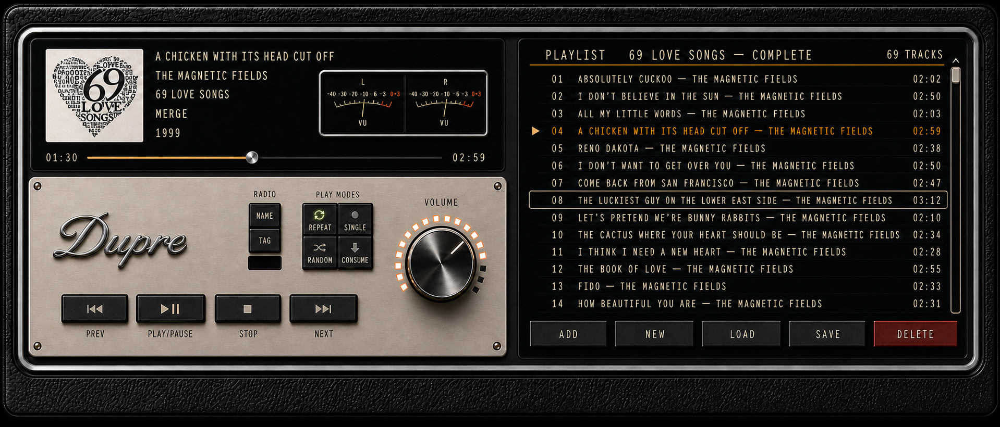
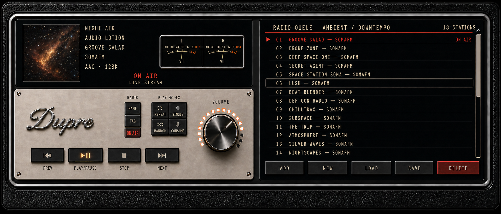
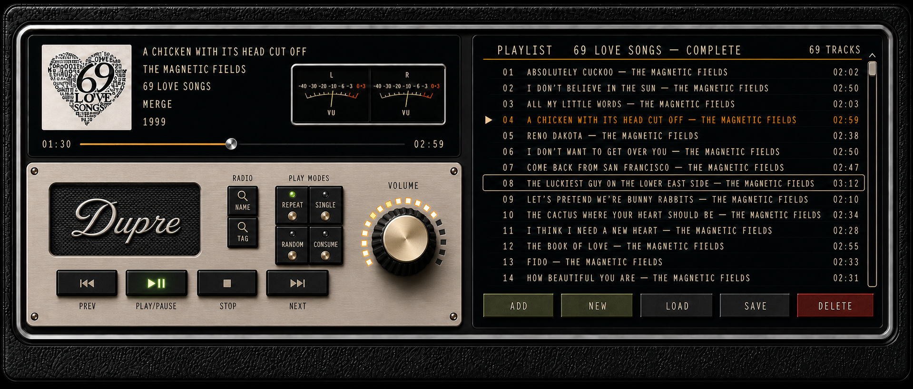
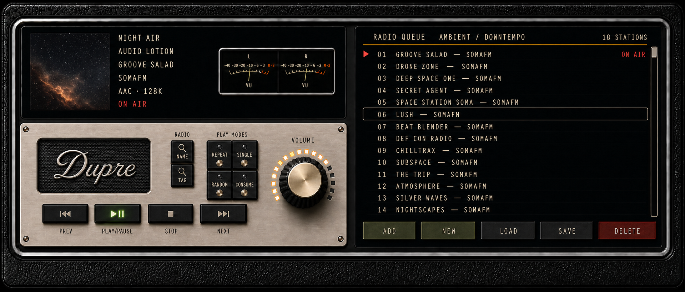

#+TITLE: Music SVG Application Design Working Set
#+AUTHOR: Craig Jennings

* Purpose

Six functional HTML/SVG prototypes for the music-config application design session.
They explore the Dupre chronometer, hi-fi stereo, and automobile-dashboard visual
language while preserving the current player, queue, radio, and playlist workflows.

This directory owns the complete in-progress remodel package while the design
continues.  The implementation spec is
[[file:2026-07-19-music-config-ui-remodel-spec.org][2026-07-19-music-config-ui-remodel-spec.org]].
The current interactive and rendering evidence lives under [[file:prototypes/][prototypes/]].
Concept boards, source artwork, and visual references stay beside them so local
iteration does not depend on files scattered through =docs/=.  When the design
is accepted, the spec, prototypes, benchmark, render fixture, and selected final
assets graduate together to their permanent =docs/= and =assets/= homes.

The selected receiver now has a final interaction candidate at
[[file:prototypes/2026-07-19-music-config-ui-remodel-prototype-1.html][prototypes/2026-07-19-music-config-ui-remodel-prototype-1.html]].  It uses
concept 30 as the physical shell and overlays the changing local-playlist and
radio state.  The paired [[file:prototypes/2026-07-19-music-config-ui-remodel-benchmark.org][librsvg benchmark]] makes the three-region production
renderer mandatory: full-instrument meter refresh missed the budget, while the
lower control tile passed.

* Inputs

- [[file:../../docs/specs/2026-07-06-fancy-music-player-ui-spec.org][Existing music player UI spec]]
- [[file:../../docs/specs/music-config-without-emms-spec.org][EMMS-free architecture spec]]
- [[file:../../../code/archsetup/docs/prototypes/panel-widget-gallery.html][Dupre panel-widget gallery]]
- [[file:../../../code/archsetup/docs/prototypes/waybar-redesign-prototype.html][Waybar redesign prototype]]

* Prototype Directions

1. Gold-pinstripe tuner console
2. Touring-car instrument cluster
3. Chronometer record deck
4. Studio rack and tape machine
5. Perpetual-calendar salon receiver
6. Mission-control radio navigator

* High-Fidelity Concept Boards — Iteration Two

The second pass deliberately separates visual design from implementation.  These
boards establish materials, lighting, silhouette, hierarchy, and instrument
semantics before the selected direction is translated into Dupre components.

1. [[file:concepts/01-champagne-receiver.png][Champagne Receiver]]
2. [[file:concepts/02-le-mans-night-cluster.png][Le Mans Night Cluster]]
3. [[file:concepts/03-geneva-playback-chronograph.png][Geneva Playback Chronograph]]
4. [[file:concepts/04-mastering-room-reel-console.png][Mastering Room Reel Console]]
5. [[file:concepts/05-perpetual-calendar-salon.png][Perpetual Calendar Salon]]
6. [[file:concepts/06-transatlantic-broadcast-navigator.png][Transatlantic Broadcast Navigator]]
7. [[file:concepts/07-functional-black-glass-receiver.png][Functional Black Glass Receiver]]
8. [[file:concepts/08-functional-black-glass-flipped.png][Functional Black Glass Receiver — flipped]]
9. [[file:concepts/09-functional-black-glass-retro.png][Functional Black Glass Receiver — retro]]
10. [[file:concepts/10-warm-black-glass-player-volume.png][Warm Black Glass Receiver — player volume]]
11. [[file:concepts/11-illuminated-black-glass-controls.png][Illuminated Black Glass Receiver — varied controls]]
12. [[file:concepts/12-consolidated-functional-receiver.png][Consolidated Functional Receiver]]
13. [[file:concepts/13-black-silver-chronograph-receiver.png][Black and Silver Chronograph Receiver]]
14. [[file:concepts/14-corrected-luxury-chronograph-receiver.png][Corrected Luxury Chronograph Receiver]]
15. [[file:concepts/15-champagne-brass-digital-hifi.png][Champagne-Brass Digital Hi-Fi]]
16. [[file:concepts/16-champagne-aluminum-radio-groups.png][Champagne-Aluminum Radio Groups]]
17. [[file:concepts/17-dupre-coltrane-scrollbar.png][Dupre Coltrane Scrollbar State]]
18. [[file:concepts/18-dupre-branding-control-study.png][Dupre Branding and Compact-Control Study]]
19. [[file:concepts/19a-dupre-playlist-state.png][Dupre Playlist State]] / [[file:concepts/19b-dupre-radio-state.png][Dupre Radio State]]
20. [[file:concepts/20-dupre-playlist-radio-comparison.png][Dupre Long-Playlist / Compact-Radio Comparison]] ( / )
21. [[file:concepts/21-dupre-semantic-controls-comparison.png][Dupre Semantic-Controls Comparison]] ( / )

- [[file:concept-board.html][Open the six-board review sheet]]

The original functional HTML pass remains at
[[file:music-svg-directions.html][music-svg-directions.html]] for interaction and
workflow reference; it is not the material-design target.

* Current Design Decisions

- Beauty must communicate real application function; no decorative controls.
- Preserve the Champagne Receiver's now-playing, progress, transport, queue,
  and playlist-management regions as the functional nucleus.
- Remove AM/FM, tone, speaker, loudness, power, and other receiver controls
  without a =music-config.el= command or state.
- Target a compact panoramic panel in the bottom portion of a predominantly
  portrait Emacs frame; playlist and player controls must sit side by side.
- Prefer a neutral black-glass, warm-meter, polished-chrome language with
  restrained warm metal and tactile black leather; keep whitespace low without
  returning to clutter.  Do not use cold blue illumination.
- Permanent radio controls map only to the implemented name and tag searches.
  Manual URL entry remains an Emacs command rather than faceplate hardware.
- Place the player on the left and playlist on the right.
- The dots around the volume knob are a cumulative illuminated scale driven by
  actual volume; the last lit dot is the precise pointer.  They never chase or
  flash.
- The knob controls dedicated mpv player volume rather than the system mixer.
  Persist the level in Emacs, pass it to each newly started per-track mpv
  process, and read/write mpv's =volume= property over the existing IPC socket.
- Drive the stereo VU meter from real mpv audio analysis.  A labeled lavfi
  =astats= filter exposes per-channel RMS and peak readings through
  =af-metadata/<label>=; apply analog needle ballistics in the UI.  Treat the
  meter as pre-volume program level so it describes the recording independently
  of listening volume.
- Prefer neutral black glass, chrome, and pebbled leather with warm ivory,
  amber, and restrained jewel illumination; avoid cold blue light.
- All playlist and now-playing typography is self-luminous behind smoked glass,
  never merely engraved.  Compose album metadata conditionally from album,
  label, year/date, genre, composer, performer, track, and disc; omit missing
  values and separators, and never display =Unknown= or =N/A=.
- Do not display a numeric player-volume value.  The physical knob pointer,
  ticks, and cumulative lamps communicate level.
- Omit manual URL entry and playlist reload from the permanent faceplate; the
  commands remain available through Emacs.
- For seekable tracks, the progress indicator is an interactive slider.  For a
  non-seekable live stream, replace the entire slider/time treatment with an
  =ON AIR= state; never show both states together.
- With the slider handling seeking, transport contains only previous,
  play/pause, stop, and next.  Labels live on the faceplate beneath compact
  physical controls.
- Put repeat, single, random, and consume lamps/toggles on the lower player
  control rail.  Put radio name/tag search there as well.  The right side is
  reserved for the large playlist and visible playlist actions.
- Present now-playing metadata as separate illuminated lines and omit the
  =NOW PLAYING= caption.
- Use one consistent family of small round chrome transport pushbuttons.  Mode
  controls use four identical low-profile luxury latching pushbuttons with
  polished-steel collars, smoked-black enamel centers, and integrated faceted
  jewels: pressed and lit means on; raised and dark means off.  Bat toggles are
  prohibited because they read as utilitarian rather than luxury hardware.
- Build depth with a realistic two-step polished-chrome bezel and dark gasket
  around both the VU meter and complete player where they meet black leather.
  Avoid excessive parallel chrome rails.
- Use a coherent brushed-silver lower control faceplate.  Chrome and silver
  dominate; brass remains a hairline accent.
- The playlist shows roughly fourteen compact one-line rows with artist inline,
  an explicit illuminated playlist name, and square matte-anodized action keys.
  Visible actions are add, new, load, save, and delete.  Delete is a normal
  matte-red key; edit is not permanent faceplate functionality.
- Put the =ON AIR= lamp inside the radio control bank.  It remains dark for a
  local file and lights only for a live radio source.
- Do not use the drum/tape roller as a saved-playlist selector.  Its unlabeled
  adjacent digits were mistaken for a counter and its purpose was not legible;
  the labeled =LOAD= action is sufficient.  If a drum mechanism is revisited,
  it must expose a unique function that is understood without explanation.
- Volume segments are identical and evenly spaced; light continuously from the
  rightmost minimum through and including the pointer-aligned segment.
- Allocate approximately 42 percent of usable width to the player and 58
  percent to the playlist.  When all fourteen rows fit, show neither a scrollbar
  nor another redundant track-count mechanism.
- Remove the current-track =01 / 14= complication entirely: the highlighted
  playlist row communicates the same information more directly.
- Put the mode/status/radio rail above the transport rail.  Align =ON AIR= with
  the other mode jewels and give it the same visible diameter, while retaining
  its non-pressable status-only behavior.
- Transport hardware is a coherent bank of four shallow, closely spaced,
  machined-metal hi-fi piano keys rather than separate round buttons.
- Use distinctly digital, self-luminous typography for player metadata and the
  playlist; keep faceplate labels engraved rather than digital.
- A pale brushed champagne-brass control faceplate is viable so long as black
  glass and polished chrome remain dominant and the brass never becomes bronze,
  copper, brown, or sepia.
- Prefer authentic pale champagne-anodized aluminum over brass: fine horizontal
  brushing, cool metallic highlights, and crisp machined edges retain warmth
  while matching real high-end audio construction.
- Fasteners are small, discreet, countersunk details rather than prominent
  corner bolts.
- Make radio membership explicit on the faceplate.  A restrained engraved
  =RADIO= heading and hairline bracket span exactly =ON AIR=, =BY NAME=, and
  =BY TAG=; a separate =PLAY MODES= heading owns repeat, single, random, and
  consume.  Do not use another heavy enclosure.
- Mode controls combine an unmistakably pressable shallow aluminum cap with a
  smaller inset jewel.  =ON AIR= uses the same jewel diameter and baseline but
  no cap or travel, preserving its status-only meaning.
- For a seekable track, slider position must be computed from elapsed/duration
  rather than independently illustrated.  Concept 16 still places the handle
  too far right for =02:37 / 05:35=; implementation must place it at 47 percent.
- Color carries stable semantics: warm ivory is ordinary information; amber is
  active playback, progress, and volume; green is an enabled playback mode;
  neutral silver is keyboard focus; red is reserved for delete, live =ON AIR=,
  and faults.  Do not color ordinary playlist actions arbitrarily.
- Use conventional volume geometry: minimum is lower left, maximum lower right,
  and illumination advances clockwise from minimum through the knob pointer.
  Segments after the pointer toward maximum remain dark.
- Playing state must be physical as well as chromatic: the =PLAY/PAUSE= key sits
  visibly lower with its shadow withdrawn; a restrained amber edge is secondary
  confirmation.
- The faceplate may carry one modest maker's plaque: coarse black crosshatch
  that survives small SVG rendering, with a raised cursive =Dupre= wordmark.
  It is a badge, not a fake speaker grille, and must not justify extra height.
- For lists longer than the fourteen-row viewport, show a narrow functional
  scrollbar.  Thumb length represents =visible rows / total rows= and position
  represents the top visible row.  Concept 17 demonstrates the long-list state
  but its generated thumb remains shorter than the required 14/32 (44 percent).
- The next review set is a matched two-state pair: one seekable normal-playlist
  player and one live-radio player using identical hardware.  The radio state
  replaces slider and times with =ON AIR=, lights the red broadcast lamp, and
  conditionally shows only available station/stream metadata.
- Do not assume short metadata.  Recover display width by reducing album art and
  VU width roughly 20 percent; allow modest automatic font condensation before
  ellipsis.  Do not marquee by default.  Full truncated values remain available
  through normal Emacs help/minibuffer affordances.
- Compact playback modes into a 2×2 internally illuminated-legend block.  The
  engraved symbol itself glows; do not add a separate lamp or oversized lip.
  Keep explicit micro-labels because =CONSUME= has no universal symbol.
- Place a similarly compact radio block immediately beside play modes: =NAME=
  and =TAG= momentary buttons above a flush =ON AIR= window.  This leaves the
  right side visually quiet around volume.
- Branding is part of the faceplate surface, never a plate atop another plate.
  Concept 18 compares: black-enamel inscription (A), bright-cut inscription
  (B), same-plane crosshatched negative-space field (C), and direct-mounted
  chrome script without backing (D).
- Select concept 18 option D: a moderately enlarged direct-mounted chrome
  cursive =Dupre= script at the faceplate's upper left, with no backing.  Put
  compact proportional =NAME=, =TAG=, and =ON AIR= radio controls below it.
- Transport adopts the same internally illuminated-legend construction as the
  mode keys.  The symbol itself is translucent: amber while active, dim ivory
  while inactive.  Do not add a separate under-key light strip.  Concepts 19a/b
  still contain a generated amber strip beneath Play and are non-authoritative
  on that detail.
- Treat local and live playback as matched states of identical hardware.  A
  seekable file shows slider and times and keeps =ON AIR= dark; a live stream
  removes all seek/time hardware, displays =ON AIR / LIVE STREAM= in that region,
  and lights the faceplate broadcast window red.
- Scrollbar thumbs remain mathematical UI, not illustrative ornament: 14/32 is
  44 percent and 14/18 is 78 percent.  Both generated concept-19 thumbs are too
  short despite their otherwise useful long-list demonstrations.
- Reserve a clear brand field at the far left of the faceplate and optically
  center =Dupre= within that invisible rectangle.  All functional controls stay
  outside it.
- Immediately right of the brand field, stack =NAME=, =TAG=, and =ON AIR= in a
  narrow vertical Radio column, right-justified tightly against an even smaller
  2×2 Play Modes block.  Volume retains the quiet right-hand field.
- Transport state is symbol-only illumination.  The area beneath every key is
  plain faceplate plus its engraved label; no amber strip, lamp, or glow.
- Stress-test metadata with realistic long values.  Concept 20 uses =A CHICKEN
  WITH ITS HEAD CUT OFF= / =THE MAGNETIC FIELDS= and the 69-track =69 LOVE SONGS=
  list without marquee or truncation.
- Review normal and live states together by composing their independently
  generated panoramic sources.  This preserves the true bottom-dock form factor
  while making both states simultaneously visible.
- Concept 20's scrollbar rendering remains non-authoritative: the 14/69 playlist
  thumb should be 20 percent, and the 14/18 radio thumb should be 78 percent and
  clearly visible.  The image model made the former too short and omitted the
  latter's filled thumb.
- Live playback contains exactly two =ON AIR= presentations: a red bottom-most
  metadata line and the current station row.  Remove the faceplate status window
  and any centered banner or =LIVE STREAM= caption.
- The compact controls form a measured 3×2 grid above transport.  Every small
  control is half a transport key's width and equal to its height; stacked Radio
  occupies column one and the 2×2 Play Modes block columns two and three.  The
  grid's right edge aligns with =NEXT=.
- Radio =NAME= and =TAG= are momentary search buttons with magnifying-glass
  glyphs and no lamps.  Persistent playback modes use a separate tiny status
  lamp above a compact champagne/brass actuator, borrowing the Heston preset
  language without numeric legends.
- Branding is a true faceplate aperture: champagne aluminum is cut away to
  reveal a recessed dark woven/diamond-textured subplate with centered warm-white
  cursive =Dupre=.  It is not a badge attached atop the faceplate.
- =PLAY/PAUSE= glows green through its symbol while playing.  Previous, Stop, and
  Next stay neutral and merely brighten ivory during activation.
- Volume uses a deeply knurled black body and machined champagne/brass cap with no
  pointer.  The cumulative lamp arc is the sole indicator and its final lit
  segment communicates the level.
- =ADD= and =NEW= may share a restrained OD-green anodized tint.  =LOAD= and
  =SAVE= remain neutral; =DELETE= remains matte red.
- Concept 21 again renders scrollbar fill incorrectly; the exact 20/78 percent
  requirements remain implementation constraints rather than image guidance.
- Tone =DELETE= down from saturated red to muted, low-saturation oxblood or
  burgundy.  It remains unmistakably destructive without becoming the loudest
  object in the application.
- Playback modes use four small circular brass pushbuttons mounted directly on
  the metal.  Remove the black switch tiles and separate lamps; illuminate only
  a thin circumference around an active brass actuator.  A single hairline
  engraved boundary contains the 2×2 group and its geometry aligns with the
  transport grid ending at =NEXT=.
- Split the lower player into two genuine material zones rather than stacking
  branding plates.  The left 28--32 percent is uninterrupted black woven grille
  continuous with the chassis; center a restrained warm-ivory/champagne cursive
  =Dupre= directly in that negative space with no border, plaque, or fasteners.
  The right 68--72 percent is one compact self-contained champagne-anodized
  control island containing Radio, Play Modes, transport, and Volume.
- Concept 22 validates this identity-bay/control-island architecture in matched
  playlist and radio states.  Its compact balance is authoritative; the image
  model's engraved Play Modes boundary does not yet reach the =NEXT= alignment
  datum, so the exact grid alignment remains an implementation constraint.
- Lock the concept-22 champagne faceplate and every component mounted on it:
  Radio keys, direct-mounted brass Play Modes matrix and engraved boundary,
  pointerless cumulative Volume dial, transport keys, fasteners, typography,
  materials, spacing, and illumination semantics.  Subsequent exploration may
  change surrounding glass and layout, but not this control component.
- Swap the information and identity zones.  Put reduced album/station art and
  separate-line metadata in the lower black-glass bay beside the locked
  faceplate.  Put =Dupre= directly on the upper black glass with no backing
  texture, beside substantially larger VU meters.
- Light each VU face with a subtle warm pool rising from a hidden lamp directly
  below its =VU= legend.  The fixture is not visible; it only explains the
  meter's restrained internal illumination.
- Give the player approximately 49 percent of total width and the list 51
  percent.  Keep fourteen rows; ellipsize only the title/artist field when it
  exceeds its allocation, while preserving the row number, current-state marker,
  duration, and live status.
- In radio state, place the first approved =ON AIR= directly underneath the
  reduced station art.  The second remains in the active station row; all
  inactive status cells are empty.  Concept 23 is authoritative for this
  swapped-information arrangement.
- Divide the player itself into two equal-height tiers.  The upper tier is one
  continuous black-glass identity/information display; =Dupre= stays at far left
  while reduced art, separate-line metadata, and conditional seek information
  occupy the remaining width.
- The lower tier is one uninterrupted full-width champagne-brass faceplate, not
  a small plate stacked over another material.  Recess modest dual VU meters
  into its left side and integrate the locked Radio, Play Modes, Volume, and
  transport hardware on its right with proportional spacing.
- Return the VU meters to approximately concept-22 scale or slightly smaller.
  They are black instrument windows with narrow chrome bezels physically set
  into the brass; their concealed lower lamps remain a soft wash rather than a
  visible point source.
- Concept 24 demonstrates this full-brass lower tier in matched playlist and
  radio states.  State-dependent information changes only in the upper glass
  and control illumination; the underlying manufactured unit is identical.
- Remove fasteners and corner radii from every interior surface.  The upper
  information glass, lower brass faceplate, and right playlist are three flush
  rectangular fields separated only by one horizontal and one vertical rule.
  Rounded depth remains exclusively in the outer leather/chrome chassis.
- Align the left edge of album or station art exactly with the left edge of the
  stacked Radio buttons below.  This is a shared vertical datum and reserves a
  larger uninterrupted field for =Dupre=.  Confine local seek time, line, and
  handle to the information block beginning at that datum; nothing extends
  beneath the wordmark.  Live =ON AIR= occupies the corresponding position below
  station art without a seek affordance.
- Render ordinary album metadata and inactive list rows in soft neutral white.
  Amber is reserved for the list header/rule and the currently selected row;
  inactive rows have no lamps, glow, dots, or amber tint.
- VU windows are flush or slightly recessed apertures in the brass, with only a
  hairline inlaid edge and inner shadow.  They must never read as raised boxes or
  chrome housings attached to the faceplate.
- Concept 25 demonstrates the seamless square-panel and white-type direction.
  The image generator still places art left of the Radio datum despite a
  targeted correction; exact shared-edge alignment remains authoritative for
  the implemented SVG.
- Reintroduce rounded depth selectively rather than through internal cards.  The
  two-step chrome trim encircling the complete unit has clearly rounded corners,
  and the flush VU apertures may use modest rounded corners.
- Rename the maker signature to a two-line =Dupre Studios=: large cursive
  =Dupre= above smaller widely tracked uppercase =STUDIOS=, centered as one
  optical lockup directly on the black glass.
- Move album/station art, metadata, and the conditional seek/live treatment
  farther right to enlarge the calm manufacturer field.
- Remove the upper vertical player/list separator entirely.  Branding, program
  information, and playlist share one continuous black-glass plane; header rules
  and column alignment alone establish list hierarchy.
- Define the lower brass faceplate as a distinct receiver module without adding
  fasteners: a narrow recessed dark groove followed by slim deep chrome encircles
  all four sides of the brass.  Its surround uses graceful rounded corners while
  the single brass field remains uninterrupted.
- Concept 26 demonstrates the =Dupre Studios= lockup, continuous upper glass,
  rounded outer chrome, rounded flush VU apertures, and fully encircled brass
  control module in matched playlist and radio states.
- Remove the complete unit's outer metal trim.  The exterior silhouette is a
  softly rolled black-leather edge; the leather terminates directly against the
  continuous black glass through a narrow compressed dark seam, with no metal
  between those materials.
- Convert every remaining metal edge from chrome to warm brass.  This includes
  the bead encircling the lower faceplate and the hairline rounded VU aperture
  edges.  No silver/chrome edging remains anywhere.
- The artwork, stacked Radio keys, and =PREV= transport key share one exact left
  edge.  Treat this as a single vertical construction datum; the seek assembly
  begins there as well and remains below only the art/metadata block.
- Make only the playlist/radio header row an analog instrument card: darker
  coffee-and-cream stock behind glass with dark espresso lettering.  Four hidden
  warm lamps above it—one at each corner and two evenly spaced between—cast
  broad subtle pools downward.  Neither bulbs nor hotspots are visible, and all
  list rows below remain black with white/selected-amber type.
- Concept 27 demonstrates the leather-to-glass junction, brass-only edging, and
  analog illuminated header in matched playlist/radio states.  Its artwork is
  visually close to the control datum; implementation must make the shared edge
  mathematically exact.
- Adopt Craig's GIMP faceplate composition as the control-layout authority.
  Divide usable brass width into approximately 44/25/31 percent zones: dual VUs
  over transport at left, Play Modes over a horizontal Name/Tag Radio pair at
  center, and Volume vertically centered at right.  Use shared baselines,
  consistent label offsets, and even component gaps so the plate is full without
  crowding.
- The four transport keys span roughly the combined width of the two VUs and sit
  directly beneath them.  The center controls form two aligned modules: 2×2
  direct-mounted brass modes above and two black radio search keys below.
- Increase the Volume control to the diameter in Craig's GIMP arrangement, but
  make it a low-profile frontal instrument: shallow knurled skirt, broad flush
  machined brass cap, minimal shadow, and no domed, magnified, or fisheye look.
  Center the complete knob/arc vertically and put =VOLUME= beneath it.
- Volume lamps return to unmistakable warm amber/gold.  Cumulative lit segments
  must never wash out to white, cream, coral, or pink; unlit segments remain
  dark.
- Concept 28 demonstrates the proportional three-zone control layout and flatter
  enlarged Volume dial in matched playlist and radio states.
- Finalize the program-information construction line by moving the artwork and
  all metadata right as one rigid group until the artwork's left edge is exactly
  collinear with the left engraved boundary of the Radio group below.  The local
  seek treatment begins on that same datum: move its left time and left endpoint
  with the information group, keep its right time and endpoint fixed, and shorten
  the run accordingly.
- The circular seek thumb is warm polished brass, not chrome or silver.  Its
  restrained highlight may distinguish it from the amber progress line without
  introducing a cold-metal exception to the brass-only material language.
- Treat Craig's manually refined 1916×821 playlist board, saved as
  =concepts/30a-dupre-studios-user-refined-playlist.png=, as the near-final
  visual authority.  It resolves the upper-panel composition: the larger calm
  =Dupre Studios= field, right-shifted artwork and separate metadata lines, a
  contained shorter seek run with brass thumb, and a playlist-dominant right
  side all coexist without crowding.
- Preserve the board's proportional lower deck: paired illuminated VUs and one
  coherent transport family at left, compact direct-mounted Play Modes and Radio
  Search controls in the center, and the large vertically centered low-profile
  Volume instrument at right.

* Concept 14 Review Notes

The four matching jeweled latching mode buttons, simplified two-step chrome
bezel, fourteen-row playlist, explicit playlist name, one-line track rows, and
clearly labeled action keys move the design toward the selected language.  The
board still contains three image-generation errors that are not design changes:

- The player remains wider than the playlist instead of the required 42/58
  allocation.
- The volume arc stays illuminated beyond the knob pointer instead of ending at
  and including the pointer-aligned segment.
- =COLUMBIA= and =1959= share a line instead of occupying separate conditional
  metadata lines.
